# 机器学习的 k-最近邻(KNN)算法

> 原文：<https://www.javatpoint.com/k-nearest-neighbor-algorithm-for-machine-learning>

*   最近邻是基于监督学习技术的最简单的机器学习算法之一。
*   K-NN 算法假设新案例/数据和可用案例之间的相似性，并将新案例放入与可用类别最相似的类别中。
*   K-NN 算法存储所有可用数据，并根据相似性对新数据点进行分类。这意味着当新数据出现时，可以通过使用 K- NN 算法很容易地将其分类到一个合适的类别中。
*   K-NN 算法可以用于回归，也可以用于分类，但主要用于分类问题。
*   K-NN 是一种**非参数算法**，意思是对底层数据不做任何假设。
*   它也被称为**懒惰学习者算法**，因为它不会立即从训练集中学习，而是存储数据集，并在分类时对数据集执行操作。
*   训练阶段的 KNN 算法只是存储数据集，当它获得新数据时，它会将该数据分类到与新数据非常相似的类别中。
*   **示例:**假设我们有一个看起来像猫和狗的生物的图像，但是我们想知道它是猫还是狗。所以对于这个识别，我们可以使用 KNN 算法，因为它是基于相似性度量的。我们的 KNN 模型将发现新数据集与猫和狗图像的相似特征，并根据最相似的特征将其归入猫或狗类别。

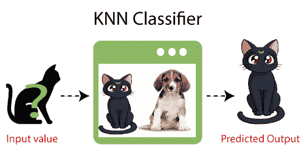

## <u>为什么我们需要一个 K-NN 算法？</u>

假设有两类，即 A 类和 B 类，我们有一个新的数据点 x1，那么这个数据点将位于这两类中的哪一类。为了解决这类问题，我们需要一个 K-NN 算法。在 K-NN 的帮助下，我们可以很容易地识别特定数据集的类别。考虑下图:

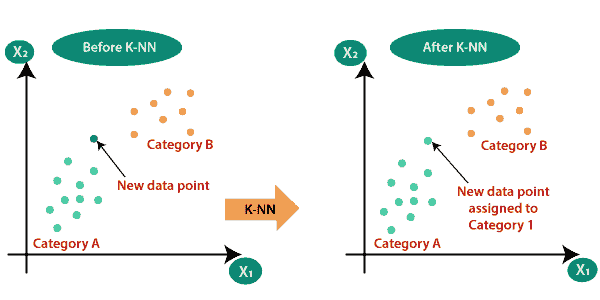

## <u>K-NN 是如何工作的？</u>

基于下面的算法可以解释神经网络的工作原理:

*   **步骤 1:** 选择邻居的数量 K
*   **第 2 步:**计算 **K 个邻居**的欧氏距离
*   **步骤-3:** 根据计算出的欧氏距离取 K 个最近邻。
*   **步骤-4:** 在这 k 个邻居中，统计每个类别的数据点数量。
*   **步骤-5:** 将新数据点分配给邻居数量最多的类别。
*   **第 6 步:**我们的模型准备好了。

假设我们有一个新的数据点，我们需要把它放在所需的类别中。请看下图:

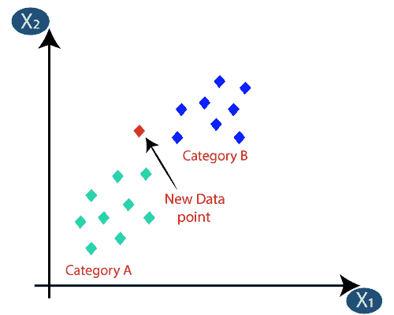

*   首先，我们将选择邻居的数量，因此我们将选择 k=5。
*   接下来，我们将计算数据点之间的**欧氏距离**。欧几里得距离是两点之间的距离，我们已经在几何学中研究过了。它可以计算为:

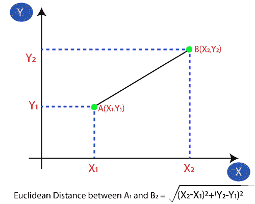

*   通过计算欧几里得距离，我们得到了最近的邻居，作为类别 A 中的三个最近的邻居和类别 b 中的两个最近的邻居。考虑下图:

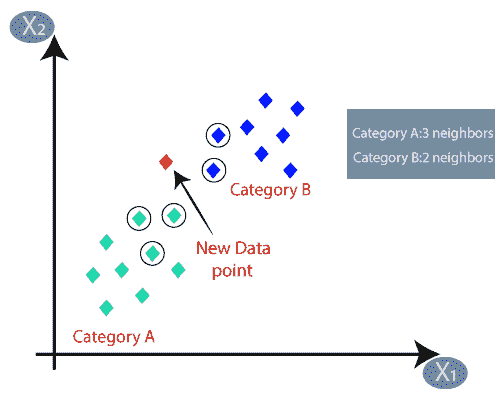

*   正如我们可以看到的，3 个最近的邻居来自类别 A，因此这个新的数据点必须属于类别 A

## <u>如何在 K-NN 算法中选择 K 的值？</u>

以下是在 K-NN 算法中选择 K 值时需要记住的几点:

*   没有特定的方法来确定“K”的最佳值，所以我们需要尝试一些值来从中找到最佳值。最优选的 K 值是 5。
*   非常低的 K 值，如 K=1 或 K=2，可能会有噪声，并导致模型中异常值的影响。
*   K 值大是好的，但可能会遇到一些困难。

## <u>KNN 算法优势:</u>

*   实现起来很简单。
*   它对噪声训练数据具有鲁棒性
*   如果训练数据很大，效果会更好。

## KNN 算法的缺点:

*   总是需要确定 K 的值，这个值有时可能很复杂。
*   因为计算所有训练样本的数据点之间的距离，所以计算成本高。

## <u>KNN 算法的 Python 实现</u>

为了实现 K-NN 算法的 Python 实现，我们将使用与逻辑回归中相同的问题和数据集。但是在这里我们将提高模型的性能。以下是问题描述:

**K-NN 算法的问题:**有一家汽车制造公司，生产了一款全新的 SUV 汽车。公司想把广告给有兴趣购买那辆 SUV 的用户。所以对于这个问题，我们有一个数据集，它通过社交网络包含多个用户的信息。数据集包含大量信息，但我们将考虑的自变量为**预计工资**和**年龄**，因变量为**购买变量**。下面是数据集:

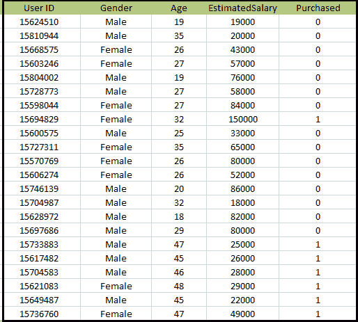

**实现 K-NN 算法的步骤:**

*   数据预处理步骤
*   将 K-NN 算法拟合到训练集
*   预测测试结果
*   测试结果的准确性(创建混淆矩阵)
*   可视化测试集结果。

**数据预处理步骤:**

数据预处理步骤将保持与逻辑回归完全相同。下面是它的代码:

```

# importing libraries
import numpy as nm
import matplotlib.pyplot as mtp
import pandas as pd

#importing datasets
data_set= pd.read_csv('user_data.csv')

#Extracting Independent and dependent Variable
x= data_set.iloc[:, [2,3]].values
y= data_set.iloc[:, 4].values

# Splitting the dataset into training and test set.
from sklearn.model_selection import train_test_split
x_train, x_test, y_train, y_test= train_test_split(x, y, test_size= 0.25, random_state=0)

#feature Scaling
from sklearn.preprocessing import StandardScaler  
st_x= StandardScaler()  
x_train= st_x.fit_transform(x_train)  
x_test= st_x.transform(x_test)

```

通过执行上面的代码，我们的数据集被导入到我们的程序中并被很好地预处理。特征缩放后，我们的测试数据集看起来像:

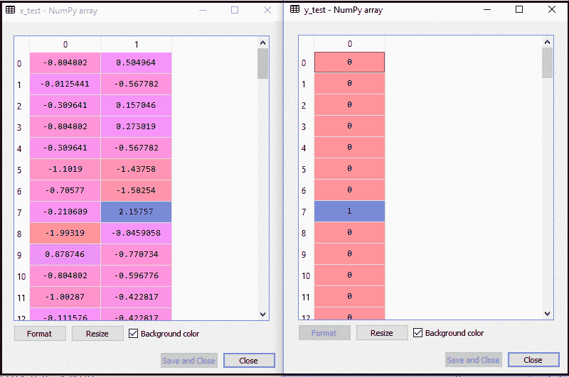

从上面的输出图像中，我们可以看到我们的数据已经成功缩放。

*   **将 K-NN 分类器拟合到训练数据:**
    现在我们将把 K-NN 分类器拟合到训练数据。为此，我们将导入 **Sklearn 邻居**库的 **KNeighborsClassifier** 类。导入类后，我们将创建类的**分类器**对象。这个类的参数将是，然后我们将使分类器适合训练数据。下面是它的代码:
    *   **n_neighbors:** 定义算法所需的邻居。通常需要 5 分钟。
    *   **metric='minkowski':** 这是默认参数，它决定了点之间的距离。
    *   **p=2:** 相当于标准欧氏度量。And then we will fit the classifier to the training data. Below is the code for it:

```

#Fitting K-NN classifier to the training set
from sklearn.neighbors import KNeighborsClassifier
classifier= KNeighborsClassifier(n_neighbors=5, metric='minkowski', p=2 )
classifier.fit(x_train, y_train)

```

**输出:通过执行上述代码，我们将得到如下输出:**

```
Out[10]: 
KNeighborsClassifier(algorithm='auto', leaf_size=30, metric='minkowski',
                     metric_params=None, n_jobs=None, n_neighbors=5, p=2,
                     weights='uniform')

```

*   **预测测试结果:**为了预测测试集结果，我们将创建一个 **y_pred** 向量，就像我们在逻辑回归中所做的那样。下面是它的代码:

```

#Predicting the test set result
y_pred= classifier.predict(x_test)

```

**输出:**

上述代码的输出将是:

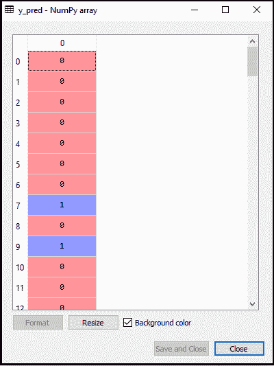

*   **创建混淆矩阵:**
    现在我们将为我们的 K-NN 模型创建混淆矩阵，以查看分类器的准确性。下面是它的代码:

```

#Creating the Confusion matrix
    from sklearn.metrics import confusion_matrix
    cm= confusion_matrix(y_test, y_pred)

```

在上面的代码中，我们已经导入了混乱矩阵函数，并使用变量 cm 调用了它。

**输出:**通过执行上述代码，我们将得到如下矩阵:

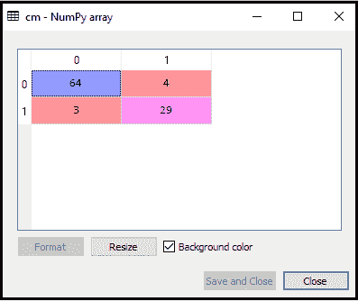

在上图中，我们可以看到有 64+29= 93 个正确预测和 3+4= 7 个不正确预测，而在逻辑回归中，有 11 个不正确预测。因此可以说，使用 K-NN 算法提高了模型的性能。

*   **可视化训练集结果:**
    现在，我们将可视化 K-NN 模型的训练集结果。代码将保持与我们在逻辑回归中所做的相同，除了图表的名称。下面是它的代码:

```

#Visulaizing the trianing set result
from matplotlib.colors import ListedColormap
x_set, y_set = x_train, y_train
x1, x2 = nm.meshgrid(nm.arange(start = x_set[:, 0].min() - 1, stop = x_set[:, 0].max() + 1, step  =0.01),
nm.arange(start = x_set[:, 1].min() - 1, stop = x_set[:, 1].max() + 1, step = 0.01))
mtp.contourf(x1, x2, classifier.predict(nm.array([x1.ravel(), x2.ravel()]).T).reshape(x1.shape),
alpha = 0.75, cmap = ListedColormap(('red','green' )))
mtp.xlim(x1.min(), x1.max())
mtp.ylim(x2.min(), x2.max())
for i, j in enumerate(nm.unique(y_set)):
    mtp.scatter(x_set[y_set == j, 0], x_set[y_set == j, 1],
        c = ListedColormap(('red', 'green'))(i), label = j)
mtp.title('K-NN Algorithm (Training set)')
mtp.xlabel('Age')
mtp.ylabel('Estimated Salary')
mtp.legend()
mtp.show()

```

**输出:**

**通过执行上面的代码，我们会得到下图:**

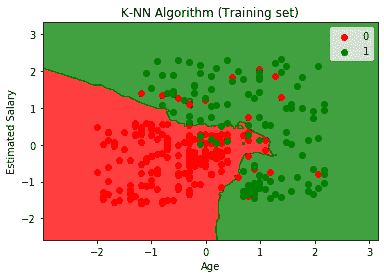

输出图不同于我们在逻辑回归中看到的图。这可以从以下几点来理解:

*   正如我们所看到的，图表显示了红点和绿点。绿色点表示已购买(1)，红色点表示未购买(0)变量。
*   该图显示了不规则的边界，而不是显示任何直线或任何曲线，因为它是一种 K-NN 算法，即寻找最近的邻居。
*   该图将用户划分为正确的类别，因为大多数没有购买 SUV 的用户位于红色区域，而购买了 SUV 的用户位于绿色区域。
*   该图显示了良好的结果，但仍然有一些绿色点在红色区域和红色点在绿色区域。但这不是什么大问题，因为这样做可以防止模型过度拟合。
*   因此，我们的模型训练有素。

*   **可视化测试集结果:**
    在模型训练之后，我们现在将通过放置一个新的数据集来测试结果，即测试数据集。代码保持不变，除了一些小改动:如 **x_train 和 y_train** 将被 **x_test 和 y_test** 取代。
    下面是它的代码:

```

#Visualizing the test set result
from matplotlib.colors import ListedColormap
x_set, y_set = x_test, y_test
x1, x2 = nm.meshgrid(nm.arange(start = x_set[:, 0].min() - 1, stop = x_set[:, 0].max() + 1, step  =0.01),
nm.arange(start = x_set[:, 1].min() - 1, stop = x_set[:, 1].max() + 1, step = 0.01))
mtp.contourf(x1, x2, classifier.predict(nm.array([x1.ravel(), x2.ravel()]).T).reshape(x1.shape),
alpha = 0.75, cmap = ListedColormap(('red','green' )))
mtp.xlim(x1.min(), x1.max())
mtp.ylim(x2.min(), x2.max())
for i, j in enumerate(nm.unique(y_set)):
    mtp.scatter(x_set[y_set == j, 0], x_set[y_set == j, 1],
        c = ListedColormap(('red', 'green'))(i), label = j)
mtp.title('K-NN algorithm(Test set)')
mtp.xlabel('Age')
mtp.ylabel('Estimated Salary')
mtp.legend()
mtp.show()

```

**输出:**

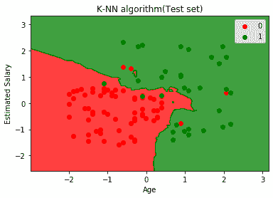

上图显示了测试数据集的输出。正如我们在图中看到的，预测的输出很好，因为大多数红点在红色区域，大多数绿点在绿色区域。

但是，红色区域的绿色点很少，绿色区域的红色点也很少。所以这些是我们在混淆矩阵中观察到的不正确的观察(7 不正确的输出)。

* * *