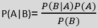
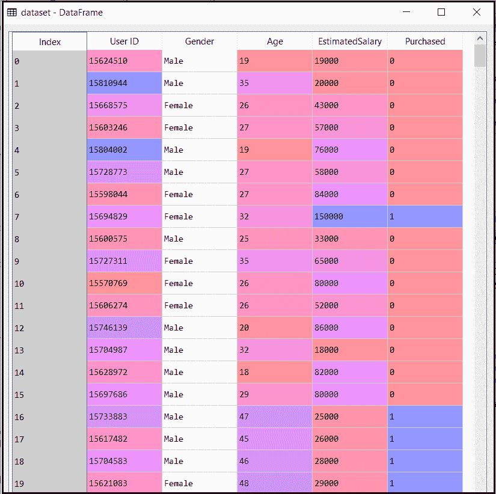
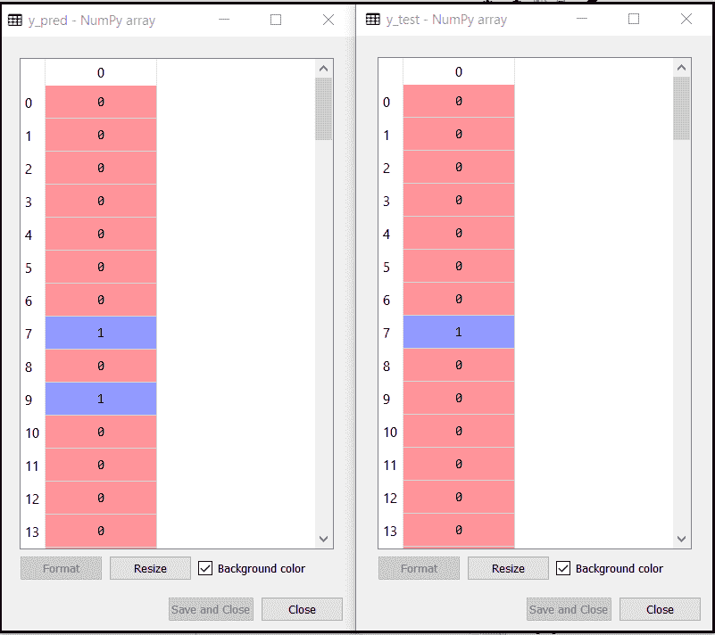
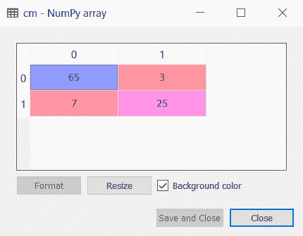
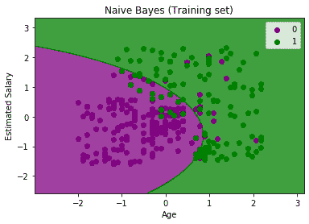
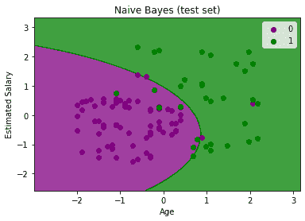

# 朴素贝叶斯分类算法

> 原文：<https://www.javatpoint.com/machine-learning-naive-bayes-classifier>

*   朴素贝叶斯算法是一种基于**贝叶斯定理**的有监督学习算法，用于解决分类问题。
*   主要用于包含高维训练数据集的*文本分类*。
*   朴素贝叶斯分类器是一种简单而有效的分类算法，它有助于建立快速的机器学习模型，从而做出快速的预测。
*   **它是一个概率分类器，也就是说它基于一个物体**的概率进行预测。
*   一些朴素贝叶斯算法的流行例子是**垃圾邮件过滤、情感分析和文章分类**。

## 为什么叫幼稚贝叶斯？

朴素贝叶斯算法由朴素和贝叶斯两个词组成，可以描述为:

*   **天真**:之所以叫天真，是因为它假设某个特征的出现独立于其他特征的出现。例如，如果水果是根据颜色、形状和味道来识别的，那么红色、球形和甜味的水果被认为是苹果。因此，每个特征单独有助于识别它是一个苹果，而不相互依赖。
*   **贝叶斯**:之所以叫贝叶斯，是因为它依赖于[贝叶斯定理](https://www.javatpoint.com/bayes-theorem-in-artifical-intelligence)的原理。

## 贝叶斯定理:

*   贝叶斯定理也被称为**贝叶斯规则**或**贝叶斯定律**，用于确定具有先验知识的假设的概率。这取决于条件概率。
*   贝叶斯定理的公式如下:



**在哪里，**

**P(A&verbar；b)是后验概率**:假设 A 对观测事件 b 的概率

**P(B&verbar；a)是可能性概率**:假设概率为真的证据的概率。

**P(A)为先验概率**:观察证据前假设的概率。

**P(B)为边际概率**:证据概率。

## 朴素贝叶斯分类器的工作原理:

借助下面的例子可以理解朴素贝叶斯分类器的工作原理:

假设我们有一个**天气条件**和对应的目标变量 **Play** 的数据集。因此，使用这个数据集，我们需要根据天气条件来决定我们是否应该在特定的一天玩。所以要解决这个问题，我们需要遵循以下步骤:

1.  将给定数据集转换为频率表。
2.  通过查找给定特征的概率生成似然表。
3.  现在，用贝叶斯定理计算后验概率。

**问题**:如果天气晴朗，那么玩家到底该不该玩？

**解决方案**:要解决这个问题，首先考虑下面的数据集:

|  | 观点 | 玩 |
| **0** | 下雨的 | 是 |
| **1** | 快活的 | 是 |
| **2** | 遮蔽 | 是 |
| **3** | 遮蔽 | 是 |
| **4** | 快活的 | 不 |
| **5** | 下雨的 | 是 |
| **6** | 快活的 | 是 |
| **7** | 遮蔽 | 是 |
| **8** | 下雨的 | 不 |
| **9** | 快活的 | 不 |
| **10** | 快活的 | 是 |
| **11** | 下雨的 | 不 |
| **12** | 遮蔽 | 是 |
| **13** | 遮蔽 | 是 |

**天气状况频率表:**

| 天气 | 是 | 不 |
| 遮蔽 | five | Zero |
| 下雨的 | Two | Two |
| 快活的 | three | Two |
| 总数 | Ten | five |

**似然表气象条件:**

| 天气 | 不 | 是 |  |
| 遮蔽 | Zero | five | 5/14= 0.35 |
| 下雨的 | Two | Two | 4/14=0.29 |
| 快活的 | Two | three | 5/14=0.35 |
| 全部 | 4/14=0.29 | 10/14=0.71 |  |

**应用贝叶斯定理:**

**P(是&verbar；Sunny)= P(Sunny&verbar；是)*P(是)/P(晴)**

p(晴天&verbar;是)= 3/10= 0.3

p(晴天)= 0.35

p(是)=0.71

所以 P(是&verbar;晴)= 0.3*0.71/0.35= **0.60**

**P(No&verbar；Sunny)= P(Sunny&verbar；否)*P(否)/P(晴)**

p(晴天&verbar;否)= 2/4=0.5

p(否)= 0.29

p(晴天)= 0.35

所以 P(不&verbar;晴)= 0.5*0.29/0.35 = **0.41**

所以从上面的计算可以看出 **P(是&verbar；晴天)> P(无&韦尔巴；晴天)**

**因此在晴天，玩家可以玩游戏。**

### 朴素贝叶斯分类器的优点:

*   朴素贝叶斯是预测一类数据集的快速简单的最大似然算法之一。
*   它可以用于二进制以及多类分类。
*   与其他算法相比，它在多类预测中表现良好。
*   是**文本分类问题**最受欢迎的选择。

### 朴素贝叶斯分类器的缺点:

*   朴素贝叶斯假设所有特征都是独立或不相关的，因此无法学习特征之间的关系。

### 朴素贝叶斯分类器的应用；

*   用于**信用评分**。
*   用于**医学数据分类**。
*   它可以用于**实时预测**，因为朴素贝叶斯分类器是一个热切的学习者。
*   用于**垃圾邮件过滤****情感分析**等文本分类。

## 朴素贝叶斯模型的类型:

朴素贝叶斯模型有三种类型，如下所示:

*   **高斯**:高斯模型假设特征遵循正态分布。这意味着，如果预测值采用连续值而不是离散值，则模型假设这些值是从高斯分布中采样的。
*   **多项式**:当数据为多项式分布时，使用多项式朴素贝叶斯分类器。它主要用于文档分类问题，它意味着特定的文档属于哪个类别，如体育、政治、教育等。
    分类器使用单词的频率作为预测因子。
*   **伯努利**:伯努利分类器的工作原理类似于多项式分类器，但是预测变量是独立的布尔变量。例如文档中是否存在特定的单词。该模型还以文档分类任务而闻名。

## 朴素贝叶斯算法的 Python 实现；

现在我们将使用 Python 实现一个朴素贝叶斯算法。为此，我们将使用“**user _ data**”**数据集**，我们已经在其他分类模型中使用了该数据集。因此，我们可以很容易地将朴素贝叶斯模型与其他模型进行比较。

### 实施步骤:

*   数据预处理步骤
*   将朴素贝叶斯拟合到训练集
*   预测测试结果
*   测试结果的准确性(创建混淆矩阵)
*   可视化测试集结果。

### 1)数据预处理步骤:

在这一步中，我们将预处理/准备数据，以便在代码中有效地使用它。这与我们在[数据预处理](https://www.javatpoint.com/data-preprocessing-machine-learning)中所做的类似。这方面的代码如下:

```
Importing the libraries
import numpy as nm
import matplotlib.pyplot as mtp
import pandas as pd

# Importing the dataset
dataset = pd.read_csv('user_data.csv')
x = dataset.iloc[:, [2, 3]].values
y = dataset.iloc[:, 4].values

# Splitting the dataset into the Training set and Test set
from sklearn.model_selection import train_test_split
x_train, x_test, y_train, y_test = train_test_split(x, y, test_size = 0.25, random_state = 0)

# Feature Scaling
from sklearn.preprocessing import StandardScaler
sc = StandardScaler()
x_train = sc.fit_transform(x_train)
x_test = sc.transform(x_test)

```

在上面的代码中，我们已经使用“**dataset = PD . read _ CSV(' user _ data . CSV ')**将数据集加载到我们的程序中。加载的数据集分为训练集和测试集，然后我们对特征变量进行了缩放。

数据集的输出如下所示:



### 2)将朴素贝叶斯拟合到训练集:

在预处理步骤之后，现在我们将把朴素贝叶斯模型拟合到训练集。下面是它的代码:

```
# Fitting Naive Bayes to the Training set
from sklearn.naive_bayes import GaussianNB
classifier = GaussianNB()
classifier.fit(x_train, y_train)

```

在上面的代码中，我们使用了 **GaussianNB 分类器**来将其拟合到训练数据集。我们也可以根据需要使用其他分类器。

**输出:**

```
Out[6]: GaussianNB(priors=None, var_smoothing=1e-09)

```

### 3)测试集结果的预测:

现在我们将预测测试集结果。为此，我们将创建一个新的预测变量 **y_pred** ，并将使用预测函数进行预测。

```
# Predicting the Test set results
y_pred = classifier.predict(x_test)

```

**输出:**



以上输出显示了预测向量 **y_pred** 和真实向量 y_test 的结果。我们可以看到一些预测与真实值不同，是不正确的预测。

### 4)创建混淆矩阵:

现在我们将使用混淆矩阵来检查朴素贝叶斯分类器的准确性。下面是它的代码:

```
# Making the Confusion Matrix
from sklearn.metrics import confusion_matrix
cm = confusion_matrix(y_test, y_pred)

```

**输出:**



我们可以在上面的混淆矩阵输出中看到，有 7+3= 10 个不正确的预测，65+25=90 个正确的预测。

### 5)可视化训练集结果:

接下来，我们将使用朴素贝叶斯分类器可视化训练集结果。下面是它的代码:

```
# Visualising the Training set results
from matplotlib.colors import ListedColormap
x_set, y_set = x_train, y_train
X1, X2 = nm.meshgrid(nm.arange(start = x_set[:, 0].min() - 1, stop = x_set[:, 0].max() + 1, step = 0.01),
                     nm.arange(start = x_set[:, 1].min() - 1, stop = x_set[:, 1].max() + 1, step = 0.01))
mtp.contourf(X1, X2, classifier.predict(nm.array([X1.ravel(), X2.ravel()]).T).reshape(X1.shape),
             alpha = 0.75, cmap = ListedColormap(('purple', 'green')))
mtp.xlim(X1.min(), X1.max())
mtp.ylim(X2.min(), X2.max())
for i, j in enumerate(nm.unique(y_set)):
    mtp.scatter(x_set[y_set == j, 0], x_set[y_set == j, 1],
                c = ListedColormap(('purple', 'green'))(i), label = j)
mtp.title('Naive Bayes (Training set)')
mtp.xlabel('Age')
mtp.ylabel('Estimated Salary')
mtp.legend()
mtp.show()

```

**输出:**



在上面的输出中，我们可以看到朴素贝叶斯分类器已经用精细边界分离了数据点。这是高斯曲线，因为我们在代码中使用了**高斯神经网络**分类器。

### 6)可视化测试集结果:

```
# Visualising the Test set results
from matplotlib.colors import ListedColormap
x_set, y_set = x_test, y_test
X1, X2 = nm.meshgrid(nm.arange(start = x_set[:, 0].min() - 1, stop = x_set[:, 0].max() + 1, step = 0.01),
                     nm.arange(start = x_set[:, 1].min() - 1, stop = x_set[:, 1].max() + 1, step = 0.01))
mtp.contourf(X1, X2, classifier.predict(nm.array([X1.ravel(), X2.ravel()]).T).reshape(X1.shape),
             alpha = 0.75, cmap = ListedColormap(('purple', 'green')))
mtp.xlim(X1.min(), X1.max())
mtp.ylim(X2.min(), X2.max())
for i, j in enumerate(nm.unique(y_set)):
    mtp.scatter(x_set[y_set == j, 0], x_set[y_set == j, 1],
                c = ListedColormap(('purple', 'green'))(i), label = j)
mtp.title('Naive Bayes (test set)')
mtp.xlabel('Age')
mtp.ylabel('Estimated Salary')
mtp.legend()
mtp.show()

```

**输出:**



以上输出是测试集数据的最终输出。如我们所见，分类器创建了一条高斯曲线来划分“购买”和“未购买”变量。我们在混淆矩阵中计算了一些错误的预测。但它仍然是很好的分类器。

* * *