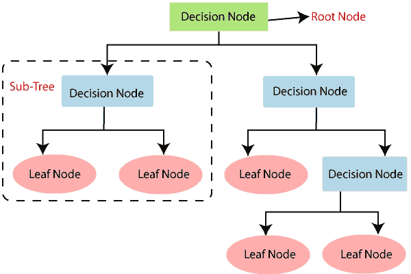
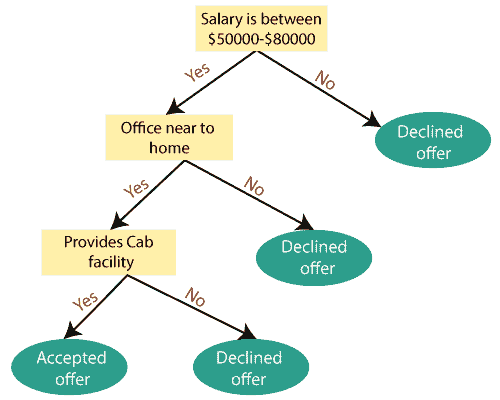
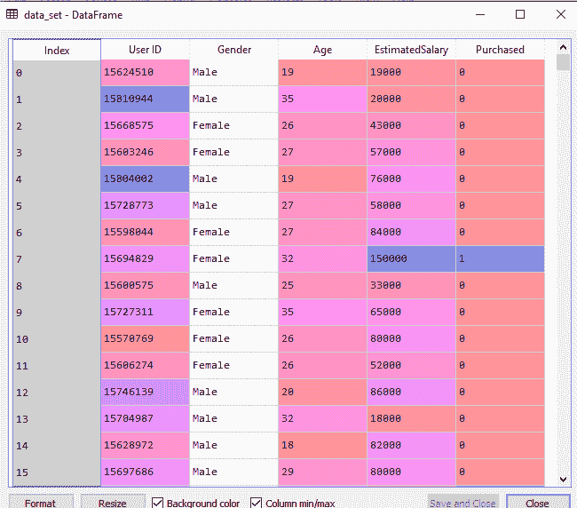
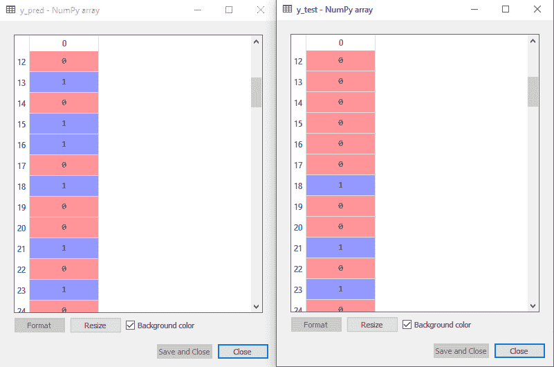
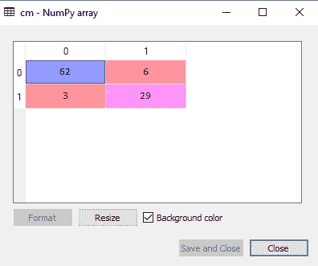
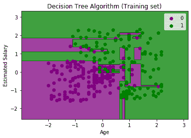
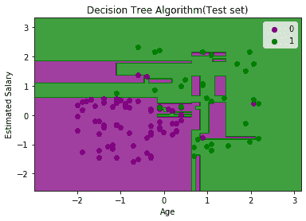

# 决策树分类算法

> 原文：<https://www.javatpoint.com/machine-learning-decision-tree-classification-algorithm>

*   决策树是一种**监督学习技术**，既可以用于分类问题，也可以用于回归问题，但大多数情况下，它是解决分类问题的首选方法。它是一个树形结构的分类器，其中**内部节点代表数据集的特征，分支代表决策规则**和**每个叶节点代表结果。**
*   在决策树中，有两个节点，即**决策节点**和**叶节点。**决策节点用于做出任何决策，并具有多个分支，而叶节点是这些决策的输出，不包含任何进一步的分支。
*   决策或测试基于给定数据集的特征来执行。
*   ***它是基于给定条件获得问题/决策的所有可能解决方案的图形表示。*T3】**
*   它之所以被称为决策树，是因为与树类似，它从根节点开始，然后扩展到更多的分支，并构建一个树状结构。
*   为了构建一棵树，我们使用 **CART 算法，**代表**分类和回归树算法。**
*   决策树只是简单地问一个问题，根据答案(是/否)，它进一步将树拆分为子树。
*   下图解释了决策树的一般结构:

#### 注:决策树可以包含分类数据(是/否)以及数字数据。



## 为什么要使用决策树？

机器学习中有各种各样的算法，因此为给定的数据集和问题选择最佳算法是创建机器学习模型时要记住的要点。以下是使用决策树的两个原因:

*   决策树通常在做决策时模仿人类的思维能力，所以很容易理解。
*   决策树背后的逻辑很容易理解，因为它显示了树状结构。

## 决策树术语

*   **根节点:**根节点是决策树开始的地方。它表示整个数据集，该数据集进一步分为两个或多个同类集。*   **叶节点:**叶节点是最终的输出节点，得到一个叶节点后，树不能再进一步隔离。*   **分裂:**分裂是根据给定的条件将决策节点/根节点划分为子节点的过程。*   **枝/子树:**将树劈开形成的树。*   **修剪:**修剪是从树上去除不需要的树枝的过程。*   **父/子节点:**树的根节点称为父节点，其他节点称为子节点。

**决策树算法是如何工作的？**

在决策树中，为了预测给定数据集的类别，算法从树的根节点开始。该算法将根属性值与记录(真实数据集)属性值进行比较，并根据比较结果，跟随分支跳转到下一个节点。

对于下一个节点，算法再次将属性值与其他子节点进行比较，并进一步移动。它继续这个过程，直到到达树的叶节点。使用以下算法可以更好地理解整个过程:

*   **步骤-1:** 从根节点开始树，S 表示，包含完整的数据集。
*   **步骤 2:** 使用**属性选择度量(ASM)在数据集中找到最佳属性。**
*   **步骤 3:** 将 S 划分为包含最佳属性可能值的子集。
*   **步骤-4:** 生成决策树节点，包含最佳属性。
*   **步骤-5:** 使用步骤-3 中创建的数据集子集递归生成新的决策树。继续此过程，直到到达无法进一步对节点进行分类的阶段，并将最终节点称为叶节点。

**例:**假设有一个应聘者有一份工作邀请，想决定是否接受邀请。因此，为了解决这个问题，决策树从根节点(ASM 的薪资属性)开始。根节点根据相应的标签进一步分为下一个决策节点(与办公室的距离)和一个叶节点。下一个决策节点进一步分成一个决策节点(Cab 设施)和一个叶节点。最后，决策节点分成两个叶节点(接受报价和拒绝报价)。考虑下图:



## 属性选择度量

在实现决策树时，出现的主要问题是如何为根节点和子节点选择最佳属性。因此，有一种称为**属性选择度量或 ASM 的技术来解决这些问题。**通过这个度量，我们可以很容易地为树的节点选择最佳属性。ASM 有两种流行的技术，它们是:

*   **信息增益**
*   **基尼指数**

### 1.信息增益:

*   信息增益是基于属性分割数据集后熵变化的度量。
*   它计算一个特征为我们提供了多少关于一个类的信息。
*   根据信息增益的大小，对节点进行分割，建立决策树。
*   决策树算法总是试图最大化信息增益的值，并且首先分割具有最高信息增益的节点/属性。可以使用以下公式计算:

```

Information Gain= Entropy(S)- [(Weighted Avg) *Entropy(each feature)

```

**熵:**熵是衡量给定属性中杂质的度量。它指定了数据的随机性。熵可以计算为:

```
Entropy(s)= -P(yes)log2 P(yes)- P(no) log2 P(no)
```

**在哪里，**

*   **S=样本总数**
*   **P(是)=是的概率**
*   **P(否)=否的概率**

### 2.基尼指数:

*   基尼指数是在 CART(分类和回归树)算法中创建决策树时使用的杂质或纯度的度量。
*   与高基尼系数相比，低基尼系数的属性更受青睐。
*   它只创建二进制拆分，CART 算法使用基尼指数来创建二进制拆分。
*   基尼系数可以用下面的公式计算:

```
Gini Index= 1- ∑jPj2

```

## 获取最优决策树

*剪枝是从一棵树上删除不必要的节点，以获得最优决策树的过程。*

过大的树会增加过度拟合的风险，而小的树可能无法捕获数据集的所有重要特征。因此，一种在不降低精度的情况下减小学习树大小的技术被称为剪枝。主要有两种类型的树**修剪**技术使用:

*   **成本复杂度修剪**
*   **减少错误修剪。**

## 决策树的优势

*   这很容易理解，因为它遵循着人类在现实生活中做任何决定时遵循的相同过程。
*   它对于解决与决策相关的问题非常有用。
*   思考问题的所有可能结果是有帮助的。
*   与其他算法相比，对数据清理的要求更低。

## 决策树的缺点

*   决策树包含很多层，这使得它很复杂。
*   它可能存在过拟合问题，可以使用**随机森林算法解决。**
*   对于更多的类别标签，决策树的计算复杂度可能会增加。

## 决策树的 Python 实现

现在我们将使用 Python 实现决策树。为此，我们将使用数据集“ **user_data.csv** ，这是我们在以前的分类模型中使用过的。通过使用相同的数据集，我们可以将决策树分类器与其他分类模型进行比较，如[【KNN】](https://www.javatpoint.com/k-nearest-neighbor-algorithm-for-machine-learning)[【SVM】](https://www.javatpoint.com/machine-learning-support-vector-machine-algorithm)[物流配送，](https://www.javatpoint.com/logistic-regression-in-machine-learning)等。

步骤也将保持不变，如下所示:

*   **数据预处理步骤**
*   **将决策树算法拟合到训练集**
*   **预测测试结果**
*   **测试结果的准确性(创建混淆矩阵)**
*   **可视化测试集结果。**

### 1.数据预处理步骤:

以下是预处理步骤的代码:

```

# importing libraries
import numpy as nm
import matplotlib.pyplot as mtp
import pandas as pd

#importing datasets
data_set= pd.read_csv('user_data.csv')

#Extracting Independent and dependent Variable
x= data_set.iloc[:, [2,3]].values
y= data_set.iloc[:, 4].values

# Splitting the dataset into training and test set.
from sklearn.model_selection import train_test_split
x_train, x_test, y_train, y_test= train_test_split(x, y, test_size= 0.25, random_state=0)

#feature Scaling
from sklearn.preprocessing import StandardScaler  
st_x= StandardScaler()
x_train= st_x.fit_transform(x_train)  
x_test= st_x.transform(x_test)  

```

在上面的代码中，我们已经对数据进行了预处理。我们加载数据集的位置，如下所示:



### 2.将决策树算法拟合到训练集

现在我们将使模型适合训练集。为此，我们将从 **sklearn.tree** 库中导入**决策树分类器**类。下面是它的代码:

```

#Fitting Decision Tree classifier to the training set
From sklearn.tree import DecisionTreeClassifier
classifier= DecisionTreeClassifier(criterion='entropy', random_state=0)
classifier.fit(x_train, y_train)

```

在上面的代码中，我们创建了一个分类器对象，其中我们传递了两个主要参数；

*   **“判据=‘熵’:**判据用于衡量分裂的质量，由熵给出的信息增益计算。
*   **随机状态=0":** 用于生成随机状态。

以下是这方面的输出:

```
Out[8]: 
DecisionTreeClassifier(class_weight=None, criterion='entropy', max_depth=None,
max_features=None, max_leaf_nodes=None,
min_impurity_decrease=0.0, min_impurity_split=None,
min_samples_leaf=1, min_samples_split=2,
min_weight_fraction_leaf=0.0, presort=False,
                       random_state=0, splitter='best')

```

### 3.预测测试结果

现在我们将预测测试集结果。我们将创建一个新的预测向量 **y_pred。**下面是它的代码:

```

#Predicting the test set result
y_pred= classifier.predict(x_test)

```

**输出:**

在下面的输出图像中，给出了预测输出和实际测试输出。我们可以清楚地看到，预测向量中有一些值与真实向量值不同。这些都是预测误差。



### 4.测试结果的准确性(创建混淆矩阵)

在上面的输出中，我们看到有一些不正确的预测，所以如果我们想知道正确和不正确预测的数量，我们需要使用混淆矩阵。下面是它的代码:

```

#Creating the Confusion matrix
from sklearn.metrics import confusion_matrix
cm= confusion_matrix(y_test, y_pred)

```

**输出:**



在上面的输出图像中，我们可以看到混淆矩阵，它有 **6+3= 9 个不正确的预测**和 **62+29=91 个正确的预测。因此，可以说，与其他分类模型相比，决策树分类器做出了很好的预测。**

### 5.可视化训练集结果:

这里我们将可视化训练集结果。为了可视化训练集结果，我们将绘制决策树分类器的图形。分类器会像我们在[逻辑回归中所做的那样，为已经购买或未购买 SUV 汽车的用户预测是或否。](https://www.javatpoint.com/logistic-regression-in-machine-learning)下面是它的代码:

```

#Visulaizing the trianing set result
from matplotlib.colors import ListedColormap
x_set, y_set = x_train, y_train
x1, x2 = nm.meshgrid(nm.arange(start = x_set[:, 0].min() - 1, stop = x_set[:, 0].max() + 1, step  =0.01),
nm.arange(start = x_set[:, 1].min() - 1, stop = x_set[:, 1].max() + 1, step = 0.01))
mtp.contourf(x1, x2, classifier.predict(nm.array([x1.ravel(), x2.ravel()]).T).reshape(x1.shape),
alpha = 0.75, cmap = ListedColormap(('purple','green' )))
mtp.xlim(x1.min(), x1.max())
mtp.ylim(x2.min(), x2.max())
fori, j in enumerate(nm.unique(y_set)):
mtp.scatter(x_set[y_set == j, 0], x_set[y_set == j, 1],
        c = ListedColormap(('purple', 'green'))(i), label = j)
mtp.title('Decision Tree Algorithm (Training set)')
mtp.xlabel('Age')
mtp.ylabel('Estimated Salary')
mtp.legend()
mtp.show()

```

**输出:**



以上输出与其余分类模型完全不同。它有垂直线和水平线，根据年龄和估计薪资变量分割数据集。

正如我们所看到的，树试图捕获每个数据集，这就是过度拟合的情况。

### 6.可视化测试集结果:

测试集结果的可视化类似于训练集的可视化，只是训练集将被测试集替换。

```

#Visulaizing the test set result
from matplotlib.colors import ListedColormap
x_set, y_set = x_test, y_test
x1, x2 = nm.meshgrid(nm.arange(start = x_set[:, 0].min() - 1, stop = x_set[:, 0].max() + 1, step  =0.01),
nm.arange(start = x_set[:, 1].min() - 1, stop = x_set[:, 1].max() + 1, step = 0.01))
mtp.contourf(x1, x2, classifier.predict(nm.array([x1.ravel(), x2.ravel()]).T).reshape(x1.shape),
alpha = 0.75, cmap = ListedColormap(('purple','green' )))
mtp.xlim(x1.min(), x1.max())
mtp.ylim(x2.min(), x2.max())
fori, j in enumerate(nm.unique(y_set)):
mtp.scatter(x_set[y_set == j, 0], x_set[y_set == j, 1],
        c = ListedColormap(('purple', 'green'))(i), label = j)
mtp.title('Decision Tree Algorithm(Test set)')
mtp.xlabel('Age')
mtp.ylabel('Estimated Salary')
mtp.legend()
mtp.show()

```

**输出:**



如上图所示，紫色区域内有一些绿色数据点，反之亦然。这些是我们在混淆矩阵中讨论过的不正确的预测。

* * *