# 机器学习中的层次聚类

> 原文：<https://www.javatpoint.com/hierarchical-clustering-in-machine-learning>

层次聚类是另一种无监督的机器学习算法，用于将未标记的数据集分组为一个聚类，也称为**层次聚类分析**或 HCA。

在该算法中，我们以树的形式开发了聚类的层次结构，这种树形结构被称为**树形图**。

有时，K-means 聚类和层次聚类的结果可能看起来相似，但它们都因工作方式而异。因为不需要像我们在 K-Means 算法中那样预先确定聚类的数量。

分层聚类技术有两种方法:

1.  **凝聚:**凝聚是一种**自下而上的**方法，该算法首先将所有数据点作为单个聚类，并将其合并，直到剩下一个聚类。
2.  **除法:**除法算法与凝聚算法相反，因为它是一种**自上而下的方法。**

### 为什么是层次聚类？

既然我们已经有了其他的[聚类](clustering-in-machine-learning)算法，比如 **[K-Means 聚类](k-means-clustering-algorithm-in-machine-learning)** ，那为什么还需要分层聚类呢？因此，正如我们在 K-means 聚类中看到的，该算法存在一些挑战，即预定数量的聚类，并且它总是试图创建相同大小的聚类。为了解决这两个挑战，我们可以选择分层聚类算法，因为在该算法中，我们不需要了解预定义的聚类数量。

在本主题中，我们将讨论凝聚层次聚类算法。

## 凝聚层次聚类

凝聚层次聚类算法是一个流行的例子。为了将数据集分组为簇，它遵循**自下而上的方法**。这意味着，该算法在开始时将每个数据集视为单个聚类，然后开始将最接近的一对聚类组合在一起。它会这样做，直到所有的集群合并成一个包含所有数据集的集群。

这种聚类的层次结构以树形图的形式表示。

## 凝聚层次聚类是如何工作的？

AHC 算法的工作可以通过以下步骤来解释:

*   **步骤-1:** 将每个数据点创建为单个集群。假设有 N 个数据点，那么集群数量也将为 N .
    T3】
*   **步骤-2:** 取两个最近的数据点或聚类，合并成一个聚类。所以，现在会有 N-1 个集群。
    T3】
*   **步骤-3** :再次取两个最接近的聚类，合并在一起形成一个聚类。会有 N-2 个集群。
    T3】
*   **步骤-4:** 重复步骤 3，直到只剩下一个集群。因此，我们将得到以下集群。考虑以下图片:
    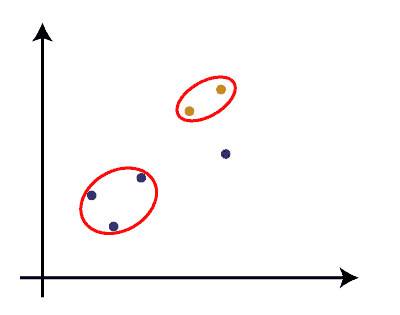
    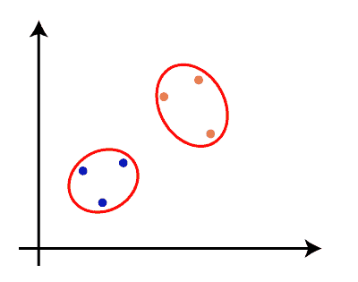
    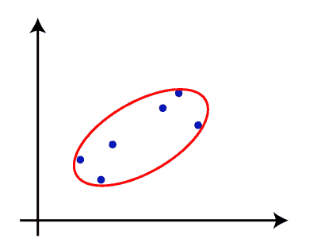
*   **步骤-5:** 一旦所有的聚类组合成一个大的聚类，根据问题开发树形图来划分聚类。

#### 注意:为了更好地理解层次聚类，建议看看 k-means 聚类

### 测量两个簇之间的距离

正如我们已经看到的，两个聚类之间的**最近距离**对于层次聚类至关重要。计算两个聚类之间的距离有多种方法，这些方法决定了聚类的规则。这些措施被称为**联动方法**。一些流行的链接方法如下:

1.  **单连锁:**是聚类最近点之间的最短距离。考虑下图:
    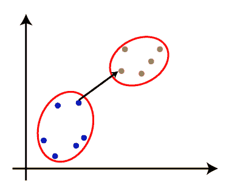
2.  **完全联动:**是两个不同集群的两点之间最远的距离。它是流行的连接方法之一，因为它比单连接形成更紧密的簇。
    T3】
3.  **平均联动:**是将每对数据集之间的距离相加，再除以数据集总数，计算出两个聚类之间的平均距离的联动方法。也是最流行的联动方式之一。
4.  **质心联动:**是计算集群质心之间距离的联动方式。考虑下图:
    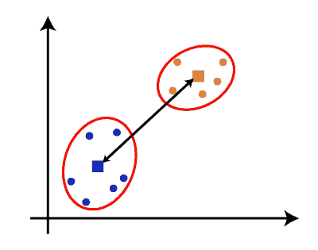

从上面给出的方法中，我们可以根据问题的类型或业务需求应用其中的任何一种。

### 层次聚类中树形图的绘制

树形图是一种树状结构，主要用于将每个步骤存储为 HC 算法执行的内存。在树形图中，Y 轴显示数据点之间的欧氏距离，x 轴显示给定数据集的所有数据点。

树形图的工作可以用下图来解释:

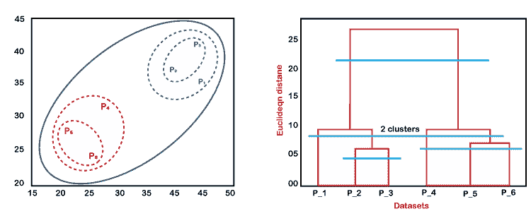

在上图中，左侧部分显示了如何在聚集聚类中创建聚类，右侧部分显示了相应的树图。

*   如上所述，首先，数据点 P2 和 P3 结合在一起，形成一个集群，相应地，创建了一个树形图，以矩形形状连接 P2 和 P3。高度是根据数据点之间的欧几里得距离决定的。
*   在下一步中，P5 和 P6 形成一个集群，并创建相应的树图。它比以前更高，因为 P5 和 P6 之间的欧几里得距离比 P2 和 P3 稍大一点。
*   同样，创建了两个新的树状图，在一个树状图中结合了 P1、P2 和 P3，在另一个树状图中结合了 P4、P5 和 P6。
*   最后，创建最终的树图，将所有数据点组合在一起。

我们可以根据我们的要求在任何层次上切割树形结构。

## 凝聚层次聚类的 Python 实现

现在我们将看到使用 Python 的凝聚层次聚类算法的实际实现。为了实现这一点，我们将使用我们在之前的 K-means 聚类主题中使用的相同数据集问题，以便我们可以轻松地比较这两个概念。

该数据集包含了去购物中心购物的顾客的信息。因此，商场老板希望使用数据集信息找到顾客的一些模式或特定行为。

### 使用 Python 实现 AHC 的步骤:

实现步骤将与 k-means 聚类相同，除了一些变化，例如查找聚类数量的方法。以下是步骤:

1.  **数据预处理**
2.  **使用树形图**找到最佳聚类数
3.  **训练层次聚类模型**
4.  **可视化集群**

### 数据预处理步骤:

在这一步中，我们将导入模型的库和数据集。

*   **导入库**

```

# Importing the libraries
import numpy as nm
import matplotlib.pyplot as mtp
import pandas as pd

```

以上几行代码用于导入库以执行特定任务，如用于数学运算， **[matplotlib](https://www.javatpoint.com/matplotlib)** 用于绘制图形或散点图，以及 **[Pandas](https://www.javatpoint.com/python-pandas)** 用于导入数据集。

*   **导入数据集**

```

# Importing the dataset
dataset = pd.read_csv('Mall_Customers_data.csv')

```

如上所述，我们导入了与 k-means 聚类相同的 **Mall_Customers_data.csv、**数据集。考虑以下输出:

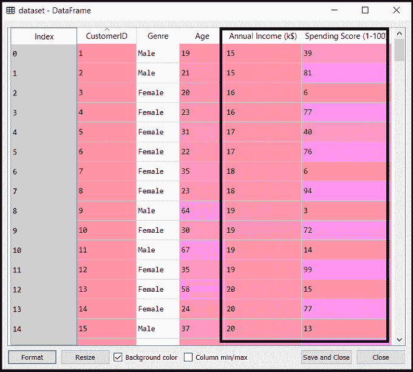

*   **提取特征矩阵**

这里我们将只提取特征矩阵，因为我们没有任何关于因变量的进一步信息。代码如下:

```

x = dataset.iloc[:, [3, 4]].values

```

这里我们只提取了 3 列和 4 列，因为我们将使用 2D 图来查看集群。因此，我们将年收入和支出分数视为特征矩阵。

### 步骤 2:使用树形图找到最佳的聚类数

现在，我们将使用我们模型的树图来找到最佳聚类数。为此，我们将使用 **scipy** 库，因为它提供了一个直接为我们的代码返回树形图的函数。考虑下面几行代码:

```

#Finding the optimal number of clusters using the dendrogram
import scipy.cluster.hierarchy as shc
dendro = shc.dendrogram(shc.linkage(x, method="ward"))
mtp.title("Dendrogrma Plot")
mtp.ylabel("Euclidean Distances")
mtp.xlabel("Customers")
mtp.show()

```

在上面几行代码中，我们已经导入了 scipy 库的**层次**模块。本模块为我们提供了一种以**联动()**为参数的方法 **shc.denrogram()，**。联动函数用来定义两个聚类之间的距离，所以这里我们通过了 x(特征矩阵)，以及方法“ **ward** ”，层次聚类中流行的联动方法。

剩下的几行代码用来描述树木图的标签。

**输出:**

通过执行上面几行代码，我们将得到下面的输出**:T1**

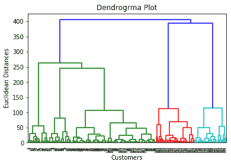

使用这个树图，我们现在将为我们的模型确定最佳的聚类数。为此，我们将找到不切割任何水平条的**最大垂直距离**。考虑下图:

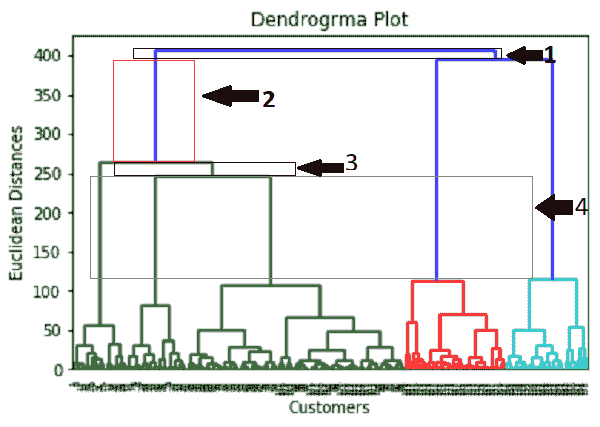

在上图中，我们显示了没有切割水平条的垂直距离。我们可以想象，第 4<sup>距离看起来是最大的，所以根据这个，**集群的数量将是 5** (这个范围内的垂直线)。我们也可以取 2 <sup>第</sup>个数字，因为它大约等于 4 <sup>第</sup>个距离，但是我们将考虑 5 个聚类，因为这与我们在 K-means 算法中计算的相同。</sup>

**所以，最佳的聚类数将是 5** ，我们将在下一步训练模型，使用相同的。

### 步骤 3:训练层次聚类模型

由于我们知道所需的最佳集群数量，我们现在可以训练我们的模型。代码如下:

```

#training the hierarchical model on dataset
from sklearn.cluster import AgglomerativeClustering
hc= AgglomerativeClustering(n_clusters=5, affinity='euclidean', linkage='ward')
y_pred= hc.fit_predict(x)

```

在上面的代码中，我们已经导入了 scikit 学习库的集群模块的**aggregatveclustering**类。

然后我们创建了这个类的对象，命名为 **hc。**凝聚类采用以下参数:

*   **n_clusters=5** :它定义了集群的数量，我们这里取 5 是因为它是最优的集群数量。
*   **亲和力= '欧几里德'**:是用来计算联系的度量。
*   **联动= '沃德'**:它定义了联动标准，这里我们已经用了“沃德”联动。这种方法是我们已经用于创建树图的流行链接方法。它减少了每个集群中的差异。

在最后一行，我们创建了因变量 y_pred 来拟合或训练模型。它不仅训练模型，还返回每个数据点所属的聚类。

执行完上面几行代码后，如果我们在 Sypder IDE 中浏览变量资源管理器选项，我们可以检查 y_pred 变量。我们可以将原始数据集与 y_pred 变量进行比较。请考虑下图:

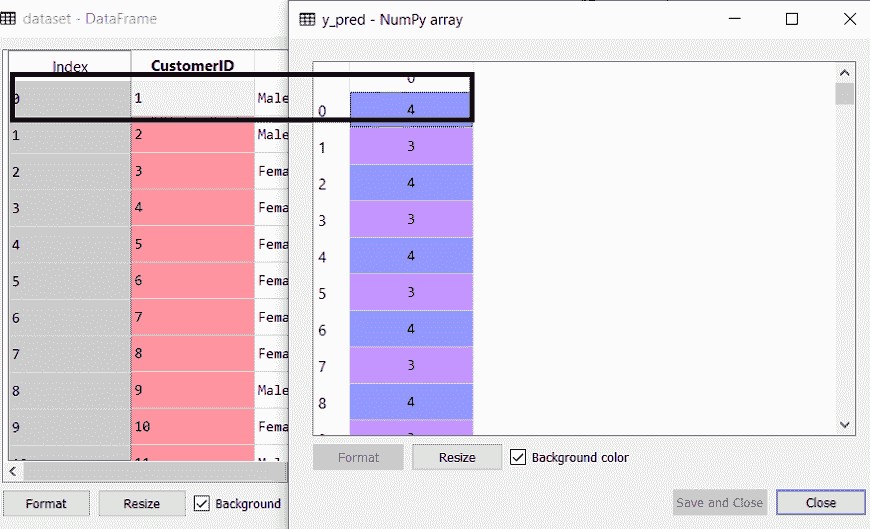

如上图所示， **y_pred** 显示了 clusters 值，这意味着客户 id 1 属于第 5 个<sup>第</sup>集群(因为索引从 0 开始，所以 4 表示第 5 个<sup>第</sup>集群)，客户 id 2 属于第 4 个<sup>第</sup>集群，以此类推。

### 步骤 4:可视化集群

由于我们已经成功地训练了我们的模型，现在我们可以可视化对应于数据集的聚类。

这里我们将使用与 k-means 聚类中相同的代码行，除了一处更改。在这里，我们将不绘制我们在 k-means 中所做的质心，因为这里我们已经使用了树图来确定最佳的聚类数。代码如下:

```

#visulaizing the clusters
mtp.scatter(x[y_pred == 0, 0], x[y_pred == 0, 1], s = 100, c = 'blue', label = 'Cluster 1')
mtp.scatter(x[y_pred == 1, 0], x[y_pred == 1, 1], s = 100, c = 'green', label = 'Cluster 2')
mtp.scatter(x[y_pred== 2, 0], x[y_pred == 2, 1], s = 100, c = 'red', label = 'Cluster 3')
mtp.scatter(x[y_pred == 3, 0], x[y_pred == 3, 1], s = 100, c = 'cyan', label = 'Cluster 4')
mtp.scatter(x[y_pred == 4, 0], x[y_pred == 4, 1], s = 100, c = 'magenta', label = 'Cluster 5')
mtp.title('Clusters of customers')
mtp.xlabel('Annual Income (k$)')
mtp.ylabel('Spending Score (1-100)')
mtp.legend()
mtp.show()

```

输出:通过执行上面的代码行，我们将得到下面的输出:

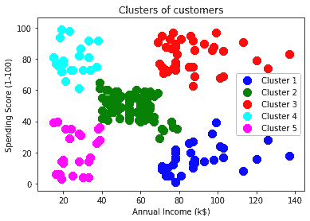

* * *