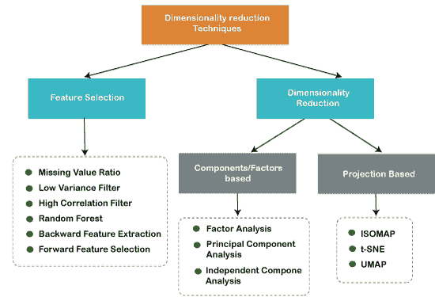

# 降维技术简介

> 原文：<https://www.javatpoint.com/dimensionality-reduction-technique>

## 什么是降维？

给定数据集中存在的输入特征、变量或列的数量被称为维数，而减少这些特征的过程被称为维数减少。

数据集在各种情况下包含大量输入特征，这使得预测建模任务更加复杂。因为很难对具有大量特征的训练数据集进行可视化或预测，所以在这种情况下，需要使用降维技术。

降维技术可以定义为: ***“它是一种将高维数据集转换为低维数据集的方法，确保它提供相似的信息。”*** 这些技术在[机器学习](https://www.javatpoint.com/machine-learning)中被广泛使用，用于在解决分类和回归问题的同时获得更好的拟合预测模型。

常用于处理高维数据的领域，如**语音识别、信号处理、生物信息学等。也可用于数据可视化、降噪、聚类分析**等。

## 维度的诅咒

处理高维数据在实践中非常困难，俗称*维数灾难。*如果输入数据集的维数增加，任何机器学习算法和模型都会变得更加复杂。随着特征数量的增加，样本数量也成比例地增加，过拟合的机会也增加。如果机器学习模型是在高维数据上训练的，它会变得过度训练，导致性能不佳。

因此，通常需要减少特征的数量，这可以通过降维来实现。

## 应用降维的好处

将降维技术应用于给定数据集的一些好处如下:

*   通过减少要素的维度，存储数据集所需的空间也会减少。
*   减少特征维数所需的计算训练时间更少。
*   数据集特征的降维有助于快速可视化数据。
*   **I** t 通过处理多重共线性来移除冗余特征(如果存在)。

## 降维的缺点

应用降维也有一些缺点，如下所示:

*   由于降维，一些数据可能会丢失。
*   在主成分分析降维技术中，有时需要考虑的主成分是未知的。

## 降维方法

有两种方法可以应用降维技术，如下所示:

### 特征选择

特征选择是选择相关特征的子集并排除数据集中存在的不相关特征以构建高精度模型的过程。换句话说，这是从输入数据集中选择最佳要素的一种方式。

特征选择使用三种方法:

**1。过滤器方法**

在该方法中，对数据集进行过滤，并获取仅包含相关要素的子集。过滤器方法的一些常见技术有:

*   **相关性**
*   **卡方检验**
*   **方差分析**
*   **信息增益等。**

**2。包装方法**

包装方法的目标与过滤方法相同，但它采用机器学习模型进行评估。在该方法中，一些特征被馈送到 ML 模型，并评估性能。性能决定是添加还是删除这些特征，以提高模型的准确性。这种方法比滤波方法更精确，但工作复杂。包装方法的一些常见技术有:

*   预选
*   向后选择
*   双向消除

**3。嵌入式方法:**嵌入式方法检查机器学习模型的不同训练迭代，评估每个特征的重要性。嵌入式方法的一些常见技术有:

*   套索
*   **弹性网**
*   **岭回归等。**

### 特征提取:

特征提取是将包含多个维度的空间转换为更少维度的空间的过程。当我们希望保留全部信息，但在处理信息时使用较少的资源时，这种方法非常有用。

一些常见的特征提取技术有:

1.  主成分分析
2.  线性判别分析
3.  核主成分分析
4.  二次判别分析

## 降维的常用技术

1.  **主成分分析**
2.  **后向淘汰**
3.  **前进选择**
4.  **分数对比**
5.  **缺失值比率**
6.  **低方差滤波器**
7.  **高相关滤波器**
8.  **随机森林**
9.  **因素分析**
10.  **自动编码器**

### 主成分分析

主成分分析是在正交变换的帮助下，将相关特征的观测值转换成一组线性不相关特征的统计过程。这些新的变换特征被称为**主分量**。它是用于探索性数据分析和预测性建模的流行工具之一。

主成分分析通过考虑每个属性的方差来工作，因为高属性显示了类之间的良好分割，因此它降低了维度。PCA 的一些现实应用是 ***图像处理，电影推荐系统，优化各种通信渠道的功率分配。*T3】**

### 反向特征消除

反向特征消除技术主要用于开发线性回归或逻辑回归模型。在该技术中执行以下步骤来降低维度或特征选择:

*   在该技术中，首先，采用给定数据集的所有 n 个变量来训练模型。
*   检查模型的性能。
*   现在，我们将每次移除一个特征，并在 n-1 个特征上训练模型 n 次，并将计算模型的性能。
*   我们将检查在模型性能中做出最小或没有变化的变量，然后我们将删除该变量或特征；之后，我们将剩下 n-1 个特性。
*   重复整个过程，直到不能删除任何功能。

在该技术中，通过选择模型的最佳性能和最大容许错误率，我们可以定义机器学习算法所需的特征的最佳数量。

### 正向特征选择

正向特征选择遵循反向消除过程的逆过程。这意味着，在这种技术中，我们不消除特征；相反，我们将找到能够在模型性能上产生最高提升的最佳特性。该技术执行以下步骤:

*   我们只从一个特性开始，逐步地我们将一次添加每个特性。
*   在这里，我们将分别在每个特性上训练模型。
*   选择性能最佳的功能。
*   这个过程将会重复，直到我们得到模型性能的显著提高。

### 缺失值比率

如果一个数据集有太多的缺失值，那么我们就删除这些变量，因为它们没有携带太多有用的信息。要执行此操作，我们可以设置一个阈值级别，如果某个变量的缺失值超过该阈值，我们将删除该变量。阈值越高，减少越有效。

### 低方差滤波器

与缺失值比率技术一样，数据中有一些变化的数据列信息较少。因此，我们需要计算每个变量的方差，方差低于给定阈值的所有数据列都会被丢弃，因为低方差特征不会影响目标变量。

### 高相关滤波器

高相关性是指两个变量携带近似相似信息的情况。由于这个因素，模型的性能可能会降低。独立数值变量之间的这种相关性给出了相关系数的计算值。如果该值高于阈值，我们可以从数据集中移除其中一个变量。我们可以考虑那些与目标变量高度相关的变量或特征。

### 随机森林

随机森林是机器学习中一种流行且非常有用的特征选择算法。这个算法包含一个内置的特征重要性包，所以我们不需要单独编程。在这项技术中，我们需要针对目标变量生成一大组树，并且在每个属性的使用统计的帮助下，我们需要找到特征的子集。

随机森林算法只取数值变量，因此我们需要使用**热编码**将输入数据转换为数值数据。

### 要素分析

因子分析是一种技术，其中每个变量根据与其他变量的相关性保持在一个组内，这意味着一个组内的变量之间可以有很高的相关性，但它们与其他组的变量之间的相关性很低。

我们可以通过一个例子来理解，比如如果我们有两个变量收入和支出。这两个变量具有很高的相关性，这意味着高收入的人花费更多，反之亦然。所以，这样的变量被放入一个组，这个组被称为**因子**。与数据集的原始维度相比，这些因素的数量将会减少。

### 自动编码器

一种流行的降维方法是自动编码器，这是一种ANN或[ANN](https://www.javatpoint.com/artificial-neural-network)，其主要目的是将输入复制到输出。在这种情况下，输入被压缩成潜在空间表示，并且使用这种表示进行输出。它主要有两个部分:

*   **编码器:**编码器的功能是压缩输入，形成潜在空间表示。
*   **解码器:**解码器的功能是从潜在空间表示中重建输出。

* * *