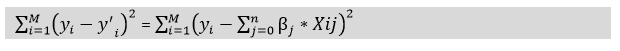
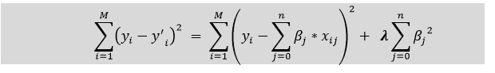

# 机器学习中的正则化

> 原文：<https://www.javatpoint.com/regularization-in-machine-learning>

## 什么是正则化？

正则化是机器学习最重要的概念之一。这是一种通过向模型添加额外信息来防止模型过度拟合的技术。

有时[机器学习](https://www.javatpoint.com/machine-learning)模型在训练数据下表现良好，但在测试数据下表现不佳。这意味着，当通过在输出中引入噪声来处理看不见的数据时，该模型无法预测输出，因此，该模型被称为过负荷。这个问题可以在正则化技术的帮助下解决。

这种技术可以通过减少变量的大小来保持模型中的所有变量或特征。因此，它保持了模型的精确性和通用性。

它主要是将特征的系数向零正则化或降低。简而言之，“*在正则化技术中，我们通过保持相同数量的特征来减少特征的数量。”*

### 正规化是如何工作的？

正则化通过向复杂模型添加惩罚或复杂性项来工作。让我们考虑简单的线性回归方程:

y= β0+β1x1+β2x2+β3x3+⋯+βnxn +b

在上式中，Y 代表要预测的值

X1、X2、…Xn 是 y 的特色

β0,β1,…..βn 分别是附着在特征上的重量或大小。这里代表模型的偏差，b 代表截距。

线性回归模型试图优化β0 和 b，以最小化成本函数。线性模型的成本函数公式如下:

现在，我们将添加一个损失函数并优化参数，使模型能够预测 y 的精确值。线性回归的损失函数称为 **RSS 或残差平方和。**

## 正则化技术

主要有两种正则化技术，如下所示:

*   **岭回归**
*   **套索回归**

### 里脊回归

*   岭回归是线性回归的类型之一，其中引入了少量的偏差，以便我们可以获得更好的长期预测。
*   岭回归是一种正则化技术，用于降低模型的复杂度。也叫 **L2 正则化**。
*   在这种技术中，成本函数通过增加惩罚项来改变。添加到模型中的偏差量称为**岭回归惩罚**。我们可以通过将λ乘以每个单独特征的平方权重来计算它。
*   岭回归中成本函数的方程为:

*   在上面的等式中，惩罚项正则化了模型的系数，因此岭回归降低了系数的幅度，从而降低了模型的复杂性。
*   从上面的方程我们可以看出，如果 **λ的值趋于零，则该方程成为线性回归模型的成本函数。**因此，对于λ的最小值，模型将类似于线性回归模型。
*   如果自变量之间存在较高的共线性，一般的线性或多项式回归会失败，因此可以使用岭回归来解决这类问题。
*   如果我们有比样本更多的参数，这有助于解决问题。

### 套索回归:

*   套索回归是另一种降低模型复杂度的正则化技术。它代表**最小绝对算子和选择算子。**
*   它类似于岭回归，只是惩罚项只包含绝对权重，而不是权重的平方。
*   由于它采用绝对值，因此，它可以将斜率缩小到 0，而岭回归只能将其缩小到接近 0。
*   也称为 **L1 正则化。**拉索回归的成本函数方程为:

*   该技术中的一些特征在模型评估中被完全忽略。
*   因此，套索回归可以帮助我们减少模型中的过拟合以及特征选择。

### 岭回归和套索回归的主要区别

*   **岭回归**主要用于减少模型中的过拟合，它包括模型中存在的所有特征。它通过缩小系数来降低模型的复杂性。
*   **套索回归**有助于减少模型中的过拟合以及特征选择。

* * *