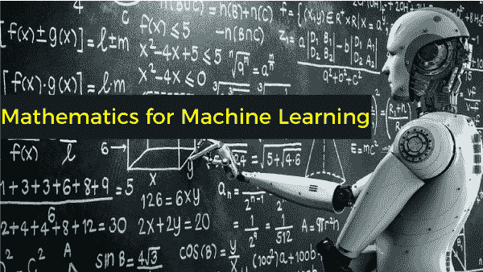
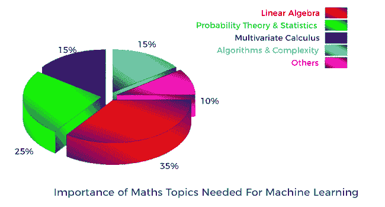

# 机器学习的基本数学|机器学习数学的重要概念

> 原文：<https://www.javatpoint.com/essential-mathematics-for-machine-learning>

如今，机器学习是研究人员、行业和热心学习者最感兴趣的技术之一，因为它让人类的生活变得更加轻松。它被广泛应用于现实世界的几乎所有领域，从谷歌助手到自动驾驶汽车。 ***是关于开发能够从数据中自动提取重要信息和模式的模型。*** 但在这里，一个重要的问题出现了:*ML****背后的魔法是什么，答案是数学*** 。数学是设计 ML 算法的核心，ML 算法可以自动从数据中学习并做出预测。因此，在深入理解最大似然算法之前，理解数学是非常重要的。

数学一直是一些人的好朋友，也是一些人的恐惧症或焦虑。许多学生对全球范围内的数学不感兴趣，因为他们认为数学中涵盖的主题与实际或现实问题不太相关。但是随着机器学习的发展，人们学习数学的动力越来越大，因为它直接用于设计最大似然算法。了解这背后的概念也很有帮助。在本主题中，我们将学习机器学习中使用的所有数学基本概念。

#### 注意:使用简单的机器学习模型，不需要深入学习数学；相反，了解基本的数学概念就足以理解它是如何在 ML 中应用的。

## 为什么要为机器学习学习数学？

发烧友学习者总有一个疑问，机器学习对数学的需求是什么？因为计算机能比人类更快地解决数学问题。 ***所以，答案是，在机器学习中学习数学不是为了解决一个数学问题，而是理解数学在 ML 算法中的应用及其工作方式*** 。以下几点解释了数学在 ML 中的重要性:

*   数学定义了最大似然算法背后的概念&通过考虑*精度、训练时间、模型复杂性、特征数量来帮助选择正确的算法。*
*   计算机对数据的理解不同于人类，比如一幅图像被计算机视为 2D-三维矩阵，而这需要数学。
*   借助数学，我们可以正确地确定区间&不确定性。
*   它有助于选择正确的参数值和验证方法。
*   了解偏差-方差权衡有助于我们识别最大似然模型中的主要问题——拟合不足和过度拟合问题。

## 机器学习的基本数学

理解了对数学的需求后，下一个问题出现了:需要什么水平的数学，需要理解什么概念。为了回答这个问题，我们已经提供了 ML 工程师/科学家所需的基本数学水平。除了以下概念之外，数学水平还取决于个人的兴趣和某人正在从事的研究类型。

*   **线性代数**
*   **多元微积分**
*   **概率论**
*   **离散数学**
*   **统计**
*   **算法&优化**
*   **其他**

下图显示了不同数学概念在机器学习中的重要性。如图所示，数学最重要的部分是**线性代数，**在 ML 中被广泛使用

### 1.机器学习的线性代数

线性代数是关于向量和处理这些向量的一些规则的研究。线性代数的概念被广泛用于开发机器学习的算法。它使最大似然算法能够在大量数据集上运行。它可以执行以下任务:

*   它在 ML 世界中几乎无处不在。
*   线性代数有助于优化数据。
*   它用于损失函数、正则化、协方差矩阵、奇异值分解、矩阵运算和支持向量机分类。
*   它也用于机器学习中的线性回归。

ML 中使用了不同的线性代数主题，如*主成分分析(PCA)、奇异值分解(SVD)、矩阵的特征分解、LU 分解、QR 分解/因子分解、对称矩阵、正交化&正交化、矩阵运算、投影、特征值&特征向量、向量空间和范数*。理解优化方法需要这些主题。

除了这些用途，线性代数还广泛应用于神经网络和数据科学领域。简而言之，*线性代数为所有 ML 算法提供了展示其结果的平台或基础。*

虽然线性代数是机器学习数学中必不可少的一部分，但并不要求深入了解。意思是不要求是线性代数方面的专家；相反，对于机器学习来说，只有这些概念的良好知识才足够。

### 2.机器学习微积分

微积分数学是机器学习不可分割的一部分，但不要求精通；相反，只有基本概念的知识就足够了。多元微积分有助于解决机器学习中的优化问题。不同的最大似然算法根据一组期望的模型参数优化目标函数，这些参数控制模型如何解释数据。获得最佳参数的过程称为优化，多元微积分有助于解决 ML 模型中的优化问题。它有助于优化并从模型中获得良好的结果。

多元微积分用于算法训练和梯度下降。我们需要学习和实现多元微积分的一些重要概念，如 ***导数、散度、曲率和二次近似*** 。

多元微积分的一些基本主题是:

*   ***偏导数***
*   ***向量值函数***
*   ***【方向梯度】***
*   **T1】黑森，雅可比 T3】**
*   ***拉普拉斯和拉格朗日分布。*T3】**

### 3.机器学习中的概率

概率一直是数学中一个重要而有趣的部分，它衡量一个事件发生的可能性。事件发生的概率越高，该事件发生的可能性就越大。 ***ML 还有助于预测未来事件发生的可能性。*** 概率是正确处理最大似然预测和建模项目所必需的。它还有助于假设检验和分布，如高斯分布和概率密度函数。

一些重要的概率概念如下:

*   ***【联合概率、边际概率和条件概率】***
*   ***【概率分布(离散、连续)】***
*   ***密度估算***
*   ***最大似然估计***
*   ***最大似然回归***
*   ***【贝叶斯定理】等*** ***。***

### 4.机器学习中的统计学

统计学有助于从给定的数据中得出合乎逻辑的结论。这是一个至关重要的概念，每个机器学习工程师/科学家都必须学会理解分类算法的工作，如机器学习中的逻辑回归、分布、判别分析和假设检验。它有助于执行以下任务:

*   它是工具的集合，有助于从可用的数据和信息中确定目标。
*   统计学有助于理解数据，并将样本观察转化为有意义的信息。
*   世界上没有一个系统存储了完美的数据，并根据需要随时可用。每个系统都有数据异常，如不完整、损坏的数据等。在这种复杂的情况下，统计概念将是你最好的朋友。
*   它有助于找到问题的答案，例如“谁在板球锦标赛中得分最高和最低？”“2021 年哪项技术是趋势？”等等。

最大似然所需的一些基本统计概念如下:

*   ***组合学***
*   ***公理***
*   ***贝叶斯‘贝叶斯’定理***
*   ***【方差与期望】***
*   ***随机变量***
*   ***条件分布和联合分布。*T3】**

### 5.机器学习中的离散数学

离散数学是基于离散(非连续数)数，更常见的是整数的数学概念的研究。离散数学在算法、编程语言、密码学、软件开发等不同领域有着广泛的应用。

机器学习和人工智能中有许多需要使用离散数学的情况。例如，一个神经网络包含整数个节点和互连，它可以有. 56 个节点。对于这种情况，需要离散元素，因此需要离散数学。图结构和图算法是机器学习离散数学的重要课题。

对于正常的 ML 项目，只有离散数学的基础就够了。同时，如果我们想使用图形模型、关系域、结构化预测等。，你需要参考一本离散数学的书。然而，对于理科毕业生来说，大部分的概念都是在大学期间涵盖的。

### 6.算法与复杂优化

优化算法对于更好地理解机器学习算法的计算效率和可扩展性非常重要。 ***数据结构的概念知识(二叉树、哈希、堆、栈等)。)，动态规划，随机化&次线性算法，图，梯度/随机下降和原始对偶方法是必需的。*T3】**

## 学习机器学习数学的最佳方式/资源

为了机器学习而学习数学并不是一件典型的事情，因为有多种资源可用，包括书籍、在线课程和不同的博客。所有这些资源提供了大量不同数学主题的知识。然而，每种资源对一些概念都有好处，所以这里我们提供了一个所有重要资源的列表，这些资源将帮助你以一种更好&简单的方式学习数学。

### 1.为机器学习学习数学的教科书

*   **<u>机器学习的数学</u>****马克·彼得·戴森罗斯**是开始你的机器学习数学之旅的最佳书籍之一。在这本书里，详细解释了这些算法的实际应用以及它们背后的数学原理。机器学习的基本数学概念已经得到了最好的解释。书可以从[这里](https://mml-book.github.io/book/mml-book.pdf)下载。
*   **<u>深度学习的动手数学</u>** 作者:**杰伊·达瓦尼**是另一本帮助理解高级 ML 算法和深度学习模型的高级数学概念的书。这本书还简要介绍了线性代数、微积分、概率和统计学。在这本书的第二版中，您将获得多层感知器、卷积神经网络(CNN)和递归神经网络(RNN)的数学的详细解释。它还解释了一些重要的概念，如正则化(L1 和 L2 范数)，辍学层，等等。

### 1.为机器学习学习数学的在线视频

*   **可汗学院**

可汗学院是一个受欢迎的在线资源，提供解释最充分的数学和科学课程，这也是免费的。从这些视频中，你可以轻松学习到 [**【线性代数】**](https://www.khanacademy.org/math/linear-algebra)[**【概率】&【统计】**](https://www.khanacademy.org/math/probability)[**【多变量微积分】**](https://www.khanacademy.org/math/multivariable-calculus)[**优化**](https://www.khanacademy.org/math/differential-calculus/derivative-applications/calc-optimization/e/optimization) 等不同的数学概念。

*   **乌达城**

[**乌达城**统计简介](https://www.udacity.com/course/intro-to-statistics--st101)是另一个免费的视频资源，通过它你可以了解机器学习&数据科学所需要的统计学的基本概念。

*   **伦敦帝国理工学院多元微积分:**

**伦敦帝国理工学院**提供了关于[多元微积分](https://www.youtube.com/playlist?list=PLiiljHvN6z193BBzS0Ln8NnqQmzimTW23)的一些概念及其在各种 ml 算法中的应用的 YouTube 系列。如果你想要机器学习的整个数学课程，你需要注册 Coursera 然而，伦敦帝国理工学院已经向所有热情的学习者免费提供多元微积分。

## 结论

数学是机器学习最重要的部分之一。然而，你需要学多少数学完全取决于你想学什么，以及你在那个话题上有多深入。这意味着，对于开发简单的 ML 模型，你不需要深入数学，仅仅有一个数学概念的基础知识就足够了， ***但是如果你想开发复杂的模型并深入高级概念，那么你也需要理解这背后的数学。*** 学习数学&将数学应用于最大似然算法将需要**大约 3-4 个月的时间。**

* * *