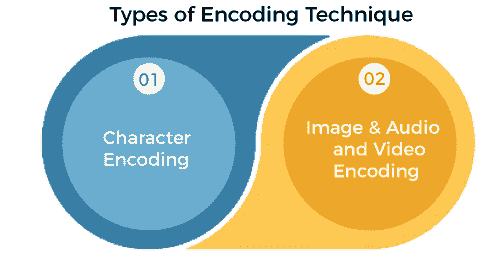

# 编码技术的类型

> 原文：<https://www.javatpoint.com/types-of-encoding-techniques>

*将数据从一种形式转换为另一种形式的过程称为编码。*用于对数据进行转换，使数据能够被不同的系统支持和使用。编码的工作原理类似于将温度从摄氏转换为华氏，因为它只是以另一种形式转换，但原始值始终保持不变。编码主要用于两个领域:

*   **电子学中的编码:**电子学中，编码是指将模拟信号转换为数字信号。
*   **计算中的编码:**在计算中，编码是通过对数据应用特定的代码、字母和数字，将数据转换为等效密码的过程。

#### 注意:编码不同于加密，因为它的主要目的不是隐藏数据，而是将其转换为一种格式，以便能够正确使用。

在本主题中，我们将讨论计算中使用的不同类型的编码技术。

## 编码技术的类型

*   **字符编码**
*   **图像&音视频编码**

### 字符编码

***字符编码将字符编码成字节*** 。它告诉计算机如何将 0 和 1 解释成真实的字符、数字和符号。计算机只理解二进制数据；因此，需要将这些字符转换成数字代码。为此，每个字符都被转换成二进制代码，为此，文本文档以编码类型保存。这可以通过将数字与字符配对来实现。如果我们不应用字符编码，我们的网站将不会以适当的格式显示字符和文本。因此，这将降低可读性，机器将无法正确处理数据。此外，字符编码确保每个字符都有一个计算机或二进制格式的适当表示。

有不同类型的字符编码技术，如下所示:

1.  **HTML 编码**
2.  **网址编码**
3.  **Unicode 编码**
4.  **Base64 编码**
5.  **十六进制编码**
6.  **ASCII 编码**

### HTML 编码

HTML 编码用于以适当的格式显示 HTML 页面。通过编码，网络浏览器可以知道要使用哪个字符集。

在 HTML 中，HTML 标记中使用了各种字符，如。要将这些字符编码为内容，我们需要使用编码。

### 网址编码

URL(统一资源定位符)编码用于 ***转换字符，使其能够通过互联网*** 传输。它也被称为百分比编码。执行网址编码是为了使用 ASCII 字符集将网址发送到互联网。非 ASCII 字符用%替换，后跟十六进制数字。

### UNICODE 编码

Unicode 是通用字符集的编码标准。它允许编码、表示和处理在世界范围内可用的大多数语言或书写系统中表示的文本。它为每种支持的语言中的每个字符提供一个代码点或数字。它可以代表所有语言中所有可能的字符。特定的比特序列被称为编码单元。

UNICODE 标准可以使用 8 位、16 位或 32 位来表示字符。

Unicode 标准定义了 Unicode 转换格式(UTF)来编码代码点。

UNICODE 编码标准有以下 UTF 方案:

*   **UTF-8 编码**
    UTF8 由 UNICODE 标准定义，UNICODE 标准是电子通信中使用的可变宽度字符编码。UTF-8 能够使用一到四个一字节(8 位)代码单元，以 Unicode 编码所有 1，112，064 个有效字符代码点。
*   **UTF-16 编码**
    UTF-16 编码使用两个 16 位整数中的一个来表示字符的代码点。
*   **UTF-32 编码**
    UTF-32 编码将每个码点表示为 32 位整数。

### Base64 编码

Base64 编码用于将二进制数据编码为等效的 ASCII 字符。Base64 编码用于邮件系统，因为像 SMTP 这样的邮件系统不能处理二进制数据，因为它们只接受 ASCII 文本数据。它也用于简单的 HTTP 身份验证来编码凭据。此外，它还用于将二进制数据转换为 cookies 和其他参数，以使数据不可读，从而防止篡改。如果图像或其他文件在没有 Base64 编码的情况下传输，它将被损坏，因为邮件系统无法处理二进制数据。

Base64 将数据表示为 3 字节的块，其中每个字节包含 8 位；因此它代表 24 位。这 24 位被分成 4 组，每组 6 位。这些组或块中的每一个都被转换成等价的 Base64 值。

### ASCII 编码

**美国信息交换标准代码** (ASCII)是一种字符编码。这是 1963 年发布的第一个字符编码标准。

ASCII 码用于将英文字符表示为数字，其中每个字母都分配有一个从 **0 到 127 的数字。**大多数现代字符编码方案基于 ASCII，尽管它们支持许多附加字符。这是一种仅使用底部 7 位的单字节编码。在 ASCII 文件中，每个字母、数字或特殊字符都用一个 7 位二进制数表示。键盘的每个字符都有一个等效的 ASCII 值。

## 图像和音频及视频编码

执行图像和音频及视频编码以节省存储空间。对图像、音频和视频等媒体文件进行编码，以更高效和压缩的格式保存它们。

这些编码文件包含相同的内容，通常质量相似，但大小压缩，因此它们可以保存在更少的空间内，可以通过邮件轻松传输，或者可以在系统上下载。

我们可以理解为将. WAV 音频文件转换为. MP3 文件，将大小缩小 1/10 th 到原来的大小。

* * *