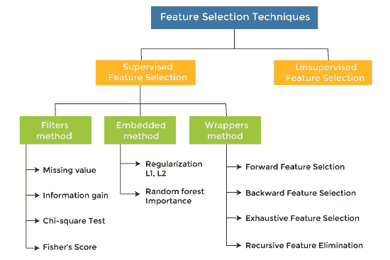
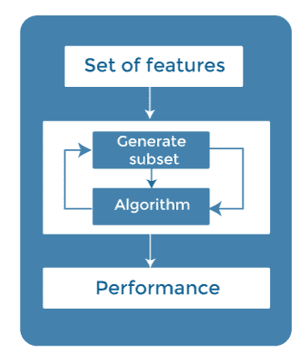
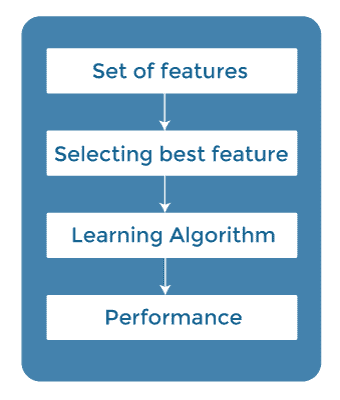
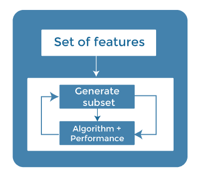
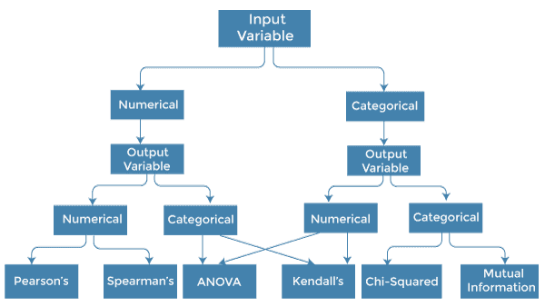

# 机器学习中的特征选择技术

> 原文：<https://www.javatpoint.com/feature-selection-techniques-in-machine-learning>

> 特征选择是一种通过去除冗余、不相关或有噪声的特征，从原始特征集中选择最相关特征子集的方法。

在开发机器学习模型时，数据集中只有少数变量对构建模型有用，其余特征要么是冗余的，要么是不相关的。如果我们输入的数据集包含所有这些冗余和不相关的特征，可能会对模型的整体性能和准确性产生负面影响和降低。因此，从数据中识别和选择最合适的特征并去除不相关或不太重要的特征是非常重要的，这是借助于机器学习中的特征选择来完成的。

特征选择是机器学习的重要概念之一，对模型的性能有很大影响。由于机器学习基于“垃圾进垃圾出”的概念，所以我们总是需要向模型输入最合适和相关的数据集，以便获得更好的结果。

在本主题中，我们将讨论机器学习的不同特征选择技术。但在此之前，让我们先了解一些特征选择的基础知识。

*   **什么是特征选择？**
*   **需要特征选择**
*   **特征选择方法/技术**
*   **特征选择统计**

## 什么是特征选择？

**A** 特征是对问题有影响或对问题有用的属性，为模型选择重要特征称为特征选择。每个机器学习过程都依赖于特征工程，特征工程主要包含两个过程；即特征选择和特征提取。虽然特征选择和提取过程可能有相同的目标，但两者完全不同。它们之间的主要区别在于，特征选择是关于选择原始特征集的子集，而特征提取则创建新的特征。特征选择是一种通过仅使用相关数据来减少模型输入变量的方法，以减少模型中的过拟合。

因此，我们可以将特征选择定义为，“ ***这是一个自动或手动选择最合适和相关的特征子集用于建模的过程*** ”特征选择是通过包含重要特征或排除数据集中不相关的特征而不进行更改来执行的。

## 功能选择的需求

在实现任何技术之前，理解技术的需求以及特征选择是非常重要的。众所周知，在机器学习中，为了获得更好的结果，有必要提供一个预处理好的输入数据集。我们收集大量数据来训练我们的模型，并帮助它更好地学习。通常，数据集由噪声数据、无关数据和部分有用数据组成。而且，庞大的数据量也拖慢了模型的训练过程，有了噪声和不相关的数据，模型可能无法很好地预测和执行。因此，从数据集中去除这些噪声和不太重要的数据是非常必要的，为此，使用了特征选择技术。

选择最佳功能有助于模型运行良好。例如，假设我们想创建一个模型，自动决定哪辆车应该被压碎作为备件，为此，我们有一个数据集。该数据集包含车型、年份、车主姓名、里程。因此，在这个数据集中，车主的名字对模型性能没有贡献，因为它不决定汽车是否应该被压碎，所以我们可以删除这个列，并为模型构建选择其余的特征(列)。

以下是在机器学习中使用特征选择的一些好处:

*   **有助于避免维度的诅咒。**
*   **它有助于模型的简化，以便研究人员能够容易地解释。**
*   **减少了训练时间。**
*   **减少过拟合，从而提高泛化能力。**

## 特征选择技术

主要有两种类型的特征选择技术，它们是:

*   **监督特征选择技术**
    监督特征选择技术考虑目标变量，可用于标记数据集。
*   **无监督特征选择技术**
    无监督特征选择技术忽略目标变量，可用于未标记数据集。

在监督特征选择下主要有三种技术:

### 1.包装方法

在包装方法中，特征的选择是通过将它视为一个搜索问题来完成的，在这个问题中，不同的组合被制作、评估，并与其他组合进行比较。它通过迭代使用特征子集来训练算法。

在模型输出的基础上，增加或减少特征，利用这个特征集，模型再次被训练。

包装方法的一些技术有:

*   **正向选择** -正向选择是一个迭代过程，从一组空的特征开始。每次迭代后，它都会不断添加一个特性，并评估性能，以检查它是否在提高性能。该过程一直持续到新变量/特征的添加没有改善模型的性能。
*   **后向淘汰** -后向淘汰也是一种迭代方式，但与正向选择相反。该技术通过考虑所有特征并移除最不重要的特征来开始该过程。这个消除过程一直持续到移除特征不能改善模型的性能。
*   **穷举特征选择-** 穷举特征选择是最好的特征选择方法之一，它将每个特征集评估为蛮力。这意味着该方法尝试&使每个可能的特征组合，并返回最佳性能的特征集。
*   **递归特征消除-**
    递归特征消除是一种递归贪婪优化方法，通过递归地获取越来越小的特征子集来选择特征。现在，使用每组特征训练估计器，并且使用 *coef_attribute* 或者通过*特征 _ 重要性 _ 属性来确定每个特征的重要性。*

### 2.过滤方法

在过滤方法中，特征是基于统计度量来选择的。该方法不依赖于学习算法，选择特征作为预处理步骤。

过滤方法通过排序使用不同的度量从模型中过滤掉不相关的特征和冗余的列。

使用过滤方法的优点是它需要的计算时间少，并且不会过度过滤数据。

过滤方法的一些常见技术如下:

*   信息增益
*   卡方检验
*   费希尔分数
*   缺失值比率

**信息增益:**信息增益决定了变换数据集时熵的降低。通过计算每个变量相对于目标变量的信息增益，可以将其用作特征选择技术。

**卡方检验:**卡方检验是一种确定分类变量之间关系的技术。计算每个特征和目标变量之间的卡方值，并选择具有最佳卡方值的期望数量的特征。

**费舍尔得分:**

Fisher 评分是一种流行的特征选择监督技术。它以降序返回变量在 fisher 准则上的排名。然后我们可以选择费舍尔得分较大的变量。

**缺失值比率:**

缺失值比率的值可用于对照阈值评估特征集。获得缺失值比率的公式是每列中缺失值的数量除以观察值的总数。该变量超过了可以丢弃的阈值。

### 3.嵌入式方法

嵌入式方法结合了过滤方法和包装方法的优点，考虑了特征的交互作用和低计算成本。这些快速处理方法类似于过滤方法，但比过滤方法更精确。

这些方法也是迭代的，它评估每一次迭代，并最佳地找到在特定迭代中对训练贡献最大的最重要的特征。嵌入式方法的一些技术有:

*   **正则化** -正则化为机器学习模型的不同参数增加了惩罚项，以避免模型中的过拟合。这个惩罚项被加到系数上；因此，它将一些系数缩小到零。那些系数为零的要素可以从数据集中移除。正则化技术的类型是 L1 正则化(拉索正则化)或弹性网(L1 和 L2 正则化)。
*   **随机森林重要性** -不同的基于树的特征选择方法帮助我们用特征重要性来提供一种选择特征的方式。这里，特征重要性指定哪个特征在模型构建中更重要或者对目标变量有很大影响。随机森林就是这样一种基于树的方法，它是一种聚集不同数量决策树的打包算法。它根据节点在所有树中的性能或杂质(基尼杂质)的减少来自动对节点进行排序。节点按照杂质值排列，因此它允许修剪特定节点下的树。剩余的节点创建了最重要特征的子集。

## 如何选择特征选择方法？

对于机器学习工程师来说，了解哪种特征选择方法适合他们的模型是非常重要的。我们对变量的数据类型了解得越多，就越容易为特征选择选择合适的统计度量。

要知道这一点，我们需要首先识别输入和输出变量的类型。在机器学习中，变量主要有两种类型:

*   **数值变量:**连续值的变量，如整数、浮点数
*   **分类变量:**具有布尔、序数、名词等分类值的变量。

以下是一些单变量统计度量，可用于基于过滤器的特征选择:

**1。数值输入，数值输出:**

数值输入变量用于预测回归建模。这种情况下常用的方法是相关系数。

*   皮尔逊相关系数(线性相关)。
*   斯皮尔曼等级系数(用于非线性相关)。

**2。数值输入，分类输出:**

具有分类输出的数值输入是分类预测建模问题 **s.** 的情况。在这种情况下，也应该使用基于相关性的技术，但是具有分类输出。

*   **方差分析相关系数(线性)。**
*   **肯德尔秩系数(非线性)。**

**3。分类输入，数字输出:**

这是带有分类输入的回归预测建模的情况。这是回归问题的另一个例子。我们可以使用与上述情况相同的方法，但顺序相反。

**4。分类输入，分类输出:**

这是一个使用分类输入变量的分类预测模型的例子。

这种情况下常用的技术是卡方检验。在这种情况下，我们也可以使用信息增益。

**我们可以在下表中用适当的措施总结上述情况:**

| 输入变量 | 输出变量 | 特征选择技术 |
| 数字的 | 数字的 | 

*   Pearson correlation coefficient (linear correlation).
*   Spearman rank coefficient (for nonlinear correlation).

 |
| 数字的 | 绝对的 | 

*   Correlation coefficient of variance analysis (linear).
*   Kendall's rank coefficient (nonlinear).

 |
| 绝对的 | 数字的 | 

*   Kendall's rank coefficient (linearity).
*   Correlation coefficient of variance analysis (nonlinear).

 |
| 绝对的 | 绝对的 | 

*   Chi-square test (contingency table)
*   Mutual information.

 |

## 结论

特征选择是机器学习中一个非常复杂和广阔的领域，人们已经进行了大量的研究来寻找最佳的方法。最佳特征选择方法没有固定的规则。然而，选择方法取决于机器学习工程师，他可以结合和创新方法来为特定问题找到最佳方法。人们应该尝试通过不同的统计测量选择的不同特征子集的各种模型拟合。

* * *