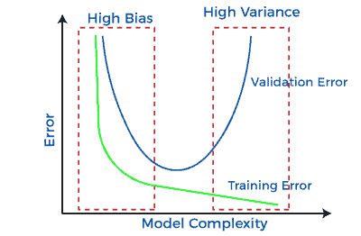
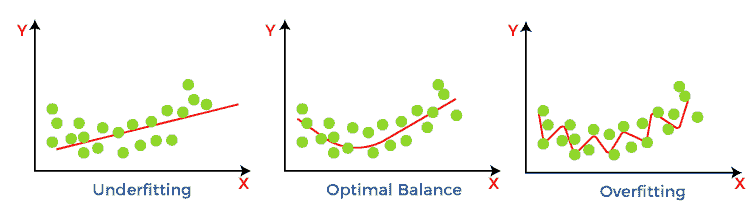
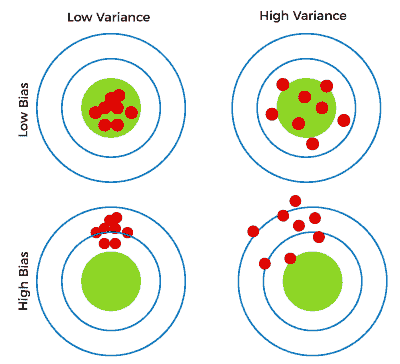
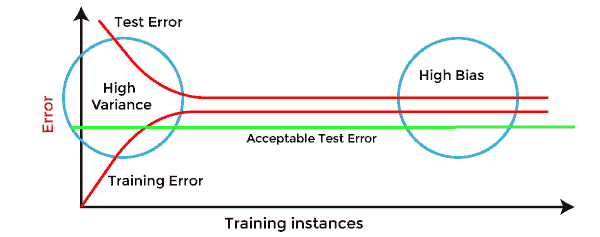
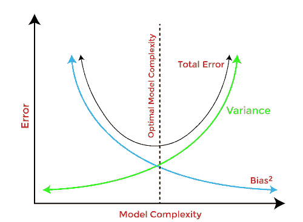

# 机器学习中的偏差和方差

> 原文：<https://www.javatpoint.com/bias-and-variance-in-machine-learning>

机器学习是人工智能的一个分支，它允许机器进行数据分析和预测。然而，如果机器学习模型不准确，就会产生预测误差，这些预测误差通常被称为偏差和方差。在机器学习中，这些误差将一直存在，因为模型预测和实际预测之间总是有微小的差异。ML/数据科学分析师的主要目标是减少这些误差，以便获得更准确的结果。在本主题中，我们将讨论偏差和方差、偏差-方差权衡、欠拟合和过拟合。但是在开始之前，我们先了解一下机器学习中有哪些错误？

## 机器学习中的错误？

在机器学习中，误差是一种衡量算法对先前未知数据集进行预测的准确度的指标。基于这些误差，选择能够在特定数据集上表现最佳的机器学习模型。机器学习中主要有两种类型的错误，它们是:

*   **可约误差:**可以减少这些误差，提高模型精度。这种误差可以进一步分为偏差和方差。
    T3】
*   **不可约误差:**这些误差将一直存在于模型中

不管使用了哪种算法。这些错误的原因是未知变量的值无法减少。

## 什么是偏见？

一般来说，机器学习模型会分析数据，找出其中的模式，并做出预测。在训练时，模型学习数据集中的这些模式，并将它们应用于测试数据进行预测。 ***在进行预测时，模型预测值与实际值/期望值之间出现差异*** 、 ***，这种差异被称为偏差误差或偏差引起的误差*** 。它可以被定义为机器学习算法(如线性回归)无法捕捉数据点之间的真实关系。每种算法都以一定量的偏差开始，因为偏差来自模型中的假设，这使得目标函数易于学习。模型具有以下任一项:

*   **低偏差:**低偏差模型会对目标函数的形式做出较少的假设。
*   **高偏差:**高偏差的模型会做出更多的假设，模型变得无法捕捉到我们数据集的重要特征。**高偏差模型也不能在新数据上表现良好。**

一般来说，线性算法有很高的偏差，因为它使他们学习得很快。算法越简单，引入的偏差就越大。而非线性算法通常具有低偏差。

具有低偏差的机器学习算法的一些例子是决策树、k 近邻和支持向量机。同时，高偏差的算法是**线性回归、线性判别分析和逻辑回归。**

### 减少高偏差的方法:

高偏差主要是由于一个简单得多的模型。以下是一些减少高偏差的方法:

*   随着模型的不足，增加输入特征。
*   减少正则化项。
*   使用更复杂的模型，例如包括一些多项式特征。

## 什么是方差误差？

如果使用不同的训练数据，方差将指定预测中的变化量。简单来说， ***方差告诉我们一个随机变量和它的期望值有多大的不同。*** 理想情况下，一个模型在不同的训练数据集之间不应该有太大的变化，这意味着算法应该很好地理解输入和输出变量之间的隐藏映射。方差误差要么是**低方差，要么是高方差。**

**低方差**表示随着训练数据集的变化，目标函数的预测有小的变化。同时，**高方差**显示目标函数的预测随训练数据集的变化而变化很大。

一个表现出高方差的模型在训练数据集上学习很多，表现很好，而在看不见的数据集上不能很好地概括。因此，这种模型在训练数据集上给出了良好的结果，但在测试数据集上显示出高错误率。

由于高方差，模型从数据集学习太多，导致模型过度拟合。具有高方差的模型存在以下问题:

*   高方差模型导致过度拟合。
*   增加模型的复杂性。

通常，非线性算法具有很大的灵活性来拟合模型，具有很高的方差。

具有低方差的机器学习算法的一些例子是，**线性回归、逻辑回归和线性判别分析**。同时，方差较大的算法有**决策树、支持向量机和 K 近邻算法。**

### 减少高差异的方法:

*   随着模型过度拟合，减少输入特征或参数数量。
*   不要使用太复杂的模型。
*   增加训练数据。
*   增加正则化项。

## 偏差方差的不同组合

偏差和方差有四种可能的组合，如下图所示:

1.  **低偏差、低方差:**
    低偏差和低方差的组合显示出理想的机器学习模型。然而，这实际上是不可能的。
2.  **低偏差、高方差:**低偏差、高方差时，模型预测不一致，平均准确。这种情况发生在模型用大量参数学习时，因此导致**过拟合**
3.  **高偏差、低方差:**高偏差、低方差时，预测一致，但平均不准确。当模型没有很好地学习训练数据集或使用很少数量的参数时，就会出现这种情况。这导致了模型中的**装配不足**问题。
4.  **高偏差、高方差:**
    高偏差、高方差，预测不一致，平均也不准确。

## 如何识别高方差或高偏差？

如果模型具有以下特征，则可以识别高方差:

*   低训练误差和高测试误差。

如果模型具有以下特征，则可以识别高偏差:

*   训练误差高，测试误差几乎与训练误差相似。

## 偏差-方差权衡

在建立机器学习模型时，为了避免模型中的过拟合和欠拟合，照顾偏差和方差是非常重要的。如果模型很简单，参数少，可能方差低，偏差大。然而，如果模型有大量的参数，它将具有高方差和低偏差。因此，需要在偏差和方差误差之间取得平衡，这种偏差误差和方差误差之间的平衡被称为**偏差-方差权衡。**

为了准确预测模型，算法需要低方差和低偏差。但这是不可能的，因为偏差和方差是相互关联的:

*   如果我们减少方差，就会增加偏差。
*   如果我们减少偏差，就会增加方差。

偏差-方差权衡是监督学习的核心问题。理想情况下，我们需要一个模型，它能够准确地捕捉训练数据中的规律性，同时能够很好地概括看不见的数据集。不幸的是，这不可能同时进行。因为高方差算法可能在训练数据上表现良好，但是它可能导致对噪声数据的过度拟合。然而，高偏差算法生成的模型非常简单，甚至可能无法捕捉数据中的重要规律。因此，我们需要在偏差和方差之间找到一个最佳点来建立一个最优模型。

因此， ***偏差-方差权衡是寻找最佳点，在偏差和方差误差之间取得平衡。*T3】**

* * *