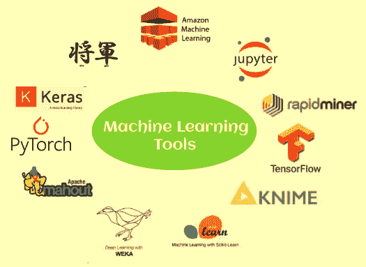
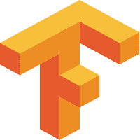
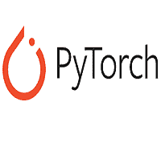
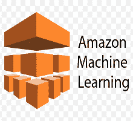
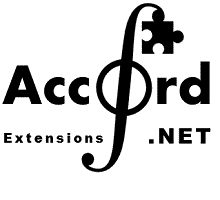
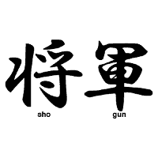
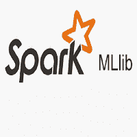

# 机器学习工具

> 原文：<https://www.javatpoint.com/machine-learning-tools>

机器学习是让生活变得更简单的最具革命性的技术之一。 ***它是人工智能的一个子领域，分析数据，建立模型，做出预测*** 。由于它的流行和巨大的应用，每个技术爱好者都想学习和构建新的机器学习应用程序。然而，要构建 ML 模型，掌握机器学习工具很重要。掌握机器学习工具将使你能够玩数据，训练你的模型，发现新方法，并创建算法。

机器学习有不同的工具、软件和平台，新的软件和工具也在日益发展。尽管机器学习工具有许多选择和可用性，但根据您的模型选择最佳工具是一项具有挑战性的任务。如果你为你的模型选择了正确的工具，你可以使它更快更有效。在本主题中，我们将讨论一些流行和常用的机器学习工具及其功能。

## 1\. 张量流

TensorFlow 是最受欢迎的开源库之一，用于训练和构建机器学习和深度学习模型。它提供了一个 JS 库，由**谷歌大脑团队开发。**它在机器学习爱好者中非常受欢迎，他们用它来构建不同的 ML 应用。它为数值计算提供了强大的库、工具和资源，特别是针对大规模机器学习和深度学习项目。它使数据科学家/ML 开发人员能够高效地构建和部署机器学习应用程序。为了训练和构建 ML 模型，TensorFlow 提供了一个高级的 Keras API，让用户可以轻松地从 TensorFlow 和机器学习开始。

### 特点:

以下是一些顶级功能:

*   TensorFlow 使我们能够轻松构建和训练我们的 ML 模型。
*   它还使您能够使用**运行现有的模型**
*   它提供了多个抽象层次，允许用户根据需求选择正确的资源。
*   它有助于建立神经网络。
*   提供分布式计算支持。
*   在构建模型时，为了更大的灵活性需求，它提供了急切的执行，从而实现了即时迭代和直观调试。
*   这是开源软件，非常灵活。
*   它还使开发人员能够使用数据流图进行数值计算。
*   运行在图形处理器和中央处理器上，也运行在各种移动计算平台上。
*   它提供了自动差异的功能(自动计算梯度被称为自动差异或自动差异)。
*   它能够轻松地在云中部署和培训模型。
*   它可以通过两种方式使用，即通过 NPM 安装或通过脚本标签。
*   它是免费使用的。

## 2\. PyTorch

PyTorch 是一个开源的机器学习框架，基于**Torch**库。这个框架是免费开源的，由 **FAIR(脸书人工智能研究实验室**)开发。它是流行的 ML 框架之一，可用于各种应用，包括计算机视觉和自然语言处理。PyTorch 有 Python 和 C++接口；但是，Python 界面更具交互性。在 PyTorch 之上组成了不同的深度学习软件，如 PyTorch 闪电、拥抱脸的变形金刚、特斯拉自动驾驶等。

它指定了一个包含 n 维数组的 Tensor 类，该数组可以与 GPU 支持一起执行张量计算。

### 特点:

以下是一些顶级功能:

*   它使开发人员能够使用 Autograde 模块创建神经网络。
*   它更适合深度学习研究，具有良好的速度和灵活性。
*   它也可以在云平台上使用。
*   它包括教程、各种工具和库。
*   它还提供了一个动态计算图，使这个库更受欢迎。
*   它允许无延迟地随机改变网络行为。
*   由于它的混合前端，它很容易使用。
*   它是免费提供的。

## 3.谷歌云 ML 引擎

当用大量数据训练分类器时，计算机系统可能表现不佳。然而，各种机器学习或深度学习项目需要数百万或数十亿个训练数据集。或者正在使用的算法需要很长时间来执行。在这种情况下，应该选择谷歌云 ML 引擎。这是一个托管平台，ML 开发人员和数据科学家在其中构建和运行最佳质量的机器学习模型。它提供了一种托管服务，允许开发人员使用任何类型和任何大小的数据轻松创建 ML 模型。

### 特点:

以下是顶级功能:

*   提供机器学习模型训练、构建、深度学习和预测建模。
*   预测和训练这两种服务可以独立使用，也可以组合使用。
*   企业可以使用它，即识别卫星图像中的云，更快地响应客户的电子邮件。
*   它可以广泛用于训练复杂的模型。

## 4.亚马逊机器学习

亚马逊提供了大量的机器学习工具，其中之一就是**亚马逊机器学习**或者 AML。亚马逊机器学习(AML)是一个基于云的、健壮的机器学习软件应用程序，广泛用于构建机器学习模型和进行预测。此外，它整合了来自多个来源的数据，包括**红移、亚马逊 S3 或 RDS。**

### 特征

以下是一些顶级功能:

*   AML 提供可视化工具和向导。
*   使用户能够识别模式，建立数学模型，并做出预测。
*   它支持三种类型的模型，即多类分类、二元分类和回归。
*   它允许用户将模型导入或导出亚马逊机器学习。
*   它还提供了机器学习的核心概念，包括最大似然模型、数据源、评估、实时预测和批量预测。
*   它使用户能够在批量请求的批处理 API 或单个请求的实时 API 的帮助下检索预测。

## 5.网

Accord.Net 是。基于网络的机器学习框架，用于科学计算。它与用 C#编写的音频和图像处理库相结合。该框架为 ML 中的各种应用提供了不同的库，如**模式识别、线性代数、统计数据处理。**Accord.Net 框架的一个流行包装是**雅阁。统计数据，雅阁。数学，雅阁。机器学习**。

### 特征

以下是一些顶级功能:

*   它包含 38 个以上的内核函数。
*   包括 40 多个统计分布的非参数和参数估计。
*   用于创建生产级计算机试听、计算机视觉、信号处理和统计应用程序。
*   包含超过 35 个假设检验，包括双向和单向方差分析检验，非参数检验，如 Kolmogorov-Smirnov 检验等。

## 6.阿帕奇·马胡特

Apache Mahout 是 Apache 软件基金会的开源项目，用于开发以线性代数为主的机器学习应用。这是一个分布式线性代数框架和数学表达的 Scala DSL，使开发人员能够迅速实现自己的算法。它还提供了 Java/Scala 库来执行主要基于线性代数和统计的数学运算。

### 特点:

以下是一些顶级功能:

*   它使开发人员能够实现机器学习技术，包括推荐、聚类和分类。
*   它是实现可扩展算法的有效框架。
*   它由矩阵和向量库组成。
*   它支持多个分布式后端(包括 Apache Spark)
*   它运行在 Apache Hadoop 之上，使用 MapReduce 范式。

## 7.幕府将军

幕府将军是一个免费的开源机器学习软件库，由**古纳尔·雷奇和苏伦·索南堡**在 **1999** 年创建。这个软件库是用 C++编写的，支持 Python、R、Scala、C#、Ruby 等不同语言的接口。，使用 **SWIG** (简化包装器和接口生成器)。幕府的主要目标是不同的基于核的算法，如支持向量机(SVM)，K-Means 聚类等。，用于回归和分类问题。它还提供了隐马尔可夫模型的完整实现。

### 特点:

以下是一些顶级功能:

*   幕府的主要目标是不同的基于核的算法，如支持向量机(SVM)，K-Means 聚类等。，用于回归和分类问题。
*   它支持使用预先计算的内核。
*   它还提供了使用多核学习功能的组合内核。
*   这最初是为处理由多达 1000 万个样本组成的庞大数据集而设计的。
*   它还使用户能够在不同编程语言的接口上工作，例如 Lua、Python、Java、C#、Octave、Ruby、MATLAB 和 r。

## 8.Oryx2

它是 lambda 架构的实现，建立在 **Apache Kafka** 和 **Apache Spark** 之上。它被广泛用于实时大规模机器学习项目。它是构建应用程序的框架，包括用于过滤、打包、回归、分类和聚类的端到端应用程序。它是用 Java 语言编写的，包括 Apache Spark、Hadoop、Tomcat、Kafka 等。Oryx2 的最新版本是 Oryx 2.8.0。

### 特点:

以下是一些顶级功能:

*   它有三层:提供 ML 抽象的顶层专门化、通用 lambda 架构层、相同标准 ML 算法的端到端实现。
*   Oryx2 最初的项目是 Oryx1，经过一些升级之后，Oryx2 上线了。
*   它非常适合大规模实时机器学习项目。
*   它包含并排排列的三层，分别命名为速度层、批处理层和服务层。
*   它还有一个数据传输层，可以在不同的层之间传输数据，并从外部来源接收输入。

## 9.Apache Spark MLlib

Apache Spark MLlib 是一个可扩展的机器学习库，运行在 Apache Mesos、Hadoop、Kubernetes、独立或云中。此外，它可以访问来自不同数据源的数据。这是一个开源的集群计算框架，为完整的集群以及数据并行和容错提供了一个接口。

为了优化数据的数值处理，MLlib 提供了线性代数包，如 Breeze 和 netlib-Java。它使用查询优化器和物理执行引擎来实现批处理和流数据的高性能。

### 特征

以下是一些顶级功能:

*   MLlib 包含各种算法，包括分类、回归、聚类、推荐、关联规则等。
*   它运行不同的平台，如 Hadoop、Apache Mesos、Kubernetes、独立平台或针对不同数据源的云中平台。
*   它包含高质量的算法，可提供出色的结果和性能。
*   它很容易使用，因为它提供了 Java、Python、Scala、R 和 SQL 中的接口。

## 10.谷歌移动工具箱

对于移动应用程序开发人员，谷歌带来了 ML Kit，该工具包包装了机器学习和技术的专业知识，以创建更健壮、优化和个性化的应用程序。该工具包可用于人脸检测、文本识别、地标检测、图像标记和条形码扫描应用。人们也可以用它来脱机工作。

### 特点:

以下是一些顶级功能:

*   ML 套件针对移动设备进行了优化。
*   它包括不同机器学习技术的优势。
*   它提供了易于使用的 API，支持您的移动应用程序中的强大用例。
*   它包括视觉应用编程接口和自然语言应用编程接口，用于检测人脸、文本和对象，识别不同的语言并提供回复建议。

## 结论

在这个主题中，我们讨论了一些流行的机器学习工具。然而，还有很多其他的 ML 工具，但是选择工具完全取决于一个人对项目、技能和工具价格的要求。这些工具大部分都是免费提供的，除了一些工具，比如 Rapid Miner。每个工具都以不同的语言工作，并提供一些规范。

* * *