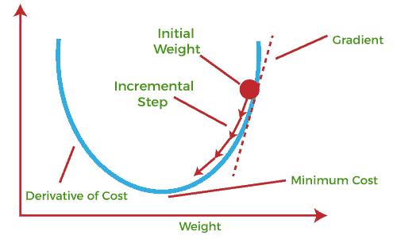
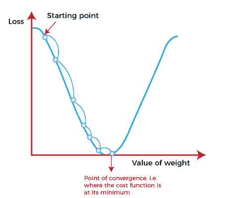
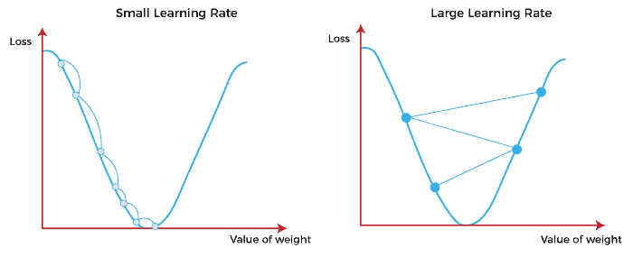
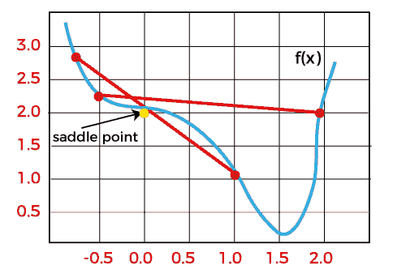

# 机器学习中的梯度下降

> 原文：<https://www.javatpoint.com/gradient-descent-in-machine-learning>

梯度下降被认为是最常用的优化算法之一，通过最小化实际结果和预期结果之间的误差来训练机器学习模型。此外，梯度下降也用于训练神经网络。

在数学术语中，优化算法是指最小化/最大化由 x 参数化的目标函数 f(x)的任务。同样，在机器学习中，优化是最小化由模型参数参数化的成本函数的任务。梯度下降的主要目标是利用参数更新的迭代最小化凸函数。一旦这些机器学习模型得到优化，这些模型就可以用作人工智能和各种计算机科学应用的强大工具。

在这个关于机器学习中梯度下降的教程中，我们将详细了解梯度下降，成本函数在机器学习中作为晴雨表的作用，梯度下降的类型，学习率等。

## 什么是梯度下降或最陡下降？

梯度下降最初是在 18 世纪中期由**“奥古斯丁-路易·柯西”**发现的。 ***梯度下降被定义为机器学习中最常用的迭代优化算法之一，用于训练机器学习和深度学习模型。它有助于找到函数的局部最小值。***

使用梯度下降定义函数的局部最小值或局部最大值的最佳方法如下:

*   如果我们在当前点向函数的负梯度或远离梯度移动，它将给出该函数的**局部最小值**。
*   每当我们在当前点向正梯度或向函数的梯度移动时，我们将得到该函数的**局部最大值**。



整个过程称为梯度上升，也称为最陡下降。 ***使用梯度下降算法的主要目标是使用迭代最小化成本函数。*** 为了实现这个目标，它迭代地执行两个步骤:

*   计算函数的一阶导数，以计算该函数的梯度或斜率。
*   远离梯度的方向，这意味着斜率从当前点增加了α倍，其中α被定义为学习速率。它是优化过程中的一个调整参数，有助于决定步骤的长度。

### 什么是成本函数？

***成本函数定义为当前位置的实际值和期望值之间的差异或误差的度量，并以单个实数的形式呈现。*** 它通过向这个模型提供反馈来帮助增加和提高机器学习效率，以便它可以最小化误差并找到局部或全局最小值。此外，它沿着负梯度的方向不断迭代，直到成本函数接近零。在这个最陡的下降点，模型将停止进一步学习。虽然成本函数和损失函数被认为是同义词，但它们之间也有细微的区别。损失函数和成本函数之间的细微差别是关于机器学习模型的训练中的误差，因为损失函数指的是一个训练例子的误差，而成本函数计算整个训练集中的平均误差。

在对初始参数进行假设并使用已知数据上的梯度下降算法修改这些参数以降低成本函数之后，计算成本函数。

假设:

参数:

成本函数:

目标:

### 梯度下降是如何工作的？

在开始梯度下降的工作原理之前，我们应该了解一些基本概念，以便从线性回归中找出直线的斜率。简单线性回归方程如下:

```

       Y=mX+c

```

其中“m”代表直线的斜率，“c”代表 y 轴上的截距。



起点(如上图所示)用于评估性能，因为它被认为只是一个任意点。在这个起点，我们将导出一阶导数或斜率，然后使用切线来计算这个斜率的陡度。此外，该斜率将通知参数(权重和偏差)的更新。

斜率在起点或任意点变得更陡，但每当产生新的参数时，则陡度逐渐减小，在最低点接近最低点，称为**收敛点。**

梯度下降的主要目标是最小化成本函数或期望与实际之间的误差。为了最小化成本函数，需要两个数据点:

*   **方向&学习率**

这两个因素用于确定未来迭代的偏导数计算，并使其达到收敛点或局部最小值或全局最小值。让我们简单讨论一下学习率因素；

### 学习率:

它被定义为达到最小值或最低点所需的步长。这通常是一个小值，根据成本函数的行为进行评估和更新。如果学习率高，会导致更大的步骤，但也会导致超过最小值的风险。同时，较低的学习率显示出较小的步长，这损害了整体效率，但提供了更精确的优势。



## 梯度下降的类型

基于各种训练模型的误差，梯度下降学习算法可以分为**批量梯度下降、随机梯度下降和小批量梯度下降。**让我们了解这些不同类型的梯度下降:

### 1.批量梯度下降:

批量梯度下降(BGD)用于找到训练集中每个点的误差，并在评估所有训练示例后更新模型。这个过程被称为训练时期。简单地说，这是一种贪婪的方法，我们必须为每次更新总结所有的例子。

**批量梯度下降的优势:**

*   与其他梯度下降相比，它产生的噪声更少。
*   它产生稳定的梯度下降收敛。
*   它在计算上是高效的，因为所有的资源都用于所有的训练样本。

### 2.随机梯度下降

随机梯度下降(SGD)是一种梯度下降类型，每次迭代运行一个训练示例。或者换句话说，它为数据集中的每个示例处理一个训练时期，并且一次更新一个训练示例的参数。由于它一次只需要一个训练示例，因此更容易存储在分配的内存中。然而，与批处理梯度系统相比，它显示了一些计算效率损失，因为它显示了需要更多细节和速度的频繁更新。此外，由于频繁更新，它也被视为有噪声的梯度。然而，有时它有助于找到全局最小值，也有助于摆脱局部最小值。

**随机梯度下降的优势:**

在随机梯度下降(SGD)中，学习发生在每个例子上，它比其他梯度下降有一些优点。

*   更容易在所需的内存中分配。
*   计算速度比批量梯度下降要快。
*   它对于大型数据集更有效。

### 3.迷你批次梯度下降:

小批量梯度下降是批量梯度下降和随机梯度下降的结合。它将训练数据集分成小批量，然后分别对这些批量执行更新。将训练数据集分成更小的批次，以保持批次梯度下降的计算效率和随机梯度下降的速度之间的平衡。因此，我们可以实现一种特殊类型的梯度下降，具有更高的计算效率和更少的噪声梯度下降。

**小批量梯度下降的优势:**

*   更容易适应分配的内存。
*   它的计算效率很高。
*   它产生稳定的梯度下降收敛。

## 梯度下降的挑战

虽然我们知道梯度下降是最流行的优化方法之一，但它也存在一些挑战。有以下几个挑战:

### 1.局部最小值和鞍点:

对于凸问题，梯度下降可以很容易地找到全局最小值，而对于非凸问题，有时很难找到全局最小值，在这里机器学习模型取得了最好的结果。



每当成本函数的斜率为零或接近于零时，这个模型就停止进一步学习。除了全局最小值之外，还有一些场景可以显示这个斜率，即鞍点和局部最小值。局部极小值生成类似于全局极小值的形状，在全局极小值中，成本函数的斜率在当前点的两侧增加。

相比之下，对于鞍点，负梯度仅出现在点的一侧，在一侧达到局部最大值，在另一侧达到局部最小值。鞍点的名称取自马的鞍。

局部极小值的名字是因为损失函数值在局部区域的那个点是最小的。相比之下，全局最小值的名称是这样给出的，因为损失函数的值在那里是最小的，在整个域中损失函数是全局最小的。

### 2.消失和爆炸渐变

在深度神经网络中，如果用梯度下降和反向传播来训练模型，除了局部极小值和鞍点之外，还会出现两个问题。

### 消失渐变:

当渐变小于预期值时，渐变消失。在反向传播过程中，该梯度变得更小，导致网络的前一层比后一层的学习速率降低。一旦发生这种情况，权重参数就会更新，直到变得无关紧要。

### 爆炸渐变:

爆炸渐变与消失渐变正好相反，因为它发生在渐变太大并创建稳定模型时。此外，在这个场景中，模型权重增加，它们将表示为 NaN。这个问题可以使用降维技术来解决，这有助于最小化模型中的复杂性。

* * *