# 机器学习书籍

> 原文：<https://www.javatpoint.com/machine-learning-books>

机器学习是计算机科学领域最受欢迎和最热门的领域之一。机器学习和人工智能正在迅速发展，并为人类提供了难以置信的力量。它有助于任务以自动化的方式运行，也有助于让我们的生活变得舒适。

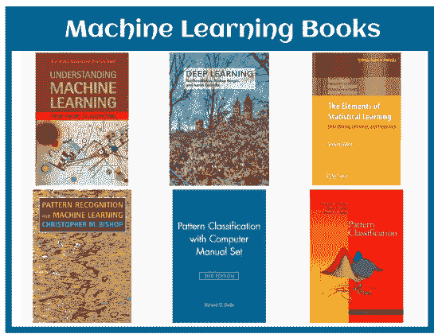

让我们看看谷歌首席执行官桑德尔·皮帅先生如何解释人工智能和机器学习

*“机器学习是一种核心的、变革性的方式，通过它我们可以重新思考我们正在做的一切。我们正在深思熟虑地将其应用于我们的所有产品，无论是搜索、广告、YouTube 还是 Play。我们还处于早期阶段，但你会看到我们以系统的方式思考如何将机器学习应用于所有这些领域。*

谷歌首席执行官桑德尔·皮帅先生

尽管机器学习正在不断发展并改变生活方式，而且它在所有技术中仍然是趋势，但我们通常在新闻中听到高级实现，这可能被视为非常可怕和不可访问的。然而，到目前为止，没有这样的发明被证明对人类有害；相反，它为我们提供了更多的好处和新的机会。

在这篇文章“机器学习书籍”中，我们将简要讨论最受欢迎的书籍的资源，这些资源将帮助您开始从初级到高级的旅程。如果有人想知道最好的机器学习书籍，那么这篇文章对他们会很有帮助。在这里，我们将讨论一些最近发表的关于深度学习和机器学习的最佳文章。

### 1.用 Scikit-Learn 和 TensorFlow(第二版)进行机器学习，作者:奥雷连·格隆

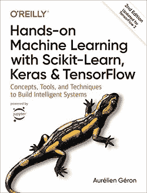

**你为什么要读这本书？**

**奥雷连·杰龙**以非常有效的方式分享了他的想法，并用例子展示了他的理论。每个人都可以通过这本书学习概念、工具和技术来快速构建智能系统。所以，如果你真的想从一个实用的方法开始，那就去买吧。这本书使用了具体的例子、最小理论和两个生产就绪的 Python 框架 **(Scikit-Learn 和 TensorFlow 2.0)**，它们帮助你获得构建智能系统的知识。你可以在面试和工作中使用概念。

这本书由两部分组成:

**第一部分:**第一部分是 ***Scikit-Learn*** 帮助理解简单线性回归等基本机器学习任务。

**第二部分:**第二部分进行了重大更新，采用了 Keras 和 TensorFlow 2.0，有助于理解使用 Deep 学习网络的高级机器学习方法的概念。此外，每一章都以一个练习结束，这个练习可以帮助你应用你在整章中学到的知识，增强你的信心。

**哪里可以买到这本书:**

你可以从亚马逊市场或任何商店在线购买这本书。

**亚马逊链接:**[https://www . Amazon . in/Hands-Machine-Learning-Scikit-Learn-TensorFlow-ebook/DP/b07xf2g 87](https://www.amazon.in/Hands-Machine-Learning-Scikit-Learn-TensorFlow-ebook/dp/B07XGF2G87)

* * *

### 2.安德烈·布尔科夫写的百页机器学习书

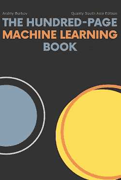

**你为什么要读这本书？**

这本书不需要太多的介绍，因为这本书在亚马逊市场上是畅销书。这让所有人都难以置信，不像其他典型的 500-1000 页机器学习书籍，**安德烈·布尔科夫**刚刚用 100 页完成了这本书，也用短短几句话解释了核心概念。这本书对这个行业的初学者以及想增强知识、想在这个领域获得广阔视野的专家都很有帮助。

**去哪里买:**这本书是按照‘先看后买’的原则分发的，也就是说首先你可以在网上看这本书，当你觉得这有帮助的时候，那么你可以在**亚马逊**集市网站上购买。

**亚马逊链接:**[https://www . Amazon . com/百页-机器学习-图书-电子书/DP/b07mcnkxb](https://www.amazon.com/Hundred-Page-Machine-Learning-Book-ebook/dp/B07MGCNKXB)

* * *

### 3.构建机器学习驱动的应用程序:从想法到产品，由 Emmanuel Ameisen 撰写

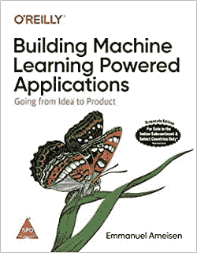

**你为什么要读这本书？**

**伊曼纽尔·阿梅森(Emmanuel Ameisen)**花了 13 个月的时间写了这本书，只有 250 页，其中包括如何在实践中运用机器学习。如果你想学习设计、构建和部署由机器学习驱动的应用程序的必要技能，那么这本书可能会非常有帮助，因为它以一个实践练习结束，从机器学习模型到生产构建你的概念。这本书受到所有数据科学家、软件工程师、产品经理和专家的赞赏，也是因为以良好的循序渐进的方式解释了机器学习应用程序。这本书分为三部分。在第一部分中，您可以学习如何规划机器学习模型和衡量成功。在第二部分，你可以学习建立一个机器学习模型。在第三部分，你可以学习改进模型的方法来实现你最初的愿景。此外，在最后或第 4 部分，您可以构建您的部署和监控策略。

**哪里买:**这本书被数据科学家、软件工程师、产品经理极力推荐。你可以在**亚马逊**或**奥赖利商店**上购买这本书。

**亚马逊链接:**[https://www . Amazon . com/Building-Machine-Learning-power-Applications/DP/149204511 x/](https://www.amazon.com/Building-Machine-Learning-Powered-Applications/dp/149204511X/)

**奥赖利商店:**T2【https://www . oreilly . com/library/view/building-machine-learning/9781492045106/

* * *

### 4.安德鲁·w·特拉斯克的《探索深度学习》

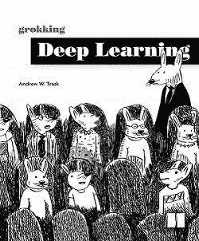

**你为什么要读这本书？**

《Grokking Deep Learning》是 Andrew W.Trask 写的，在这本书里，Andrew 先生描述了如何从零开始构建深度学习神经网络。仅使用 Python 和数学支持库 NumPy，您将训练自己的神经网络来查看和理解图像，将文本翻译成各种语言，甚至像威廉·莎士比亚一样写作。完成后，您将完全准备好继续掌握深度学习框架。

**在哪里买:**本书涵盖了使用带有 NumPy 的低级构造块学习机器学习和神经网络的所有基本原理和方法。你可以在**亚马逊**或**曼宁出版物**上购买这本书。

亚马逊链接:[https://www . Amazon . com/Grokking-Deep-Learning-Andrew-Trask/DP/1617293709](https://www.amazon.com/Grokking-Deep-Learning-Andrew-Trask/dp/1617293709)

曼宁出版物:[https://www.manning.com/books/grokking-deep-learning](https://www.manning.com/books/grokking-deep-learning)

* * *

### 5.Francois Chollet 写的 Python 深度学习

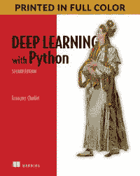

**你为什么要读这本书？**

这本书包含了使用 python 语言和 Keras 库进行深度学习的核心概念。以创造 Keras 和谷歌人工智能研究员而闻名的 Francois Chollet，用直观的解释和实际的例子写出了这本书。这本书帮助你探索核心概念及其在计算机视觉、自然语言处理和学习模型中的实际应用。完成本书后，您将了解所有的实践技能，以及使用 python 语言和库进行深度学习的理论理解。

**购买地点:**读者在购买本书之前，应具备基本的 Python 技能。此外，如果你甚至是 Keras、TensorFlow 和机器学习领域的初学者，那么这本书可以帮助你很多。你可以在亚马逊市场、曼宁出版物或奥莱利网站上购买这本书。链接如下:

**亚马逊链接:**[https://www . Amazon . com/Deep-Learning-Python-Francois-Chollet/DP/1617294438/](https://www.amazon.com/Deep-Learning-Python-Francois-Chollet/dp/1617294438/)

**曼宁出版物:**[https://www.manning.com/books/deep-learning-with-python](https://www.manning.com/books/deep-learning-with-python)

**奥赖利:**T2【https://www . oreilly . com/library/view/deep-learning-with/9781617294433/

* * *

### 6.伊恩·古德费勒、约西亚·本吉奥、亚伦·库维尔撰写的《深度学习》:

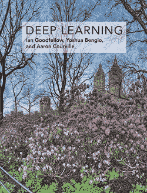

**你为什么要读这本书？**

这本书被认为是深度学习的圣经，由三位专家撰写:伊恩·古德费勒、约西亚·本吉奥、亚伦·库维尔。虽然这本书充满了技术数学原理和作者，已经以完美的方式解释了每个概念，但如果你想在深度学习之旅中开始你的旅程，那么这是不推荐的。因为，要理解所有的概念，首先你需要建立你的代数基础，然后只有你能考虑这本书。

这本书在线性代数、概率论、信息论、数值计算和机器学习方面有全面的数学和概念背景。除了深度学习技术，本书的作者以非常简单的方式解释了 ***深度前馈网络、正则化、优化算法、卷积网络、序列建模和实用方法论*** 。此外，除了深度学习技术，您还可以增强各种应用的知识，如 ***自然语言处理、语音识别、计算机视觉、在线推荐系统、生物信息学和视频游戏*** 。这本书涵盖了所有的理论主题，如自动编码器、表示学习、结构化概率模型、蒙特卡罗方法、划分函数、近似推理和深度生成模型等。

**在哪里买:**这本书对于学生以及打算在这个行业做一些与众不同的专家或研究人员来说，都是非常有帮助的。你可以在亚马逊上购买这本书。

**亚马逊链接:**[https://www . Amazon . com/Deep-Learning-Adaptive-computing-Machine/DP/0262035618/](https://www.amazon.com/Deep-Learning-Adaptive-Computation-Machine/dp/0262035618/)

* * *

### 7.《强化学习:导论》(第二版)作者:理查德·萨顿，安德鲁·巴尔托

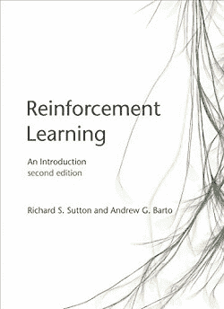

**你为什么要读这本书？**

这本书有各种类别，如机器学习、强化学习、深度学习、深度强化学习和人工智能。

这本书是理查德·萨顿先生和安德鲁·格写的。**巴尔托。**如果说《深度学习》这本书(上面提到的)被认为是《深度学习圣经》，那么这本书也被认为是《强化学习圣经》。如果你真的想在强化学习领域开始职业生涯，那么这本书会对你很有帮助。

在这本书里，作者显著地解释了他们关于人工智能算法的清晰想法。与第一版类似，第二版也专注于核心学习算法，如 UCB、预期萨莎和双重学习。此外，这本书分布在各个部分，包括诸如*人工神经网络、傅立叶基础、策略梯度方法、强化学习与心理学和神经科学的关系、AlphaGo、AlphaGo Ze* ro、*雅达利游戏玩法以及 IBM Watson 的下注策略等主题。*

**在哪里购买:**你可以在亚马逊市场购买这本书，也可以在下面给定的链接上在线免费阅读。

**亚马逊链接:**[https://www . Amazon . com/DP/0262039249/](https://www.amazon.com/dp/0262039249/)

**在此免费阅读 PDF:**T2【https://web . Stanford . edu/class/psych 209/Readings/suttonbartoiprlbook 2 ended . PDF

* * *

### 8.马克西姆·拉潘撰写的《深度强化学习实践(第二版)》:

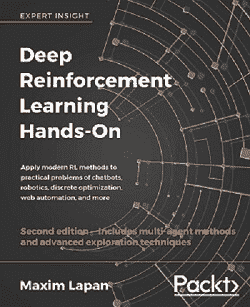

**你为什么要读这本书？**

这本书是由马克西姆·拉潘先生写的，它帮助你借助平衡理论，包括编码实践，理解强化学习的实用方法。根据不同的评论，如果你真的想获得强化学习理论知识的实践经验，那么这本书是最合适的。这本书也有各种类别，如机器学习、强化学习、深度学习、深度强化学习和人工智能。

**购买地点:**可以在亚马逊或 Packt 网站购买本书。

**亚马逊链接:**[https://www . Amazon . com/Deep-reference-Learning-Hands-optimization/DP/1838826998](https://www.amazon.com/Deep-Reinforcement-Learning-Hands-optimization/dp/1838826998)

**Packt Link:**[https://www . packtpub . com/product/deep-reference-learning-动手/9781788834247](https://www.packtpub.com/product/deep-reinforcement-learning-hands-on/9781788834247)

* * *

### 9.《从数据中学习》作者:亚塞尔·阿布·穆斯塔法、马利克·马格东·伊斯梅尔、宣天林。

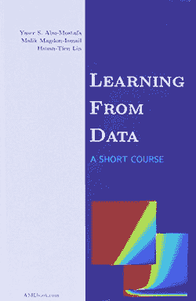

**你为什么要读这本书？**

这本书是由三位作者写的:亚塞尔·阿布·穆斯塔法、马利克·马格东·伊斯梅尔和宣天琳。如果你真的想增强你对机器学习核心概念的知识，那么这是最好的书。

这本书包含了机器学习的完整介绍，可以在线免费获取。机器学习应用于各种行业，如工程、科学、金融和商业等。这项技术帮助您启用计算系统，并通过旧记录提高性能。因此，这本书被设计成机器学习的速成课程，包含所有学生和专家都应该知道的核心主题。

**购买地点:**

这本书可以在网上免费获得，并以电子章节设计，并定期更新机器学习的当前趋势。你也可以在亚马逊上购买这本书。

亚马逊链接:[https://www . Amazon . com/Learning-Data-亚塞尔-S-Abu-Mostafa/DP/1600490069](https://www.amazon.com/Learning-Data-Yaser-S-Abu-Mostafa/dp/1600490069)

* * *

### 10.朱迪亚·珀尔写的《为什么之书》，达纳·麦肯齐:

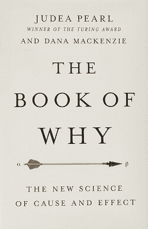

**你为什么要读这本书？**

这本书是由**朱迪亚·珀尔和达纳·麦肯齐合写的，它**是这份名单上最有争议的书。在本书中，作者介绍了超越曲线拟合机器学习或深度学习模型的因果关系框架，并分享了他们实现人工通用智能的思想。

这本书是基于*的原理“相关性不是因果关系。”*

读完这本书，你会知道如何管理和思考一件简单的事情，以及如何回答困难的问题。此外，这本书向我们展示了人类思维的本质和人工智能的关键。

**购买地点:**

如果你想提高你的思维能力，那么这本书可能是互联网上最好的书。你可以在亚马逊上购买这本书。

**亚马逊链接:**[https://www . Amazon . com/Book-Why-Science-因果/dp/046509760X](https://www.amazon.com/Book-Why-Science-Cause-Effect/dp/046509760X)

* * *