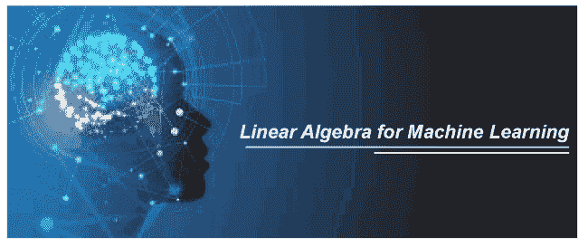

# 机器学习的线性代数

> 原文：<https://www.javatpoint.com/linear-algebra-for-machine-learning>

机器学习与数学有很强的联系。每一种机器学习算法都是基于数学的概念&同样在数学的帮助下，人们可以通过考虑训练时间、复杂度、特征数量等来选择正确的算法。 ***线性代数是数学的一个基本领域，它定义了对线性变换所需的向量、矩阵、平面、映射和直线的研究。*T3】**

线性代数这个术语最早是在 18世纪初引入的，目的是为了找出线性方程中的未知数，方便地求解方程；因此，它是数学的一个重要分支，有助于研究数据。同样，没有人能否认线性代数无疑是处理机器学习应用的重要和首要的东西。这也是开始学习机器学习和数据科学的先决条件。

线性代数在机器学习 ***中起着至关重要的作用和关键的基础，它使 ML 算法能够在大量数据集*** 上运行。

线性代数的概念被广泛用于开发机器学习的算法。尽管它几乎被用于机器学习的每个概念中，但具体来说，它可以执行以下任务:

*   数据优化。
*   适用于损失函数、正则化、协方差矩阵、奇异值分解、矩阵运算和支持向量机分类。
*   线性回归在机器学习中的实现。

除了上述用途，线性代数也用于神经网络和数据科学领域。

像线性代数这样的基本数学原理和概念是机器学习和深度学习系统的基础。要学习和理解机器学习或数据科学，需要熟悉线性代数和优化理论。在本主题中，我们将解释机器学习所需的所有线性代数概念。

#### 注:虽然线性代数是机器学习数学中必不可少的一部分，但并不要求在这方面很亲密。意思是不要求是线性代数方面的专家；相反，对于机器学习来说，只有这些概念的良好知识才是绰绰有余的。

## 为什么先学线性代数再学机器学习？

线性代数正好类似于机器学习中面包店的面粉。因为蛋糕同样是基于面粉的，所以每个机器学习模型也是基于线性代数的。此外，蛋糕还需要更多的配料，如鸡蛋、糖、奶油、苏打水。同样，机器学习也需要更多的概念，如向量演算、概率和优化理论。因此，我们可以说机器学习借助上述数学概念创建了一个有用的模型。

以下是在机器学习之前学习线性代数的一些好处:

*   **更好的图形体验**
*   **改进统计**
*   **创造更好的机器学习算法**
*   **估计机器学习的预测**
*   **易学**

### 更好的图形体验:

线性代数有助于在机器学习中提供更好的图形处理，如图像、音频、视频和边缘检测。这些是您可以处理的机器学习项目支持的各种图形表示。此外，机器学习算法提供的分类器基于给定数据集的部分类别对其进行训练。这些分类器也从训练数据中去除误差。

此外，线性代数通过一个名为**矩阵分解技术的特定术语帮助解决和计算大型复杂数据集。**有两种最流行的矩阵分解技术，如下所示:

*   **Q-R**
*   **L-U**

### 改进的统计:

统计是机器学习中组织和整合数据的一个重要概念。此外，线性代数有助于更好地理解统计学的概念。高级统计主题可以使用线性代数的方法、运算和符号进行整合。

### 创建更好的机器学习算法:

线性代数也有助于创建更好的监督和非监督机器学习算法。

很少有监督学习算法可以使用线性代数创建，如下所示:

*   **逻辑回归**
*   **线性回归**
*   **决策树**
*   **支持向量机(SVM)**

此外，下面列出了一些无监督学习算法，这些算法也可以借助线性代数创建，如下所示:

*   **单值分解(SVD)**
*   **聚类**
*   **成分分析**

借助线性代数概念，您还可以在直播项目中自定义各种参数，并了解深入的知识，以更准确和精确的方式提供相同的内容。

### 估计机器学习的预测:

如果你正在做一个机器学习项目，那么你必须是一个心胸开阔的人，而且你将能够传授更多的观点。因此，在这方面，你必须提高机器学习概念的意识和亲和力。您可以从设置不同的图形、可视化、使用不同的机器学习算法的各种参数开始，或者处理您周围的其他人可能难以理解的事情。

### 易于学习:

线性代数是数学的一个重要部门，很容易理解。每当对高等数学及其应用有要求时，都会考虑到这一点。

## 机器学习的最小线性代数

### 符号:

线性代数中的符号使您能够阅读论文、书籍和网站中的算法描述，以了解算法的工作原理。即使你使用 for 循环而不是矩阵运算，你也能把事情拼凑起来。

### 运营:

在向量和矩阵中使用高级抽象可以使概念更加清晰，它也有助于描述、编码，甚至思维能力。在线性代数中，要求学习矩阵、向量等的加、乘、逆、转置等基本运算。

### 矩阵分解:

线性代数最推荐的领域之一是矩阵分解，特别是矩阵沉积方法，如奇异值分解和二维码。

## 机器学习中线性代数的例子

以下是机器学习中线性代数的一些流行例子:

*   **数据集和数据文件**
*   **线性回归**
*   **推荐系统**
*   **一键编码**
*   **正规化**
*   **主成分分析**
*   **图像和照片**
*   **奇异值分解**
*   **深度学习**
*   **潜在语义分析**

### 1.数据集和数据文件

每个机器学习项目都在数据集上工作，我们使用这个数据集来拟合机器学习模型。

每个数据集都类似于由行和列组成的表状结构。其中每行代表观察值，每列代表特征/变量。该数据集作为矩阵处理，矩阵是线性代数中的关键数据结构。

此外，当这个数据集被划分为监督学习模型的输入和输出时，它表示矩阵(X)和向量(y)，其中向量也是线性代数的一个重要概念。

### 2.图像和照片

在机器学习中，图像/照片用于计算机视觉应用。每个图像都是线性代数矩阵的一个例子，因为图像是由每个像素的高度和宽度组成的表格结构。

此外，对图像的不同操作，如裁剪、缩放、调整大小等。使用线性代数的符号和运算来执行。

### 3.一种热编码

在机器学习中，有时，我们需要处理分类数据。这些分类变量被编码以使它们更简单和更容易工作，而对这些变量进行编码的流行编码技术被称为**一热编码。**

在单向编码技术中，创建了一个表，该表显示了一个变量，该变量在数据集中每个类别有一列，每个示例有一行。此外，每行被编码为二进制向量，该向量包含零或一个值。这是稀疏表示的一个例子，它是线性代数的一个子领域。

### 4.线性回归

[线性回归](https://www.javatpoint.com/linear-regression-in-machine-learning)是借用统计学的一种流行的机器学习技术。它描述了输入和输出变量之间的关系，并用于机器学习来预测数值。使用最小二乘优化解决线性回归问题的最常见方法是借助矩阵分解方法来解决。一些常用的矩阵分解方法是 LU 分解，或奇异值分解，这是线性代数的概念。

### 5.正规化

在机器学习中，我们通常寻找最简单的可能模型来实现特定问题的最佳结果。更简单的模型可以很好地概括，从具体的例子到未知的数据集。这些较简单的模型通常被认为是具有较小系数值的模型。

当模型适合数据时，用于最小化模型系数大小的技术被称为[正则化](https://www.javatpoint.com/regularization-in-machine-learning)。常见的正则化技术有 **L1** 和 **L2 正则化。**这两种形式的正则化实际上都是对作为向量的系数的大小或长度的度量，并且是直接从称为向量范数的线性代数中提取的方法。

### 6.主成分分析

通常，每个数据集包含数千个特征，用如此大的数据集拟合模型是机器学习最具挑战性的任务之一。此外，用不相关特征构建的模型不如用相关特征构建的模型准确。机器学习中有几种方法可以自动减少数据集的列数，这些方法被称为降维。机器学习中最常用的降维方法是[主成分分析](https://www.javatpoint.com/principal-component-analysis)或 PCA。这项技术对可视化和训练模型的高维数据进行投影。主成分分析使用线性代数中的矩阵分解方法。

### 7.奇异值分解

奇异值分解也是一种流行的降维技术，也被简称为奇异值分解。

它是线性代数的矩阵分解方法，广泛应用于特征选择、可视化、降噪等多个领域。

### 8.潜在语义分析

自然语言处理是机器学习的一个分支，它处理文本和口语单词。

NLP 将文本文档表示为包含单词的大型矩阵。例如，矩阵列可以包含已知的词汇单词，行可以包含句子、段落、页面等。，矩阵中的单元格标记为单词出现次数的计数或频率。它是文本的稀疏矩阵表示。以这种方式处理的文档更容易比较、查询和用作监督机器学习模型的基础。

这种数据准备形式被称为潜在语义分析，简称 LSA，也被称为[潜在语义索引](https://www.javatpoint.com/latin-semantic-indexing)或 LSI。

### 9.推荐系统

推荐系统是机器学习的一个子领域，是一个提供产品推荐的预测建模问题。例如，基于客户以前购买历史的在线书籍推荐、电影和电视剧推荐，就像我们在亚马逊和网飞看到的那样。

推荐系统的发展主要基于线性代数方法。我们可以将其理解为使用距离度量(如欧几里德距离或点积)计算稀疏客户行为向量之间相似性的示例。

不同的矩阵分解方法，如奇异值分解，被用于推荐系统来查询、搜索和比较用户数据。

### 10.深度学习

[人工神经网络](https://www.javatpoint.com/keras-artificial-neural-networks)或[人工神经网络](https://www.javatpoint.com/artificial-neural-network)是非线性最大似然算法，用于处理大脑，并以类似的方式将信息从一层传递到另一层。

[深度学习](https://www.javatpoint.com/deep-learning)研究这些神经网络，它们实现更新更快的硬件，用于训练和开发具有巨大数据集的更大网络。所有深度学习方法对于机器翻译、语音识别等不同的挑战性任务都取得了很好的效果。处理神经网络的核心是基于线性代数数据结构，这些数据结构被相乘和相加在一起。深度学习算法也适用于向量、矩阵、张量(二维以上的矩阵)输入和多维系数。

## 结论

在这个主题中，我们讨论了线性代数，它在机器学习中的作用和重要性。对于每一个机器学习爱好者来说，学习线性代数的基本概念对于理解 ML 算法的工作原理，为特定问题选择最佳算法是非常重要的。

* * *