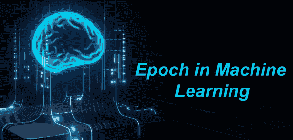
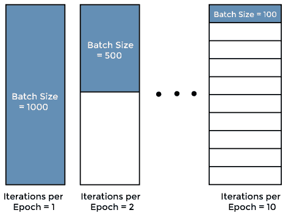

# 机器学习的时代

> 原文：<https://www.javatpoint.com/epoch-in-machine-learning>

在机器学习中，每当你想用一些数据训练一个模型时，那么 **Epoch** 指的是通过算法训练数据集的一个完整过程。此外，训练机器学习模型需要几个时期，但是，在这种情况下，在模型中输入大量训练数据时，您将面临一个问题。出现此问题是由于计算机存储的限制。为了克服这个问题，我们必须根据计算机内存或存储容量将训练数据分成小批量。那么只有我们可以通过喂养这些批次来训练机器学习模型，而没有任何麻烦。这个过程被称为机器学习中的批处理， ***更进一步，当所有批处理被精确地馈送一次以训练模型时，那么整个过程被称为机器学习中的纪元*** 。在本文中，**【机器学习中的纪元】**我们将简要讨论纪元、批次和样本等。让我们从机器学习时代的定义开始。

## 什么是机器学习时代？

时代被定义为在一个周期内用所有训练数据训练机器学习模型的迭代总数。在 Epoch 中，所有训练数据只使用一次。此外，换句话说，Epoch 也可以理解为算法围绕训练数据集完成的总遍数。向前传球和向后传球一起算为训练中的一次传球。

通常，当机器学习模型被训练时，它需要少量的纪元。纪元经常与迭代混淆在一起。

## 什么是迭代？

迭代定义为完成一个纪元所需的批次总数，其中批次数等于一个纪元的迭代总数。

让我们用一个例子来理解迭代和纪元，我们有 3000 个训练例子，我们将用来训练一个机器学习模型。

在上面的场景中，我们可以将训练数据集分成相当大的批次。假设我们已经考虑了每批 500 个例子的批次，那么需要 6 次迭代才能完成 1 个纪元。

数学上，我们可以这样理解；

*   训练示例总数= 3000；
*   假设每个批次大小= 500；
*   那么迭代总数=训练示例总数/单个批次大小= 3000/500
*   迭代总数= 6
*   和 ***1 个纪元= 6 次迭代***

现在，简单了解一下批量大小。

## 什么是机器学习中的批处理？

在机器学习中开始介绍 Batch 之前，您的脑海中必须有一件事，即批处理大小和批处理是机器学习中两个独立的实体。

批处理大小定义为单个批处理中存在的训练示例总数。你也可以用上面提到的例子来理解批处理，我们已经将整个训练数据集/例子分成不同的批处理或集合或部分。

让我们用下面的例子来理解混合 Epoch 和迭代的概念，在下面的例子中，我们考虑了 1000 个数据集，如下图所示。

在上图中，我们可以这样理解这个概念:

*   如果批处理大小为 1000，则一个纪元将在一次迭代中完成。
*   如果批处理大小为 500，则一个纪元将在 2 次迭代中完成。

类似地，如果批量太小或例如 100，则纪元将在 10 次迭代中完成。因此，我们可以得出这样的结论:对于每个时期，所需的迭代次数乘以批处理大小就得到数据点的数量。然而，我们可以使用多个数字时代来训练机器学习模型。

## 机器学习中关于纪元和批处理的要点:

在训练机器学习模型时，每个人都应该记住几个要点。这些措施如下:

*   Epoch 是一个机器学习术语，指的是训练数据在整个数据点期间通过机器学习算法的次数。
*   如果有大量数据可用，则可以将整个数据集划分为常见的组或批。
*   通过学习模型运行一批的过程称为迭代。在机器学习中，整个训练数据集中的一个周期称为一个纪元。然而，在理想条件下，整个训练数据集中的一个周期被称为一个纪元，但是训练一个模型通常需要多个纪元。
*   通过在机器学习模型的训练中使用更多的时期，可以用新的输入实现更好的泛化。
*   考虑到现实应用中数据的复杂性和多样性，可能需要成百上千个时期来实现合理的测试数据正确性。此外，根据手头的主题，纪元一词有几种定义。

## 为什么要使用多个 Epoch？

通过 ML 算法或神经网络传递整个数据集可能看起来不正确，我们需要多次将其传递给同一个算法。

因此，需要记住，为了优化学习，我们使用梯度下降，这是一个迭代过程。因此，仅通过一个过程或一个时期来更新权重是不够的。

此外，一个时期可能导致模型的过度拟合。

* * *