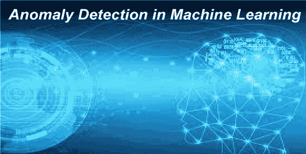

# 带有异常检测的机器学习

> 原文：<https://www.javatpoint.com/machine-learning-with-anomaly-detection>

**异常检测是发现那些因与其余数据点或观测值不同而引起怀疑的稀有项目、数据点、事件或观测值的过程。**异常检测也称为**异常检测**。

通常，异常数据与某种问题有关，如银行欺诈、医疗问题、设备故障等。

发现异常是定义什么是正常的能力？例如，在下图中，黄色车辆是所有红色车辆中的异常。

## 异常检测的类型

**1。点异常**

如果数据集内的元组远离数据的其余部分，则可以说它是点异常。

**例**:积分异常的一个例子是信用卡突然发生巨额交易。

**2。上下文异常**

上下文异常也称为条件异常值。如果一个特定的观察不同于其他数据点，那么它被称为上下文异常。在这种类型的异常中，一个上下文中的异常可能不是另一个上下文中的异常。

**3。集体异常**

当一个数据集中的一个数据点对整个数据集来说是异常的时，就会出现集体异常，这种值被称为集体异常值。在这种异常情况下，特定的或个体的值作为一个整体或上下文并不异常。

## 异常检测技术的分类

异常检测技术大致分为三种类型:

1.  **监督异常检测**
2.  **无监督异常检测**

### 监督异常检测

监督异常检测需要标记的训练数据，它包含正常和异常数据，用于创建预测模型。常见的监督方法有神经网络、支持向量机、k 近邻、贝叶斯网络、决策树等。

k-最近邻是一种流行的非参数技术，它可以找到输入向量上不同点之间的近似距离。这是最好的异常检测方法之一。另一个流行的模型是贝叶斯网络，当与统计方案相结合时，它用于异常检测。该模型编码了可变利益之间的概率关系。

监督异常检测技术有不同的优势，如编码变量之间的相互依赖关系和预测事件的能力；它还提供了整合先前知识和数据的能力。

### 无监督异常检测

无监督异常检测不需要标记的训练数据。这些技术基于两个假设，

*   大部分网络连接来自正常流量，只有少量数据异常。
*   恶意流量在统计上不同于正常流量。

基于这些假设，频繁出现的相似数据点的数据簇被假设为正常流量，而那些不频繁出现的数据组被认为是异常或恶意的。

一些常见的无监督异常检测算法是自组织映射(SOM)、K 均值、C 均值、期望最大化元算法(EM)、自适应共振理论(ART)和一类支持向量机。自组织映射是一种流行的技术，旨在降低数据可视化的维数。

异常检测可以有效地帮助捕捉欺诈，发现大型复杂大数据集中的奇怪活动。这在银行安全、自然科学、医学和市场营销等领域非常有用，因为这些领域容易发生恶意活动。通过机器学习，一个组织可以加强搜索并提高其数字业务计划的有效性。

## 异常检测的需求

### 1.应用程序性能的异常检测

任何公司的应用程序性能都会提高或降低员工生产率和收入。监控应用程序性能的常规或传统方法允许对问题做出反应，但业务仍然会受到影响，因此会影响用户。但是在使用机器学习的异常检测的帮助下，很容易在应用程序性能问题影响业务和用户之前识别和解决它们。

使用机器学习算法的异常检测可以简单地将数据与相应的应用程序性能度量相关联，并找出问题的完整知识。有不同的行业也对其业务采用异常检测技术，如**电信、Adtech** 等。

### 2.产品质量异常检测

产品经理信任另一个部门来负责必要的监控和警报是不够的。产品经理总是需要能够相信产品会顺利工作。这是因为产品总是需要改变，从每个版本发布到新功能升级，并产生异常。如果你没有正确监控这些异常，可能会导致数百万的收入损失，还会影响品牌声誉。

### 3.用户体验的异常检测

如果您发布了一个有缺陷的版本，您可能会遇到 DDoS 攻击，在客户体验中有使用失误的风险。因此，需要在这些问题影响用户体验之前做出反应，以减少收入损失的机会。

主动精简和改善用户体验将有助于提高各种行业的客户满意度，包括游戏、在线业务等。

## 结论

在本主题中，我们提供了异常检测及其业务用例的详细描述。异常检测在不同的业务应用中非常有用，如信用卡欺诈检测系统、入侵检测等。

* * *