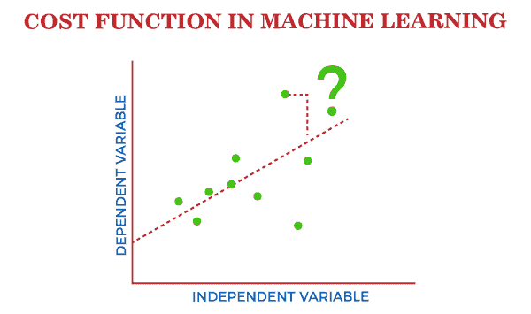
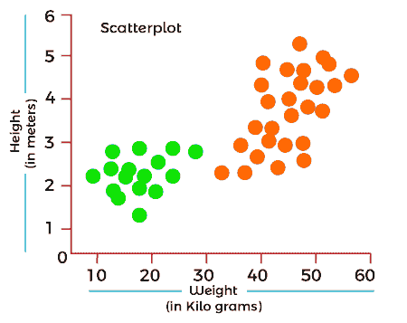
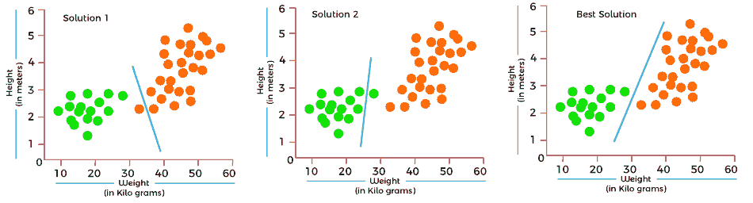
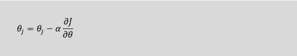
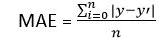
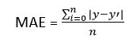

# 机器学习中的成本函数

> 原文：<https://www.javatpoint.com/cost-function-in-machine-learning>

机器学习模型应该具有非常高的精确度，以便在实际应用中表现良好。但是如何计算模型的准确性，即我们的模型在现实世界中的表现是好是坏？在这种情况下，成本函数就产生了。正确估计模型是一个重要的机器学习参数。



成本函数在理解模型如何评估输入和输出参数之间的关系方面也起着至关重要的作用。

在本主题中，我们将解释机器学习中的成本函数、梯度下降和成本函数的类型。

## 什么是成本函数？

***成本函数是决定机器学习模型对于给定数据集表现如何的重要参数。*** 它计算期望值和预测值之间的差值，并将其表示为单个实数。

在机器学习中，一旦我们训练了我们的模型，我们就想看看我们的模型表现如何。虽然有各种各样的精度函数可以告诉你你的模型是如何运行的，但不会给出改进它们的见解。因此，我们需要一个函数，通过找到训练不足和训练过度模型之间的点，来找到模型最准确的时间。

简单来说，“ ***成本函数是一个衡量模型在估计 X(输入)和 Y(输出)参数*** 之间的关系时有多错误的指标。”成本函数有时也被称为损失函数，它可以通过迭代运行模型来估计，以将估计的预测与已知的 y 值进行比较

每个 ML 模型的主要目的是确定可以最小化成本函数的参数或权重。

## 为什么要使用成本函数？

虽然有不同的精度参数，那么为什么我们需要机器学习模型的成本函数。所以，我们可以用一个数据分类的例子来理解它。假设我们有一个包含猫和狗的身高和体重的数据集，我们需要对它们进行相应的分类。如果我们使用这两个特征绘制记录，我们将得到如下散点图:



在上图中，绿点是猫，黄点是狗。下面是这个分类问题的三种可能的解决方案。



在上述解决方案中，所有三个分类器都具有高精度，但是第三个解决方案是最好的，因为它正确地分类了每个数据点。最好的分类背后的原因是它在两个类之间，离任何一个都不近或不远。

为了得到这样的结果，我们需要一个成本函数。它意味着获得最优解；我们需要一个成本函数。它计算了实际值和预测值之间的差异，并测量了我们的模型在预测中的错误程度。通过最小化代价函数的值，我们可以得到最优解。

## 梯度下降:最小化成本函数

正如我们在上面部分讨论的，成本函数告诉我们你的模型有多错误？并且每个机器学习模型都试图最小化成本函数，以便给出最佳结果。梯度下降的作用来了。

“ ***梯度下降是一种优化算法，用于优化模型中的代价函数或误差。”*** 它使模型能够采用梯度或方向，通过达到尽可能小的误差来减少误差。这里的方向是指模型参数应该如何修正，以进一步降低成本函数。你的模型中的错误在不同的点可能是不同的，你必须找到最快的方法来最小化它，以防止资源浪费。

梯度下降是一个迭代过程，在这个过程中，模型逐渐收敛到最小值，如果模型迭代得比这个点更远，它产生的损失变化很小或为零。这一点称为收敛，此时误差最小，代价函数优化。

下面是线性回归中的梯度下降方程:



在梯度下降方程中，α被称为学习率。此参数决定了您应该以多快的速度向下移动到斜坡。对于大的 alpha，采取大的步骤，对于小的 alpha 值，需要采取小的步骤。

## 成本函数的类型

根据问题的不同，成本函数可以有不同的类型。然而，它主要有三种类型，如下所示:

1.  回归成本函数
2.  二元分类成本函数
3.  多类分类成本函数。

### 1.回归成本函数

回归模型用于对房价、天气预报、贷款预测等连续变量进行预测。当成本函数与回归一起使用时，它被称为“回归成本函数”在这种情况下，成本函数被计算为基于距离的误差，例如:

```

Error= Actual Output-Predicted output

```

有三种常用的回归成本函数，如下所示:

**a .表示错误**

在这种类型的成本函数中，为每个训练数据计算误差，然后取所有误差值的平均值。

这是可能的最简单的方法之一。

训练数据中出现的错误可以是负的，也可以是正的。在求平均值时，它们可以相互抵消，导致模型的零均值误差，因此不建议模型使用成本函数。

然而，它为回归模型的其他成本函数提供了基础。

**b .均方误差**

均方误差是最常用的成本函数方法之一。它改进了平均误差成本函数的缺点，因为它计算实际值和预测值之间的差值的平方。由于差值的平方，它避免了任何负误差的可能性。

计算均方误差的公式如下:



均方误差也称为 L2 损失。

在均方误差中，每个误差都是平方的，这有助于减少预测中的小偏差。但是，如果数据集有产生更多预测误差的异常值，那么对该误差求平方将进一步使误差增加数倍。因此，我们可以说，均方误差对异常值的鲁棒性较差。

**c .平均绝对误差(MAE)**

平均绝对误差还通过取实际值和预测值之间的绝对差值来克服平均误差成本函数的问题。

计算平均绝对误差的公式如下:



这意味着绝对误差成本函数也被称为 **L1 损失**。它不受噪声或异常值的影响，因此如果数据集有噪声或异常值，会得到更好的结果。

### 2.二元分类成本函数

分类模型用于对分类变量进行预测，例如对 0 或 1、猫或狗等的预测。分类问题中使用的成本函数称为分类成本函数。然而，分类成本函数不同于回归成本函数。

分类中常用的损失函数之一是交叉熵损失。

二元成本函数是分类交叉熵的一个特例，其中只有一个输出类。例如，红色和蓝色之间的分类。

为了更好地理解它，让我们假设只有一个输出变量 Y

```

Cross-entropy(D) = - y*log(p) when y = 1

Cross-entropy(D) = - (1-y)*log(1-p) when y = 0

```

二元分类中的误差被计算为所有 N 个训练数据的交叉熵的平均值。这意味着:

```

Binary Cross-Entropy = (Sum of Cross-Entropy for N data)/N

```

### 3.多类分类成本函数

多类分类成本函数用于将实例分配给两个以上类之一的分类问题。此外，类似于二元分类成本函数，交叉熵或分类交叉熵是常用的成本函数。

它的设计方式是可以用于目标值范围从 0 到 1，3，…的多类分类。，n 个类。

在多类分类问题中，交叉熵将生成一个分数，该分数总结了实际和预期概率分布之间的平均差异。

对于完美的交叉熵，当分数最小化时，该值应该为零。

* * *