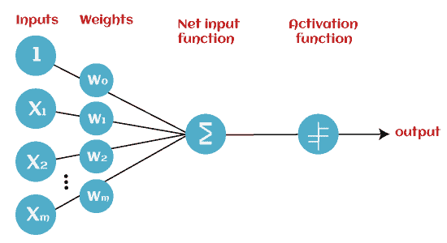
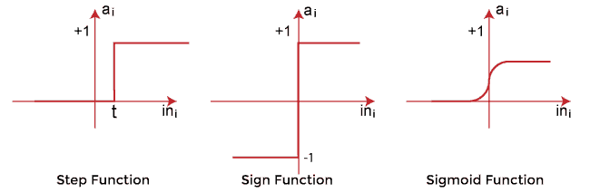
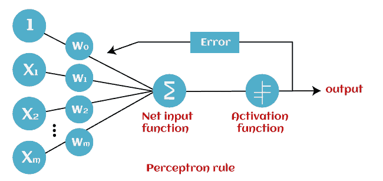

# 机器学习中的感知器

> 原文：<https://www.javatpoint.com/perceptron-in-machine-learning>

在机器学习和人工智能中，感知器是所有人最常用的术语。它是学习机器学习和深度学习技术的第一步，包括一组权重、输入值或分数以及阈值。 ***感知器是人工神经网络*** 的构建模块。最初，在 19 世纪中叶世纪，**弗兰克·罗森布拉特先生**发明了感知器，用于执行某些计算以检测输入数据能力或商业智能。感知器是一种线性机器学习算法，用于各种二进制分类器的监督学习。这种算法使神经元能够在准备过程中一个接一个地学习和处理元素。在本教程“机器学习中的感知器”中，我们将简要讨论感知器及其基本功能的深入知识。让我们从感知器的基本介绍开始。

## 机器学习中的感知器模型是什么？

感知器是一种机器学习算法，用于各种二元分类任务的监督学习。此外， ***感知器也被理解为人工神经元或神经网络单元，有助于检测商业智能中的某些输入数据计算*** 。

感知器模型也被视为最好和最简单的人工神经网络类型之一。然而，它是一种二进制分类器的监督学习算法。因此，我们可以认为它是一个单层神经网络，具有四个主要参数，即**输入值、权重和偏差、净和以及激活函数。**

## 什么是机器学习中的二进制分类器？

在机器学习中，二进制分类器被定义为有助于决定输入数据是否可以表示为数字向量并属于某个特定类别的函数。

二进制分类器可以被认为是线性分类器。简单来说，我们可以把它理解为一个 ***分类算法，可以用权重和特征向量来预测线性预测器函数。*T3】**

## 感知器的基本组成部分

Frank Rosenblatt 先生发明了感知器模型作为包含三个主要部分的二元分类器。这些措施如下:

*   **输入节点或输入层:**

这是感知器的主要组成部分，它将初始数据接受到系统中进行进一步处理。每个输入节点都包含一个实数值。

*   **重量和偏差:**

权重参数表示单元之间的连接强度。这是感知器组件的另一个最重要的参数。在决定输出时，权重与相关输入神经元的强度成正比。此外，偏差可以被认为是线性方程中的截距线。

*   **激活功能:**

这些是最终的重要组成部分，有助于确定神经元是否会放电。激活函数主要可视为阶跃函数。

激活功能的类型:

*   符号函数
*   阶跃函数，以及
*   Sigmoid 函数

数据科学家使用激活函数根据各种问题陈述做出主观决定，并形成所需的输出。通过检查学习过程是否缓慢或具有消失或爆炸梯度，激活函数在感知器模型中可能有所不同(例如，符号、步长和 Sigmoid)。

## 感知器是如何工作的？

在机器学习中，感知器被认为是一个单层神经网络，由四个主要参数组成，分别是输入值(输入节点)、权重和偏差、净和以及激活函数。感知器模型从所有输入值和它们的权重相乘开始，然后将这些值相加以创建加权和。然后，将该加权和应用于激活函数“f”以获得期望的输出。该激活功能也称为**步进功能**，由**‘f’**表示。

该阶跃函数或激活函数在确保输出在所需值(0，1)或(-1，1)之间映射方面起着至关重要的作用。需要注意的是，输入的权重表示节点的强度。同样，输入的偏置值可以使激活函数曲线上下移动。

感知器模型在以下两个重要步骤中工作:

**第一步**

在第一步中，首先将所有输入值与相应的权重值相乘，然后将它们相加以确定加权和。数学上，我们可以计算加权和如下:

* wi * Xi = x1 * w1+x2 * w2+…wn * xn

给这个加权和加上一个特殊的术语 **bias 'b'** ，以提高模型的性能。

**wi * Xi+b**

**第 2 步**

在第二步中，激活函数被应用于上述加权和，这给我们以二进制形式或连续值的输出，如下所示:

**y = f((wi * Xi+b)**

## 感知器模型的类型

基于层，感知器模型分为两种类型。这些措施如下:

1.  单层感知器模型
2.  多层感知器模型

### 单层感知器模型:

这是最简单的人工神经网络类型之一。单层感知器模型由前馈网络组成，并且还包括模型内部的阈值传递函数。单层感知器模型的主要目标是分析具有二元结果的线性可分对象。

在单层感知器模型中，其算法不包含记录的数据，因此它从不稳定地分配权重参数的输入开始。此外，它还汇总了所有输入(权重)。将所有输入相加后，如果所有输入的总和大于预定值，模型将被激活，并将输出值显示为+1。

如果结果与预定值或阈值相同，则表示该模型的性能得到满足，重量需求不变。然而，当多个重量输入值被输入到模型中时，该模型包含一些触发的差异。因此，为了找到所需的输出并最大限度地减少误差，需要对权重输入进行一些更改。

*“单层感知器只能学习线性可分模式。”*

### 多层感知器模型:

像单层感知器模型一样，多层感知器模型也具有相同的模型结构，但是具有更多的隐藏层。

多层感知器模型也称为反向传播算法，它分两个阶段执行，如下所示:

*   **前向阶段:**激活功能在前向阶段从输入层开始，在输出层结束。
*   **后向阶段:**后向阶段，根据模型要求修改权重和偏差值。在这一阶段，实际输出和需求之间的误差在输出层向后产生，在输入层结束。

因此，多层感知器模型被认为是具有不同层的多个人工神经网络，其中激活函数不保持线性，类似于单层感知器模型。代替线性，激活函数可以执行为 sigmoid、TanH、ReLU 等。，用于部署。

多层感知器模型具有更大的处理能力，可以处理线性和非线性模式。此外，它还可以实现逻辑门，如与、或、异或、与非、非、XNOR、或非。

**多层感知器的优势:**

*   多层感知器模型可用于解决复杂的非线性问题。
*   它适用于小型和大型输入数据。
*   它帮助我们在训练后获得快速的预测。
*   它有助于在大数据和小数据的情况下获得相同的准确率。

**多层感知器的缺点:**

*   在多层感知器中，计算既困难又耗时。
*   在多层感知器中，很难预测因变量对每个自变量的影响程度。
*   模型的运行取决于培训的质量。

## 感知器函数

感知器函数“f(x)””可以通过将输入“x”乘以学习到的权重系数“w”作为输出来实现。

数学上，我们可以表达如下:

**f(x)= 1；如果 w.x+b > 0**

**否则，f(x)=0**

*   ' w '代表实值权重向量
*   “b”代表偏差
*   “x”表示输入 x 值的向量。

## 感知器的特性

感知器模型具有以下特征。

1.  感知器是一种用于二进制分类器监督学习的机器学习算法。
2.  在感知器中，权重系数是自动学习的。
3.  最初，权重与输入特征相乘，并决定神经元是否被激发。
4.  激活函数应用步长规则来检查权重函数是否大于零。
5.  绘制了线性决策边界，从而能够区分两个线性可分离的类+1 和-1。
6.  如果所有输入值的总和大于阈值，则必须有输出信号；否则，将不会显示任何输出。

## 感知器模型的局限性

**感知器模型的局限性如下:**

*   由于硬限制传递函数，感知器的输出只能是二进制数(0 或 1)。
*   感知器只能用于对输入向量的线性可分集合进行分类。如果输入向量是非线性的，就不容易正确分类。

## 感知器的未来

感知器模型的未来非常光明和重要，因为它有助于通过构建直观的模式来解释数据，并在未来应用它们。机器学习是一项快速发展的人工智能技术，正在不断进化和发展中；因此，感知器技术的未来将继续支持和促进机器的分析行为，进而提高计算机的效率。

在人工神经元的帮助下，感知器模型不断变得更加先进，并有效地处理复杂的问题。

## 结论:

在这篇文章中，您已经了解了感知器模型是一种最简单的人工神经网络，它承载输入及其权重、所有加权输入的总和以及激活函数。感知器模型不断为人工智能和机器学习做出贡献，并且这些模型变得更加先进。感知器使计算机能够使用各种机器学习技术更有效地处理复杂的问题。感知器是人工神经网络的基础，每个人都应该对感知器模型有深入的了解，才能研究深度神经网络。

* * *