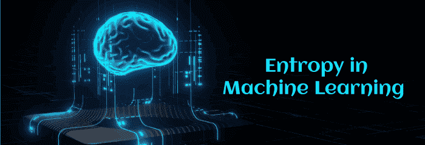
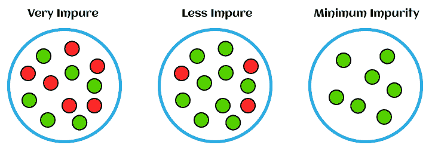
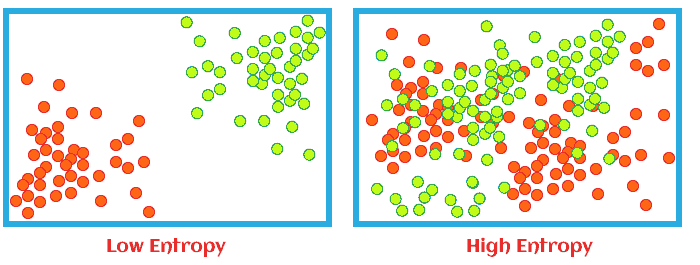
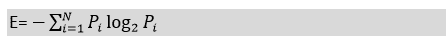
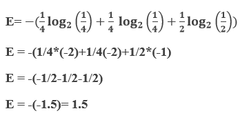
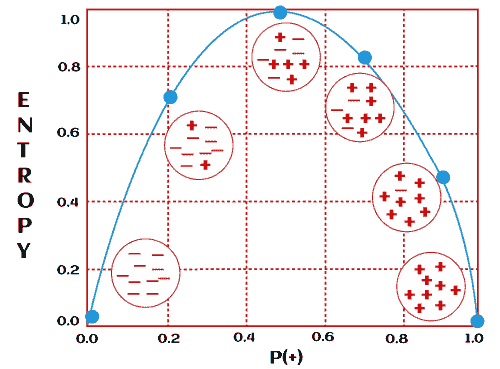
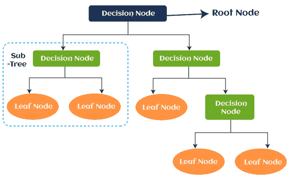
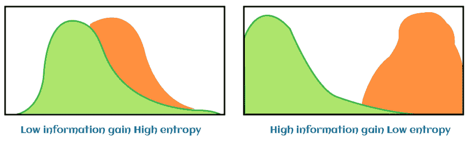
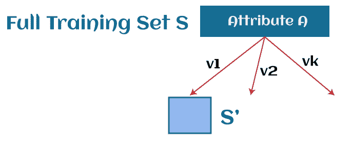

# 机器学习中的熵

> 原文：<https://www.javatpoint.com/entropy-in-machine-learning>

我们生活在一个科技世界，在某个地方，一切都与科技有关。机器学习也是计算机科学世界中最受欢迎的技术，它使计算机能够从过去的经验中自动学习。

此外，信息技术世界对机器学习的需求如此之大，以至于大多数公司都希望他们的业务中有高技能的机器学习工程师和数据科学家。机器学习包含了大量容易解决复杂问题的算法和概念，机器学习中的熵就是其中之一。几乎每个人在物理和化学的学校或大学时代都听过熵这个词。熵的基础来自物理学，它被定义为对系统中的无序、随机性、不可预测性或不纯性的度量。在这篇文章中，我们将讨论什么是机器学习中的熵，以及为什么机器学习需要熵。因此，让我们从快速介绍机器学习中的熵开始。

## 机器学习中的熵介绍

熵被定义为机器学习中正在处理的信息的随机性或无序度。进一步，换句话说，我们可以说**熵是衡量系统**不可预测性或不纯性的机器学习度量。

当信息在系统中处理时，每一条信息都有特定的价值，可以用来从中得出结论。因此，如果从一条信息中更容易得出有价值的结论，那么在机器学习中熵会更低，或者如果熵更高，那么很难从这条信息中得出任何结论。

熵是机器学习中理解各种概念的有用工具，如特征选择、建立决策树、拟合分类模型等。作为一名机器学习工程师和专业的数据科学家，你必须对机器学习中的熵有深入的了解。

## 什么是机器学习中的熵

熵是机器学习中处理的信息中无序或杂质的度量。它决定了决策树如何选择拆分数据。

我们可以用任何简单的例子来理解熵这个术语:抛硬币。当我们抛硬币时，会有两种结果。然而，很难断定抛硬币的确切结果是什么，因为抛硬币与其结果之间没有直接关系。两种结果都有 50%的概率；那么，在这种情况下，熵会很高。这就是机器学习中熵的本质。

## 熵的数学公式

考虑具有总数为 N 个类的数据集，那么熵(E)可以用下面的公式来确定:

哪里；

P i =在第一类中随机选择一个例子的概率；

熵总是介于 0 和 1 之间，但是根据数据集中的类的数量，它可以大于 1。但是高价值的

让我们用一个例子来理解它，在这个例子中，我们有一个数据集，其中有三种颜色的水果，红色，绿色和黄色。假设我们在整个数据集中有 2 个红色、2 个绿色和 4 个黄色观测值。那么根据上面的等式:

**e =-【prlog 2pr+pplog 2pp+pylog2py】**

哪里；

P r =选择红色水果的概率；

P g =选择绿色水果和；

P y =选择黄色水果的概率。

pr= 2/8 = 1/4[因为 8 个数据集中只有 2 个代表红色果实]

pg= 2/8 = 1/4[因为 8 个数据集中只有 2 个代表绿色水果]

py= 4/8 = 1/2[因为 8 个数据集中只有 4 个代表黄色果实]

现在我们的最终方程将是这样的:

所以，熵将是 1.5。

让我们考虑一个情况，当所有的观察都属于同一个类；那么熵永远为 0。

**E =(1 log21)**

= 0

当熵变为 0 时，则数据集没有杂质。杂质为 0 的数据集对学习没有帮助。此外，如果熵为 1，那么这种数据集有利于学习。

## 什么是机器学习中的决策树？

决策树被定义为用于分类和回归问题的监督学习算法。但是，它主要用于解决分类问题。它的结构类似于树，其中内部节点代表数据集的特征，树的分支代表决策规则，叶节点代表结果。

决策树用于根据历史数据预测结果。决策树基于**“if-then-else”**语句的序列和一个根，这是我们最初要解决的问题。

## 决策树中使用的术语:

**叶节点:**叶节点被定义为决策节点的输出，但如果它们不包含任何分支，则意味着树不能与该节点进一步隔离。

**根节点:**顾名思义，根节点是任何决策树的原点。它包含整个数据集，该数据集被进一步分成两个或多个子集。此节点包括多个分支，用于在分类问题中做出任何决策。

**拆分:**是在一定的定义条件下，将根节点划分为多个子节点的过程。

**分支:**分支由根节点或决策节点拆分而成。

**修剪:**修剪被定义为从树上去除不需要的树枝的过程。

**父节点:**决策树中的根节点称为父节点。

**子节点:**除了根节点，其他所有节点都称为决策树中的子节点。

## 熵在决策树中的应用

在决策树中，叶节点的异质性可以通过使用代价函数来降低。在根级别，目标列的熵可以由香农公式确定，其中香农先生将加权熵描述为在每个分支为目标列计算的熵。但是，简单来说，你可以把加权熵理解为每个属性的个体权重。此外，权重被认为是每个类别的概率。熵减少得越多，获得的信息就越多。

## 熵中的信息增益是多少？

信息增益被定义为在数据集中观察到的模式和熵的减少。

数学上，信息增益可以用下面的公式表示:

信息增益=(父节点熵)-(子节点熵)

#### 注:信息增益按 1-熵计算。

让我们通过一个具有以下三种场景的示例来理解它:

|  | 熵 | 信息增益 |
| 情景 1 | 0.7812345 | 0.2187655 |
| 场景 2 | Zero | one |
| 情景 3 | one | Zero |

假设我们有一个在根节点总共有四个值的树，它被分成第一级，一个分支中有一个值(比如分支 1)，另一个分支中有三个值(分支 2)。根节点的熵是 1。

现在，为了计算子节点 1 的熵，权重取为？对于分支 1 和？对于分支 2 和使用香农熵公式计算。如上所述，子节点 2 的熵为零，因为该子节点中只有一个值，这意味着不存在不确定性，因此不存在异质性。

h(X)=-[(1/3 * log2(1/3))+(2/3 * log2(2/3))]= 0.9184

上述情况的信息增益是熵的加权平均值的减少。

信息增益= 1 - ( * 0.9184) - ( *0) = 0.3112

熵去除得越多，信息增益就越大。信息增益越高，分割越好。

## 如何利用信息增益构建决策树:

在现在分别理解了信息增益和熵的概念之后，我们可以很容易地构建一个决策树。请参见使用信息增益构建决策树的步骤:

1.  应该从集合中选择具有最高信息增益的属性作为父(根)节点。从下图看，是 A.
    
2.  为属性 a 的每个值构建子节点
3.  反复重复，直到构建完整棵树。

### 决策树的优势:

*   决策树很容易理解，因为它在做出任何决定时都遵循人类思维的相同过程。
*   它用于解决机器学习中任何与决策相关的问题。
*   它有助于找出问题的所有可能结果。
*   与其他算法相比，对数据清理的要求更低。

* * *