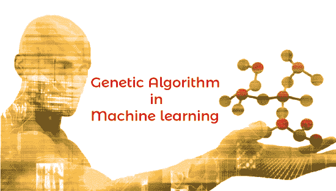
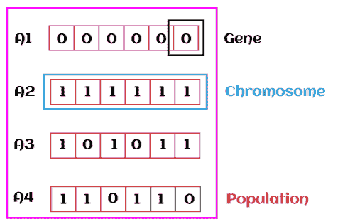
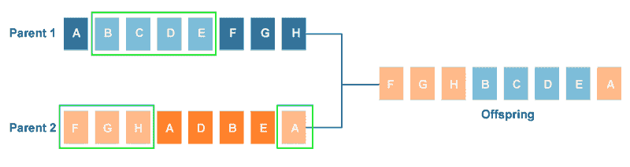
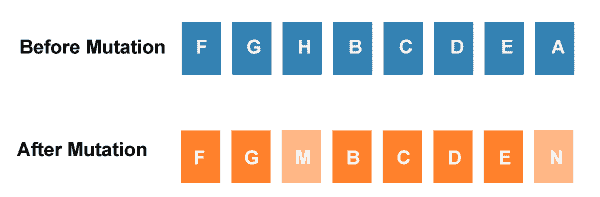
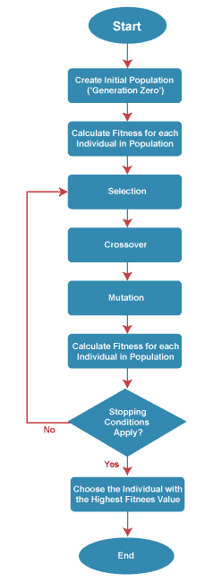

# 机器学习中的遗传算法

> 原文：<https://www.javatpoint.com/genetic-algorithm-in-machine-learning>

***遗传算法是一种自适应启发式搜索算法，其灵感来自“达尔文在《自然》*** 中的进化论。”它用于解决机器学习中的优化问题。它是重要的算法之一，因为它有助于解决需要很长时间才能解决的复杂问题。

遗传算法正被广泛应用于不同的现实世界中，例如，**设计电子电路、破译密码、图像处理和人工创造力。**

在本主题中，我们将详细解释遗传算法，包括遗传算法中使用的基本术语，它是如何工作的，遗传算法的优势和局限性等。

## 什么是遗传算法？

在理解遗传算法之前，让我们先了解基本术语，以便更好地理解该算法:

*   **种群:**种群是所有可能或可能解的子集，可以解决给定的问题。
*   **染色体:**染色体是种群中给定问题的解决方案之一，基因的集合生成一条染色体。
*   **基因:**一条染色体被分成不同的基因，或者它是染色体的一个元素。
*   **等位基因:**等位基因是特定染色体内提供给基因的值。
*   **适应度函数:**适应度函数用于确定个体在群体中的适应度水平。它意味着一个个体与其他个体竞争的能力。在每次迭代中，根据个体的适应度函数对其进行评估。
*   **遗传算子:**在一种遗传算法中，最佳个体交配再生出的后代优于父母。在这里，遗传操作者在改变下一代的遗传组成中发挥作用。
*   **选择**

在计算了种群中每一个现存个体的适合度之后，选择过程被用来确定种群中的哪一个个体将会繁殖并产生将会形成下一代的种子。

可用的选择样式类型

*   **轮盘选择**
*   **事件选择**
*   **等级接地选择**

所以，现在我们可以把遗传算法定义为一种求解优化问题的启发式搜索算法。它是进化算法的一个子集，用于计算。遗传算法使用遗传和自然选择概念来解决优化问题。

## 遗传算法是如何工作的？

遗传算法在进化的世代周期中产生高质量的解决方案。这些算法使用不同的操作来增强或替换群体，以给出改进的拟合解。

它基本上涉及五个阶段来解决复杂的优化问题，如下所示:

*   **初始化**
*   **体能分配**
*   **选择**
*   **繁殖**
*   **终止**

### 1.初始化

遗传算法的过程始于生成一组个体，称为种群。这里每个人都是给定问题的解决方案。一个个体包含一组称为基因的参数或以此为特征。基因组合成一串，产生染色体，这就是问题的解决方案。最流行的初始化技术之一是使用随机二进制字符串。

### 2.健身任务

体能函数是用来判断一个人的体能如何的？它意味着一个个体与其他个体竞争的能力。在每次迭代中，根据个体的适应度函数对其进行评估。健身功能为每个人提供健身分数。这个分数进一步决定了被选择用于再现的概率。适合度分数越高，越有机会被选中进行繁殖。

### 3.选择

选择阶段包括选择个体来繁殖后代。所有被选择的个体然后被安排成一对二，以增加繁殖。然后这些个体将他们的基因转移到下一代。

有三种类型的选择方法，它们是:

*   轮盘选择
*   锦标赛选择
*   基于等级的选择

### 4.生殖

在选择过程之后，在繁殖步骤中产生孩子。在这一步中，遗传算法使用应用于父群体的两个变异算子。复制阶段涉及的两个操作符如下所示:

*   **交叉:**交叉在遗传算法的繁殖阶段起着最重要的作用。在这个过程中，在基因中随机选择一个交叉点。然后交叉算子交换来自当前世代的两个父母的遗传信息，以产生代表后代的新个体。
    
    父母的基因在他们之间交换，直到遇到交叉点。这些新产生的后代被添加到种群中。这个过程也被称为交叉。可用的交叉样式类型:
    *   单点交叉
    *   两点交叉
    *   制服交叉
    *   可继承算法交叉
*   **突变**
    突变算子在后代(新子代)中插入随机基因，保持种群的多样性。这可以通过翻转染色体中的一些位来实现。
    突变有助于解决早熟收敛问题，增强多样化。下图显示了突变过程:
    可用的突变样式类型，
    
    *   **翻转位突变**
    *   **高斯突变**
    *   **交换/互换突变**

### 5.结束

在再现阶段之后，应用停止标准作为终止的基础。算法在达到阈值适应度解后终止。它将确定最终解决方案为群体中的最佳解决方案。

## 一种简单遗传算法的一般工作流程

## 遗传算法的优势

*   遗传算法的并行能力是最好的。
*   它有助于优化各种问题，如离散函数、多目标问题和连续函数。
*   它为一个随着时间的推移而改进的问题提供了解决方案。
*   遗传算法不需要导数信息。

## 遗传算法的局限性

*   遗传算法不是解决简单问题的有效算法。
*   它不能保证问题最终解决方案的质量。
*   健身值的重复计算可能会产生一些计算挑战。

## 遗传算法与传统算法的区别

*   搜索空间是问题的所有可能解决方案的集合。在传统算法中，只保留一组解，而在遗传算法中，可以使用搜索空间中的几组解。
*   传统算法需要更多的信息来执行搜索，而遗传算法只需要一个目标函数来计算个体的适应度。
*   传统算法不能并行工作，而遗传算法可以并行工作(个体适应度的计算是独立的)。
*   遗传算法的一个很大的不同是，遗传算法不是直接对搜索结果进行操作，而是对它们的表示(或渲染)进行操作，这些表示通常被称为染色体。
*   传统算法和遗传算法的一大区别是，它不直接对候选解进行运算。
*   传统算法最终只能产生一个结果，而遗传算法可以从不同的世代产生多个最优结果。
*   传统算法不太可能产生最优结果，而遗传算法不能保证产生最优的全局结果，但由于它使用了交叉和变异等遗传算子，因此获得问题最优结果的可能性很大。
*   传统算法本质上是确定性的，而遗传算法本质上是概率性和随机性的。

* * *