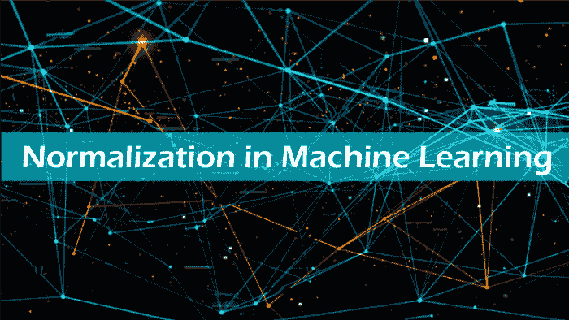
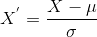

# 机器学习中的规范化

> 原文：<https://www.javatpoint.com/normalization-in-machine-learning>

***归一化是最常用的数据准备技术之一，它帮助我们更改数据集中数值列的值，以使用通用的比例。*T3】**



虽然**归一化**对于机器学习中所有可用的数据集都没有强制要求，但是只要数据集的属性具有不同的范围，它就会被使用。它有助于提高机器学习模型的性能和可靠性。在本文中，我们将简要讨论机器学习中的各种规范化技术、为什么使用它、ML 模型中规范化的例子等等。那么，让我们从机器学习中规范化的定义开始。

## 什么是机器学习中的规范化？

规范化是机器学习中的一种缩放技术，应用于数据准备期间，以更改数据集中数值列的值，从而使用通用的缩放比例。对于模型中的所有数据集，这不是必需的。只有当机器学习模型的特征具有不同的范围时才需要它。

数学上，我们可以用下面的公式计算归一化:

```

Xn = (X - Xminimum) / ( Xmaximum - Xminimum)

```

*   Xn =标准化值
*   最大值=特征的最大值
*   最小=特征的最小值

**示例:**假设我们有一个模型数据集，它具有如上所述的最大值和最小值。为了使机器学习模型正常化，值被移动和重新缩放，因此它们的范围可以在 0 和 1 之间变化。这项技术也被称为**最小-最大缩放**。在这种缩放技术中，我们将按如下方式更改特征值:

**情况 1-** 如果 X 的值最小，则分子的值为 0；因此归一化也将为 0。

```

Xn = (X - Xminimum) / ( Xmaximum - Xminimum)

```

把 X =Xminimum 放在上面的公式中，我们得到；

xn = xminimmy-xminimmy/(xmaximmy-xminimmy)

Xn = 0

**情况 2-** 如果 X 的值最大，那么分子的值等于分母；因此归一化将为 1。

```

Xn = (X - Xminimum) / ( Xmaximum - Xminimum)

```

把 X =Xmaximum 放在上面的公式中，我们得到；

xn = xmaximm-xminimmy/(xmaximm-xminimmy)

Xn = 1

**情况 3-** 另一方面，如果 X 的值既不是最大值也不是最小值，那么归一化的值也将在 0 和 1 之间。

因此，归一化可以被定义为一种缩放方法，其中值被移位和重新缩放以保持它们的范围在 0 和 1 之间，或者换句话说；可以称为**最小-最大缩放技术**。

## 机器学习中的规范化技术

虽然机器学习中有很多特征归一化技术，但最常用的却很少。这些措施如下:

*   **最小-最大缩放:**这种技术也被称为缩放。正如我们在上面已经讨论过的，最小-最大缩放方法帮助数据集移动和重新缩放它们的属性值，因此它们最终在 0 和 1 之间变化。
*   **标准化缩放:**

标准化标度也称为 **Z-score** 归一化，其中值以具有单位标准差的平均值为中心，这意味着属性变为零，结果分布具有单位标准差。数学上，我们可以通过从平均值中减去特征值并除以标准差来计算标准化。

因此，标准化可以表达如下:



这里代表特征值的均值， **σ** 代表特征值的标准差。

然而，与最小-最大缩放技术不同，在标准化技术中，特征值不限于特定范围。

该技术对于使用距离度量的各种机器学习算法有帮助，例如 **KNN、K-means 聚类和主成分分析**等。此外，模型建立在假设的基础上并且数据是正态分布的也很重要。

## 规范化和标准化的区别

| 正常化 | 标准化 |
| 该技术使用最小值和最大值来缩放模型。 | 该技术使用均值和标准差来缩放模型。 |
| 当要素的比例不同时，这很有帮助。 | 当变量的平均值设置为 0，标准偏差设置为 1 时，这很有帮助。 |
| 缩放值的范围在[0，1]或[-1，1]之间。 | 比例值不限于特定范围。 |
| 它受到异常值的影响。 | 它受异常值的影响相对较小。 |
| Scikit-Learn 提供了一个名为“最小最大缩放器”的转换器，用于标准化。 | Scikit-Learn 提供了一个名为标准化的转换器。 |
| 它也被称为缩放规范化。 | 它被称为 Z 分数归一化。 |
| 当特征分布未知时，它很有用。 | 当特征分布为正态时，这是有用的。 |

## 何时使用规范化或标准化？

规范化和标准化哪个适合我们的机器学习模型？这可能是所有数据科学家和机器学习工程师的一大困惑。虽然这两个术语有着几乎相同的含义，但是选择使用规范化还是标准化将取决于您的问题和您在模型中使用的算法。

1.规范化是一种转换技术，有助于更好地提高模型的性能和准确性。当你不知道特征分布的时候，机器学习模型的规范化是有用的。换句话说，数据的特征分布不遵循**高斯**(钟形曲线)分布。规范化必须有丰富的范围，所以如果数据中有异常值，它们会受到规范化的影响。

此外，它对于具有可变缩放技术的数据也很有用，例如 **KNN，人工神经网络** s。因此，您不能对数据的分布使用假设。

2.当您完全了解数据的特征分布，或者换句话说，您的数据遵循高斯分布时，机器学习模型中的标准化非常有用。然而，这不一定是真的。与标准化不同，标准化不一定有边界范围，因此如果数据中有异常值，它们不会受到标准化的影响。

此外，当数据具有可变维度和技术时，例如**线性回归、逻辑回归和线性判别分析**，它也是有用的。

**示例:**我们来了解一个实验，其中我们有一个数据集，它有两个属性，即年龄和工资。其中年龄从 0 到 80 岁，收入从 0 到 75000 美元或更多不等。假设收入是年龄的 1000 倍。因此，这两个属性的范围有很大的不同。

由于其较大的价值，当我们进行进一步分析时，如多元线性回归，归因收入会更有机地影响结论。然而，这并不一定意味着它是一个更好的预测器。因此，我们对数据进行标准化，以便所有变量都在相同的范围内。

此外，它还有助于对信用风险评分的预测，在这种情况下，标准化适用于除类别列之外的所有数字数据。它使用 **tanh 变换**技术，将所有数值特征转换为 0 到 1 范围内的值。

## 结论

规范化通过创建新的值并保持数据的一般分布和比率来避免原始数据和数据集的各种问题。此外，它还使用各种技术和算法来提高机器学习模型的性能和准确性。因此，规范化和标准化的概念有点混乱，但是对于构建更好的机器学习模型非常重要。

* * *