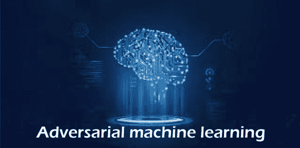
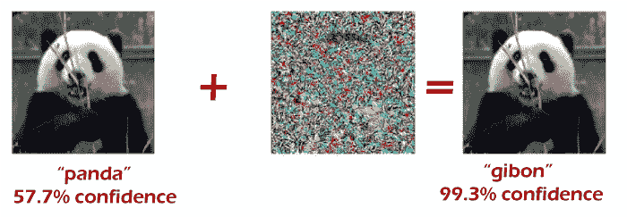
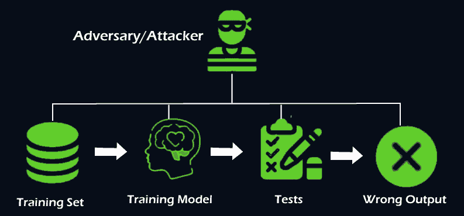

# 对抗性机器学习

> 原文：<https://www.javatpoint.com/adversarial-machine-learning>

***计算机安全领域使用“敌手”一词，以恶意输入*** 愚弄或误导机器学习模型。网络安全也是所有数据科学家和程序员最重要的概念之一。因为黑客总是试图用不同的技术黑数据。同样，**对抗性机器学习**也是一种用欺骗性数据误导任何机器学习模型，降低模型精度和性能的技术。在本文中，我们将讨论机器学习和人工智能的一个非常重要的概念，它可以帮助您保护机器学习模型免受数字攻击，并使它们免受未经授权的攻击。因此，让我们从对抗性机器学习的快速介绍开始。

## 什么是对抗性机器学习？

***对抗性机器学习被称为一种网络攻击，旨在利用恶意输入愚弄或误导模型。*** 用于执行攻击，通过提供欺骗性输入来破坏或扰乱机器学习模型。对抗性机器学习可以广泛应用于图像分类和垃圾邮件检测，其中对图像集进行一些更改会导致分类器产生不正确的预测。

### 对抗性机器学习的例子

对抗性机器学习示例指的是欺骗性输入，目的是误导或破坏机器学习模型或计算机程序。有一些攻击者制作的图像示例，我们的模型无法正确预测。让我们用流行的熊猫对长臂猿的例子来理解。虽然这两个图像不同，但人眼无法分辨。

左边的图像是 ImageNet 数据集中**的干净图像之一，用于训练 **GoogLeNet 模型。****

然而，第一个图像与第三个图像或甚至第一个图像的修改版本略有不同。右侧图像是在中心图像中引入小扰动的帮助下创建的。

第一张图片被模型预测为熊猫，果然不出所料，而右边的图片被高置信度的识别为长臂猿。

因此，当引入一个带有对抗性输入的典型图像时，它会导致分类器将熊猫误认为长臂猿。

现在，再举一个例子，显示作者打印的 3D 海龟的不同视图，以及谷歌盗梦空间 v3 模型的错误分类。

对抗性机器学习已经产生了各种各样的结果，从有趣的、良性的和令人尴尬的——比如跟踪海龟被误认为是步枪——到潜在的有害例子，比如自动驾驶汽车把停车标志误认为限速。

## 你所说的对抗性白盒和黑盒攻击是什么意思？

在机器学习中，攻击有两种分类方式。这些措施如下:

*   **黑盒攻击**
*   **白盒攻击**

**黑盒攻击:**黑盒攻击是攻击者没有目标模型的模型信息，也无法访问其架构、参数和梯度的场景。

**白盒攻击:**这些攻击与黑盒攻击正好相反，在黑盒攻击中，攻击者可以访问目标模型及其架构、参数和梯度的所有信息。

黑盒攻击和白盒攻击进一步分为以下两种类型:

*   **目标攻击:**在这种类型的攻击中，攻击者以模型预测特定目标类的方式中断输入。
*   **非目标攻击:**在这种类型的攻击中，攻击者以模型预测一个类的方式破坏输入，但它不应该是一个真正的类。

## 如何防范对抗性例子？

尽管从安全角度来看，对抗性机器学习总是对模型有害的，但我们可以通过进行对抗性训练来保护我们的模型。由于一般的机器学习模型是用一些旧的数据或经验来训练的，用于预测结果；类似地，对抗式机器学习模型也与训练一起提供。其中模型在各种对立的例子上训练，以使它们对数据中的故障具有鲁棒性。

尽管如此，对模型进行对抗性训练并不容易，因为这是一个非常缓慢和昂贵的过程。每一个单独的训练例子都必须探究对抗的弱点，然后模型必须在所有这些例子上重新训练。科学家们正在开发方法来优化发现和修补机器学习模型中敌对弱点的过程。此外，一些人工智能研究人员也在通过结合并行神经网络和广义神经网络，借助深度学习概念来防止这种攻击。

## 对抗性攻击的类型

有太多类型的对抗性攻击会损害你的机器学习系统。这些攻击的目的是降低分类器在特定任务上的准确性和性能，并且误导模型。对抗性机器学习是机器学习的一个部门，研究这些攻击并降低它们对模型的影响。

对抗攻击有以下几种重要类型:

### 中毒发作:

每当机器学习模型正在训练或部署期间，就会发生中毒攻击。也被称为**污染**攻击。

在中毒攻击中，当模型处于训练阶段时，攻击者会影响数据或其标签，从而导致系统偏斜或在未来产生不准确的决策。它降低了机器学习系统的准确性和性能。

此外，当机器学习模型在部署期间被重新训练时，攻击者引入恶意输入并破坏模型。对于数据研究人员来说，当数据变得有毒并且在特定类型的输入样本上表现错误时，这是很难识别的。此外，很难检测什么类型的样本数据会触发机器学习模型的错误行为。

让我们用一个毒害聊天机器人的例子来理解。微软为推特推出了一个聊天机器人，通过与其他用户的重复互动来学习参与对话。最初，它在用户之间进行随意而有趣的对话，但后来，他们检查出 chatbot 不包含适当的过滤器。由于这一点，系统开始在其算法中滥用推文。一旦用户数量增加，辱骂性的推文也会增加。因此，微软不得不在同一天关闭这个聊天机器人。

### 逃避攻击:

这些攻击与中毒攻击正好相反，中毒攻击发生在机器学习系统已经被训练之后。这些攻击是机器学习中常用的攻击类型。

它发生在 ML 模型计算新样本周围的概率时，通常是通过试错法开发的。攻击者在部署期间操纵数据，但是当机器学习模型崩溃时，他们是未知的。

让我们用一个例子来理解。假设攻击者想要研究机器学习模型的算法，该模型旨在过滤垃圾邮件内容。然后，攻击者可以在不同的电子邮件上进行各种实验，通过引入新的电子邮件来绕过垃圾邮件过滤器，该电子邮件包含足够多的外来单词来“提示”算法，并将其归类为不是来自垃圾邮件的垃圾邮件。

这些攻击可能会影响机器学习模型的正确性和保密性，从而导致它提供攻击者想要的恶意输出。这些攻击也可用于泄露私人或敏感信息。逃避攻击最常见的例子之一是针对生物识别验证系统的欺骗攻击。

### 模型提取:

模型提取被称为黑盒机器学习系统。它通过提取训练数据来重建模型。它有助于窃取股票营销预测模型，后来攻击者为了自己的财务利益，重建了一个类似于以前模型的新模型。当训练数据或模型本身敏感且机密时，模型提取攻击非常重要。

## 用于产生对抗性攻击的技术/方法

| 方法 | 描述 | 优势 | 不足之处 |
| **有限记忆 BFGS (L-BFGS)** | 有限记忆布赖登-弗莱彻-戈德法布-尚诺(左-BFGS)。 | 它用于最大限度地减少对图像的干扰。它致力于基于非线性梯度的数值优化算法。 | 产生对抗性的例子是很重要的。这是一种非常复杂的方法，因为它是一种计算密集型优化技术。此外，它相对来说更耗时。 |
| fgsm | 它是快速梯度符号法的缩写。 | 这是一种相对简单和快速的基于梯度的机器学习方法。 | 相对而言，它的计算量较小。在这种方法中，模型中的每个属性都添加了中断。 |
| **JSMA** | 它代表基于雅可比的显著图攻击。使用特征选择有助于减少分类错误。 | 与 FGSM 相比，它破坏的属性数量相对较少。 | 与 FGSM 方法相比，它的计算量更大。 |
| **深度冷却攻击** | Deepfool 攻击被称为非目标对抗性攻击生成方法。它着重于减少恶意训练数据和原始训练数据之间的欧氏距离。在这种方法中，估计决策边界，并迭代添加中断。 | 产生具有较少干扰和较高分类率的对抗性例子是有效的。 | 与 FGSM 相比，它的计算量更大，JSMA 方法和示例并不合适。 |
| **C & W** | 它代表卡里尼&瓦格纳进攻。这种技术也类似于 L-BFGS 攻击，但唯一的区别与盒子约束和不同的目标函数有关，因为它不包含盒子约束，这使得该方法更有效地生成对抗性例子。 | 它是机器学习中生成对抗示例的最有效方法，也可能误导对抗防御技术。 | 与 Deep 傻瓜、FGSM 和 JSMA 方法相比，它的计算量更大，示例并不合适。 |
| **GAN** | 它代表生成性对抗网络，用于生成具有两个神经网络的对抗攻击。一个作为生成器或产品样本，另一个作为鉴别器或错误分类它们。因此，两个神经网络都玩零和游戏。鉴别器还试图区分实际样本和生成器生成的样本。 | 它生成不同于训练样本的样本。 | 它是高度计算密集型的。 |
| 动物园 | 它代表零阶优化攻击。它使我们能够在不接触分类器的情况下估计分类器的梯度。 | 它的性能与 C&W 攻击非常相似，不需要训练分类器。 | 它需要对目标分类器进行大量查询。 |

## 结论

通过这种方式，我们已经理解了对抗性机器学习示例对于机器学习和人工智能中的安全观点是多么重要。希望在阅读本教程后，您将获得关于对抗性机器学习的完整基本信息。

* * *