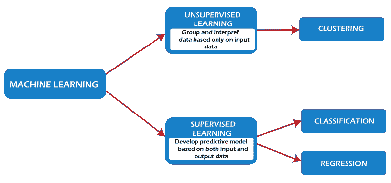
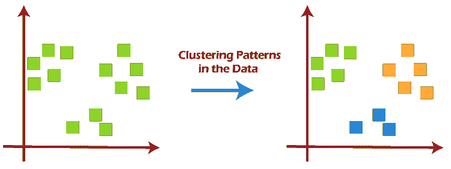
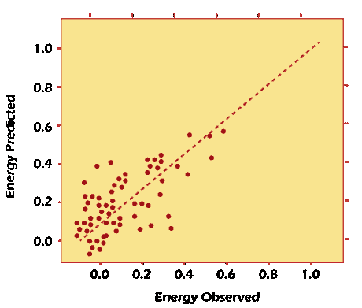
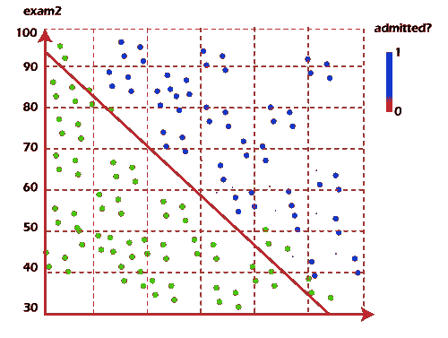
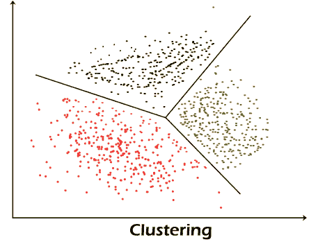
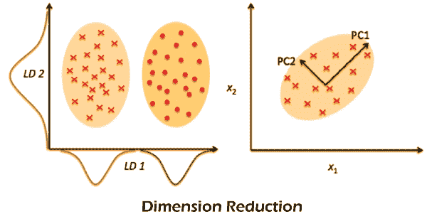
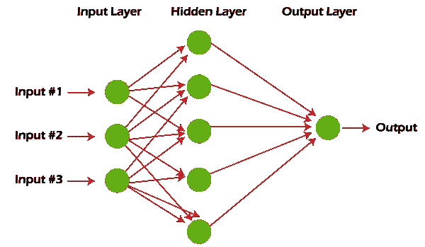
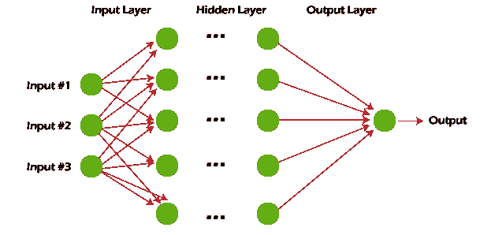
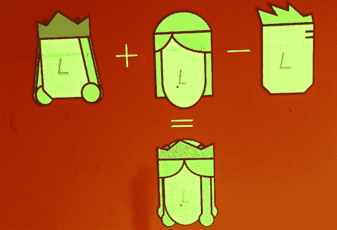

# 机器学习技术

> 原文：<https://www.javatpoint.com/machine-learning-techniques>

机器学习是一种数据分析技术，它教计算机做人类和动物天生就会做的事情:从经验中学习。机器学习算法使用计算方法直接从数据中“**”学习**”，而不依赖预定的方程作为模型。

随着可用于学习的样本数量的增加，算法会进行调整以提高性能。深度学习是机器学习的一种特殊形式。

## 机器学习是如何工作的？

机器学习使用两种技术:监督学习，它在已知的输入和输出数据上训练模型，以预测未来的输出；无监督学习，它使用输入数据中的隐藏模式或内部结构。

### 监督学习

有监督的机器学习创建了一个模型，该模型在存在不确定性的情况下基于证据进行预测。监督学习算法获取一组已知的输入数据和对数据的已知响应(**输出**)，并训练模型以生成对新数据响应的合理预测。如果你已经知道你试图估计的输出数据，使用监督学习。

监督学习使用分类和回归技术来开发机器学习模型。

分类模型对输入数据进行分类。分类技术预测离散响应**。比如**，邮件是真的，或者垃圾邮件，或者肿瘤是癌性的或者良性的。典型的应用包括医学成像、语音识别和信用评分。

如果您的数据可以标记、分类或分成特定的组或类，请使用分类法。例如，用于手写识别的**应用程序**使用分类来识别字母和数字。在图像处理和计算机视觉中，无监督模式识别技术被用于目标检测和图像分割。

执行分类的常见算法包括支持向量机(**SVM**s)**增强**和**袋装决策树、 *k* 最近邻、朴素贝叶斯、判别分析、逻辑回归**和**神经网络**。

回归技术预测连续响应 **-例如**，温度变化或电力需求波动。典型的应用包括电力负荷预测和算法交易。

如果您正在处理一个数据范围，或者您的响应的性质是一个实数，例如温度或直到一台设备出现故障的时间，请使用回归技术。

常见的回归算法包括**线性、非线性模型、正则化、逐步回归、增强和打包决策树、神经网络和自适应神经模糊学习**。

**使用监督学习预测心脏病发作**

医生想预测一年内是否有人会心脏病发作。他们有以前患者的数据，包括**年龄、体重、身高**和**血压**。他们知道以前的病人是否在一年内心脏病发作过。因此，问题是将现有的数据结合成一个模型，可以预测一个新的人是否会在一年内心脏病发作。

### 无监督学习

检测无监督学习数据中的隐藏模式或内部结构。它用于消除包含输入数据但没有标记响应的数据集。

聚类是一种常见的无监督学习技术。它用于探索性数据分析，以发现数据中隐藏的模式和集群。聚类分析的应用包括基因序列分析、市场研究和商品鉴定。

**例如**，如果一家手机公司想要优化他们建塔的位置，他们可以使用机器学习来预测他们的塔基于多少人。

一部手机一次只能与 1 个发射塔通话，因此该团队使用聚类算法来设计发射塔的良好布局，以优化他们的客户群或客户群的信号接收。

用于执行聚类的常见算法是 **k-means** 和 **k-medoids、分层聚类、高斯混合模型、隐马尔可夫模型、自组织映射、模糊 C-means 聚类和减法聚类。**

描述了十种方法，这是您可以用来提高机器学习知识和技能的基础:

*   **回归**
*   **分类**
*   **聚类**
*   **降维**
*   **集合方法**
*   **神经网络和深度学习**
*   **迁移学习**
*   **强化学习**
*   **自然语言处理**
*   **单词嵌入**

让我们区分机器学习的两个一般类别:有监督和无监督。当我们有一条我们想要预测或解释的数据时，我们应用**监督** **ML** 技术。我们使用先前的和输出的数据来预测基于新输入的输出。

例如，您可以使用有监督的 ML 技术来帮助想要估计下个月将注册该服务的新用户数量的服务企业。相比之下，**未经训练的 ML** 着眼于连接和分组数据点的方式，而不使用目标变量进行预测。

换句话说，它根据特征评估数据，并使用特征对彼此相似的对象进行分组。例如，您可以使用无监督学习技术来帮助想要细分具有相似特征的产品的零售商，而无需事先指定使用哪些特征。

### 1.回归

回归方法属于监督 ML 的范畴。它们有助于预测或解释基于先前数据的特定数值，例如基于类似房产的过去定价数据预测资产价格。

最简单的方法是线性回归，我们用直线的数学方程( **y = m * x + b** )对数据集进行建模。我们通过计算使所有数据点和直线之间的总距离最小化的直线的位置和斜率来训练具有多个数据对 **(x，y)** 的线性回归模型。换句话说，我们计算最接近数据中观测值的直线的斜率(M)和 y 截距(B)。

让我们考虑一个更具体的线性回归的例子。我曾经用线性回归的方法，通过把楼龄、楼层数、平方英尺数、插墙设备数汇总在一起，来预测一些建筑的能耗(以 **kW** 为单位)。

因为有多个输入(**年龄、平方英尺等。**)，我用了多变量线性回归。原理类似于**一对一**线性回归。不过，在这种情况下，我创建的“**线**”发生在多维空间，取决于变量的数量。

现在想象一下，你已经获得了一个建筑的特征(**年龄、平方英尺等)。**)，但你不知道能耗。在这种情况下，我们可以使用拟合线来估计特定建筑的能耗。下图显示了线性回归模型与建筑实际能耗的吻合程度。

请注意，您也可以使用线性回归来估计每个因素的权重，这些因素有助于最终预测能耗。例如，一旦你有了一个公式，你就可以确定年龄、体型或身高是最重要的。

***线性回归模型估算建筑能耗(kWh)。*T3】**

回归技术从简单(线性回归)到复杂(规则线性回归、多项式回归、决策树、随机森林回归和神经网络)无所不包。但是不要迷茫:从学习简单的线性回归开始，掌握技巧，继续前进。

### 2.分类

在另一类有监督的 ML 中，分类方法预测或解释类值。例如，它们可以帮助预测在线客户是否会购买产品。输出可以是或否:买方或无买方。但是分类的方法不限于两类。例如，分类方法可以帮助评估给定的图像是包含汽车还是卡车。最简单的分类算法是逻辑回归，听起来像回归方法，其实不是。逻辑回归基于一个或多个输入估计事件发生的概率。

例如，逻辑回归可以用一个学生的两个考试成绩来预测这个学生是否会被某所大学录取。因为猜测是概率，所以输出是 0 到 1 之间的数字，其中 1 代表绝对确定性。对于学生来说，如果预测概率大于 0.5，我们估计他们会被录取。如果预测概率小于 0.5，我们估计会被拒绝。

下图显示了往届学生的分数以及他们是否被录取。逻辑回归允许我们画一条代表决策边界的线。

因为逻辑回归是最简单的分类模型，所以它是分类的一个很好的起点。随着您的进步，您可以深入研究非线性分类器，例如决策树、随机森林、支持向量机和神经网络等。

### 3.使聚集

我们属于未受过聚类方法训练的 ML，因为它们旨在对具有相似特征的观察进行分组或分组。聚类方法不使用输出信息进行训练，而是让算法定义输出。在聚类方法中，我们只能使用可视化来观察解的质量。

最流行的聚类方法是 K-Means，其中“ **K** ”代表用户选择的聚类数。(请注意，有几种选择 K 值的技术，例如弯头方法。)

*   在数据中随机选择 K 个中心。
*   指定最接近随机生成的中心的每个数据点。

否则，我们返回步骤 2。(如果中心继续变化，为了防止以无限循环结束，请提前设置最大迭代次数。)

如果这些中心没有变化(或者变化很小)，这个过程就结束了。

下一个图将 K 均值应用于建筑物的数据集。这四项测量与空调、插入式电器(微波炉、冰箱等)有关。)，家用燃气，取暖用燃气。地块的每一列都代表了每一栋建筑的效率。

***线性回归模型估算建筑能耗(kWh)。*T3】**

回归技术从简单(线性)到复杂(规则线性、多项式、决策树、随机森林和神经网络)无所不包。但是不要迷茫:从学习简单的线性回归开始，掌握技巧，继续前进。

***将建筑物聚集成高效(绿色)和低效(红色)组。*T3】**

当您探索聚类时，您会遇到非常有用的算法，例如基于密度的噪声空间聚类(DBSCAN)、均值漂移聚类、凝聚层次聚类和使用高斯混合模型的期望最大化聚类等。

### 4.降维

我们使用降维来从数据集中移除最不重要的信息(有时是不必要的列)。例如，图像可能由数千个像素组成，这些像素对您的分析来说并不重要。或者，在制造过程中测试微芯片时，您可能会对每个芯片进行数千次测量和测试，其中许多测量和测试提供了冗余信息。在这些情况下，您需要一个降维算法来使数据集易于管理。

最流行的降维方法是主成分分析(PCA)，它通过寻找使数据的线性方差最大化的新向量来降低特征空间的维数。(您也可以衡量信息丢失的程度，并进行相应的调整。)当数据的线性相关性较强时，PCA 可以在不损失太多信息的情况下大幅降低数据的维数。

另一种流行的方法是 t-随机邻域嵌入(t-SNE)，它可以最小化非线性维数。人们通常使用 t-SNE 进行数据可视化，但您也可以将其用于机器学习任务，例如特征空间缩减和聚类等。

下一个图显示了对 MNIST 手写数字数据库的分析。MNIST 包含数以千计的数字 0 到 9 的图像，研究人员用这些图像来测试他们的聚类和分类算法。数据集的每一行都是原始图像的矢量版本(**大小 28 x 28 = 784** )和每个图像的标签(零、一、二、三、…、九)。因此，我们将维度从 784(像素)减少到 2(可视化中的维度)。投影到两个维度允许我们可视化更高维的原始数据集。

### 5.集成方法

想象一下，你已经决定制造一辆自行车，因为你对商店和网上提供的选择不满意。一旦你组装好这些优秀的零件，最终的自行车将比所有其他选择都耐用。

每个模型都使用相同的思想来组合多个预测模型(监督 ML)，以获得比模型更高质量的预测。

例如，随机**森林算法**是一种集成方法，它结合了用来自数据集的不同样本训练的多个决策树。结果，随机森林的预测质量超过了用单一决策树预测的预测质量。

想办法减少单个机器学习模型的方差和偏差。通过结合这两个模型，预测的质量变得平衡。使用另一个模型，相对精度可能会相反。这很重要，因为任何给定的模型在某些条件下可能是准确的，但在其他条件下可能是不准确的。

**卡格尔**比赛的大部分状元都使用了一些穿衣方法。最流行的集成算法是**随机森林、XGBoost** 和 **LightGBM** 。

### 6.神经网络和深度学习

与被认为是线性模型的线性和逻辑回归不同，神经网络旨在通过向模型添加参数层来捕获数据中的非线性模式。简单的神经网络有三个输入，如下图所示，一个包含五个参数的隐藏层和一个输出层。

***具有隐藏层的神经网络。*T3】**

神经网络结构足够灵活，可以构建我们著名的线性和逻辑回归。术语“深度学习”来自一个具有许多隐藏层的神经网络，并包含各种架构。

随着研究和行业团体加倍他们的深度学习努力，每天产生全新的方法，在深度学习中跟上发展尤其困难。

***深度学习:具有多个隐藏层的神经网络。*T3】**

深度学习技术需要大量数据和计算能力才能获得最佳性能，因为这种方法可以在庞大的体系结构中自调整许多参数。很快就明白了为什么深度学习实践者需要具有图形处理器的强大计算机。

特别是，深度学习技术在视觉(图像分类)、文本、音频和视频方面非常成功。最常见的深度学习软件包是 Tensorflow 和 PyTorch。

### 7.迁移学习

假设你是一名在零售业工作的数据科学家。你花了几个月的时间训练一个高质量的模型，将图像分为衬衫、t 恤和 polos。你的新任务是创建一个类似的模型来分类服装图像，如牛仔裤，货物，休闲和礼服裤。

迁移学习指的是重用已经训练好的神经网络的一部分，并使其适应新的但相似的任务。具体来说，一旦您使用任务的数据训练了神经网络，您就可以移动一部分训练好的层，并将它们与一些可用于新任务的新层结合起来。新的神经网络可以通过增加几层来快速学习和适应新的任务。

转移学习的优势在于，你需要更少的数据来训练神经网络，这一点尤其重要，因为就时间和金钱而言，深度学习算法的训练都很昂贵。

转移学习的主要优点是，你需要更少的数据来训练神经网络，这一点尤其重要，因为深度学习算法的训练在时间和金钱(计算资源)方面都很昂贵。当然，要找到足够的标注数据进行训练并不容易。

让我们回到你的例子，假设你使用一个有 20 个隐藏层的神经网络作为衬衫模型。在运行了一些实验之后，您意识到您可以移动衬衫模型的 18 层，并将它们与新的参数层结合起来，在裤子图像上进行训练。

所以裤子模型将有 19 个隐藏层。这两个功能的输入和输出是不同的，但是可重用层可以总结与这两者相关的信息，例如，结构方面。

迁移学习变得越来越流行，现在有许多具体的预训练模型可用于常见的深度学习任务，如图像和文本分类。

### 8.强化学习

想象一只老鼠在迷宫中试图寻找隐藏的奶酪碎片。起初，老鼠可能会随机移动，但过了一会儿，老鼠的感觉有助于感知哪些动作使它更接近奶酪。我们把老鼠暴露在迷宫中的次数越多，就越能找到奶酪。

老鼠的过程是指我们用强化学习来训练一个系统或游戏。一般来说，RL 是一种帮助代理从经验中学习的机器学习方法。

RL 可以通过记录行动并在设定的环境中使用试错法来最大化累积奖励。在我们的例子中，鼠标是代理，迷宫是环境。鼠标的一组可能动作是:向前、向后、向左或向右移动。奖励是奶酪。

当你很少或没有关于问题的历史数据时，你可以使用 RL，因为它不需要先验信息(不像传统的机器学习方法)。在 RL 框架中，您可以边走边从数据中学习。毫不奇怪，RL 在游戏方面特别成功，尤其是像象棋和围棋这样“信息正确”的游戏。有了游戏，来自代理和环境的反馈会很快到来，让模型学习得更快。RL 的缺点是，如果问题很复杂，可能需要很长时间来训练。

随着 IBM 的深蓝在 1997 年击败了最佳人类棋手，基于 RL 的算法 AlphaGo 在 2016 年击败了最佳围棋手。RL 目前的先行者是英国的 DeepMind 团队。

2019 年 4 月，OpenAI Five 战队是第一个击败电竞 Dota 2 世界冠军战队的 AI，这是一款非常复杂的电竞游戏，OpenAI Five 战队之所以选择它，是因为没有 RL 算法能够打赢它。你可以看出强化学习是一种特别强大的人工智能形式，我们当然希望看到这些团队取得更多进展。不过，也值得记住这种方法的局限性。

### 9.自然语言处理

世界上很大一部分数据和知识是以某种人类语言的形式存在的。例如，我们可以训练我们的手机自动完成我们的短信或纠正拼写错误的单词。我们也可以教机器与人类进行简单的对话。

自然语言处理不是一种机器学习方法，而是一种广泛使用的为机器学习准备文本的技术。想想许多不同格式的文本文档(Word、在线博客)。这些文本文档中的大多数都将充满错别字、缺失字符和其他需要过滤掉的单词。目前，最受欢迎的文本处理软件包是自然语言工具包，由斯坦福的研究人员创建。

将文本映射到数字表示的最简单方法是计算每个文本文档中每个单词的出现频率。想象一个整数矩阵，其中每行代表一个文本文档，每列代表一个单词。术语频率的矩阵表示通常被称为术语频率矩阵(TFM)。我们可以通过将矩阵中的每个条目除以每个单词在整个文档语料库中的重要性权重，来创建一个更流行的文本文档矩阵表示。我们称这种方法为术语频率逆文档频率(TFIDF)，它通常更适合机器学习任务。

### 10.单词嵌入

TFM 和 TFIDF 是文本文档的数字表示，只考虑频率和加权频率来表示文本文档。相比之下，单词嵌入可以捕获文档中单词的上下文。与单词上下文一样，嵌入可以测量单词之间的相似性，允许我们对单词进行算术运算。

Word2Vec 是一种基于神经网络的方法，它将语料库中的单词映射到数字向量。然后，我们可以使用这些向量来查找同义词，对单词执行算术运算，或者表示文本文档(通过取文档中所有单词向量的平均值)。例如，我们使用足够大的文本文档语料库来估计单词嵌入。

假设向量(“单词”)是代表单词“单词”的数字向量。为了近似向量('女性')，我们可以对向量执行算术运算:

***矢('王')+矢('女')-矢('男')~矢('皇后')***

***嵌入单词(向量)的算术。*T3】**

单词表示允许通过计算两个单词的向量表示之间的余弦相似性来找到单词之间的相似性。余弦相似性度量两个向量之间的角度。

我们使用机器学习方法来计算单词嵌入，但这通常是在顶部实现机器学习算法的前期阶段。例如，假设我们可以访问几千名推特用户的推文。我们也假设我们知道哪些推特用户买了房子。为了估计新的推特用户购买房屋的概率，我们可以将 Word2Vec 与逻辑回归相结合。

你可以自己训练单词嵌入，或者得到一组预先训练好的单词向量(迁移学习)。要下载 157 种不同语言的预训练单词向量，请查看快速文本。

## 摘要

深入研究这些方法，充分了解每种方法的基础知识，可以作为进一步研究更高级算法和方法的坚实起点。

没有最好的方法或一刀切。找到正确的算法在一定程度上只是试错——即使是经验丰富的数据科学家也无法在不尝试的情况下判断一个算法是否可行。但是算法的选择也取决于你正在处理的数据的大小和类型，你想从数据中获得的见解，以及这些见解将如何被使用。

* * *