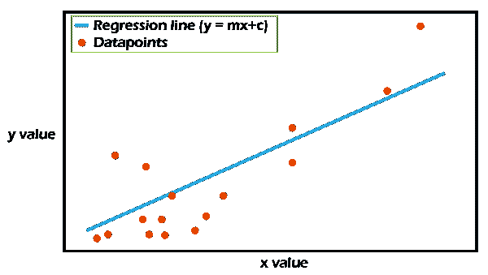
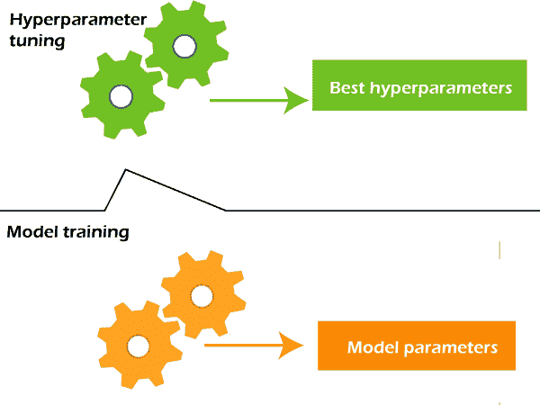

# 模型参数和超参数的区别

> 原文：<https://www.javatpoint.com/model-parameter-vs-hyperparameter>

对于机器学习初学者来说，可能会有很多术语看起来令人困惑，为了精通这个领域，清除这种困惑是很重要的。例如，“模型参数”和“超参数”。对于初学者来说，对这两个术语没有清晰的理解是一个常见的问题。因此，为了消除这种混淆，让我们理解参数和超参数之间的区别，以及它们如何相互关联。


## 什么是模型参数？

**模型参数是模型内部的配置变量，模型自己学习。**例如，线性回归模型中自变量的权重或系数。独立变量 SVM 的权重或系数，神经网络的权重和偏差，聚类中的聚类质心。

我们可以使用下图了解模型参数:



上图显示了简单线性回归的模型表示。这里，x 是自变量，y 是因变量，目标是拟合给定数据的最佳回归线，以定义 x 和 y 之间的关系。回归线可以由以下等式给出:

```

y= mx+c

```

其中 **m** 为线路的**坡度， **c** 为线路**的**截距。这两个参数是通过最小化 RMSE 拟合直线来计算的，它们被称为模型参数。**

模型参数的一些要点如下:

*   模型用它们来做预测。
*   模型从数据本身中学习它们
*   这些通常不是手动设置的。
*   这些是模型的一部分，也是机器学习算法的关键。

## 什么是模型超参数？

**超参数是那些由用户明确定义以控制学习过程的参数。**

*   这些通常由机器学习工程师手动定义。
*   人们无法知道给定问题的超参数的确切最佳值。最佳值可以通过经验法则或反复试验来确定。



超参数的一些例子有**训练神经网络的学习率，KNN 算法中的 K**等。

## 参数与超参数对照表

| 因素 | 超参数 |
| 参数是配置模型，它在模型内部。 | 超参数是控制训练过程的明确指定的参数。 |
| 参数对于做出预测至关重要。 | 超参数对于优化模型至关重要。 |
| 这些是在训练模型时指定或估计的。 | 这些都是在模型训练开始前设定的。 |
| 它在模型内部。 | 这些都是模型外部的。 |
| 这些都是模型自己学习和设定的。 | 这些由机器学习工程师/从业者手动设置。 |
| 这些取决于用于训练的数据集。 | 这些独立于数据集。 |
| 参数的值可以通过优化算法来估计，例如梯度下降。 | 超参数的值可以通过超参数调整来估计。 |
| 训练后估计的最终参数决定了模型在未知数据上的性能。 | 选定或微调的超参数决定了模型的质量。 |
| 模型参数的一些例子是ANN中的权重、SVM 支持向量、线性回归或逻辑回归中的系数。 | 模型超参数的一些例子是用于训练神经网络的学习速率、KNN 算法中的 K 等。 |

## 结论

在本文中，我们已经了解了模型参数是超参数的明确定义以及它们之间的区别。简而言之，模型参数在模型内部，并根据数据自动估计，而超参数是手动设置的，用于优化模型并帮助估计模型参数。

* * *