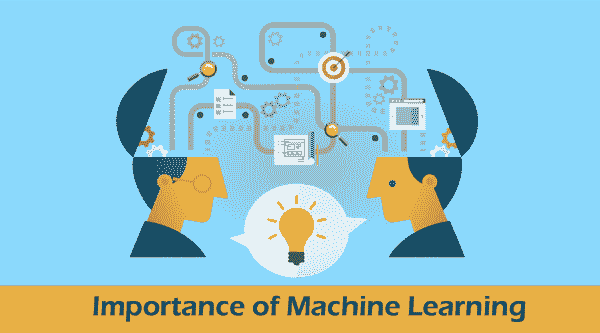

# 机器学习的重要性

> 原文：<https://www.javatpoint.com/importance-of-machine-learning>

机器学习是人工智能最受欢迎的子领域之一。机器学习概念几乎无处不在，如医疗保健、金融、基础设施、营销、自动驾驶汽车、推荐系统、聊天机器人、社交网站、游戏、网络安全等。

目前，机器学习正处于发展阶段，许多新技术正在不断被添加到机器学习中。它在很多方面帮助我们，比如分析大块数据、数据提取、解释等等。因此，机器学习有无限多的用途。在这个主题中，我们将通过例子讨论机器学习的各种重要性。因此，让我们从机器学习的快速介绍开始。

## 什么是机器学习？

机器学习是人工智能的一个分支，它允许机器自动从经验中学习和改进。它被定义为不需要明确编程就能让计算机学习的研究领域。它与传统编程有很大不同。

## 机器学习是如何工作的？

机器学习是人工智能的核心形式，它使机器能够从过去的数据中学习并做出预测

它涉及数据探索和模式匹配，只需最少的人工干预。机器学习过去主要使用四种技术:

### 1.监督学习:

监督学习是一种需要监督的机器学习方法，类似于师生关系。在监督学习中，机器用标记良好的数据进行训练，这意味着一些数据已经用正确的输出进行了标记。因此，每当新数据被引入系统时，监督学习算法都会分析这些样本数据，并在标记数据的帮助下预测正确的输出。

它分为两种不同的算法。这些措施如下:

*   **分类:**以黄色、蓝色、对错等类别形式输出时进行交易。
*   **回归:**处理输出变量为真实值时，如年龄、身高等。

这项技术允许我们从经验中收集或产生数据输出。它的工作方式与人类使用训练集的一些标记数据点进行学习的方式相同。它有助于利用经验优化模型的性能，并解决各种复杂的计算问题。

### 2.无监督学习:

与监督学习不同，无监督学习不需要分类或标记良好的数据来训练机器。它旨在根据一些模式和差异，甚至在没有任何标记的训练数据的情况下，将未分类的信息分组。在无监督学习中，没有提供监督，因此没有给机器样本数据。因此，机器只能自己在未标记的数据中寻找隐藏的结构。

它分为两种不同的算法。这些措施如下:

*   **聚类:**它处理训练数据中有内在分组要求的情况，例如按学生感兴趣的领域分组。
*   **关联:**它处理的是有助于识别大部分数据的规则，比如对 ML 感兴趣，也对 AI 感兴趣的学生。

### 3.半监督学习:

半监督学习被定义为监督和非监督学习方法的结合。它被用来克服监督和非监督学习方法的缺点。

在半监督学习方法中，机器使用有标签和无标签的数据进行训练。虽然，它涉及几个有标签的例子和大量无标签的例子。

语音分析、网页内容分类、蛋白质序列分类和文本文档分类器是半监督学习在现实世界中最受欢迎的应用。

### 4.强化学习:

强化学习被定义为一种不需要标记数据的基于反馈的机器学习方法。在这种学习方法中，代理通过执行操作和查看操作结果来学习在环境中的行为。代理可以为每个好的行为提供正反馈，为坏的行为提供负反馈。因为在强化学习中，没有训练数据，因此代理被限制只能用他们的经验学习。

## 机器学习的重要性

尽管机器学习随着如此多的新技术不断发展，但它仍然被用于各个行业。

***机器学习之所以重要，是因为它可以让企业看到客户行为和运营业务模式的趋势，以及支持新产品的开发。*** 如今的许多领先公司，如**脸书、谷歌、**和**优步**，都将机器学习作为其运营的核心部分。机器学习已经成为许多公司的重要竞争优势。

机器学习有几个实际应用，可以推动真正的业务成果，如节省时间和金钱，有可能极大地影响您组织的未来。特别是，我们看到客户服务行业正在产生巨大的影响，机器学习使人们能够更快、更有效地完成工作。通过虚拟助理解决方案，机器学习可以自动执行原本需要由实时代理执行的任务，例如更改密码或检查帐户余额。这释放了宝贵的代理时间，可以用来专注于人类表现最好的那种客户关怀:高接触度、复杂的决策，这些决策不像机器那样容易处理。在 Interactions，我们通过消除请求应该发送给人还是机器的决定来进一步改进流程:独特的自适应理解技术，机器学会意识到它的局限性，当它对提供正确的解决方案缺乏信心时，它会救助人类。

## 机器学习技术的用例

机器学习在每个行业都有广泛的应用，尤其是涉及收集、分析和响应大数据集的应用。机器学习的重要性可以通过这些重要的应用来理解。

机器学习被广泛应用的一些重要应用如下:

1.  **医疗保健:**机器学习广泛应用于医疗保健行业。它帮助医疗保健研究人员分析数据点并提出结果。自然语言处理有助于为患者提供更好的结果的准确见解。此外，机器学习通过从 x 光、超声波、计算机断层扫描等方面分析关于患者状况的外部数据，改进了治疗方法。自然语言处理、医学成像和遗传信息是机器学习的关键领域，可以改善医疗保健领域的诊断、检测和预测系统。
2.  **自动化:**这是机器学习的重要应用之一，有助于使系统自动化。它帮助机器在没有人工干预的情况下执行重复的任务。作为一名机器学习工程师和数据科学家，你有责任多次解决任何给定的任务而不出错。然而，这对人类来说实际上是不可能的。因此，机器学习已经开发了各种模型来自动化该过程，具有在更短的时间内执行迭代任务的能力。
3.  **银行和金融:**机器学习是 AI 的一个子集，它使用统计模型来做出准确的预测。在银行和金融领域，机器学习在许多方面提供了帮助，例如欺诈检测、投资组合管理、风险管理、聊天机器人、文档分析、高频交易、抵押贷款承销、反洗钱检测、异常检测、风险信用评分检测、KYC 处理等。因此，机器学习被广泛应用于银行和金融领域，以减少错误和时间。
4.  **交通和交通预测:**这是机器学习最常见的应用之一，被所有个人在日常生活中广泛使用。它有助于确保高度安全的路线、生成准确的 eta、预测车辆故障、驾驶规范分析等。虽然机器学习已经解决了交通问题，但还需要更多的改进。统计机器学习算法有助于构建智能交通系统。此外，深度学习探索了道路、高速公路、交通、环境因素、碰撞等复杂的相互作用。因此，机器学习技术改善了日常交通管理，并收集了交通数据来预测路线和交通的见解。
5.  **图像识别:**它是机器学习最常见的应用之一，用于检测互联网上的图像。此外，各种社交媒体网站，如脸书，使用图像识别为您的脸书朋友标记图像，其功能名为自动朋友标记建议。
    此外，如今，几乎所有的移动设备都配备了令人兴奋的人脸检测功能。使用此功能，您可以通过面部解锁来保护您的移动数据，因此，如果有人试图访问您的移动设备，没有面部识别，他们将无法打开。
6.  **语音识别:**语音识别是机器学习应用最大的成果之一。它使用户能够在不写文本的情况下搜索内容，换句话说，就是“通过语音搜索”。它可以在 YouTube、谷歌、亚马逊等上搜索内容/产品。用你的声音搭建平台。这项技术被称为语音识别。
    是将语音指令转换为文字的过程；因此，它也被称为“语音转文本”或“计算机语音识别”。语音识别的一些重要例子有**谷歌助手、Siri、Cortana、Alexa** 等。
7.  **产品推荐:**帮助 Flipkart、亚马逊、网飞等各种电商、娱乐公司，是机器学习取得的最大成就之一。在互联网上为他们的产品做数字广告。当任何人搜索任何产品时，他们会在同一浏览器上上网时开始获得同一产品的广告。
    这可以通过机器学习算法来实现，该算法根据用户的兴趣或过去的经验工作，并相应地为产品推荐它们。例如，当我们在亚马逊平台上搜索一台笔记本电脑时，它也是从许多具有相同类别和标准的其他笔记本电脑开始的。同样，当我们使用网飞时，我们会发现一些娱乐系列、电影等的推荐。因此，这也可以通过机器学习算法来实现。
8.  **虚拟个人辅助:**这个功能可以在很多方面帮助我们，比如使用语音指令搜索内容、使用语音拨打号码、在手机中搜索联系人、播放音乐、打开电子邮件、安排约会等。现在有一天，你们都看到了像“**阿列克谢！播放音乐**“这也是在机器学习的帮助下完成的。谷歌助手、Alexa、Cortana、Siri 等。，是机器学习的几个常见应用。这些虚拟个人助理记录我们的语音指令，将它们发送到云上的服务器，使用最大似然算法解码并相应地采取行动。
9.  **邮件垃圾邮件和恶意软件检测&过滤:**机器学习还可以帮助我们过滤垃圾邮件、重要邮件、一般邮件等不同类别的邮件。通过这种方式，用户可以轻松识别电子邮件是有用的还是垃圾邮件。这也可以通过机器学习算法来实现，例如**多层感知器、决策树、**和**朴素贝叶斯分类器**。内容过滤器、标题过滤器、基于规则的过滤器、权限过滤器、通用黑名单过滤器等。，是谷歌使用的一些重要垃圾邮件过滤器。
10.  **自动驾驶汽车:**这是机器学习最令人兴奋的应用之一。机器学习在自动驾驶汽车的制造中起着至关重要的作用。它使用无监督的学习方法来训练汽车模型，以便在驾驶时检测人和物体。塔塔和特斯拉是最受欢迎的自动驾驶汽车制造公司。因此，这是一场技术时代的大革命，也是在机器学习的帮助下完成的。
11.  **信用卡诈骗检测:**信用卡诈骗已经成为网络黑客非常容易攻击的目标。随着在线/数字支付文化的增长，信用卡/借记卡的风险也在平行增加。机器学习还帮助开发人员检测和分析在线交易中的欺诈。提出了一种新的流式交易数据欺诈检测方法，目的是分析客户过去的交易细节并提取行为模式。此外，持卡人根据他们的交易金额被分成不同的类别，从而可以分别提取这些群体的行为模式。因此，信用卡欺诈检测是一种利用机器学习的聚合策略和反馈机制的新方法。
12.  **股票营销和交易:**机器学习在股票营销和交易领域也有帮助，它使用历史趋势或过去的经验来预测市场风险。由于股票营销是营销风险的另一个名称，机器学习在一定程度上降低了它，并根据营销风险预测数据。机器学习的**长短期神经记忆网络**用于预测股市趋势。
13.  **语言翻译:**机器学习在语言翻译中的运用可见一斑。它使用序列到序列的学习算法将一种语言翻译成另一种语言。此外，它还使用图像识别技术将文本从一种语言识别为另一种语言。同样，谷歌的 GNMT(Google Neural Machine Translation)提供了这个功能，这是一种将文本翻译成我们熟悉的语言的神经机器学习，它被称为自动翻译。

### 结论:

机器学习直接或间接地参与了我们的日常工作。我们已经看到了各种机器学习应用程序，它们对于在这个技术世界中生存非常有用。虽然机器学习正处于发展阶段，但它正在不断快速发展。机器学习最大的优点是它的高价值预测，可以在没有人工干预的情况下实时指导更好的决策和明智的行动。因此，在本文的最后，我们可以说机器学习领域非常广阔，其重要性不限于特定的行业或部门；它适用于分析或预测未来事件的任何地方。

* * *