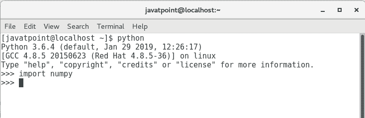

# NumPy环境设置

> 原文：<https://www.javatpoint.com/numpy-environment-setup>

NumPy 没有与 Python 捆绑在一起。我们必须使用 python pip 安装程序来安装它。执行以下命令。

```

$ pip install numpy 

```

最佳做法是使用完整的 SciPy 堆栈安装 NumPy。SciPy 堆栈的二进制分布特定于操作系统。

## Windows 操作系统

在 Windows 操作系统上，SciPy 堆栈由 Anaconda 提供，它是 Python SciPy 包的免费发行版。

可以从官方网站下载:https://www.anaconda.com/.它也适用于 Linux 和 Mac。

comes 还提供完整的 SciPy 堆栈，该堆栈可以免费获得，也可以获得商业许可。我们可以通过以下链接下载:https://www.enthought.com/products/canopy/

Python (x，y)也可以通过完整的 SciPy 发行版免费获得。请访问以下链接下载:https://python-xy.github.io/

## Linux 操作系统

在 Linux 中，不同的包管理器用于安装 SciPy 堆栈。包管理器特定于不同的 Linux 发行版。让我们看看他们每个人。

## 人的本质

在终端上执行以下命令。

```

$ sudo apt-get install python-numpy

$ python-scipy python-matplotlibipythonipythonnotebook python-pandas

$ python-sympy python-nose

```

## 美国红帽子的公司出品的计算机操作系统

在 Redhat 上，执行以下命令来安装 Python SciPy 包堆栈。

```

$ sudo yum install numpyscipy python-matplotlibipython 

$ python-pandas sympy python-nose atlas-devel 

```

要验证安装，通过在终端上执行 python 命令打开 Python 提示符(windows 情况下为 cmd)，并尝试导入模块 NumPy，如下图所示。如果它没有给出错误，那么它就安装成功了。



* * *