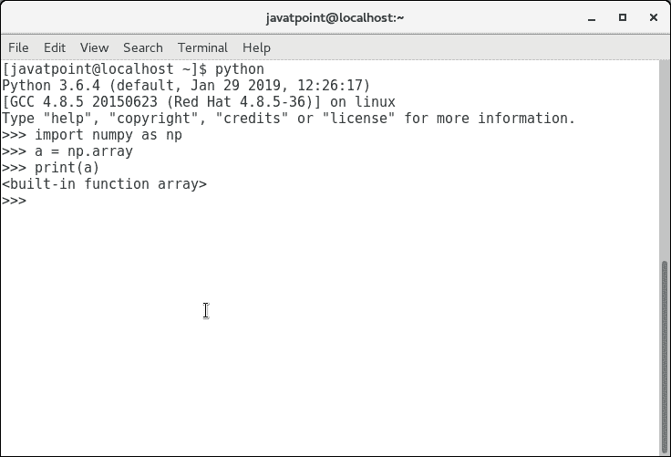
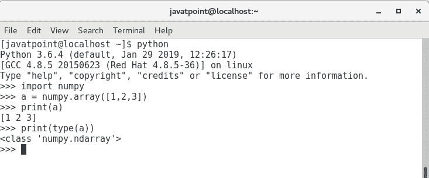
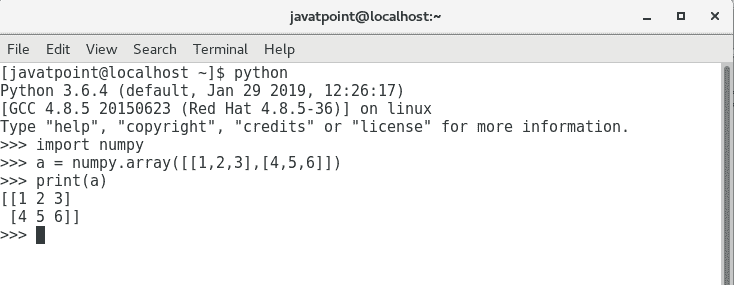
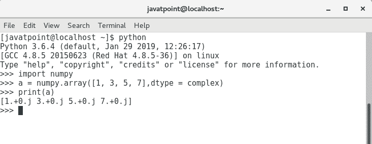
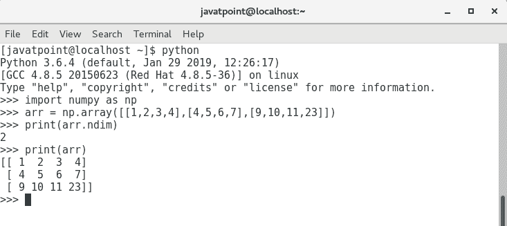

# numpy ndarray

> 哎哎哎:# t0]https://www . javatppoint . com/num py-ndaarray

Ndarray 是 numpy 中定义的 n 维数组对象，它存储相似类型元素的集合。换句话说，我们可以将一个数组定义为数据类型(dtype)对象的集合。

可以通过使用基于 0 的索引来访问 ndarray 对象。数组对象的每个元素在内存中都包含相同的大小。

## 创建一个数组对象

ndarray 对象可以通过使用 numpy 模块的数组例程来创建。为此，我们需要导入 numpy。

```

>>> a = numpy.array

```

请看下图。



我们还可以将集合对象传递到数组例程中，以创建等效的 n 维数组。语法如下。

```

>>> numpy.array(object, dtype = None, copy = True, order = None, subok = False, ndmin = 0)

```

下表描述了这些参数。

| 塞内加尔 | 参数 | 描述 |
| one | 目标 | 它表示集合对象。它可以是列表、元组、字典、集合等。 |
| Two | 类型 | 我们可以通过将此选项更改为指定类型来更改数组元素的数据类型。默认值为无。 |
| three | 复制 | 它是可选的。默认情况下，它是真的，这意味着对象被复制。 |
| four | 命令 | 该选项可以分配 3 个可能的值。它可以是 C(列顺序)、R(行顺序)或 A(任意) |
| five | 苏博克 | 默认情况下，返回的数组将是基类数组。我们可以通过将该选项设置为 true 来改变这一点，使子类通过。 |
| six | 管理 | 它表示结果数组的最小维数。 |

要使用列表创建数组，请使用以下语法。

```

>>> a = numpy.array([1, 2, 3])

```



要创建多维数组对象，请使用以下语法。

```

>>> a = numpy.array([[1, 2, 3], [4, 5, 6]])

```



要更改数组元素的数据类型，请在集合中同时提到数据类型的名称。

```

>>> a = numpy.array([1, 3, 5, 7], complex)

```



## 寻找数组的维数

**ndim** 函数可以用来求数组的维数。

```

>>> import numpy as np
>>> arr = np.array([[1, 2, 3, 4], [4, 5, 6, 7], [9, 10, 11, 23]])

>>> print(arr.ndim)

```



## 找到每个数组元素的大小

itemsize 函数用于获取每个数组项的大小。它返回每个数组元素占用的字节数。

考虑下面的例子。

### 例子

```

#finding the size of each item in the array
import numpy as np
a = np.array([[1,2,3]])
print("Each item contains",a.itemsize,"bytes")

```

**输出:**

```
Each item contains 8 bytes.

```

## 查找每个数组项的数据类型

为了检查每个数组项的数据类型，使用了 dtype 函数。考虑以下示例来检查数组项的数据类型。

### 例子

```

#finding the data type of each array item
import numpy as np
a = np.array([[1,2,3]])
print("Each item is of the type",a.dtype)

```

**输出:**

```
Each item is of the type int64

```

## 找到数组的形状和大小

为了获得数组的形状和大小，使用了与 numpy 数组相关联的大小和形状函数。

考虑下面的例子。

### 例子

```

import numpy as np
a = np.array([[1,2,3,4,5,6,7]])
print("Array Size:",a.size)
print("Shape:",a.shape)

```

**输出:**

```
Array Size: 7
Shape: (1, 7)

```

## 重塑数组对象

通过数组的形状，我们意味着多维数组的行数和列数。然而，numpy 模块为我们提供了通过改变多维数组的行数和列数来重塑数组的方法。

与 ndarray 对象相关联的整形()函数用于对数组进行整形。它接受指示数组新形状的行和列的两个参数。

让我们重塑下图中给出的数组。


### 例子

```

import numpy as np
a = np.array([[1,2],[3,4],[5,6]])
print("printing the original array..")
print(a)
a=a.reshape(2,3)
print("printing the reshaped array..")
print(a)

```

**输出:**

```
printing the original array..
[[1 2]
 [3 4]
 [5 6]]
printing the reshaped array..
[[1 2 3]
 [4 5 6]]

```

## 数组中的切片

在 NumPy 数组中切片是从数组中提取一系列元素的方法。数组切片的执行方式与 python 列表相同。

考虑以下示例来打印数组的特定元素。

### 例子

```

import numpy as np
a = np.array([[1,2],[3,4],[5,6]])
print(a[0,1])
print(a[2,0])

```

**输出:**

```
2
5

```

上面的程序从数组的第 0 个<sup>索引打印第 2 个<sup>第</sup>元素，从第 2 个<sup>第</sup>索引打印第 0 个<sup>元素。</sup></sup>

## 林空间

linspace()函数返回给定时间间隔内均匀分布的值。以下示例返回给定间隔 5-15 内 10 个均匀分隔的值

### 例子

```

import numpy as np
a=np.linspace(5,15,10) #prints 10 values which are evenly spaced over the given interval 5-15
print(a)

```

**输出:**

```
[ 5\.          6.11111111  7.22222222  8.33333333  9.44444444 10.55555556
 11.66666667 12.77777778 13.88888889 15\.        ]

```

## 求数组元素的最大值、最小值和和

NumPy 提供了 max()、min()和 sum()函数，分别用于查找数组元素的最大值、最小值和和。

考虑下面的例子。

### 例子

```

import numpy as np
a = np.array([1,2,3,10,15,4])
print("The array:",a)
print("The maximum element:",a.max())
print("The minimum element:",a.min())
print("The sum of the elements:",a.sum())

```

**输出:**

```
The array: [ 1  2  3 10 15  4]
The maximum element: 15
The minimum element: 1
The sum of the elements: 35

```

## 数字阵列轴

NumPy 多维数组由轴表示，其中轴-0 表示列，轴-1 表示行。我们可以提到轴来执行行级或列级计算，如添加行或列元素。


要计算每列中的最大元素、每行中的最小元素以及所有行元素的相加，请考虑以下示例。

### 例子

```

import numpy as np
a = np.array([[1,2,30],[10,15,4]])
print("The array:",a)
print("The maximum elements of columns:",a.max(axis = 0)) 
print("The minimum element of rows",a.min(axis = 1))
print("The sum of all rows",a.sum(axis = 1))

```

**输出:**

```
The array: [[1  2  30]
		   [10  15  4]]
The maximum elements of columns: [10 15 30]
The minimum element of rows [1 4]
The sum of all rows [33 29]

```

## 求平方根和标准差

与 numpy 数组相关联的 sqrt()和 std()函数分别用于求数组元素的平方根和标准差。

标准差意味着数组的每个元素与 numpy 数组的平均值有多大的差异。

考虑下面的例子。

### 例子

```

import numpy as np
a = np.array([[1,2,30],[10,15,4]])
print(np.sqrt(a))
print(np.std(a))

```

**输出:**

```
[[1\.         1.41421356 5.47722558]
 [3.16227766 3.87298335 2\.        ]]
10.044346115546242

```

## 数组上的算术运算

numpy 模块允许我们直接对多维数组执行算术运算。

在下面的示例中，对两个多维数组 a 和 b 执行算术运算。

### 例子

```

import numpy as np
a = np.array([[1,2,30],[10,15,4]])
b = np.array([[1,2,3],[12, 19, 29]])
print("Sum of array a and b\n",a+b)
print("Product of array a and b\n",a*b)
print("Division of array a and b\n",a/b)

```

## 数组连接

numpy 为我们提供了垂直堆叠和水平堆叠，允许我们垂直或水平连接两个多维数组。

考虑下面的例子。

### 例子

```

import numpy as np
a = np.array([[1,2,30],[10,15,4]])
b = np.array([[1,2,3],[12, 19, 29]])
print("Arrays vertically concatenated\n",np.vstack((a,b)));
print("Arrays horizontally concatenated\n",np.hstack((a,b)))

```

**输出:**

```
Arrays vertically concatenated
 [[ 1  2 30]
 [10 15  4]
 [ 1  2  3]
 [12 19 29]]
Arrays horizontally concatenated
 [[ 1  2 30  1  2  3]
 [10 15  4 12 19 29]]

```

* * *