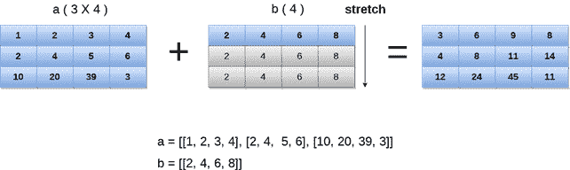

# 数字广播

> 原文：<https://www.javatpoint.com/numpy-broadcasting>

在数学运算中，我们可能需要考虑不同形状的数组。当涉及不同形状的数组时，NumPy 可以执行这样的操作。

例如，如果我们考虑矩阵乘法运算，如果两个矩阵的形状相同，那么这个运算将很容易执行。然而，如果形状不相似，我们可能还需要操作。

考虑下面的例子将两个数组相乘。

### 例子

```

import numpy as np
a = np.array([1,2,3,4,5,6,7])
b = np.array([2,4,6,8,10,12,14])
c = a*b;
print(c)

```

**输出:**

```
[ 2  8 18 32 50 72 98]

```

然而，在上面的例子中，如果我们考虑不同形状的数组，我们将得到如下所示的错误。

### 例子

```

import numpy as np
a = np.array([1,2,3,4,5,6,7])
b = np.array([2,4,6,8,10,12,14,19])
c = a*b;
print(c)

```

**输出:**

```
ValueError: operands could not be broadcast together with shapes (7,) (8,) 

```

在上面的例子中，我们可以看到两个数组的形状不相似，因此它们不能相乘。NumPy 可以通过使用广播的概念来执行这样的操作。

在广播中，较小的阵列被广播到较大的阵列，以使它们的形状相互兼容。

## 广播规则

如果满足以下情况，广播是可能的。

1.  较小维度的数组可以在其形状中附加“1”。
2.  每个输出维度的大小是该维度中输入大小的最大值。
3.  如果输入在特定维度中的大小与输出大小匹配，或者其值正好为 1，则可以在计算中使用输入。
4.  如果输入大小为 1，则第一个数据条目用于沿维度的计算。

如果满足以下规则，广播可以应用于阵列。

1.  所有的输入数组都有相同的形状。
2.  数组具有相同的维数，每个维数的长度要么是一个公共长度，要么是 1。
3.  维数较少的数组可以在其形状中附加“1”。

让我们看一个广播的例子。

### 例子

```

import numpy as np
a = np.array([[1,2,3,4],[2,4,5,6],[10,20,39,3]])
b = np.array([2,4,6,8])
print("\nprinting array a..")
print(a)
print("\nprinting array b..")
print(b)
print("\nAdding arrays a and b ..")
c = a + b;
print(c)

```

**输出:**

```
printing array a..
[[ 1  2  3  4]
 [ 2  4  5  6]
 [10 20 39  3]]

printing array b..
[2 4 6 8]

Adding arrays a and b ..
[[ 3  6  9 12]
 [ 4  8 11 14]
 [12 24 45 11]]

```



* * *