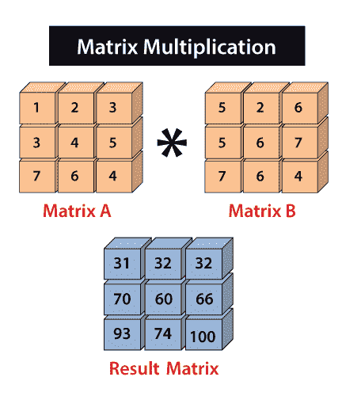

# Python 中的数字矩阵乘法

> 原文：<https://www.javatpoint.com/numpy-matrix-multiplication>

矩阵乘法是以两个矩阵为输入，将第一个矩阵的行与第二个矩阵的列相乘，生成单个矩阵的运算。请注意，我们必须确保第一个矩阵中的行数应该等于第二个矩阵中的列数。



在 Python 中，使用 NumPy 进行矩阵乘法的过程被称为**矢量化**。矢量化的主要目的是移除或减少我们明确使用的循环的**。通过减少程序中的“for”循环，可以加快计算速度。内置包 NumPy 用于操作和数组处理。**

我们可以通过这三种方法来执行 numpy 矩阵乘法。

1.  首先是乘法()函数的使用，它执行矩阵的逐元素乘法。
2.  其次是 matmul()函数的使用，它执行两个数组的矩阵乘积。
3.  最后是使用点()函数，它执行两个数组的点积。

### 示例 1:元素式矩阵乘法

```

import numpy as np
array1=np.array([[1,2,3],[4,5,6],[7,8,9]],ndmin=3)
array2=np.array([[9,8,7],[6,5,4],[3,2,1]],ndmin=3)
result=np.multiply(array1,array2)
result

```

**在上面的代码中**

*   我们导入了别名为 np 的 numpy。
*   我们使用维度为 3 的 numpy.array()函数创建了一个 array1 和 array2。
*   我们已经创建了一个变量结果，并分配了 np.multiply()函数的返回值。
*   我们已经在 np.multiply()中传递了数组 array1 和 array2。
*   最后，我们尝试打印结果的值。

在输出中，显示了一个三维矩阵，其元素是数组 1 和数组 2 元素逐元素相乘的结果。

**输出:**

```
array([[[ 9, 16, 21],
        	[24, 25, 24],
        	[21, 16,  9]]])

```

### 示例 2:矩阵产品

```

import numpy as np
array1=np.array([[1,2,3],[4,5,6],[7,8,9]],ndmin=3)
array2=np.array([[9,8,7],[6,5,4],[3,2,1]],ndmin=3)
result=np.matmul(array1,array2)
result

```

**输出:**

```
array([[[ 30,  24,  18],
        	[ 84,  69,  54],
        	[138, 114,  90]]])

```

**在上面的代码中**

*   我们导入了别名为 np 的 numpy。
*   我们使用维度为 3 的 numpy.array()函数创建了 array1 和 array2。
*   我们已经创建了一个变量结果，并分配了 np.matmul()函数的返回值。
*   我们已经传递了 np.matmul()中的数组 array1 和 array2。
*   最后，我们尝试打印结果的值。

在输出中，显示了一个三维矩阵，其元素是数组 1 和数组 2 元素的乘积。

### 示例 3:点积

以下是 numpy.dot 的规格:

*   当 a 和 b 都是一维数组时->两个向量的内积(没有复共轭)
*   当 a 和 b 都是二维数组时->矩阵乘法
*   当 a 或 b 为 0-D 时(也称为标量)->用 numpy.multiply(a，b)或 a * b 相乘
*   当 a 是 N-D 数组，b 是一维数组时-> a 和 b 最后一个轴上的和积。
*   当 a 是 N-D 数组，b 是 M-D 数组，条件是 M > = 2-> a 的最后一个轴和 b 的倒数第二个轴的和积:
    **同样，点(a，b)[i，j，k，m] =和(a[i，j，] * b[k，，m])**

```

import numpy as np
array1=np.array([[1,2,3],[4,5,6],[7,8,9]],ndmin=3)
array2=np.array([[9,8,7],[6,5,4],[3,2,1]],ndmin=3)
result=np.dot(array1,array2)
result

```

**在上面的代码中**

*   我们导入了别名为 np 的 numpy。
*   我们使用维度为 3 的 numpy.array()函数创建了 array1 和 array2。
*   我们已经创建了一个变量结果，并分配了 np.dot()函数的返回值。
*   我们已经传递了 np.dot()中的数组 array1 和 array2。
*   最后，我们尝试打印结果的值。

在输出中，显示了一个三维矩阵，其元素是数组 1 和数组 2 元素的点积。

**输出:**

```
array([[[[ 30,  24,  18]],
        	[[ 84,  69,  54]],
        	[[138, 114,  90]]]])

```

* * *