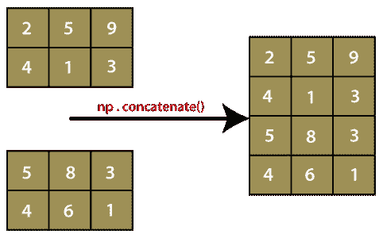

# Python 中的 numpy.concatenate()

> 哎哎哎:# t0]https://www . javatppoint . com/num py-串接

concatenate()函数是 NumPy 包中的一个函数。这个函数本质上将 NumPy 数组组合在一起。该函数主要用于沿指定轴连接两个或多个相同形状的数组。请记住以下几点:

1.  NumPy 的 concatenate()不像传统的数据库连接。这就像堆叠 NumPy 数组。
2.  该功能可以垂直和水平操作。这意味着我们可以水平或垂直地将数组连接在一起。



concatenate()函数通常写成 np.concatenate()，但我们也可以写成 numpy.concatenate()。这取决于导入 numpy 包的方式，或者将 numpy 分别导入为 np 或者导入 numpy。

### 句法

```

numpy.concatenate((a1, a2, ...), axis)

```

### 因素

**1) (a1，a2，...)**

此参数定义数组的顺序。这里，a1，a2，a3...是具有相同形状的阵列，除了在对应于轴的维度上。

**2)轴:int(可选)**

此参数定义数组将沿其连接的轴。默认情况下，其值为 0。

### 结果

它将返回一个包含两个数组元素的数组。

### 示例 1: numpy.concatenate()

```

import numpy as np
x=np.array([[1,2],[3,4]])
y=np.array([[12,30]])
z=np.concatenate((x,y))
z

```

**在上面的代码中**

*   我们导入了别名为 np 的 numpy。
*   我们已经使用 np.array()函数创建了一个数组“x”。
*   然后，我们使用相同的 np.array()函数创建了另一个数组“y”。
*   我们已经声明了变量“z”，并分配了 np.concatenate()函数的返回值。
*   我们已经在函数中传递了数组“x”和“y”。
*   最后，我们尝试打印“z”的值。

在输出中，两个数组的值，即“x”和“y”按照轴=0 显示。

**输出:**

```
array([[ 1,  2],
       	[ 3,  4],
       	[12, 30]])

```

### 示例 2:轴=0 的 numpy.concatenate()

```

import numpy as np
x=np.array([[1,2],[3,4]])
y=np.array([[12,30]])
z=np.concatenate((x,y), axis=0)
z

```

**输出:**

```
array([[ 1,  2],
       	[ 3,  4],
       	[12, 30]])

```

### 示例 3:轴=1 的 numpy.concatenate()

```

import numpy as np
x=np.array([[1,2],[3,4]])
y=np.array([[12,30]])
z=np.concatenate((x,y.T), axis=1)
z

```

**输出:**

```
array([[ 1,  2, 12],
       	[ 3,  4, 30]])

```

在上面的示例中，'。“t”用于将行改为列，将列改为行。

### 示例 4:轴=无的 numpy.concatenate()

```

import numpy as np
x=np.array([[1,2],[3,4]])
y=np.array([[12,30]])
z=np.concatenate((x,y), axis=None)
z

```

**输出:**

```
array([ 1,  2,  3,  4, 12, 30])

```

在上面的例子中，我们使用了 np.concatenate()函数。该函数不保留对掩码数组输入的掩码。我们可以通过下面的方法来连接数组，从而保留对掩码数组输入的掩码。

### 示例 5: np.ma.concatenate()

```

import numpy as np
x=np.ma.arange(3)
y=np.arange(3,6)
x[1]=np.ma.masked
x
y
z1=np.concatenate([x,y])
z2=np.ma.concatenate([x,y])
z1
z2

```

**在上面的代码中**

*   我们导入了别名为 np 的 numpy。
*   我们已经使用 NP . ma . array()函数创建了一个数组“x”。
*   然后，我们使用相同的 NP . ma . array()函数创建了另一个数组“y”。
*   我们已经声明了变量“z1”，并分配了 np.concatenate()函数的返回值。
*   我们已经声明了变量“z2”，并分配了 np.ma.concatenate()函数的返回值。
*   最后，我们尝试打印“z1”和“z2”的值。

在输出中，数组“z1”和“z2”的值都保留了掩码数组输入的掩码。

**输出:**

```
masked_array(data=[0, --, 2],
             	mask=[False,  True, False],
       		fill_value=999999)
array([3, 4, 5])
masked_array(data=[0, 1, 2, 3, 4, 5],
             	mask=False,
       		fill_value=999999)
masked_array(data=[0, --, 2, 3, 4, 5],
             	mask=[False,  True, False, False, False, False],
       		fill_value=999999)

```

* * *