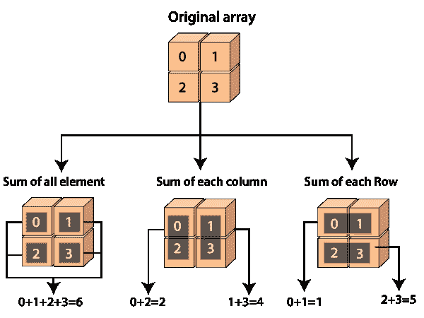

# Python 中的 numpy.sum()

> 哎哎哎:# t0]https://www . javatppoint . com/num py-sum

Python 的 numpy 包中提供了 numpy.sum()函数。该函数用于计算给定数组中所有元素的和、每行的和以及每列的和。

本质上，这是对数组元素的求和，获取数组中的元素，并将它们相加。还可以添加数组的行和列元素。输出将以数组对象的形式出现。



### 句法

numpy.sum()函数有以下语法:

```

numpy.sum(arr, axis=None, dtype=None, out=None, keepdims=<no value>, initial=<no value>)

```

### 因素

**1) arr: array_like**

这是一个数组。这是我们想要求和的元素的源数组。这个参数是必不可少的，在 numpy.sum()函数中起着至关重要的作用。

**2)轴:int 或 None 或 int 元组(可选)**

此参数定义执行求和的轴。默认轴是无，它将对数组的所有元素求和。当轴为负时，它从最后一个轴计数到第一个轴。在 1.7.0 版本中，当轴是整数元组时，对元组中指定的所有轴执行求和，而不是像以前那样对单个轴或所有轴执行求和。

**类型:dtype(可选)**

此参数定义累加器的类型和元素求和的返回数组。默认情况下，使用 arr 的数据类型，除非 arr 具有精度低于默认平台整数的整数数据类型。在这种情况下，当 arr 有符号时，使用平台整数，当 arr 无符号时，使用与平台整数精度相同的无符号整数。

**4)输出:ndarray(可选)**

此参数定义结果将放置在其中的替代输出数组。该结果数组必须具有与预期输出相同的形状。必要时，将转换输出值的类型。

**5） 保留： 布尔（选项）**

此参数定义了一个布尔值。当此参数设置为“真”时，缩小的轴将作为尺寸为 1 的尺寸留在结果中。在这个选项的帮助下，结果将根据输入数组正确广播。传递默认值时，keepdims 不会传递给 ndarray 子类的 sum 方法，但在非默认值的情况下不会。如果子类方法没有实现 keepdims，那么可能会引发任何异常。

**6)初始:标量**

此参数定义总和的起始值。

### 返回

该函数返回一个与 arr 形状相同的数组，并去掉指定的轴。当 arr 是 0-d 数组时，或者当轴是无时，返回标量。当指定数组输出时，返回对 **out** 的引用。

### 示例 1: numpy.array()

```

import numpy as np
a=np.array([0.4,0.5])
b=np.sum(a)
b

```

**输出:**

```
0.9

```

**在上面的代码中**

*   我们已导入别名为“np”的 numpy。
*   我们已经使用 np.array()函数创建了一个数组“a”。
*   我们已经声明了变量“b”，并分配了 np.sum()函数的返回值。
*   我们已经在函数中传递了数组“a”。
*   最后，我们尝试打印 b 的值。

在输出中，显示了数组中所有元素的总和。

### 例 2:

```

import numpy as np
a=np.array([0.4,0.5,0.9,6.1])
x=np.sum(a, dtype=np.int32)
x

```

**输出:**

```
6

```

**在上面的代码中**

*   我们已导入别名为“np”的 numpy。
*   我们已经使用 np.array()函数创建了一个数组“a”。
*   我们已经声明了变量“x”，并分配了 np.sum()函数的返回值。
*   我们在函数中传递了数组“a”和 int32 的数据类型。
*   最后，我们尝试打印 x 的值。

在输出中，只显示了整数的和，而没有显示浮点值。

### 例 3:

```

import numpy as np
a=np.array([[1,4],[3,5]])
b=np.sum(a)
b

```

**在上面的代码中**

**输出:**

```
13

```

### 例 4:

```

import numpy as np
a=np.array([[1,4],[3,5]])
b=np.sum(a,axis=0)
b

```

**在上面的代码中**

*   我们导入了别名为 np 的 numpy。
*   我们已经使用 np.array()函数创建了一个数组“a”。
*   我们已经声明了变量“b”，并分配了 np.sum()函数的返回值。
*   我们已经在函数中传递了数组“a”和 axis=0。
*   最后，我们尝试打印 b 的值。

在输出中，相应地计算了列元素的总和。

**输出:**

```
array([4, 9])

```

### 例 5:

```

import numpy as np
a=np.array([[1,4],[3,5]])
b=np.sum(a,axis=1)
b

```

**输出:**

```
array([5, 8])

```

### 示例 6:

```

import numpy as np
b=np.sum([15], initial=8)
b

```

**输出:**

```
23

```

**在上面的代码中**

*   我们导入了别名为 np 的 numpy。
*   我们已经声明了变量“b”，并分配了 np.sum()函数的返回值。
*   我们已经在函数中传递了元素的数量和初始值。
*   最后，我们尝试打印 b 的值。

在输出中，初始值被添加到元素序列中的最后一个元素，然后执行所有元素的求和。

* * *