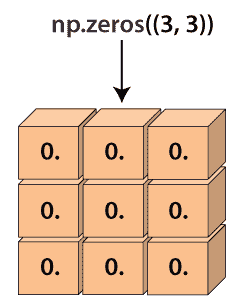

# Python 中的 numpy.zeros()

> 哎哎哎:# t0]https://www . javatppoint . com/num py-zeros

numpy.zeros()函数是机器学习程序中广泛使用的最重要的函数之一。此函数用于生成包含零的数组。

numpy.zeros()函数提供一个给定形状和类型的新数组，数组中用零填充。



### 句法

```

numpy.zeros(shape, dtype=float, order='C'

```

### 因素

**形状:int 或 int 的元组**

此参数用于定义数组的维度。此参数用于我们要在其中创建数组的形状，如(3，2)或 2。

**数据类型:数据类型(可选)**

此参数用于定义数组所需的数据类型。默认情况下，数据类型为 numpy.float64。此参数对于定义来说不是必需的。

**顺序:{'C '，' F'}(可选)**

此参数用于定义我们希望在内存中存储数据的顺序，行为主(C 风格)或列为主(Fortran 风格)

### 返回

这个函数返回一个数组。输出数组是具有指定形状、数据类型、顺序并包含零的数组。

### 示例 1:不带数据类型和顺序的 numpy.zeros()

```

import numpy as np
a=np.zeros(6)
a

```

**输出:**

```
array([0., 0., 0., 0., 0., 0.])

```

**在上面的代码中**

*   我们导入了别名为 np 的 numpy。
*   我们已经声明了变量“a”，并分配了 np.zeros()函数的返回值。
*   我们在函数中传递了一个整数值。
*   最后，我们尝试打印“a”的值。

在输出中，显示了一个带有浮点整数(零)的数组。

### 示例 2:无顺序的 numpy.zeros()

```

import numpy as np
a=np.zeros((6,), dtype=int)
a 

```

**输出:**

```
array([0, 0, 0, 0, 0, 0])

```

### 示例 3:带形状的 numpy.zeros()

```

import numpy as np
a=np.zeros((6,2))
a

```

**输出:**

```
array([[0., 0.],
       	[0., 0.],
       	[0., 0.],
       	[0., 0.],
       	[0., 0.],
       	[0., 0.]])

```

**在上面的代码中**

*   我们导入了别名为 np 的 numpy。
*   我们已经声明了变量“a”，并分配了 np.zeros()函数的返回值。
*   我们已经传递了数组元素的形状。
*   最后，我们尝试打印“a”的值。

在输出中，显示了给定形状的数组。

### 示例 4:带形状的 numpy.zeros()

```

Import numpy as np
s1=(3,2)
a=np.zeros(s1)
a

```

**输出:**

```
array([[0., 0.],
       	[0., 0.],
       	[0., 0.]])

```

### 示例 5:带有自定义数据类型的 numpy.zeros()

```

Import numpy as np
a=np.zeros((3,), dtype=[('x', 'i4'), ('y', 'i4')])
a

```

**输出:**

```
array([(0, 0), (0, 0), (0, 0)], dtype=[('x', '<i4'), ('y', '<i4')])

```

**在上面的代码中**

*   我们导入了别名为 np 的 numpy。
*   我们已经声明了变量“a”，并分配了 np.zeros()函数的返回值。
*   我们已经在函数中传递了形状和自定义数据类型。
*   最后，我们尝试打印“a”的值。

在输出中，显示了一个包含带有自定义数据类型的零的数组。

* * *