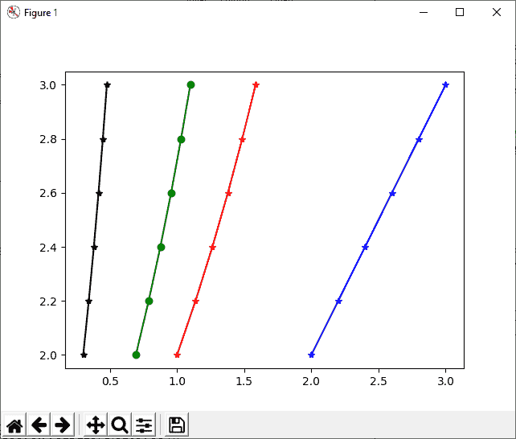

# Python 中的 numpy.log()

> 哎哎哎:# t0]https://www . javatppoint . com/num py-log

numpy.log()是一个数学函数，用于计算 x 的自然对数(x 属于所有输入数组元素)。它是指数函数的倒数，也是元素自然对数。自然对数对数对数是指数函数的倒数，所以对数(exp(x))=x，以 e 为底数的对数就是自然对数。

### 句法

```

numpy.log(x, /, out=None, *, where=True, casting='same_kind', order='K', dtype=None, subok=True[, signature, extobj]) = <ufunc 'log'> 

```

### 因素

**x:数组 _like**

此参数定义 numpy.log()函数的输入值。

**out:n 数组、无或 n 数组和无的元组(可选)**

此参数用于定义存储结果的位置。如果我们定义这个参数，它必须有一个类似于输入广播的形状；否则，返回新分配的数组。元组的长度等于输出的数量。

**其中:array_like(可选)**

这是通过输入广播的条件。在这个条件为真的位置，out 数组将被设置为 ufunc(通用函数)结果；否则，它将保留其原始价值。

**铸造:{'no '，' equiv '，' safe '，' same_kind '，' unsafe'}(可选)**

此参数控制可能发生的数据转换类型。“否”表示根本不应该强制转换数据类型。“equiv”表示只允许字节顺序更改。“safe”表示唯一的强制转换，它允许保留值。“same_kind”仅表示安全强制转换或一种类型内的强制转换。“不安全”意味着可能会进行任何数据转换。

**顺序:{'K '，' C '，' F '，' A'}(可选)**

此参数指定输出数组的计算迭代顺序/内存布局。默认情况下，顺序是 k。顺序“C”意味着输出应该是 C 连续的。顺序“F”表示 F 连续，如果输入是 F 连续的，则“A”表示 F 连续，如果输入是 C 连续的，则“A”表示 C 连续。“k”表示匹配输入的元素顺序(尽可能接近)。

**数据类型:数据类型(可选)**

它重写计算和输出数组的数据类型。

**子点：布尔（可选）**

默认情况下，此参数设置为 true。如果我们将其设置为 false，输出将始终是一个严格的数组，而不是子类型。

**签名**

此参数允许我们为基础计算中使用的一维循环“for”提供特定的签名。

ext obj

此参数是长度为 1、2 或 3 的列表，指定 ufunc 缓冲区大小、错误模式整数和错误回调函数。

### 返回

这个函数返回一个包含 x 的自然对数值的数组，它属于输入数组的所有元素。

### 例 1:

```

import numpy as np
a=np.array([2, 4, 6, 3**8])
a
b=np.log(a)
b
c=np.log2(a)
c
d=np.log10(a)
d

```

**输出:**

```
array([   2,    4,    6, 6561])
array([0.69314718, 1.38629436, 1.79175947, 8.78889831])
array([ 1\.        ,  2\.        ,  2.5849625 , 12.67970001])
array([0.30103   , 0.60205999, 0.77815125, 3.81697004])

```

**在上述代码中**

*   我们导入了别名为 np 的 numpy。
*   我们已经使用 np.array()函数创建了一个数组“a”。
*   我们已经声明了变量 b、c 和 d，并分别分配了 np.log()、np.log2()和 np.log10()函数的返回值。
*   我们已经在所有函数中传递了数组“a”。
*   最后，我们尝试打印 b、c 和 d 的值。

在输出中，显示了一个数组，包含源数组所有元素的 log、log2 和 log10 值。

### 例 2:

```

import numpy as np
import matplotlib.pyplot as plt
arr = [2, 2.2, 2.4, 2.6,2.8, 3]
result1=np.log(arr)
result2=np.log2(arr)
result3=np.log10(arr)
plt.plot(arr,arr, color='blue', marker="*")
plt.plot(result1,arr, color='green', marker="o")
plt.plot(result2,arr, color='red', marker="*")
plt.plot(result3,arr, color='black', marker="*")
plt.show()

```

**输出:**



**在上面的代码中**

*   我们导入了别名为 np 的 numpy。
*   我们还导入了别名为 plt 的 matplotlib.pyplot。
*   接下来，我们使用 np.array()函数创建了一个数组“arr”。
*   之后，我们声明了变量 result1、result2、result3，并分别分配了 np.log()、np.log2()和 np.log10()函数的返回值。
*   我们已经在所有函数中传递了数组“arr”。
*   最后，我们尝试绘制“arr”、结果 1、结果 2 和结果 3 的值。

在输出中，显示了一个由四条不同颜色的直线组成的图形。

### 例 3:

```

import numpy as np
x=np.log([2, np.e, np.e**3, 0])
x

```

**输出:**

```
__main__:1: RuntimeWarning: divide by zero encountered in log
array([0.69314718, 1\.        , 3\.        ,       -inf])

```

**在上面的代码中**

*   首先，我们导入了别名为 np 的 numpy。
*   我们已经声明了变量“x”，并分配了 np.log()函数的返回值。
*   我们在函数中传递了不同的值，例如整数值、np.e 和 np.e**2。
*   最后，我们尝试打印“x”的值。

在输出中，显示了一个数组，包含源数组元素的日志值。

* * *