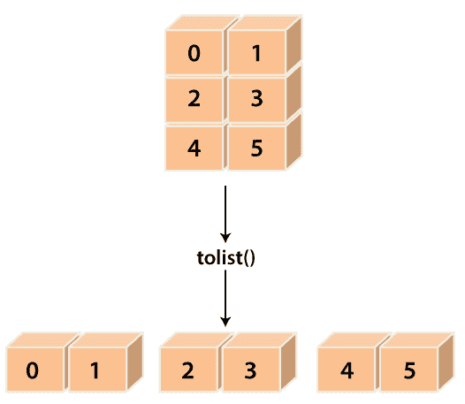

# Python 中的 numpy . ndarray . tolist()

> 原文：<https://www.javatpoint.com/numpy-array-tolist>

numpy 模块提供了一个函数 **numpy.ndarray.tolist()** ，用于将数组的数据元素转换为列表。该函数将数组作为 Python 标量的**级深度嵌套列表返回。**

简单地说，这个函数返回数组元素的副本作为 Python 列表。通过 item 函数将元素转换为最近的兼容内置 Python 类型。当“a.ndim”为 0 时，那么列表的深度为 0，它将是一个简单的 Python 标量，而不是任何列表。



### 句法

```

ndarray.tolist()

```

### 因素

此函数没有参数。

### 返回:y:对象、对象列表或对象列表

这个函数返回可能嵌套的数组元素列表。

#### 注意
我们可以通过 a=np.array(a.tolist())重新创建数组，但是它有时会失去精度。

### 例 1:

如果我们将 **a.tolist()** 用于 1D 数组，那么它将几乎与**列表(a)** 相同，只是 **tolist** 将 numpy 标量转换为 Python 标量。

```

import numpy as np
a = np.uint32([6, 2])
a
a_list=list(a)
a_list
type(a_list[0])
a_tolist=a.tolist()
a_tolist
type(a_tolist[0])

```

**输出:**

```
array([6, 2], dtype=uint32)
[6, 2]
<type 'numpy.uint32'>
[6L, 2L]
<type 'long'>

```

**在上面的代码中**

*   我们导入了别名为 np 的 numpy。
*   我们已经使用 np.uint32()函数创建了一个数组“a”。
*   我们已经声明了变量‘a _ list’，并分配了 **list()** 函数的返回值。
*   我们试图打印“a”、“a_list”的值和 a_list 的类型。
*   我们已经声明了变量 a_tolist，并分配了返回值 **ndarray.tolist()** 。
*   最后，我们尝试打印“ **a_tolist** 的类型和值。

在输出中，它显示了一个列表和其元素从源数组转换而来的类型。

### 例 2:

对于二维数组，递归应用**到列表**。

```

import numpy as np
a = np.array([[11, 21], [31, 41]])
b=a.tolist()
a
b

```

**输出:**

```
array([[11, 21],
       	[31, 41]])
[[11, 21], [31, 41]]

```

**在上面的代码中**

*   我们导入了别名为 np 的 numpy。
*   我们使用 np.array()函数创建了一个二维数组“a”。
*   我们已经声明了变量‘b’，并分配了 **a.tolist()** 函数的返回值。
*   最后，我们尝试打印“ **b** 的值。

在输出中，它显示了一个列表，其元素是从源数组转换而来的。

### 例 3:

```

import numpy as np
x = np.array(5)
list(x)
y=x.tolist()
y

```

**输出:**

```
Traceback (most recent call last):
  File "<stdin>", line 1, in <module>
TypeError: iteration over a 0-d array
5

```

* * *