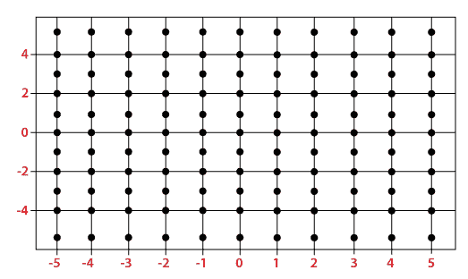
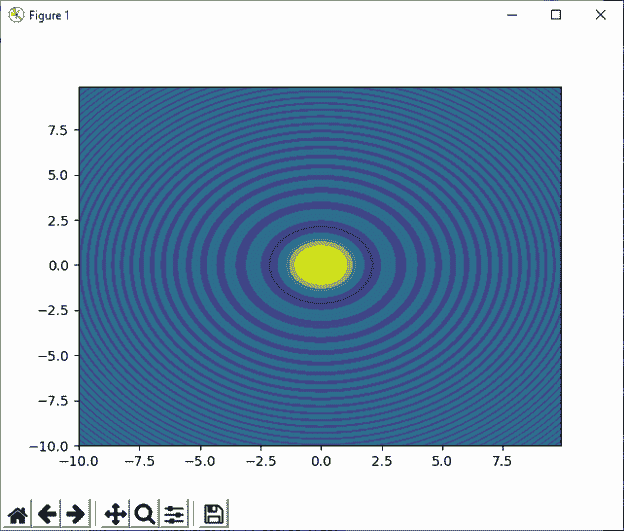
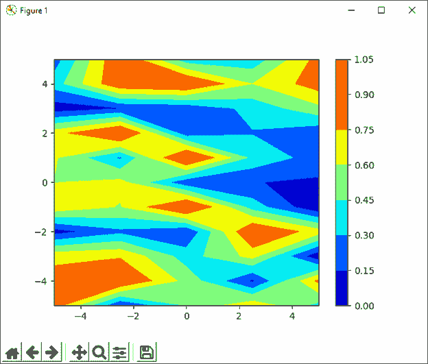
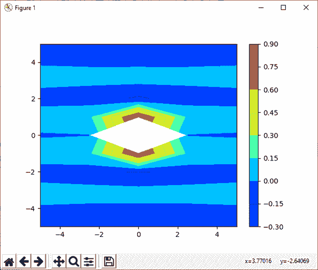

# Python 中的 numpy.meshgrid()

> 哎哎哎:# t0]https://www . javatppoint . com/num py-mesh grid

Python 的 numpy 模块提供了 **meshgrid()** 功能，用于在给定的一维数组的帮助下创建矩形网格，这些数组表示**矩阵索引**或**笛卡尔索引**。MATLAB 多少启发了 meshgrid()函数。meshgrid()函数从坐标向量中返回坐标矩阵。



在上图中，x 轴的范围是-5 到 5，y 轴的范围是-5 到 5。所以，图中一共标注了 121 个点，每个点都有 x 坐标和 y 坐标。对于平行于 x 轴的任何直线，标记点的 x 坐标分别为-5、-4、-3、-2、-1、0、1、2、3、4 和 5。另一方面，对于任何平行于 y 轴的直线，从下到上标记点的 y 坐标分别为-5、-4、-3、-2、-1、0、1、2、3、4 和 5。

### 句法

```

numpy.meshgrid(*xi, **kwargs)

```

### 因素

**x1，x2，…，xn : array_like**

此参数定义一维数组，它表示网格的坐标。

**索引:{'xy '，' ij'}(可选)**

这是一个可选参数，用于定义输出的笛卡尔“xy”(默认)或矩阵(“ij”)索引。

**稀疏：布尔值（可选）**

此参数也是可选的。如果我们需要一个稀疏的网格来保存内存，我们必须将这个参数设置为真。默认情况下，它设置为“假”。

**复制：布尔（可选）**

这个可选参数的目的是返回原始数组的副本以节省内存。默认情况下，它设置为“假”。

如果**稀疏**和**复制**参数都设置为假，那么它将返回非连续数组。此外，广播数组的多个元素可以引用单个存储位置。如果我们需要写入阵列，那么我们必须先制作副本。

### 返回

x1、X2、…、Xn

从这个函数返回坐标向量的坐标长度。

### 例 1:

```

import numpy as np
na, nb = (5, 3)
a = np.linspace(1, 2, na)
b = np.linspace(1, 2, nb)
xa, xb = np.meshgrid(a, b)
xa
xb

```

**输出:**

```
array([[1\.  , 1.25, 1.5 , 1.75, 2\.  ],
       	[1\.  , 1.25, 1.5 , 1.75, 2\.  ],
       	[1\.  , 1.25, 1.5 , 1.75, 2\.  ]])
array([[1\. , 1\. , 1\. , 1\. , 1\. ],
       	[1.5, 1.5, 1.5, 1.5, 1.5],
       	[2\. , 2\. , 2\. , 2\. , 2\. ]])

```

**在上面的代码中**

*   我们已经导入了别名为 np 的 numpy。
*   我们创建了两个变量，即 na 和 nb，并分别赋值 5 和 3。
*   我们使用 linspace()函数创建了两个数组，即 a 和 b。
*   之后，我们已经声明了变量‘xa’和‘XB’，并分配了 **meshgrid()** 的返回值
*   我们在函数中传递了数组“a”和“b”
*   最后，我们尝试打印**【xa】**和**【XB】**的值。

在输出中，显示了两个数组，其中包含坐标向量的坐标长度。

### 例 2:

```

import numpy as np
na, nb = (5, 3)
a = np.linspace(1, 2, na)
b = np.linspace(1, 2, nb)
xa, xb = np.meshgrid(a, b, sparse=True)
xa
xb

```

**输出:**

```
array([[1\.  , 1.25, 1.5 , 1.75, 2\.  ]])
array([[1\. ],
       	[1.5],
       	[2\. ]])

```

### 例 3:

```

import numpy as np
import matplotlib.pyplot as plt
a = np.arange(-10, 10, 0.1)
b = np.arange(-10, 10, 0.1)
xa, xb = np.meshgrid(a, b, sparse=True)
z = np.sin(xa**2 + xb**2) / (xa**2 + xb**2)
h = plt.contourf(a,b,z)
plt.show()

```

**输出:**



**在上面的代码中**

*   我们导入了别名为 np 的 numpy。
*   我们已经将 matplotlib.pyplot 导入为 plt。
*   我们使用 np.arange()函数创建了两个数组，即 a 和 b。
*   之后，我们已经声明了变量‘xa’和‘XB’，并分配了 **meshgrid()** 的返回值
*   我们已经在函数中传递了数组“a”和“b”。
*   之后，我们声明了一个变量 z，并分配了 np.sine()函数的返回值。
*   最后，我们尝试使用**绘制等高线和填充等高线**

在输出中，绘制了等高线。

### 例 4:

```

import numpy as np
import matplotlib.pyplot as plt
a = np.linspace(-5, 5, 5)
b = np.linspace(-5, 5, 11)
random_data = np.random.random((11, 5))
xa, xb = np.meshgrid(a, b)
plt.contourf(xa, xb, random_data, cmap = 'jet')
plt.colorbar()
plt.show()

```

**输出:**



### 例 5:

```

import numpy as np
import matplotlib.pyplot as plt
a = np.linspace(-5, 5, 5)
b = np.linspace(-5, 5, 11)
random_data = np.random.random((11, 5))
xa, xb = np.meshgrid(a, b)
sine = (np.sin(xa**2 + xb**2))/(xa**2 + xb**2)
plt.contourf(xa, xb, sine, cmap = 'jet')
plt.colorbar()
plt.show()

```

**输出:**



* * *