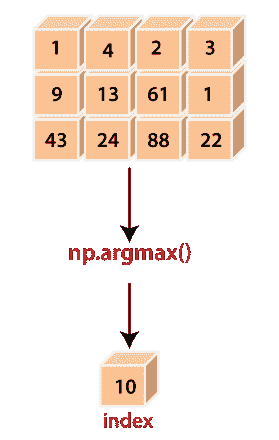

# Python 中的 numpy.argmax

> 哎哎哎:# t0]https://www . javatppoint . com/num py-argmax

在许多情况下，当数组的大小太大时，需要花费太多的时间才能从中找到最大的元素。为此，Python 的 numpy 模块提供了一个名为 **numpy.argmax()** 的函数。此函数返回沿指定轴返回的最大值的索引。



### 语法:

```

numpy.argmax(a, axis=None, out=None)

```

### 因素

**x:数组 _like**

这个参数定义了我们想知道其最大值的源数组。

**轴:int(可选)**

此参数定义了索引所在的轴，默认情况下，索引位于展平数组中。

**出:阵列(可选)**

此参数定义了要插入结果的数组。这将是相同的类型和形状，适合存储结果

### 返回

此参数定义一个包含数组索引的数组。形状与 **x 形状**相同，去掉了沿轴的尺寸。

### 例 1:

```

Import numpy as np
x = np.arange(20).reshape(4,5) + 7
x
y=np.argmax(a)
y

```

**输出:**

```
array([[ 7,  8,  9, 10, 11],
       	[12, 13, 14, 15, 16],
       	[17, 18, 19, 20, 21],
       	[22, 23, 24, 25, 26]])
19

```

**在上面的代码中**

*   我们导入了别名为 np 的 numpy。
*   我们使用 **np.arange()** 函数创建了一个四行五列的数组**‘x’**。
*   我们还在数组的每个元素中添加了 7。
*   我们已经声明了变量**‘y’**，并分配了 **np.argmax()** 函数的返回值。
*   我们已经通过了函数中的数组**‘x’**。
*   最后，我们尝试打印**‘y’**的值。

在输出中，它显示了数组中最大元素的索引。

### 例 2:

```

Import numpy as np
x = np.arange(20).reshape(4,5) + 7
y=np.argmax(x, axis=0)
z=np.argmax(x, axis=1)
y
z

```

**输出:**

```
array([3, 3, 3, 3, 3], dtype=int64)
array([4, 4, 4, 4], dtype=int64)

```

### 例 3:

```

Import numpy as np
x = np.arange(20).reshape(4,5) + 7
indices = np.unravel_index(np.argmax(x, axis=None), x.shape)
indices
x[indices]

```

**输出:**

```
(3, 4)
26

```

### 例 4:

```

import numpy as np
a = np.array([[5,2,1], [3,7,9],[0, 4, 6]])
index_arr = np.argmax(a, axis=-1)
index_arr
# Same as np.max(a, axis=-1, keepdims=True)
result = np.take_along_axis(a, np.expand_dims(index_arr, axis=-1), axis=-1)
result1
# Same as np.max(a, axis=-1)
result = np.take_along_axis(a, np.expand_dims(index_arr, axis=-1), axis=-1).squeeze(axis=-1)
result2

```

**输出:**

```
array([[0],
       	[2],
       	[2]])
array([5, 9, 6])

```

**在上面的代码中**

*   我们导入了别名为 np 的 numpy。
*   我们使用 **np.array()** 函数创建了一个多维数组**。**
***   我们已经声明了变量**‘index _ arr’**，并分配了 **np.argmax()** 函数的返回值。*   我们已经通过了函数中的数组**‘a’**和轴。*   我们试图打印**“index _ arr”**的值。*   最后，我们试图借助两种不同的方式来获取数组的最大值，这两种方式与 **np.argmax()** 非常相似。**

 **在输出中，它显示了数组中最大元素的索引以及这些索引中存在的值。

* * ***