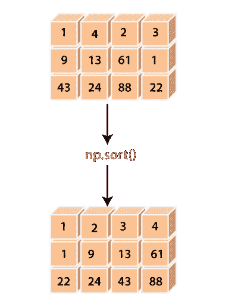

# Python 中的排序

> 哎哎哎:# t0]https://www . javatppoint . com/num py-sort

在某些情况下，我们需要一个排序的数组进行计算。为此，Python 的 numpy 模块提供了一个名为 **numpy.sort()** 的函数。该函数给出源数组或输入数组的排序副本。



### 语法:

```

numpy.sort(a, axis=-1, kind='quicksort', order=None)

```

### 参数:

**x:数组 _like**

此参数定义将要排序的源数组。

**轴:int 或 None(可选)**

此参数定义了执行排序的轴。如果该参数为**无**，则数组在排序前将被展平，默认情况下，该参数设置为-1，沿最后一个轴对数组进行排序。

**种类:{quicksort、heapsort、mergesort}(可选)**

该参数用于定义排序算法，默认使用**【快速排序】**进行排序。

**顺序:字符串或字符串列表(可选)**

当用字段定义数组时，它的顺序定义了进行第一、第二等比较的字段。只能将单个字段指定为字符串，不一定适用于所有字段。但是，未指定的字段仍将按照它们在数据类型中出现的顺序使用，以断开联系。

### 返回:

此函数返回源数组的排序副本，该副本的形状和类型与源数组相同。

### 例 1:

```

import numpy as np
x=np.array([[1,4,2,3],[9,13,61,1],[43,24,88,22]])
x
y=np.sort(x)
y

```

**输出:**

```
array([[ 1,  4,  2,  3],
       	[ 9, 13, 61,  1],
       	[43, 24, 88, 22]])
 array([[ 1,  2,  3,  4],
       	[ 1,  9, 13, 61],
       	[22, 24, 43, 88]])

```

**在上面的代码中**

*   我们导入了别名为 np 的 numpy。
*   我们使用 **np.array()** 函数创建了一个多维数组**‘x’**。
*   我们已经声明了变量**‘y’**，并分配了 **np.sort()** 函数的返回值。
*   我们已经在函数中传递了输入数组**‘x’**。
*   最后，我们尝试打印**‘y’**的值。

在输出中，它显示了相同类型和形状的源数组的排序副本。

### 例 2:

```

import numpy as np
x=np.array([[1,4,2,3],[9,13,61,1],[43,24,88,22]])
x
y=np.sort(x, axis=None)
y

```

**输出:**

```
array([[ 1,  4,  2,  3],
       	[ 9, 13, 61,  1],
       	[43, 24, 88, 22]])
array([ 1,  1,  2,  3,  4,  9, 13, 22, 24, 43, 61, 88])

```

### 例 3:

```

import numpy as np
x=np.array([[1,4,2,3],[9,13,61,1],[43,24,88,22]])
x
y=np.sort(x,axis=0)
y
z=np.sort(x,axis=1)
z

```

**输出:**

```
array([[ 1,  4,  2,  1],
       	[ 9, 13, 61,  3],
       	[43, 24, 88, 22]])
array([[ 1,  2,  3,  4],
       	[ 1,  9, 13, 61],
       	[22, 24, 43, 88]])

```

### 例 4:

```

import numpy as np
dtype = [('name', 'S10'), ('height', float), ('age', int),('gender','S10')]
values = [('Shubham', 5.9, 23, 'M'), ('Arpita', 5.6, 23, 'F'),('Vaishali', 5.2, 30, 'F')]
x=np.array(values, dtype=dtype)
x
y=np.sort(x, order='age')
y
z=np.sort(x, order=['age','height'])
z

```

**输出:**

```
array([('Shubham', 5.9, 23, 'M'), ('Arpita', 5.6, 23, 'F'), ('Vaishali', 5.2, 30, 'F')],dtype=[('name', 'S10'), ('height', '<f8'), ('age', '<i4'), ('gender', 'S10')]) 
array([('Arpita', 5.6, 23, 'F'), ('Shubham', 5.9, 23, 'M'), ('Vaishali', 5.2, 30, 'F')], dtype=[('name', 'S10'), ('height', '<f8'), ('age', '<i4'), ('gender', 'S10')])
array([('Arpita', 5.6, 23, 'F'), ('Shubham', 5.9, 23, 'M'), ('Vaishali', 5.2, 30, 'F')], dtype=[('name', 'S10'), ('height', '<f8'), ('age', '<i4'), ('gender', 'S10')])

```

**在上面的代码中**

*   我们导入了别名为 np 的 numpy。
*   我们已经定义了结构化数组的字段和值。
*   通过在 **np.array()** 函数中传递数据类型和值，我们创建了一个结构化数组**‘x’**。
*   我们已经声明了变量**【y】**和**【z】**，并分配了 **np.sort()** 函数的返回值。
*   我们已经在函数中传递了输入数组**‘x’**和顺序。
*   最后，我们尝试打印**【y】****【z】**的值。

在输出中，它显示了具有定义顺序的结构化数组的排序副本。

* * *