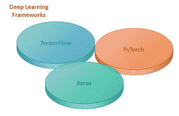
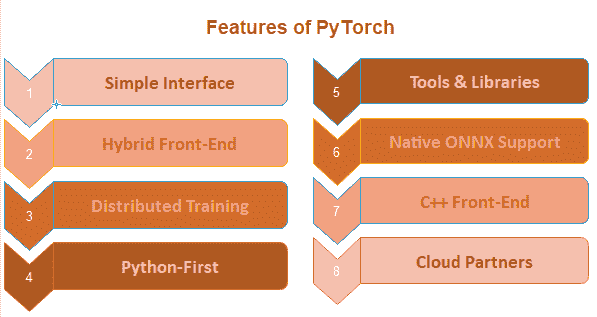

# 什么是 Pytorch？

> 原文：<https://www.javatpoint.com/pytorch-introduction>

**PyTorch** 是基于 **Torch** 库的计算机软件的一小部分。是**脸书**推出的深度学习框架。PyTorch 是 **Python** 编程语言的**机器学习库**，用于**自然语言处理**等应用。

**py torch 提供的高级功能如下:**

1.  借助**图形处理单元** (GPU)，给出强加速的张量计算。
2.  它提供了建立在基于磁带的自动差异系统上的深度神经网络。

开发 PyTorch 是为了在实现和构建**深度学习神经网络**的过程中提供高灵活性和速度。正如你已经知道的，这是一个用于 **Python** 编程语言的机器学习库，所以安装、运行和理解都非常简单。Pytorch 是**完全 python 化的**(使用广泛采用的 python 习惯用法，而不是编写 Java 和 C++代码)，这样它就可以快速成功地构建一个**神经网络模型**。



## PyTorch 的历史

**PyTorch** 于 2016 年发布。许多研究人员越来越愿意采用 PyTorch。由**脸书**操作。脸书还运营**咖啡馆 2** (用于快速特征嵌入的卷积架构)。将 PyTorch 定义的模型转换为 Caffe2 是一项挑战。为此，脸书和微软在 2017 年 9 月发明了一个**开放神经网络交换** (ONNX)。简单来说，ONNX 是为了在框架之间转换模型而开发的。Caffe2 于 2018 年 3 月并入 PyTorch。

PyTorch 可以轻松构建极其复杂的神经网络。这一特性很快使它成为一个热门的图书馆。在研究工作中，它给了 TensorFlow 一个艰难的竞争。PyTorch 的发明者想做一个非常必要的库，可以轻松运行所有的数值计算，最后，他们发明了 PyTorch。对于深度学习科学家、机器学习开发人员和神经网络调试器来说，实时运行和测试部分代码是一个巨大的挑战。PyTorch 完成了这个挑战，并允许他们实时运行和测试他们的代码。所以他们不用等着检查它是否有效。

#### 注意:要使用 PyTorch 功能和服务，可以使用 Python 包，如 NumPy、SciPy 和 Cython。

## 为什么要用 PyTorch？

为什么是 PyTorch？PyTorch 有什么特别之处，使得构建 Deep 学习模型变得特别。PyTorch 是一个动态库。动态库意味着灵活的库，您可以根据自己的需求和变化使用该库。目前在 Kaggle 比赛中，它被完成者持续使用。

有如此多的特征使得深度学习科学家可以用它来制作深度学习模型。

**这些特征如下。**



### 简单界面

PyTorch 有一个非常简单的像 Python 一样的界面。它提供了一种使用 API 的简单方法。这个框架非常容易像 Python 一样运行和操作。PyTorch 可以在 Windows 和 Linux 上轻松理解或实现。

### 混合前端

PyTorch 提供了一个新的混合前端，它在急切模式下提供了灵活性和易用性，同时最初在 C++运行时环境中过渡到图形模式以提高速度、优化和功能。

**例如:**

```

@torch.jit.script
 def Rnn(h, x, Wh, Uh, Wy, bh, by):
  y = []                                                     
  for t in range(x.size(0)):
  	h = torch.tanh(x[t] @ Wh + h @ Uh + bh)
y += [torch.tanh(h @ Wy + by)]
  	if t % 10 == 0:
  		print("stats: ", h.mean(), h.var())
    return torch.stack(y), h

```

### 分布式培训

PyTorch 允许开发人员以分布式方式训练神经网络模型。借助于对对等通信的本机支持以及来自 Python 和 C++的集体操作的异步执行，它在研究和生产中提供了优化的性能。

**例如:**

```

import torch.distributed as dist1 
from torch.nn.parallel import DistributedDataParallel
dist1.init_process_group(backend='gloo')
model = DistributedDataParallel(model)

```

### python-第一

PyTorch 完全基于 Python。PyTorch 与大多数流行的 Python 库和包(如 Cython 和 Numba)一起使用。PyTorch 深深地嵌入到 Python 中。它的代码完全是 pythonic 的。**Python**意味着使用广泛采用的 Python 习惯用法，而不是在代码中编写 java 和 C++代码。

**例如:**

```

import torch
import numpy as np
x = np.ones(5)
y = torch.from_numpy(x)
np.add(x, 1, out=x)
print(x)
print(y)

```

### 工具和库

丰富的工具和库生态系统可用于扩展 PyTorch 并支持计算机视觉和强化学习等领域的开发。这个生态系统是由开发人员和研究人员组成的活跃社区开发的。这些生态系统帮助他们构建灵活快速的深度学习神经网络。

**例如:**

```

import torchvision.models as models
resnet18 = models.resnet18(pretrained=True)
alexnet = models.alexnet(pretrained=True)
squeezenet = models.squeezenet1_0(pretrained=True)
vgg16 = models.vgg16(pretrained=True)
densenet = models.densenet161(pretrained=True)
inception = models.inception_v3(pretrained=True)

```

### 本机 ONNX 支持

ONNX 是为了在框架之间转换模型而开发的。为了直接访问与 ONNX 兼容的平台、运行时、可视化工具等，您需要在标准 ONNX 中导出模型。

**例如:**

```

import torch.onnx
import torchvision
dum_input = torch.randn(1, 3, 224, 224)
model = torchvision.models.alexnet(pretrained=True)
torch.onnx.export(model, dum_input, "alexnet.onnx")

```

### C++前端

C++前端是 PyTorch 的一个 c++接口，它遵循已建立的 Python 前端的设计和架构。它支持高性能、低延迟和裸机 C++应用研究。

**例如:**

```

#include <torch/torch.h>
torch::nn::Linear model(num_features, 1);
torch::optim::SGD optimizer(model->parameters());
auto data_loader = torch::data::data_loader(dataset);
for (size_t epoch = 0; epoch < 10; ++epoch)
 {
      for (auto batch : data_loader) 
      {
      	auto prediction = model->forward(batch.data);
      	auto loss = loss_function(prediction, batch.target);
      	loss.backward();
      	optimizer.step();
    }
}

```

### 云合作伙伴

PyTorch 得到了 AWS 等许多主要云平台的支持。借助于预先构建的图像、对图形处理器的大规模训练以及在生产规模环境中运行模型的能力等。；它提供了无摩擦开发和易于扩展。

**例如:**

```

export IMAGE_FAMILY="pytorch-latest-cpu"
  export ZONE="us-west1-b"
  export INSTANCE_NAME="my-instance"
  gcloud compute instances create $INSTANCE_NAME \
  --zone=$ZONE \
  --image-family=$IMAGE_FAMILY \

```

* * *