# PyTorch 的安装

> 哎哎哎:# t0]https://www . javatppoint . com/pytorch-installation

对于安装，首先，您必须选择您的首选项，然后运行安装命令。您可以在本地或与云合作伙伴一起开始安装。下图中，Stable 展示了目前支持和测试最多的 PyTorch (1.1)版本，适用于很多用户。如果您想要最新的 1.1 版本，但没有完全测试和支持，那么您必须选择预览(夜间)。

对于安装，您必须满足适合您的包管理器的先决条件。我们建议您使用 **Anaconda** 包管理器，因为它安装了所有的依赖项。

| 平台、操作系统、语言和其他先决条件 |
| **PyTorch 构建** | 合适(1.1) | 试映 |
| OS | Linux 操作系统 | 苹果个人计算机 | Windows 操作系统 |
| **包装** | 伯爵夫人 | 点 | LibTorch | 来源 |
| **语言** | Python 2.7 | Python 3.5 | Python 3.6 | Python 3.7 | C++ |
| **Cuda** | Nine | Ten | 没有人 |

LibTorch 仅适用于 C++。现在，我们首先用 pip 包在 windows 中安装 PyTorch，然后使用 Conda。

## 使用 Pip 在窗口上安装

要安装 PyTorch，首先要安装 python，然后要按照下面的步骤进行。

**第一步:**

首先你必须进入 python37 文件夹，然后使用 cd Scripts 命令进入它的 Scripts 文件夹。

**第二步:**

第二步，你需要在命令提示符下的 **easy_install.exe** pip 命令的帮助下，按照你需要的版本安装 pip。一旦依赖性处理完成，您将自动返回到脚本文件夹。

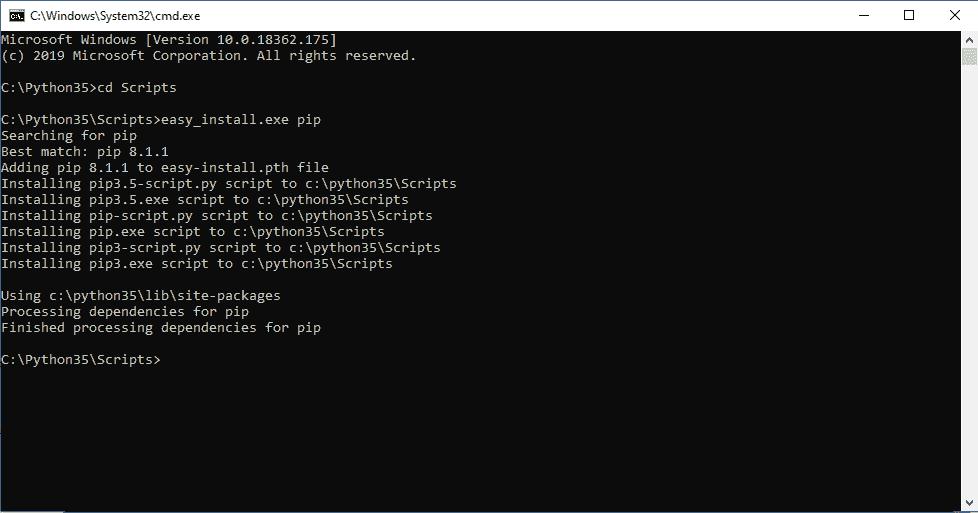

**第三步:**

现在，您的下一步是为 pip 安装 python 的 numpy 包。Numpy 安装将在 **pip 安装 numpy 命令**的帮助下完成。如果你的 python 已经有了这个包，那么它会显示**“需求已经满足”**否则，它会安装这个包。 **Pip 列表**命令用于检查包裹。

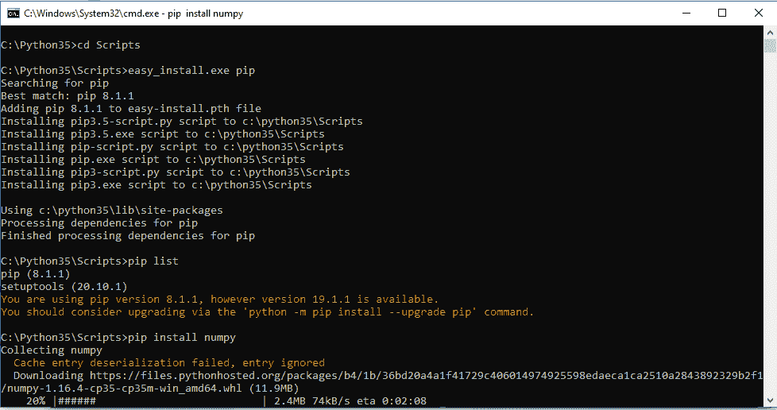

下载完成后，它会显示一条成功的消息，并将光标收回到脚本文件夹中。

**第四步:**

下一步是借助 **pip install scipy** 命令安装 pip 另一个软件包 scipy。

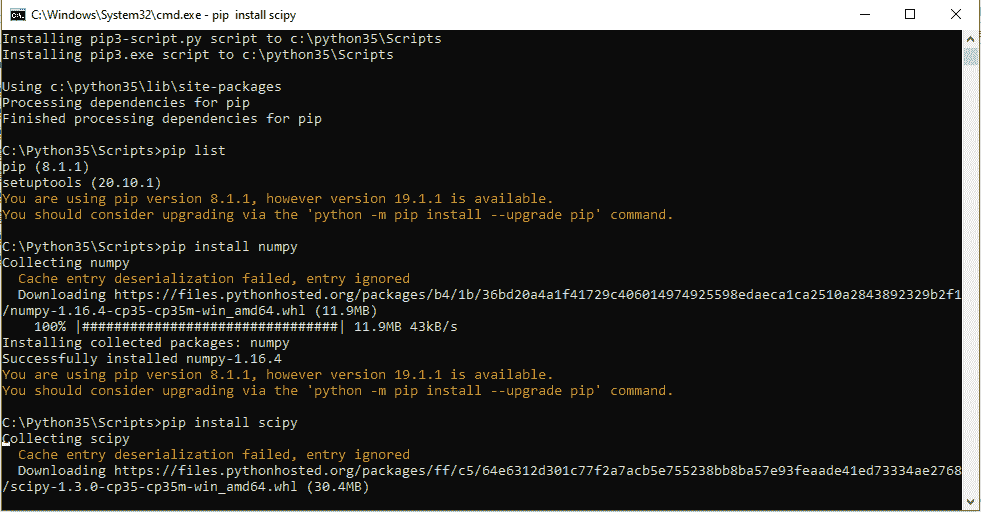

下载完成后，光标会回到脚本文件夹中。

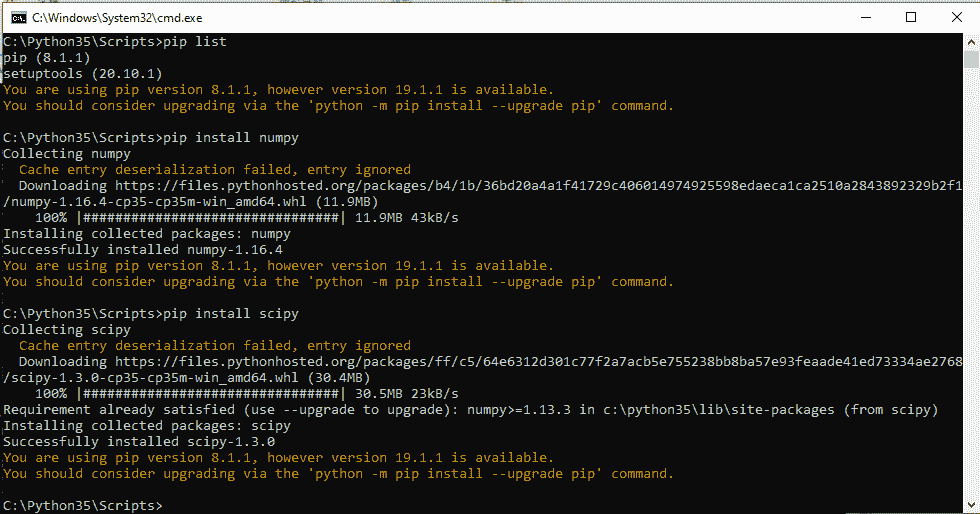

**第五步:**

现在，使用 **pip list** 命令检查 PyTorch 所需的所有已安装软件包。

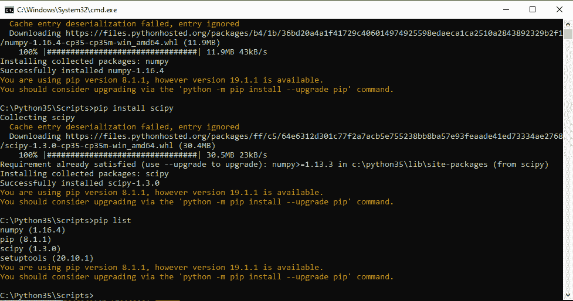

**第 6 步**

现在，你要去[https://pytorch.org/](https://pytorch.org/)获取 PyTorch 的安装命令。

在这里，您必须选择您喜欢的 PyTorch 构建、操作系统、包、语言和 CUDA。它为您提供了两个在窗口中安装 PyTorch 的命令。

**第七步:**

下一步是在命令提示符下运行这两个命令。请记住，如果您在此命令中进行任何更改，它将不会安装 PyTorch 并给出错误消息。

*   pip 3 install[https://download . pytorch . org/whl/CPU/torch-1 . 1 . 0-CP 35-CP 35m-win _ amd64 . whl](https://download.pytorch.org/whl/cpu/torch-1.1.0-cp35-cp35m-win_amd64.whl)

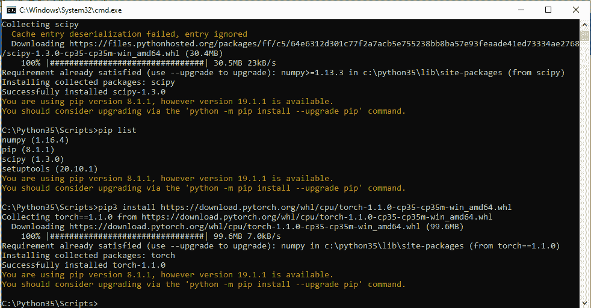

*   pip 3 install[https://download . pytorch . org/whl/CPU/torchision-0 . 3 . 0-CP 35-CP 35m-win _ amd64 . whl](https://download.pytorch.org/whl/cpu/torchvision-0.3.0-cp35-cp35m-win_amd64.whl)

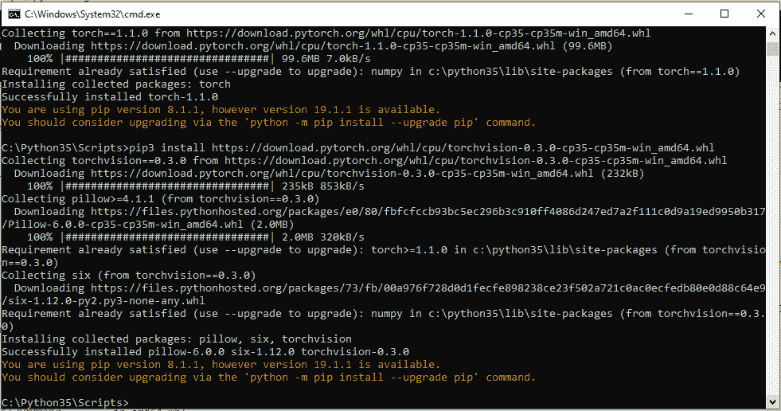

**第八步:**

现在，重新运行 pip list 命令来检查 PyTorch 是否成功运行。

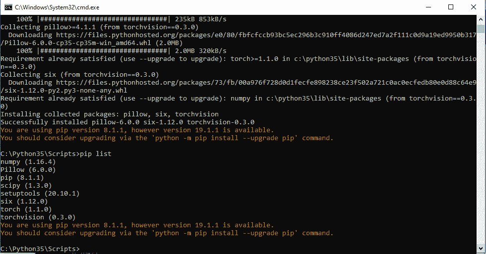

**第九步:**

现在，测试 PyTorch。运行 python 命令使用 python。导入火炬与 PyTorch 一起工作并执行操作。

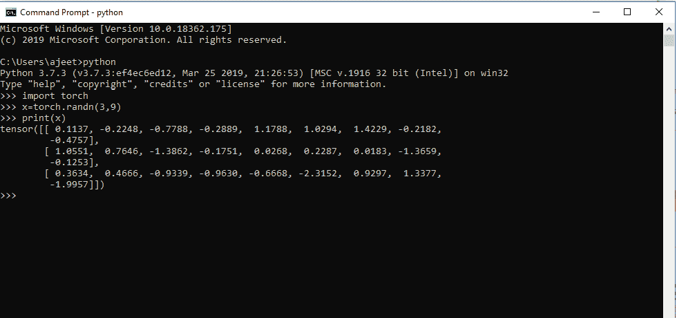

## 使用 Conda 在 Windows 上安装

本教程定义了 PyTorch 的分步安装。要使用 Conda 安装 PyTorch，您必须遵循以下步骤

**第一步:**

首先，您必须在系统中安装 Anaconda 的最新版本。要安装 Anaconda，必须经过[https://www.anaconda.com/distribution/](https://www.anaconda.com/distribution/)。

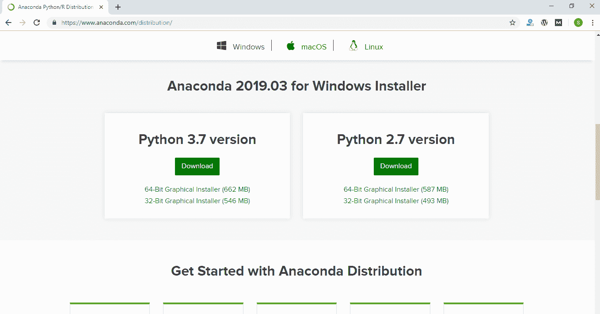

**第二步:**

现在，运行您的 Anaconda 安装程序并完全安装它。Anaconda 安装完成后，会出现一个 Anaconda 命令提示符。

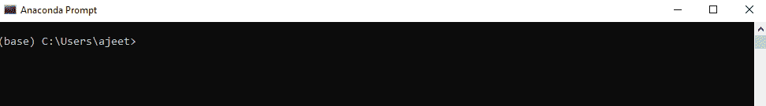

**第三步:**

下一步是使用 Anaconda 命令提示符安装 PyTorch。要安装 PyTorch，您必须在命令提示符下运行 PyTorch 的安装命令。该命令在[https://pytorch.org/](https://pytorch.org/)上可用。

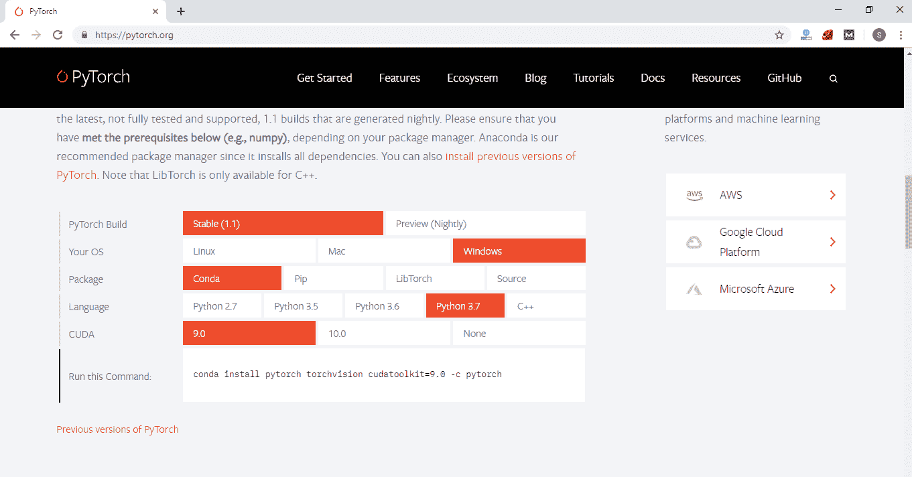

根据您的需求选择语言和 cuda 版本。

**第四步**

现在运行 **python 版**、 **Conda 版**命令检查 **Conda** 和 **python** 包是否安装。之后，在命令提示符下运行给定的命令。请记住，您在命令提示符下运行的命令类似于给定的命令。如果不相似，则会产生错误信息，安装将会失败。

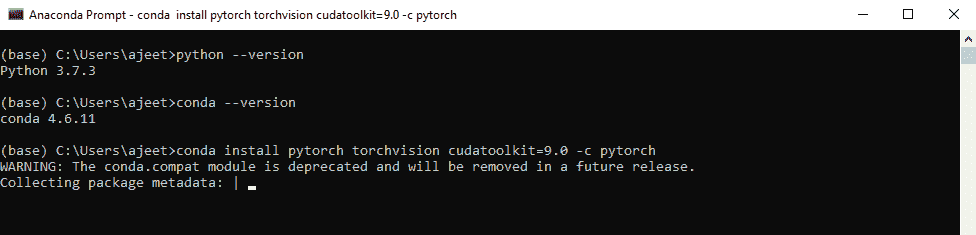
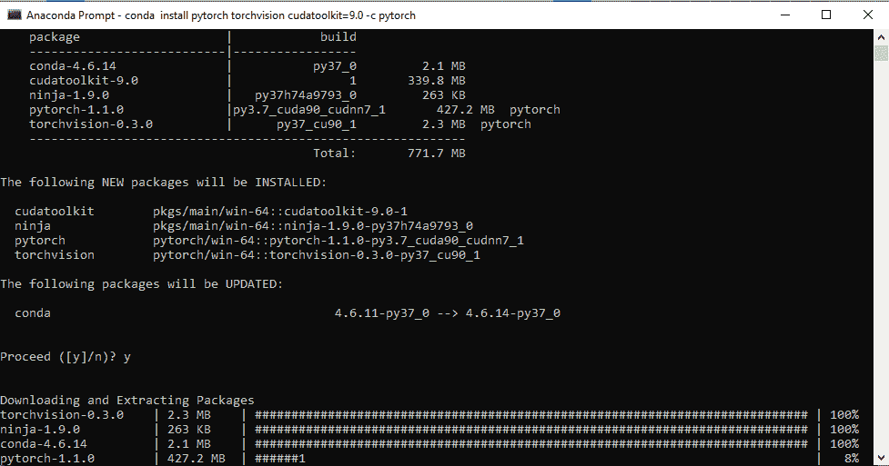

下载并安装所有软件包需要一些时间。完成您的命令后，您的光标切换到您的目录的文件夹。

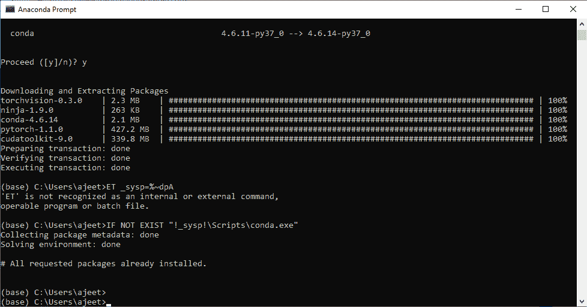

**第五步:**

现在，执行 conda list pytorch 命令，检查所有软件包是否安装成功。

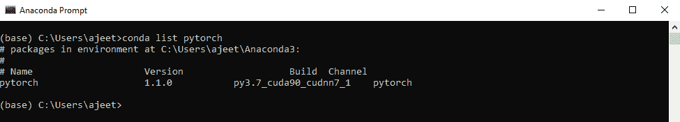

**第六步:**

现在，测试 PyTorch。运行 python 命令使用 python。导入火炬与 PyTorch 一起工作并执行操作。

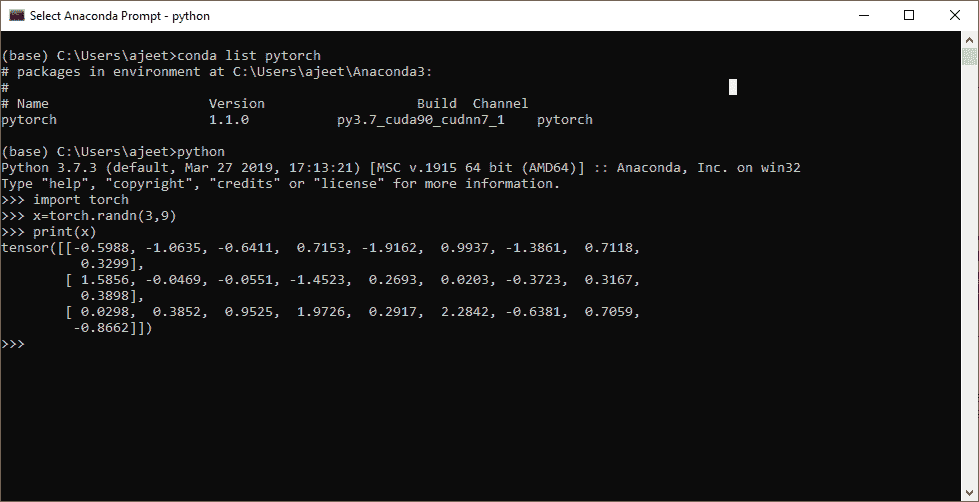

## 在 Linux 上安装

Linux 中的 PyTorch 安装类似于使用 Conda 安装 Windows。要在您的 Linux 系统中安装 PyTorch，您必须遵循下面给出的步骤。

**第一步:**

您的第一步是在您的 Linux 操作系统中下载 Anaconda。下载需要通过以下链接[https://www.anaconda.com/distribution/](https://www.anaconda.com/distribution/)。

**第二步:**

在这里，你选择最新版本的 python，即 3.7，点击鼠标右键，复制链接地址进行安装。

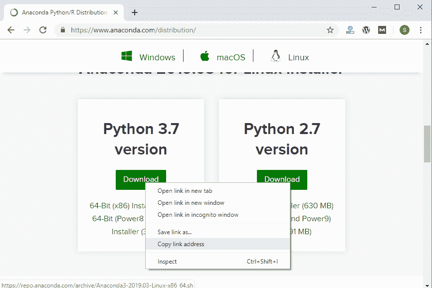

**第三步:**

打开您的终端，使用 wget <link>命令在终端上运行复制链接。该命令在您的 Linux 系统中下载 Anaconda。

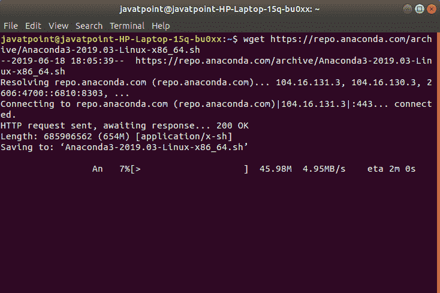

下载需要几秒钟。一旦下载完成，你的光标回到你的主目录。

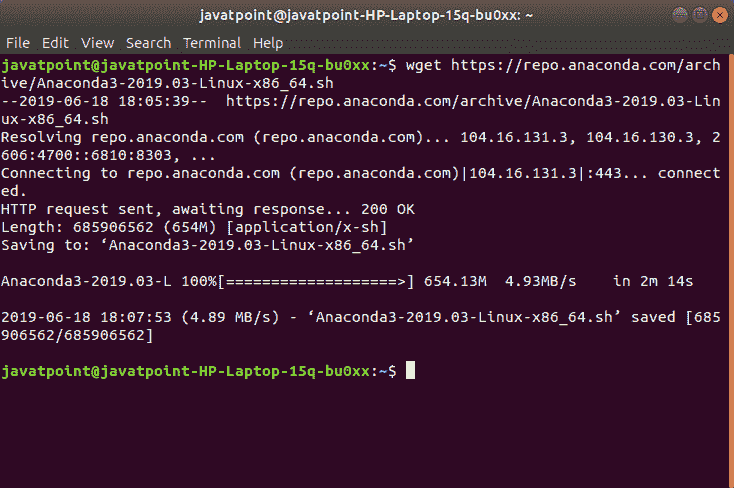

**第四步:**

下一步是在您的系统中安装 Anaconda。要安装它，你必须首先进入下载目录或你下载你的蟒蛇。安装是用 bash 文件完成的，因为在 Linux 中，当你下载 Anaconda 时，它是作为 bash 文件下载的。所以，要安装 Anaconda，你必须为最新版本的 python 3.7 运行**bash ~/Downloads/Anaconda 3-2019.03-Linux-x86 _ 64 . sh**命令，或者为 python 2.7 运行**bash ~/Downloads/Anaconda 2-2019.03-Linux-x86 _ 64 . sh**命令。

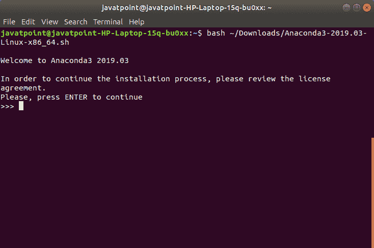

在这里，您必须按回车键才能继续。当您按回车键时，安装就开始了。安装几次后，它会再问您一个问题，即您接受许可条款吗？你通过打字给它一个答案，是的。

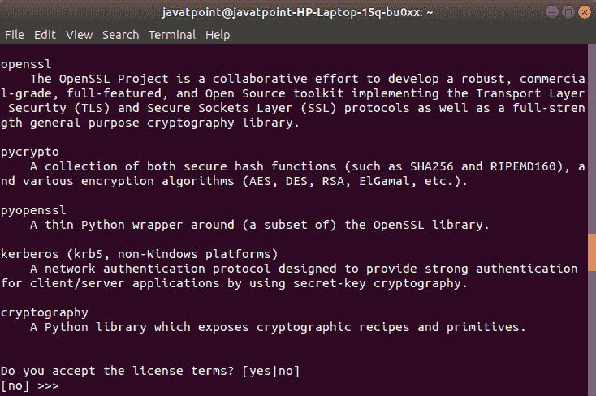

**第五步:**

当您键入 yes 并按 enter 时，您的 anaconda 安装开始。几次安装后，它再次问你最后一个问题，即，你希望安装程序通过运行 conda init 来初始化 Anaconda3 吗？您再次键入 yes 作为答案，然后，您的光标返回到下载目录。

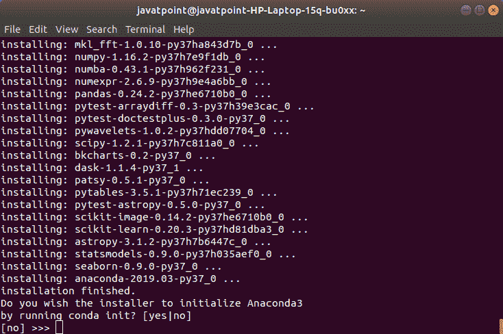

**第六步:**

现在下一步是运行**源码~/。bashrc** 和**蟒蛇-领航员**然后我们安装 PyTorch。

**第七步:**

下一步是使用[https://pytorch.org/](https://pytorch.org/)链接前往 PyTorch 官方网站。

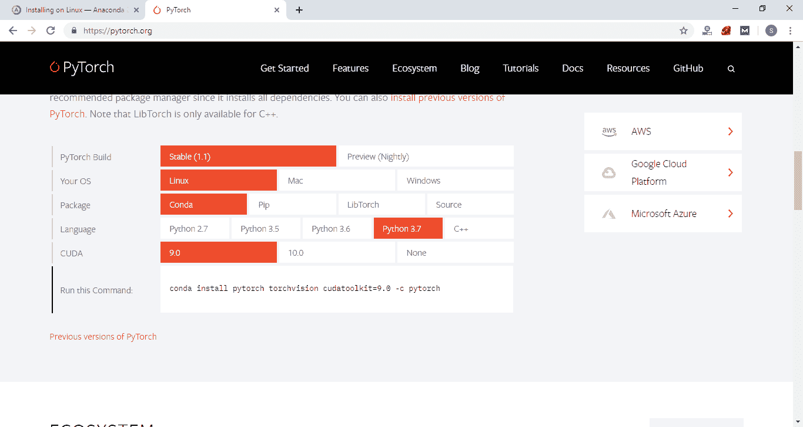

在这里，您必须选择您的操作系统、软件包、语言和 CUDA 版本。我用的是 python 3.7 和 CUDA 9.0 的 Conda 包。

**第八步:**

现在你必须在你的终端上运行官方网站给出的命令。请记住，您运行的命令类似于给定的命令；否则，它将生成安装不成功的错误消息。

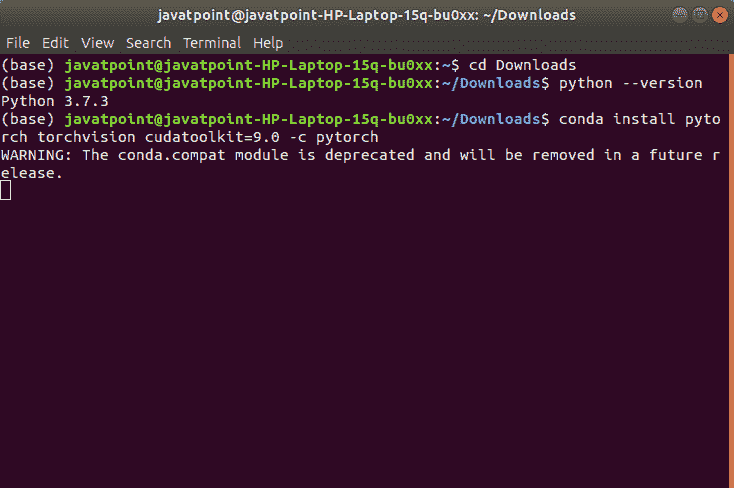

几秒钟后，它会要求您更新软件包(如果有)。我们必须通过写 y 给出答案。

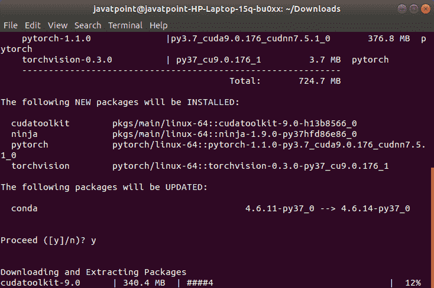

一旦你给出它的答案，它就开始下载所有的包，比如 PyTorch、Cudatoolkit、Conda、Torch 等。

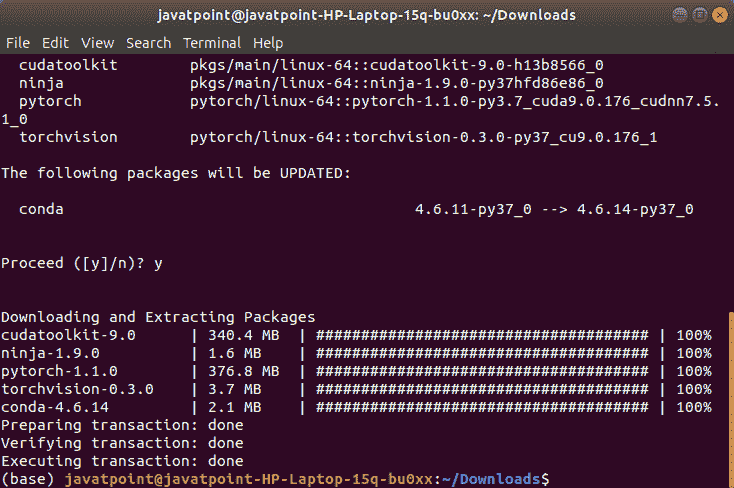

**第九步:**

现在，PyTorch 安装成功。是时候通过执行 Torch 程序来测试 PyTorch 了。

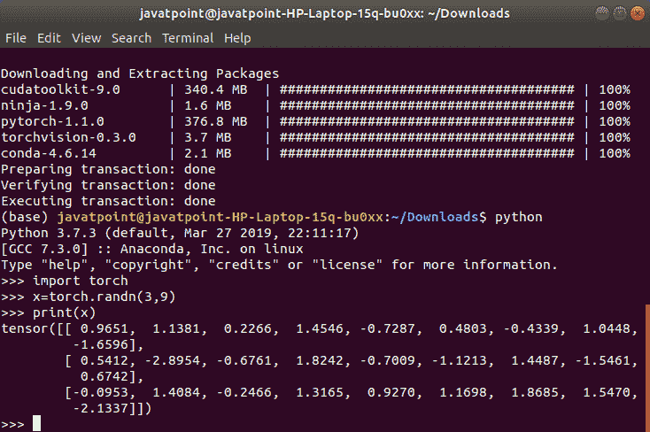

* * *