# PyTorch 中的 torch.nn

> 原文：<https://www.javatpoint.com/torch_nn-in-pytorch>

PyTorch 提供 torch.nn 模块来帮助我们创建和训练神经网络。我们将首先在 MNIST 数据集上训练基本神经网络，而不使用这些模型中的任何特征。我们将只使用基本的 PyTorch 张量功能，然后我们将一次从 torch.nn 增量添加一个特征。

> ***torch.nn 为我们提供了更多的类和模块来实现和训练神经网络。*T3】**

nn 包包含以下模块和类:

| S.No | 类和模块 | 描述 |
| 1. | 参数 | 它是张量的一种，被认为是模参数。 |
| 2. | 容器 |  |
| 1)火炬模块 | 它是所有神经网络模块的基类。 |
| 2)手电筒。神经网络。顺序 | 这是一个顺序容器，其中模块的添加顺序与它们在构造函数中传递的顺序相同。 |
| 3) torch.nn.ModuleList | 这将保存列表中的子模块。 |
| 4)torch . nn . modulate | 这将在一个目录中保存子模块。 |
| 5) torch.nn.ParameterList | 这将保存列表中的参数。 |
| 6) torch.nn.parameterDict | 这将保存目录中的参数。 |
| 3. | 卷积层 |  |
| 1) torch.nn.Conv1d | 这个包将用于对由几个输入平面组成的输入信号进行 1D 卷积。 |
| 2)二维 Conv 的 torch.nn.Conv | 这个包将用于对由几个输入平面组成的输入信号进行 2D 卷积。 |
| 3) torch.nn.Conv3d | 该软件包将用于对由几个输入平面组成的输入信号进行三维卷积。 |
| 4) torch.nn.ConvTranspose1d | 这个包将用于在由几个输入平面组成的输入图像上应用 1D 转置卷积算子。 |
| 5) torch.nn.ConvTranspose2d | 这个包将用于在由几个输入平面组成的输入图像上应用 2D 转置卷积算子。 |
| 6) torch.nn.ConvTranspose3d | 该软件包将用于在由几个输入平面组成的输入图像上应用 3D 转置卷积算子。 |
| 7)打开火炬 | 它用于从成批输入张量中提取滑动局部块。 |
| 8)火炬，折叠 | 它用于将一组滑动的局部块组合成一个大的包含张量。 |
| 4. | 汇集层 |  |
| 1) torch.nn.MaxPool1d | 它用于对由多个输入平面组成的输入信号应用 1D 最大汇集。 |
| 2)火炬. nn.MaxPool2d | 它用于对由多个输入平面组成的输入信号应用 2D 最大汇集。 |
| 3) torch.nn.MaxPool3d | 它用于对由几个输入平面组成的输入信号应用 3D 最大汇集。 |
| 4) torch.nn.MaxUnpool1d | 它用于计算 MaxPool1d 的部分逆。 |
| 5)火炬. nn . max unpol 2d | 它用于计算 MaxPool2d 的部分逆。 |
| 6) torch.nn.MaxUnpool3d | 它用于计算 MaxPool3d 的部分逆。 |
| 7） 火炬.nn.平均池 1d | 它用于对由几个输入平面组成的输入信号应用 1D 平均汇集。 |
| 8） 火炬.nn.平均池 2d | 它用于对由几个输入平面组成的输入信号应用 2D 平均汇集。 |
| 9） 火炬.nn.平均池 3d | 它用于对由几个输入平面组成的输入信号应用三维平均汇集。 |
| 10) torch.nn .分数 MaxPool2d | 它用于对由多个输入平面组成的输入信号应用 2D 分数最大汇集。 |
| 11) torch.nn.LPPool1d | 它用于对由多个输入平面组成的输入信号应用 1D 功率平均汇集。 |
| 12)火炬. nn.LPPool2d | 它用于对由多个输入平面组成的输入信号应用 2D 功率平均汇集。 |
| 13) torch.nn.AdavtiveMaxPool1d | 它用于对由多个输入平面组成的输入信号应用 1D 自适应最大汇集。 |
| 14) torch.nn.AdavtiveMaxPool2d | 它用于对由多个输入平面组成的输入信号应用 2D 自适应最大汇集。 |
| 15) torch.nn.AdavtiveMaxPool3d | 它用于对由几个输入平面组成的输入信号应用 3D 自适应最大汇集。 |
| 16)torch . nn . adavtivagppool 1d | 它用于对由几个输入平面组成的输入信号应用 1D 自适应平均汇集。 |
| 17)二维 torch . nn . adavtiveavgpool | 它用于对由几个输入平面组成的输入信号应用 2D 自适应平均汇集。 |
| 18)torch . nn . adavtivagppool 3d | 它用于对由几个输入平面组成的输入信号应用三维自适应平均汇集。 |
| 5. | 填充层 |  |
| 1) torch.nn.ReflectionPad1d | 它将使用输入边界的反射来填充输入张量。 |
| 2)火炬. nn 重构垫 | 它将使用输入边界的反射来填充输入张量。 |
| 3) torch.nn.ReplicationPad1 | 它将使用输入边界的复制来填充输入张量。 |
| 4) torch.nn.ReplicationPad2d | 它将使用输入边界的复制来填充输入张量。 |
| 5) torch.nn.ReplicationPad3d | 它将使用输入边界的复制来填充输入张量。 |
| 6） 火炬.nn.ZeroPad2d | 它将用零填充输入张量边界。 |
| 7)torch . nn . constantipad 1d | 它将用一个常数值填充输入张量边界。 |
| 8)圆环. nn . constantipad 2d | 它将用一个常数值填充输入张量边界。 |
| 9)torch . nn . constantipad 3d | 它将用一个常数值填充输入张量边界。 |
| 6. | 非线性激活(加权和，非线性) |  |
| 1) torch.nn.ELU | 它将用于应用元素式函数:
ELU(x)=最大值(0，x)+最小值(0，α*(exp(x)-1)) |
| 2) torch.nn.Hardshrink | 它将用于按元素应用硬收缩函数:
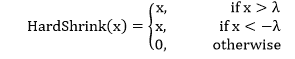 |
| 3)torch . nn . Leakey Lu | 它将用于应用元素式函数:
LeakyReLu(x)=max(0，x)+负 _slope*min(0，x) |
| 4) torch.nn.LogSigmoid | 它将用于应用元素方式函数:
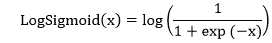 |
| 5) torch.nn .多头注意 | 它用于允许模型关注来自不同表示子空间的信息 |
| 6)火炬 | 它将用于应用元素式函数:
PReLU(x)=max(0，x)+a*min(0，x) |
| 7)火炬 | 它将用于逐元素应用校正的线性单位函数:
ReLU(x)=max(0，x) |
| 8) torch.nn .继电器 6 | 它将用于应用逐元素函数:
ReLU6(x)=min(max(0，x)，6) |
| 9) torch.nn.RReLU | 它将用于应用随机泄漏整流线性单位函数，元素方式，如论文中所述:
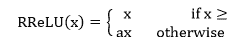 |
| 10） 火炬 | 它将用于应用元素方式的函数为:
SELU(x)=比例*(max(0，x)+ min(0，a *(exp(x)-1))

这里α= 1.6732632423543772848170429916717 和比例= 1.05070493493493495.9349852946 |
| (11)托奇 | 它将用于应用元素方式函数为:
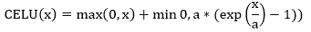 |
| 12) torch.nn.Sigmoid | 它将用于应用元素方式函数为:
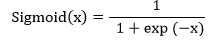 |
| 13） 火炬.nn.Softplus | 它将用于应用元素方式函数为:
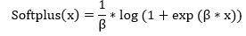 |
| 14)torch . nn . Softhrink | 它将使用元素方式应用软收缩功能:
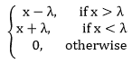 |
| 15) torch.nn.Softsign | 它将用于应用元素方式函数为:
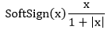 |
| 16) torch.nn.Tanh | 它将用于应用元素方式函数为:
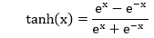 |
| 17) torch.nn.Tanhshrink | 它将用于应用元素方式的函数为:
Tanhshrink(x)=x-Tanh(x) |
| 18) torch.nn .阈值 | 它将使用阈值输入张量的每个元素。阈值定义为:
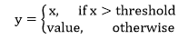 |
| 7. | 非线性激活(其他) |  |
| 1) torch.nn.Softmin | 它用于将软最小函数应用于 n 维输入张量，以重新缩放它们。之后，n 维输出张量的元素位于 0、1 和 1 的范围内。软敏定义为:
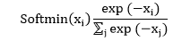 |
| 2) torch.nn.Softmax | 它用于将 softmax 函数应用于 n 维输入张量，以重新缩放它们。之后，n 维输出张量的元素位于 0、1 和 1 的范围内。Softmax 定义为:
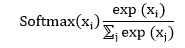 |
| 3) torch.nn.Softmax2d | 它用于将软最大值应用于每个空间位置的要素。 |
| 4) torch.nn.LogSoftmax | 它用于将 LogSoftmax 函数应用于 n 维输入张量。LofSoftmax 函数可以定义为:
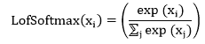 |
| 5)torch . nn . adaptivelogsftmaxwithloss | 这是一种用于训练具有大输出空间的模型的策略。当标签分布高度不平衡时，这是非常有效的 |
| 8. | 标准化层 |  |
| 1) torch.nn .批次标准 1d | 它用于在 2D 或三维输入上应用批量标准化。
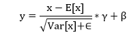 |
| 2) torch.nn .批次标准 2d | 它用于在 4D 上应用批处理规范化。
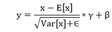 |
| 3) torch.nn .批次标准 3d | 它用于对 5D 输入应用批量标准化。
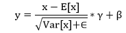 |
| 4) torch.nn.GroupNorm | 它用于对小批量输入应用组规范化。
 |
| 5)torch . nn . syncbatch 标准 | 它用于对 n 维输入应用批处理规范化。
 |
| 6)火炬. nn .实例标准 1d | 它用于对 3D 输入应用实例规范化。
 |
| 7) torch.nn .实例标准 2d | 它用于对 4D 输入应用实例规范化。
 |
| 8)torch . nn . 3d 实例标准 | 它用于对 5D 输入应用实例规范化。
 |
| 9)火炬. nn .图层标准 | 它用于在小批量输入上应用层规范化。
 |
| 10)torch . nn . Localresponse ORM | 它用于对由几个输入平面组成的输入信号进行局部响应归一化，其中通道占据第二维。 |
| 9. | 循环层 |  |
| 1)火炬. nn.RNN | 它用于将具有 tanh 或 ReLU 非线性的多层埃尔曼 RNN 应用于输入序列。每层为输入序列中的每个元素计算以下函数:
ht= tanh(Wihxt+bih+Whhtt-1+bhh |
| (2)火炬传递 | 它用于将多层长短期记忆(LSTM) RNN 应用于输入序列。每个层为输入序列中的每个元素计算以下函数:
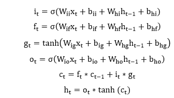 |
| (3) torch.nn .起重机 | 它用于将多层门控循环单位(GRU) RNN 应用于输入序列。每个层为输入序列中的每个元素计算以下函数:
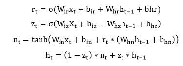 |
| 4) torch.nn.RNNCell | 它用于将具有 tanh 或 ReLU 非线性的埃尔曼 RNN 单元应用于输入序列。每一层为输入序列中的每个元素计算以下函数:
T1】h’= tanh(Wihx+bih+Whhh+bhh)
ReLU 用来代替 tanh |
| (5)托奇 | 它用于将长短期记忆(LSTM)单元应用于输入序列。每个层为输入序列中的每个元素计算以下函数:
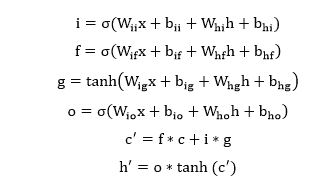
，其中σ是 sigmoid 函数，而*是哈达玛乘积。 |
| 6) torch.nn.GRUCell | 它用于将门控循环单位(GRU)细胞应用于输入序列。每个层为输入序列中的每个元素计算以下函数:
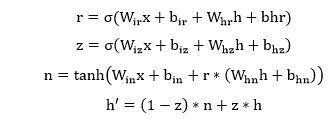 |
| 10. | 线性层 |  |
| 1)火炬，身份 | 这是一个占位符标识运算符，不区分参数。 |
| 2)火炬，线性 | 用于对输入数据进行线性变换:
y=xA T +b |
| 3) torch.nn .双线性 | 它用于对传入数据应用双线性变换:
y=x 1 Ax 2 +b |
| 11. | 脱落层 |  |
| 1)torch . nn . drop | 它用于调节和防止神经元的共同适应。在训练期间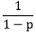的因子缩放输出。这意味着模块在评估过程中计算一个身份函数。 |
| 2) torch.nn.Dropout2d | 如果特征图中的相邻像素是相关的，那么 torch.nn.Dropout 将不会规范激活，并且会降低有效学习率。在这种情况下，torch.nn.Dropout2d()用于促进要素地图之间的独立性。 |
| 3) torch.nn.Dropout3d | 如果特征图中的相邻像素是相关的，那么 torch.nn.Dropout 将不会规范激活，并且会降低有效学习率。在这种情况下，torch.nn.Dropout2d()用于促进要素地图之间的独立性。 |
| 4) torch.nn.AlphaDropout | 它用于对输入应用 Alpha Dropout。Alpha Dropout 是一种保持自规格化特性的 drop。 |
| 12. | 稀疏层 |  |
| 1)火炬嵌入 | 它用于存储单词嵌入，并使用索引检索它们。模块的输入是一个索引列表，输出是相应的单词嵌入。 |
| 2) torch.nn.EmbeddingBag | 它用于计算嵌入的“包”的和或平均值，而不用实例化中间嵌入。 |
| 13. | 距离函数 |  |
| 1)torch . nn . Cosinesiality | 它将返回 x1 和 x2 之间的余弦相似度，沿着 dim 计算。
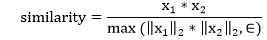 |
| 2) torch.nn.PairwiseDistance | 它使用 p 范数计算向量 v1、v2 之间的成对分批距离:
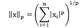 |
| 14. | 损失函数 |  |
| 1)火炬损失 | 它用于衡量输入 x 和目标 y 中每个元素之间的平均绝对误差的标准。未减少的损失可以描述为:
l(x，y)=L={l 1 ，...，l n }，lN= &#124; xN-yN&#124;，
其中 N 为批次大小。 |
| 2)torch . nn . ms loss | 它用于衡量输入 x 和目标 y 中每个元素之间的均方误差的标准。未减少的损失可描述为:
l(x，y)=L={l 1 ，...，l n }，lN=(xN-yN)2，
其中 N 为批次大小。 |
| 3) torch.nn.CrossEntropyLoss | 该准则结合了神经网络。LogSoftmax()和 nn。NLLLoss()在一个单独的类中。当我们用 C 类训练分类问题时，这很有帮助。 |
| 4)torch . nn . ctclos | 连接主义时间分类损失计算连续时间序列和目标序列之间的损失。 |
| (5)火炬. nn.NLLLoss | 负对数似然损失用于训练 C 类分类问题。 |
| (6)泥炭. nn .泊松损失 | t
目标泊松分布的负对数似然损失~泊松(输入)损失(输入，目标)=输入-目标*对数(目标！)他瞄准了。 |
| 7) torch.nn.KLDivLoss | 它是连续分布的一个有用的距离度量，当我们在连续输出分布的空间上执行直接回归时，它也是有用的。 |
| 8) torch.nn.BCELoss | 它被用来创建一个标准，衡量目标和输出之间的二元交叉熵。未减少的损失可以描述为:
l(x，y)=L={l 1 ，...，l n }，lN=-wN【yN* logxN+(1-yN)* log(1-xN)，
其中 N 为批次大小。 |
| (9)torch . nn . bcewithytsloser | 它将 Sigmoid 层和 BCELoss 结合在一个类中。我们可以利用对数-和-exp 技巧，通过将运算合并到一层来获得数值稳定性。 |
| 10) torch.nn.MarginRankingLoss | 它创建了一个标准来测量给定输入 x1、x2、两个 1D 小批量张量和一个包含 1 或-1 的 1D 小批量张量 y 的损失。小批量中每个样品的损失函数如下:
损失(x，y)=最大值(0，-y *(x1-x2)+余量 |
| 11)torch . nn . hingee embedded loss | HingeEmbeddingLoss 测量给定的包含 1 或-1 的输入张量 x 和标签张量 y 的损失。它用于测量两个输入是否相似。损失函数定义为:
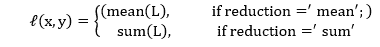 |
| 12)torch . nn . multillbarginloss | 用于创建优化输入 x 和输出 y 之间的多类多分类铰链损耗的标准 |
| 13)torch . nn . smooth 1 loss | 它用于创建一个标准，如果绝对元素误差低于 1，则使用平方项，否则使用 L1 项。也叫胡贝尔损失:
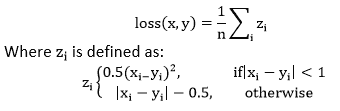 |
| 14) torch.nn .软利润损失 | 它用于创建一个准则，该准则优化了输入张量 x 和包含 1 或-1 的目标张量 y 之间的两类分类逻辑损失。
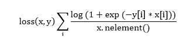 |
| 15) torch.nn .多边利润损失 | 它用于创建一个标准，该标准基于输入 x 和大小为(N，C)的目标 y 之间的最大熵来优化多标签单对全损失。
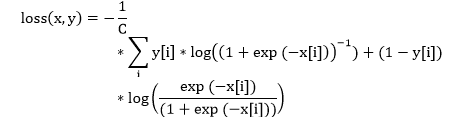 |
| 16)torch . nn . CosineDembed loss | 它用于创建一个标准，该标准测量给定输入张量 x1、x2 以及值为 1 或-1 的张量标签 y 的损失。它用于测量两个输入是否相似，使用余弦距离。
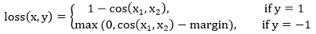 |
| 17) torch.nn .多式联运 | 它用于创建一个标准，该标准优化输入 x 和输出 y 之间的多类分类铰链损耗
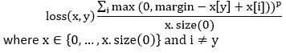 |
| 18) torch.nn.TripletMarginLoss | 它用于创建一个标准，该标准测量给定输入张量 x1、x2、x3 和大于 0 的裕量的三重损失。它用于测量样本之间的相对相似性。三元组由一个锚点、一个正例和一个负例组成。
L(a，p，n)=最大{d(a i ，p i )-d(a i ，nI)+余量，0} |
| 15. | 视觉层 |  |
| 1) torch.nn.PixelShuffle | 它用于将形状张量(*，C×r 2 ，H，W)中的元素重新排列为形状张量(*，C，H×r，W，r) |
| 2) torch.nn.Upsample | 它用于对给定的多通道 1D、2D 或 3D 数据进行上采样。 |
| 3)torch . nn . ups amplitude 2d 测试 | 它用于对由多个输入通道组成的输入信号应用 2D 最近邻上采样。 |
| 4)torch . nn . upsmampling bilinear 2d | 它用于对由多个输入通道组成的输入信号应用 2D 双线性上采样。 |
| 16. | 数据并行层(多图形处理器，分布式) |  |
| 1) torch.nn.DataParallel | 它用于在模块级实现数据并行。 |
| 2)torch . nn . distributed data parallel | 用于实现分布式数据并行，在模块级基于 torch.distributed 包。 |
| 3)torch . nn . distributeddataparallelcpu | 它用于在模块级为中央处理器实现分布式数据并行。 |
| 17. | 公用事业 |  |
| 1)torch . nn . clip _ deg _ norm _ 中的值 | 它用于裁剪一系列参数的梯度范数。 |
| 2) torch.nn.clip_grad_value_ | 它用于将一系列参数的梯度范数限制在指定值。 |
| 3)torch . nn . parameters _ to _ vector | 它用于将参数转换为一个向量。 |
| 4)torch . nn . vector _ to _ 参数 | 它用于将一个向量转换为参数。 |
| 5) torch.nn.weight_norm | 它用于对给定模块中的参数应用权重归一化。
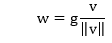 |
| 6) torch.nn.remove_weight_norm | 它用于从模块中移除权重规范化和重新参数化。 |
| 7)torch . nn . spectrum _ norm | 它用于对给定模块中的参数应用光谱归一化。 |
| 8) torch.nn.PackedSequence | 它将用于保存打包序列的数据和批次大小列表。 |
| 9)torch . nn . pack _ padding _ sequence | 它用于打包包含可变长度填充序列的张量。 |
| 10)torch . nn . pad _ packed _ sequence | 它用于填充一批包装好的可变长度序列。 |
| 11) torch.nn.pad_sequence | 它用于用填充值填充可变长度张量列表。 |
| 12) torch.nn.pack_sequence | 它用于打包可变长度张量的列表 |
| 13)torch . nn . remove _ spectrum _ norm | 它用于从模块中移除光谱归一化和重新参数化。 |

**参考:**

[https://pytorch.org/docs/stable/nn.html](https://pytorch.org/docs/stable/nn.html)

* * *