# PyTorch 基础知识

> 原文：<https://www.javatpoint.com/basics-of-pytorch>

理解使用 PyTorch 所需的所有基本概念至关重要。PyTorch 完全基于张量。张量有操作要执行。除了这些，还有许多其他的概念需要执行任务。

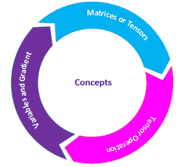

现在，逐一了解所有概念，以获得对 PyTorch 的深入了解。

## 矩阵或张量

张量是 Pytorch 的关键组成部分。我们可以说 PyTorch 完全基于张量。在数学术语中，一个矩形数字阵列被称为度量。在 Numpy 库中，这些指标被称为 **ndaaray** 。在 PyTorch 中，它被称为**张量**。张量是一个 n 维数据容器。例如，在 PyTorch 中，1d-Tensor 是向量，2d-Tensor 是度量，3d- Tensor 是立方体，4d-Tensor 是立方体向量。

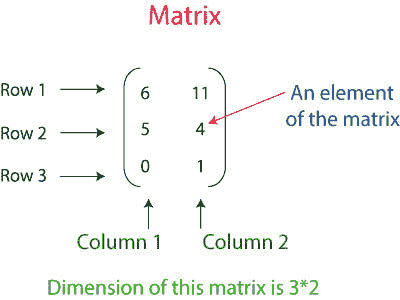

**以上矩阵表示三行两列的 2D 张量。**

创建张量有三种方法。每一个都有不同的方法来创建张量。张量被创建为:

1.  创建一个数组
2.  用所有的 1 和随机数创建一个张量
3.  从 numpy 数组创建张量

让我们看看张量是如何产生的

### 创建一个 PyTorch 张量作为数组

在这种情况下，您必须首先定义数组，然后在 torch 的 Tensor 方法中将该数组作为参数传递。

**例如**

```

import torch
arr = [[3, 4], [8, 5]] 
pyTensor = torch.Tensor(arr)
print(pyTensor)        

```

**输出:**

```
tensor ([[3., 4.],[8., 5.]])

```

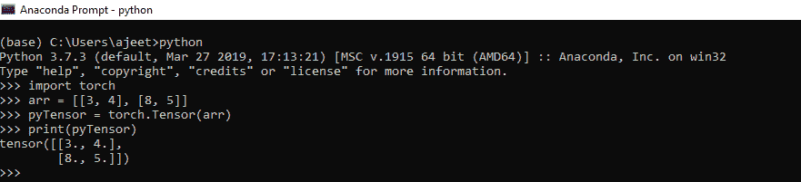

### 用随机数和全 1 创建一个张量

要创建一个随机数张量，你必须使用 rand()方法，要创建一个包含所有张量的张量，你必须使用 torch 的 one()。为了生成随机数，火炬的另一种方法将与 rand 一起使用，即手动种子，参数为 0。

**例如**

```

import torch
ones_t = torch.ones((2, 2)) 
torch.manual_seed(0)  //to have same values for random generation
rand_t = torch.rand((2, 2))
print(ones_t)
print(rand_t)

```

**输出:**

```
Tensor ([[1., 1.],[1., 1.]])
tensor ([[0.4963, 0.7682],[0.0885, 0.1320]])

```

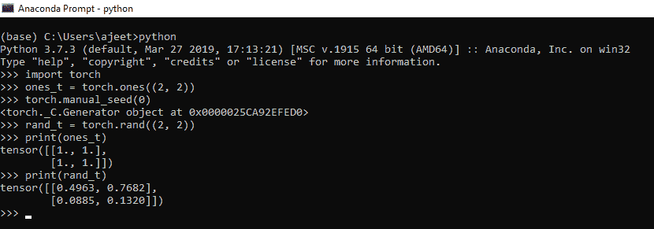

### 从 numpy 数组创建张量

要从 numpy 数组创建 Tensor，我们必须创建 numpy 数组。一旦创建了 numpy 数组，我们就必须将它作为参数从 _numpy()传入。此方法将 numpy 数组转换为 Tensor。

**例如**

```

import torch
import numpy as np1
numpy_arr = np1.ones((2, 2))
pyTensor = torch.from_numpy(numpy_arr)
np1_arr_from_Tensor = pyTensor.numpy()
print(np1_arr_from_Tensor)

```

**输出:**

```
[[1\. 1.] [1\. 1.]]

```

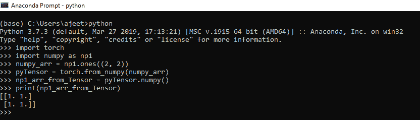

## 张量运算

张量类似于一个数组，所以我们在一个数组上进行的所有运算也可以适用于张量。

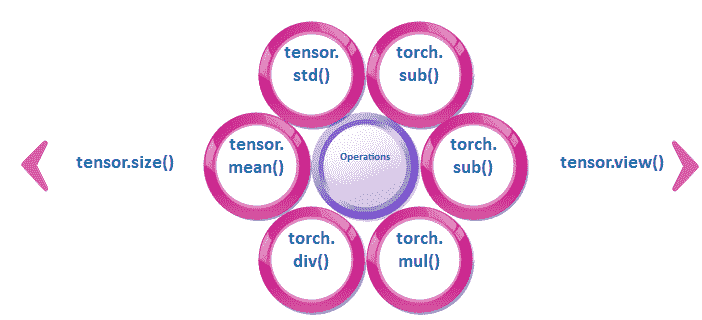

### 1)调整张量的大小

我们可以使用张量的大小属性来调整张量的大小。我们使用 Tensor.view()来调整张量的大小。调整张量大小意味着将 2*2 维张量转换为 4*1 或 4*4 维张量转换为 16*1，依此类推。要打印张量大小，我们使用 Tensor.size()方法。

让我们看一个调整张量大小的例子。

```

import torch
pyt_Tensor = torch.ones((2, 2))
print(pyt_Tensor.size())        # shows the size of this Tensor
pyt_Tensor = pyt_Tensor.view(4) # resizing 2x2 Tensor to 4x1
print(pyt_Tensor)

```

**输出:**

```
torch.Size ([2, 2])
tensor ([1., 1., 1., 1.])

```

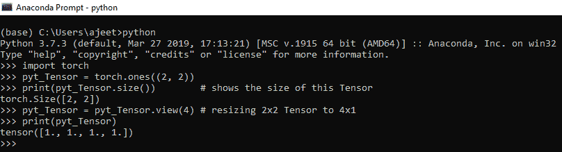

### 2)数学运算

所有的数学运算，如加法、减法、除法和乘法都可以在张量上执行。手电筒可以做数学运算。我们使用 torch.add()、torch.sub()、torch.mul()和 torch.div()在 Tensors 上执行操作。

让我们看一个数学运算是如何执行的例子:

```

import numpy as np
import torch
Tensor_a = torch.ones((2, 2))
Tensor_b = torch.ones((2, 2))
result=Tensor_a+Tensor_b
result1 = torch.add(Tensor_a, Tensor_b)     //another way of addidtion
Tensor_a.add_(Tensor_b)	// In-place addition
print(result)
print(result1)
print(Tensor_a)

```

**输出:**

```
tensor ([[2., 2.], [2., 2.]])
tensor ([[2., 2.], [2., 2.]])

```

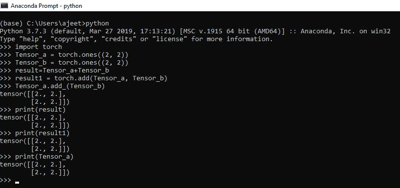

### 3)平均值和标准偏差

我们可以计算一维或多维张量的标准差。在我们的数学计算中，我们首先要计算平均值，然后我们用平均值对给定的数据应用下面的公式。

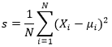

但是在 Tensor 中，我们可以用 Tensor.mean()和 Tensor.std()来求给定张量的偏差和平均值。

让我们看一个它如何表现的例子。

```

import torch
pyTensor = torch.Tensor([1, 2, 3, 4, 5])
mean = pyt_Tensor.mean(dim=0)        //if multiple rows then dim = 1
std_dev = pyTensor.std(dim=0)       // if multiple rows then dim = 1
print(mean)
print(std_dev)

```

**输出:**

```
tensor (3.)
tensor (1.5811)

```

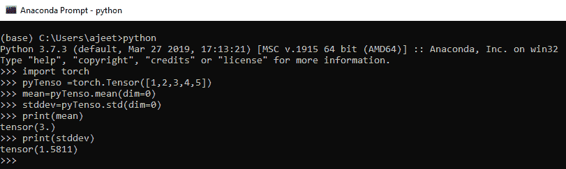

## 变量和梯度

包的中心类是**自动签名变量**。它的主要任务是包裹一个**张量**。它支持几乎所有在其上定义的操作。你可以叫**。back Ford()**并仅在完成计算时计算所有梯度。

通过**。数据**属性，可以访问行 Tensor，同时这个变量的梯度累加到**中。grad** 。

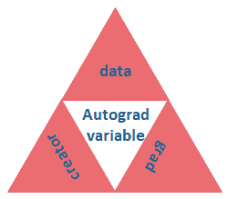

在深度学习中，梯度计算是关键。变量用于计算 PyTorch 中的梯度。简单地说，变量只是一个具有梯度计算功能的张量的包装器。

下面是用于管理变量的 python 代码。

```

import numpy as np
import torch
from torch.autograd import Variable
pyt_var = Variable(torch.ones((2, 2)), requires_grad = True)

```

上述代码的行为与张量相同，因此我们可以以相同的方式应用所有操作。

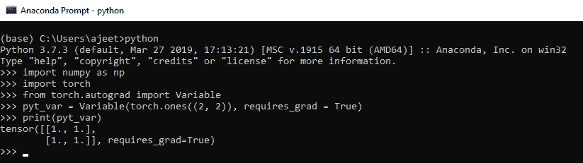

让我们看看如何在 PyTorch 中计算梯度。

### 例子

```

import numpy as np
import torch
from torch.autograd import Variable  
// let's consider the following equation
// y = 5(x + 1)^2
x = Variable (torch.ones(1), requires_grad = True)
y = 5 * (x + 1) ** 2        //implementing the equation.
y.backward()                // calculate gradient
print(x.grad)                // get the gradient of variable x
# differentiating the above mentioned equation
// => 5(x + 1)^2 = 10(x + 1) = 10(2) = 20

```

**输出:**

```
tensor([20.])

```

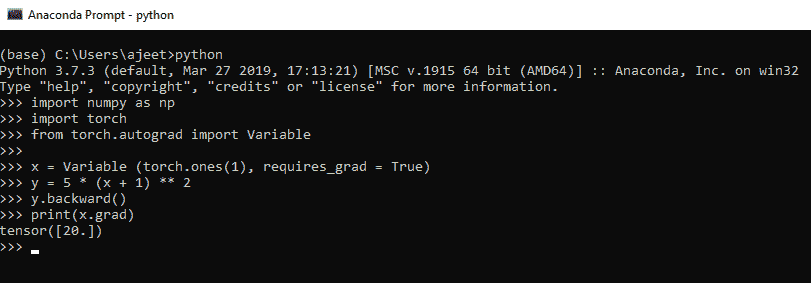

* * *