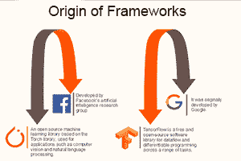
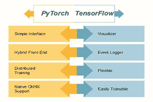
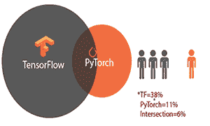
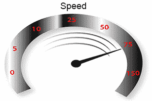
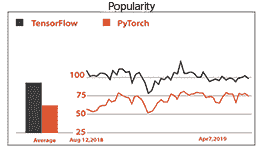
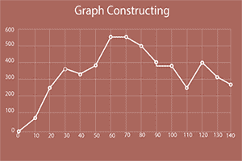
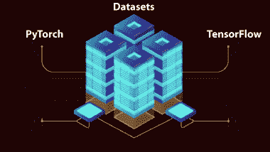
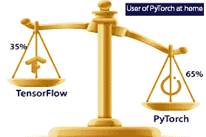

# PyTorch vs. TensorFlow

> 哎哎哎:# t0]https://www . javatppoint . com/pytorch-vs-tensorlow

启动新项目需要了解 **PyTorch** 和 **TensorFlow** 的区别。当开发人员决定从事深度学习或机器学习研究时，库发挥着至关重要的作用。根据一项调查，有 1616 名 ML 开发人员和数据科学家正在使用 PyTorch，3.4 名 ML 开发人员正在使用 TensorFlow。

**我们将基于以下因素比较两个框架:**

## 1)起源

PyTorch 是一个基于 Torch 库的机器学习库。**脸书人工智能研究小组**将其开发用于应用，例如深度学习和自然语言处理。它是在**修正版 BSD 许可**下发布的免费开源软件。TensorFlow也是一个开源的机器学习，最初是由**谷歌**开发的。

* * *

## 2)特征

PyTorch 有几个吸引人的特点，例如:

1.  对 Python 的本机支持
2.  动态计算图
3.  支持 CUDA

这些特性确保运行代码的时间更少，并提高了性能。另一方面，TensorFlow 还具有区分和吸引功能，例如 **TensorBoard** ，这将是可视化机器学习模型时的一个很好的选择。它还提供了**TensorFlow service**，这是一个特定的 **grpc 服务器**，在生产期间的部署过程中使用。

* * *

## 3)社区

PyTorch 的社区比 TensorFlow 小得多。TensorFlow 被商业组织、学术界等各个领域的许多研究者采用。在 TensorFlow 中，更容易找到资源或解决方案。TensorFlow 和 PyTorch 中有大量的教程、代码以及支持。

* * *

## 4)空气污染指数

如果要说 **API** ，那么 TensorFlow 是最好的，因为它提供了高、低级别的**API**。PyTorch 提供了更低级的 API，它专注于数组表达式的直接工作。PyTorch 在过去的一年里获得了极大的兴趣，并成为深度学习学术研究和应用的首选解决方案，这需要优化自定义表达式。

* * *

## 5)速度

**PyTorch** 和 **TensorFlow** 是两个最流行的深度学习框架。 **PyTorch** 适合在家里工作，正在实施第一个深度学习项目的人。但是 **TensorFlow** 如果我们在办公室工作，并且我们对深度学习项目有很好的了解，那么就会用到。如果我们将 **PyTorch** 和 **TensorFlow** 两者的速度进行比较，那么两者的框架都提供了相似的步调，既快又适合表现。

* * *

## 6)人气

基于受欢迎程度，TensorFlow 被广泛使用，而不是 PyTorch。每个组织都需要简单可读的体系结构，以及大数据集执行的高性能。PyTorch 比 TensorFlow 更年轻，人气增长迅速。PyTorch 允许自定义，而 TensorFlow 不允许。TensorFlow 拥有最多的 GitHub 活动、谷歌搜索、Medium 文章、亚马逊上的书籍和 ArXiv 文章。它被大多数开发人员使用，并在大多数在线职位描述中列出。

* * *

## 7)上升时间

PyTorch 是一个支持图形处理器的 NumPy 嵌入式替代产品，它具有构建和训练深度神经网络的高级功能。如果我们熟悉 Python、NumPy 和深度学习抽象，它会让 PyTorch 很容易学习。我们写 TensorFlow 代码的时候，首先会得到“**用 Python 把**编译成图，然后由 TensorFlow 执行引擎运行。TensorFlow 还有一些额外的概念需要学习，例如图、会话、占位符和变量范围。TensorFlow 的上升时间肯定比 PyTorch 长。

* * *

## 8)覆盖范围

TensorFlow 本身支持某些操作，例如沿维度翻转张量、检查张量的 Nan 和 infinity 以及快速傅立叶变换。它还有 **contrib 包**，用于创建更多模型。它为高级功能的使用提供了支持，并为我们提供了广泛的选择。

PyTorch 实现的功能仍然较少，但由于所有的关注，它将很快真正实现。PyTorch 在学习者和自由职业者中不像 TensorFlow 那样受欢迎。

* * *

## 9)部署

对于小规模的服务器端部署来说，这两个框架都很容易理解。TensorFlow 适用于**移动**和**嵌入式部署**。为了将其部署到**安卓系统**和 **IOS 系统**上，TensorFlow 需要做大量的工作。我们不必用 C++或 Java 重写模型的整个推理部分。PyTorch 在不关闭服务的情况下无法轻松热插拔，但 TensorFlow 可以轻松做到这一点。

* * *

## 10)序列化

框架的加载和保存模型都非常简单。PyTorch 有一个简单的 API，如果我们想要或者保存一个模型的所有权重，它可以腌制整个类。在序列化中，TensorFlow 的主要特点是整个图形可以保存为协议缓冲区，并且还包括参数和操作。之后，该图将以其他支持的语言加载，如 Java 和 C++。对于不支持 Python 的部署堆栈，TensorFlow 至关重要。当您更改模型源代码时，TensorFlow 可能会很有用，但是它应该能够运行旧模型。

* * *

## 11)图形构建和调试

PyTorch 在创建图形的整个过程中具有动态特性。图表可以通过解释对应于图表特定方面的代码行来构建，这样它就完全建立在运行时之上。

有了 TensorFlow，图的构造是静态的，需要经过编译。之后，它将在我们前面提到的执行引擎上运行。

* * *

## 12)可视化

当我们展示组织中的任何项目时，可视化发挥着重要的作用。为了可视化机器学习模型，TensorFlow 有 TensorBoard，它可以在训练模型期间提供帮助，并快速发现错误。它是模型图形的实时表示，不仅显示图形表示，还实时显示精度图形。PyTorch 中缺少此功能。

* * *

## 13)建筑

如果我们将 PyTorch 和 TensorFlow 与它们的架构进行比较，那么 PyTorch 的架构非常简单，而不是 TensorFlow。TensorFlow 不是很容易使用，尽管它提供了 **Keras** 作为框架，使工作变得更容易。当我们将 PyTorch 与 TensorFlow 进行比较时，它的可读性较差。

* * *

## 14)数据集

PyTorch 通常用于低性能模型和大数据集，另一方面，TensorFlow 用于高性能模型和大数据集。TensorFlow 在需要快速执行的大数据集执行中起着至关重要的作用。PyTorch 要简单得多，但并没有被使用，因为每个组织都有一个大的数据集用于高性能的执行。当我们想要执行低性能的大数据集时，使用 PyTorch。

* * *

## 15)文件

PyTorch 和 TensorFlow 都是基于 Python 编程语言。Python APIs 有很好的文档记录，所以通常会找到最好的。有一点让 TensorFlow 做得最好，那就是 PyTorch C 库大部分都是没有文档的。然而，这只有在编写定制的 C 扩展时才是重要的，也许如果对软件整体有贡献的话。

* * *

## 16)设备管理

在 TensorFlow 中，设备管理是一件轻而易举的事情，这意味着我们不必指定任何东西，因为有默认值设置得很好。在 TensorFlow 中，如果 GPU 可用，那么它会自动假设我们要在 GPU 上运行。TensorFlow 管理的缺点是，它会消耗可用 GPU 上的所有内存，即使只有一个正在使用。

另一方面，在 PyTorch 中，即使 **CUDA** 被启用，尽管我们必须显式地移动设备上的所有内容。该代码需要对 **CUDA** 进行更频繁的检查和更明确的设备管理。

* * *

## 17)自定义扩展

用 C、C++或 CUDA 编写的绑定或构建自定义扩展对这两种框架都是可行的。当然，TensorFlow 需要更多的样板代码，尽管它更干净，支持多种类型和设备。

在 PyTorch 中，我们可以简单地为特定的 CPU 和 GPU 版本编写一个接口和实现。

两个框架(PyTorch 和 TensorFlow)都直接编译定制扩展。不需要在 pip 安装之外下载任何头文件或源代码。

* * *

## 结论

在本文的最后，我们发现 PyTorch 和 TensorFlow 是相似的。PyTorch 非常 pythonic 化，使用起来非常舒服。它有很好的加速时间和文档记录，并且比 TensorFlow 快得多。与 TensorFlow 相比，PyTorch 的社区更小，并且缺少了一些有用的工具，例如 TensorBoard，这使得 TensorFlow 与 PyTorch 相比表现最好。

我们可以根据自己的喜好(我们想要编码的内容)和需求来使用这两个框架。

我们得出结论，PyTorch 最好在家里使用，TensorFlow 最好在办公室使用。

* * *

## PyTorch 与 TensorFlow 的比较

| 南不 | 比较因素 | 及格 | 失败 |
| **1。** | 特征 | TensorFlow | PyTorch |
| **2。** | 社区 | TensorFlow | PyTorch |
| **3。** | 原料药的级别 | TensorFlow | PyTorch |
| **4。** | 速度 | PyTorch | TensorFlow |
| **5。** | 流行 | TensorFlow | PyTorch |
| **6。** | 上升时间 | PyTorch | TensorFlow |
| **7。** | 新闻报道 | TensorFlow | PyTorch |
| **8。** | 部署 | TensorFlow | PyTorch |
| **9。** | 序列化 | TensorFlow | PyTorch |
| **10。** | 图形构造和调试 | PyTorch | TensorFlow |
| **11 时。** | 形象化 | TensorFlow | PyTorch |
| **12 时。** | 体系结构 | PyTorch | TensorFlow |
| **13。** | 资料组 | TensorFlow | PyTorch |
| **14。** | 文件 | PyTorch， TensorFlow |  |
| **15。** | 设备管理 | TensorFlow | PyTorch |
| **16。** | 自定义扩展 | PyTorch | TensorFlow |

* * *