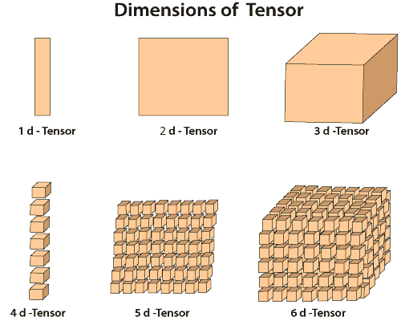
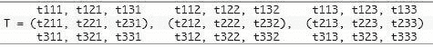
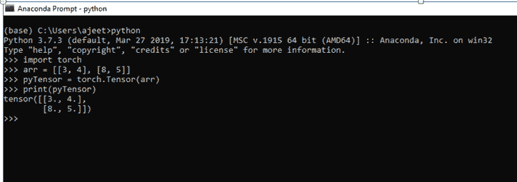
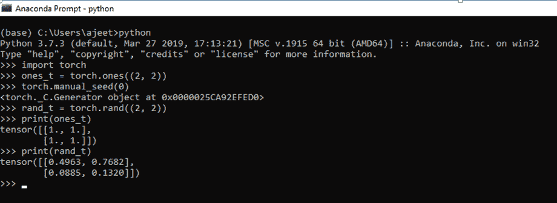
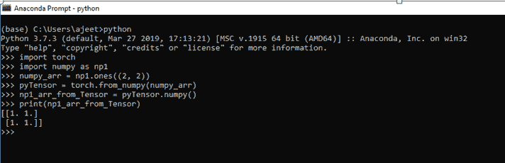

# 张量介绍

> 原文：<https://www.javatpoint.com/pytorch-tensors>

张量是 Pytorch 的关键组成部分。我们可以说 PyTorch 完全基于张量。在数学中，数字的矩形阵列被称为度量。在 NumPy 库中，这些度量称为 ndaaray。在 PyTorch 中，它被称为张量。张量是一个 n 维数据容器。例如，在 PyTorch 中，1d-张量是向量，2d-张量是度量，3d-张量是立方体，4d-张量是立方体向量。

Torch 以强大的 GPU 加速提供张量计算。我们必须熟悉张量数据结构才能使用 PyTorch。它将作为神经网络实施前的基本前提。

在深度学习中，张量是关键部分，我们可以看到围绕张量的很多讨论。甚至它出现在谷歌主要机器学习库的名称中，即 TensorFlow。

在本教程中，我们将讨论什么是张量，以及如何使用 numpy 在 python 中执行操作和操纵它们。

**“一般情况下，排列在具有可变轴数的规则网格上的数字阵列称为张量。”**

Below is the diagram that describes the Tensor's dimensions in a very efficient way. 

现在让我们了解一下张量的符号

张量符号类似于度量符号。大写字母代表张量，带下标整数的小写字母代表张量内的标量值。



在物理和工程领域，张量和张量代数作为工具被广泛使用。我们可以说它是机器学习中的一套技术，在深度学习模型的操作和训练中可以用张量来描述。

## 如何创建 Tensor？

有三种方法可以创建张量。每个都有不同的方法来创建张量和使用不同的方法。张量被创建为

1.  从数组创建张量
2.  用所有 1 和随机数创建张量
3.  从 numpy 数组创建张量

让我们看看张量是如何产生的

### 从数组创建张量

在这种情况下，您必须首先定义数组，然后在 torch 的 Tensor 方法中将该数组作为参数传递。

**例如**

```

Import torch
arr = [[3, 4], [8, 5]] 
pytensor = torch.Tensor(arr)
print(pytensor)

```

**输出:**

```
tensor ([[3., 4.],[8., 5.]])

```



### 用随机数和全 1 创建张量

要创建一个随机数张量，我们必须使用 rand()方法，要创建一个包含所有 1 的张量，你必须使用 torch 的 one()方法。为了生成随机数，火炬的另一种方法将与 rand 一起使用，即手动种子，参数为 0。

**例如**

```

import torch
ones_t = torch.ones((2, 2)) 
torch.manual_seed(0)  //to have same values for random generation
rand_t = torch.rand((2, 2))
print(ones_t)
print(rand_t)

```

**输出:**

```
tensor([[1., 1.],[1., 1.]])
tensor([[0.4962, 0.7682],[0.0885, 0.1320]])

```



### 从 numpy 数组创建张量

要从 numpy 数组创建张量，我们必须创建 numpy 数组。一旦创建了 numpy 数组，我们就必须将它作为参数从 _numpy()传入。此方法将 numpy 数组转换为张量。

**例如**

```

import torch
import numpy as np1
numpy_arr = np1.ones((2, 2))
pytensor = torch.from_numpy(numpy_arr)
np1_arr_from_tensor = pytensor.numpy()
print(np1_arr_from_tensor)

```

**输出:**

```
[[1\. 1.][1\. 1.]]

```



* * *