# 一维张量

> 原文：<https://www.javatpoint.com/pytorch-one-dimensional-tensors>

我们知道， **PyTorch** 已经被**深度学习**世界所拥抱，因为它能够方便地定义神经网络。神经网络的基本结构是传感器，PyTorch 也是围绕传感器构建的。性能往往会大幅提升。模糊地说，张量是矩阵的推广。

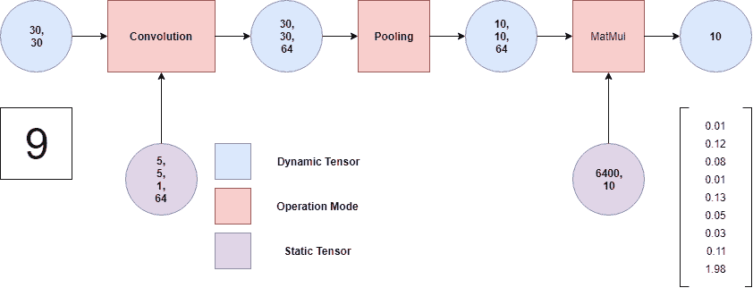

1D 张量类似于 1D 矩阵。在一维张量中，只有一行和一列称为向量。有一个零维张量，也称为标量。

现在我们将讨论在张量上进行的运算。

我们也可以使用谷歌 Colab 来编写 Tensor 的代码。访问谷歌 Colab 非常简单。对于谷歌可乐，不需要设置。它完全在云上运行。

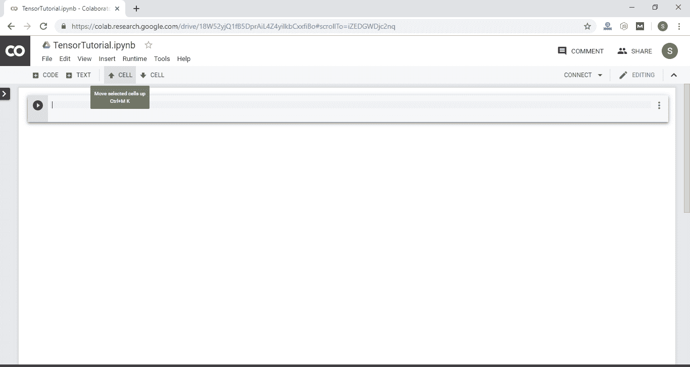

谷歌 Colab 类似于 Jupyter 笔记本。当我们使用谷歌 Colab 时，许多软件包都会预装。可惜火炬不在其中，只好先用**安装火炬！pip3 安装火炬**命令。

现在，我们将对一维张量进行运算。

## 创建一维张量

为了创建一维张量，我们使用 torch 库的张量属性。为了创建张量，我们使用 torch.tensor()方法。

**创建一维张量的语法如下:**

```

n= torch.tensor([Tensor elements])

```

这里，n 是张量类型的变量，张量元素可以是跟在(，)后面的任何整数或浮点数。

### 例子

```

import torch
n=torch.tensor([1,2,3,4])
print(n)

```

**输出:**

```
tensor([1, 2, 3, 4])

```

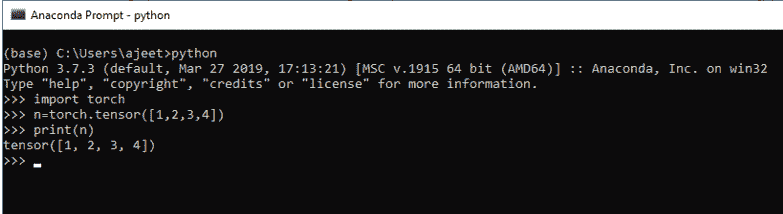

## 检查张量中元素的数据类型

我们可以检查包含在张量中的元素的数据类型。我们使用 Tensor 的 dtype()来查找数据类型。

### 例子

```

import torch
n=torch.tensor ([1.0, 2.0, 3.0])
print (n.dtype)

```

**输出:**

```
torch.float32

```

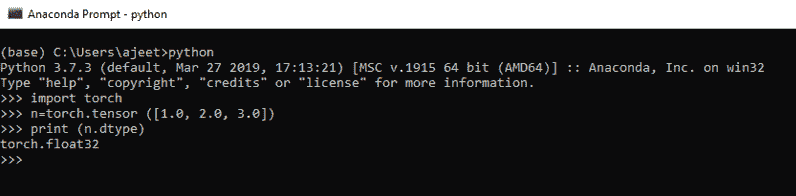

## 张量元素的存取

我们可以借助张量元素的索引来访问该元素。如果我们想打印张量的所有元素，那么我们可以打印张量变量。像一维度量指数一样，Tensor 指数也是从 0 开始的。

### 例子

```

import torch
n=torch.tensor([1.0, 2.0, 3.0])
print(n[2]) 

```

**输出:**

```
tensor(3.)

```

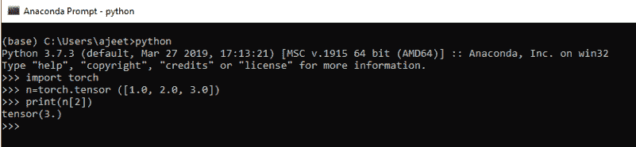

## 访问指定范围的张量元素

通过传递以冒号(:)分隔的元素的起始索引或结束索引来访问指定范围的元素非常简单。它将跳过起始索引元素和打印元素，直到结束索引。

### 例子

```

import torch
n=torch.tensor([1.0, 2.0, 3.0])
print(n[0:2]) 

```

**输出:**

```
tensor (2.0,3.0)

```

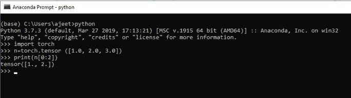

我们还有一个例子，它通过跳过由我们初始化的起始索引来打印所有元素。

### 例子

```

import torch
n=torch.tensor ([1.0, 2.0, 3.0])
print(n[0:]) 

```

**输出:**

```
tensor (2.0,3.0)

```

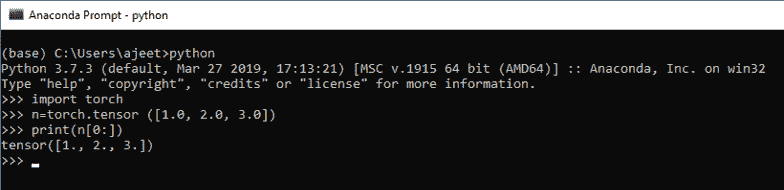

## 使用整数元素创建浮点张量

我们可以使用整数元素创建一个浮点张量。在这种情况下，我们使用了火炬的浮动属性。

### 例子

```

import torch
n=torch.FloatTensor([1,2,3,4,5,6,7])
print(n)

```

**输出:**

```
tensor([1., 2., 3., 4., 5., 6., 7.])

```

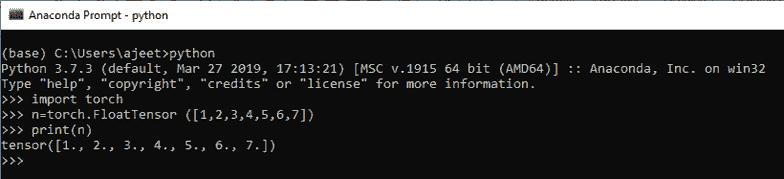

## 寻找张量的大小

就像一维度量一样，我们也可以找到张量的大小。我们使用张量的 size()方法来得到大小。

### 例子

```

import torch
n=torch.FloatTensor([1,2,3,4,5,6,7])
print(n.size())

```

**输出:**

```
torch.Size([7])

```

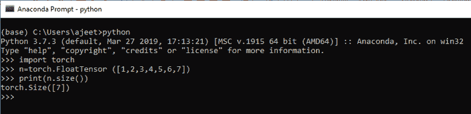

## 改变张量的视图

张量具有这样的性质，我们可以通过它来改变张量的视图。改变视图意味着如果张量是一维的(一行一列)，并且我们想改变它的视图六行一列。可以借助 Tensor 的 view()进行更改。它类似于数组的重塑()。

### 例子

```

import torch
n=torch.FloatTensor([1,2,3,4,5,6])
print(n)
n.view(6,1)   

```

**输出:**

```
tensor ([1., 2., 3., 4., 5., 6.])
tensor([[1.],
        [2.],
        [3.],
        [4.],
        [5.],
        [6.]])

```

#### 注:我们也可以使用其他维度，如(3，2)，但它应该与我们的原始张量元素兼容。

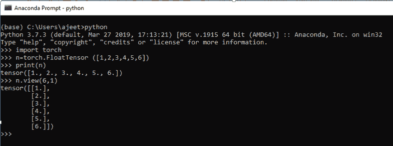

## 使用 numpy 数组的张量

我们也可以使用 numpy 数组创建 Tensor。我们要借助火炬的 from_numpy () 把 numpy 数组转换成 Tensor。为此，我们首先必须初始化 numpy，然后创建一个 numpy 数组。

### 例子

```

import torch
import numpy as np
a=np.array([1,2,3,4,5,6])
tensorcon=torch.from_numpy(a)
print(tensorcon)
print(tensorcon.type())

```

**输出:**

```
tensor([1, 2, 3, 4, 5, 6])
torch.LongTensor

```

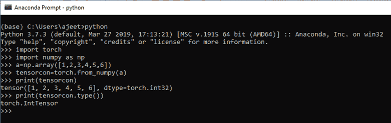

* * *