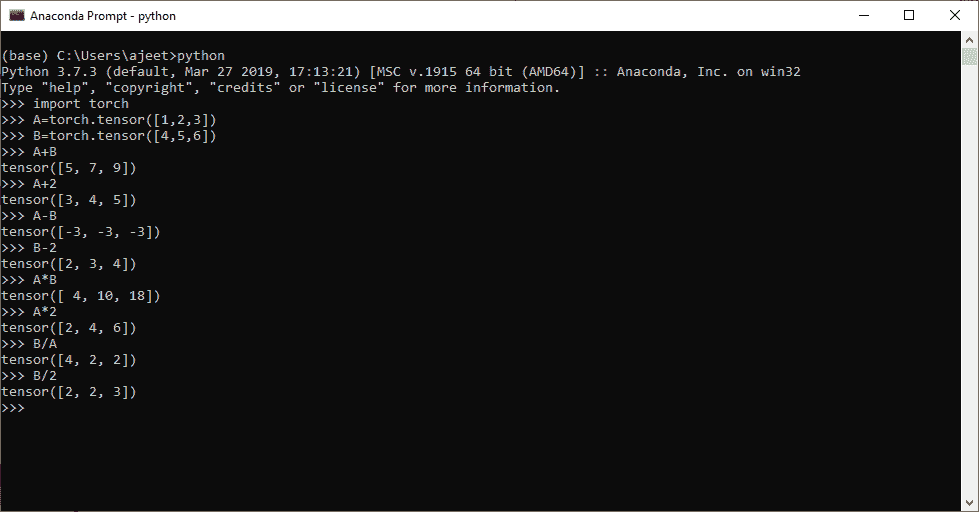
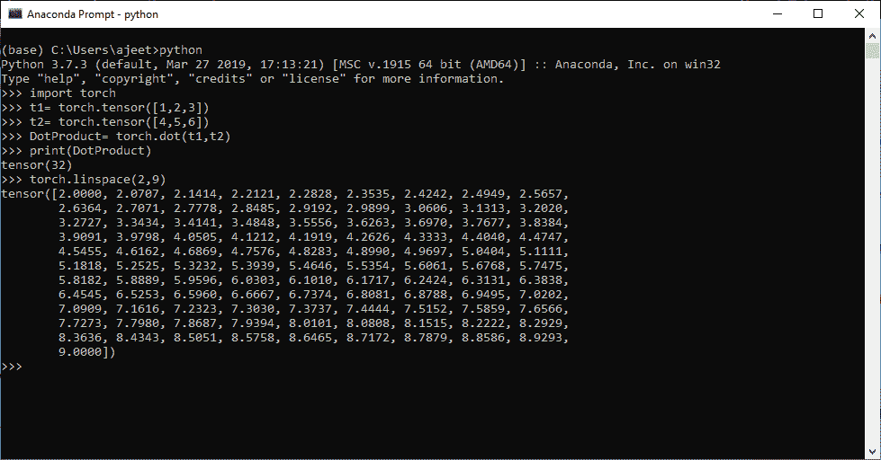
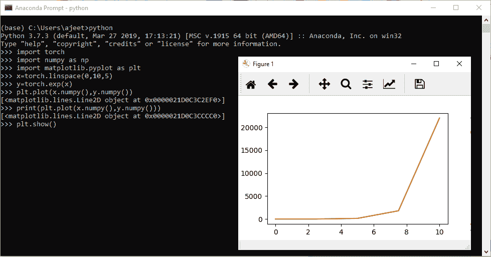
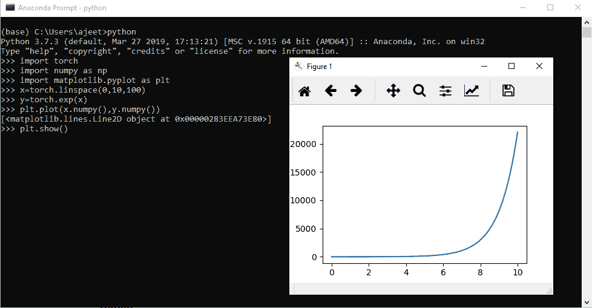
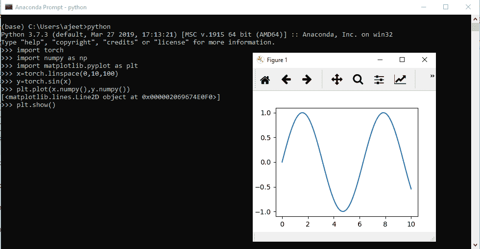

# 向量运算

> 原文：<https://www.javatpoint.com/pytorch-vector-operation>

我们知道张量有不同类型的维度，如零维、一维和多维。向量是一维张量，对它们进行操作可以有几种操作。向量运算有不同的类型，如数学运算、点积和 linspace。向量在深度学习中起着至关重要的作用。

在深度学习神经网络中，我们借助向量或一维张量生成随机点。对向量执行以下操作。

## 数学运算

我们可以对另一个张量进行加、减、乘、除。下表列出了在具有预期输出的向量上执行的所有数学运算。

| 南号码 | 操作 | 张量 A | 张量 B | 数字 | 句法 | 输出 |
| one | + | [1, 2, 3] | [4, 5, 6] | Two | A+B | [5, 7, 9] |
| Two | [1, 2, 3] | [4, 5, 6] | Two | A+2 | [3, 4, 5] |
| three | - | [1, 2, 3] | [4, 5, 6] | Two | A-B | [-3, -3, -3] |
| four | [1, 2, 3] | [4, 5, 6] | Two | B-2 | [2, 3, 4] |
| five | * | [1, 2, 3] | [4, 5, 6] | Two | 甲*乙 | [4, 10,18] |
| six | [1, 2, 3] | [4, 5, 6] | Two | A*2 | [2, 4, 6] |
| seven | / | [1, 2, 3] | [4, 5, 6] | Two | 乙/甲 | [4, 2, 2] |
| eight | [1, 2, 3] | [4, 5, 6] | Two | B/2 | [2, 2, 3] |

```

import torch
A=torch.tensor([1,2,3])
B=torch.tensor([4,5,6])
A+B
A+2
A-B
B-2
A*B
A*2
B/A
B/2

```

**输出:**

```
tensor([5, 7, 9])
tensor([3, 4, 5])
tensor([-3, -3, -3])
tensor([2, 3, 4])
tensor([ 4, 10, 18])
tensor([2, 4, 6])
tensor([4, 2, 2])
tensor([2, 2, 3])

```



## 点积与林空间

我们也可以计算两个张量的点积。我们使用火炬的 dot()方法来计算哪个提供了准确或预期的结果。还有一个向量运算，即 linspace。对于 linspace，我们使用方法 linspace()。这个方法包含两个参数第一个是起始数，第二个是结束数。

这个方法的输出是，从起始数字到结束数字打印一百个等间距的数字。

#### 注意:我们可以通过传递一个参数来明确指定步长，而不是诉诸默认值，这个参数就是参数列表末尾的步长。

### 例子

```

import torch
t1= torch.tensor([1,2,3])
t2= torch.tensor([4,5,6])
DotProduct= torch.dot(t1,t2)
print(DotProduct)
torch.linspace(2,9)

```

**输出:**

```
tensor(32)
tensor([2.0000, 2.0707, 2.1414, 2.2121, 2.2828, 2.3535, 2.4242, 2.4949, 2.5657,
        2.6364, 2.7071, 2.7778, 2.8485, 2.9192, 2.9899, 3.0606, 3.1313, 3.2020,
        3.2727, 3.3434, 3.4141, 3.4848, 3.5556, 3.6263, 3.6970, 3.7677, 3.8384,
        3.9091, 3.9798, 4.0505, 4.1212, 4.1919, 4.2626, 4.3333, 4.4040, 4.4747,
        4.5455, 4.6162, 4.6869, 4.7576, 4.8283, 4.8990, 4.9697, 5.0404, 5.1111,
        5.1818, 5.2525, 5.3232, 5.3939, 5.4646, 5.5354, 5.6061, 5.6768, 5.7475,
        5.8182, 5.8889, 5.9596, 6.0303, 6.1010, 6.1717, 6.2424, 6.3131, 6.3838,
        6.4545, 6.5253, 6.5960, 6.6667, 6.7374, 6.8081, 6.8788, 6.9495, 7.0202,
        7.0909, 7.1616, 7.2323, 7.3030, 7.3737, 7.4444, 7.5152, 7.5859, 7.6566,
        7.7273, 7.7980, 7.8687, 7.9394, 8.0101, 8.0808, 8.1515, 8.2222, 8.2929,
        8.3636, 8.4343, 8.5051, 8.5758, 8.6465, 8.7172, 8.7879, 8.8586, 8.9293,
        9.0000])

```



## 在二维坐标系上绘制函数

当在二维坐标系上绘制函数时，可以使用 linspace 函数。对于 x 轴，我们以 2.5 的间隔创建一个从 0 到 10 的陆地空间，Y 将是每个 x 值的函数。例如，我们可以为 y 找到每个 x 值的指数。

现在，我们正在使用**地图绘制库**库绘制 x 和 y 数据，这是一个用于数据分析的可视化库。

### 例子

```

import torch
import numpy as np
import matplotlib.pyplot as plt
x=torch.linspace(0,10,100)
y=torch.exp(x)
plt.plot(x.numpy(),y.numpy())
plt.show()

```

**输出:**



#### 注意:为了更平滑的指数增长，我们必须增加 linspace 中的数据。如果是 100 而不是 5，那么输出会更平滑。



#### 注:我们可以绘制 x 的正弦值，而不是指数值。所以它会产生一个正弦曲线。

### 例子

```

import torch
import numpy as np
import matplotlib.pyplot as plt
x=torch.linspace(0,10,100)
y=torch.sin(x)
plt.plot(x.numpy(),y.numpy())
plt.show()

```

**输出:**



* * *