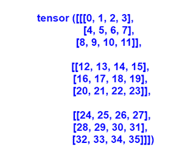
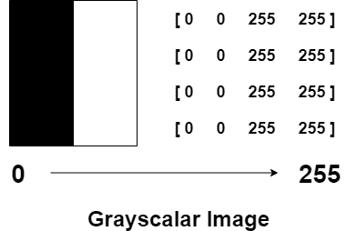
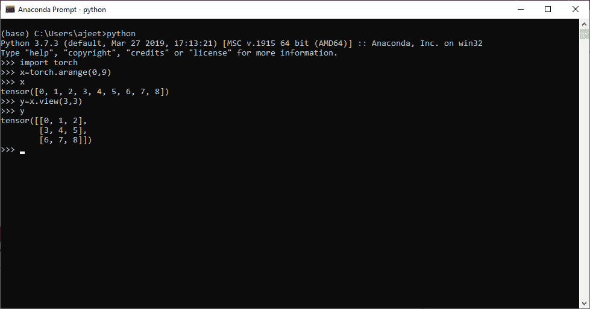
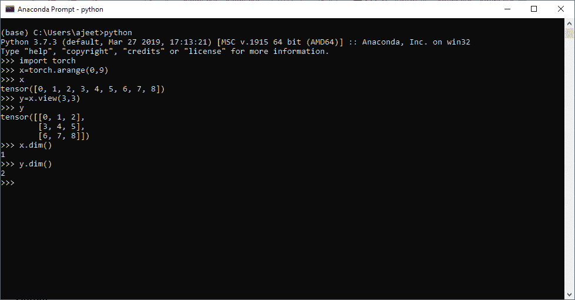
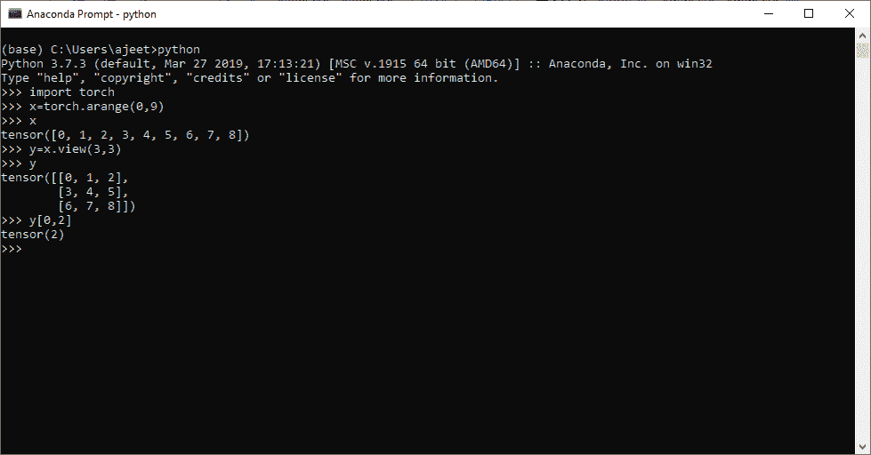
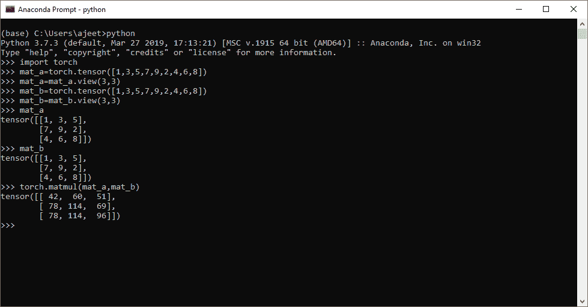
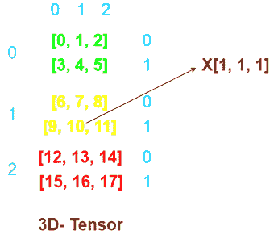
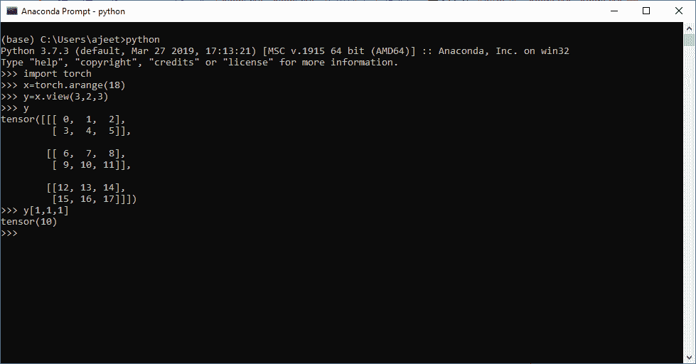
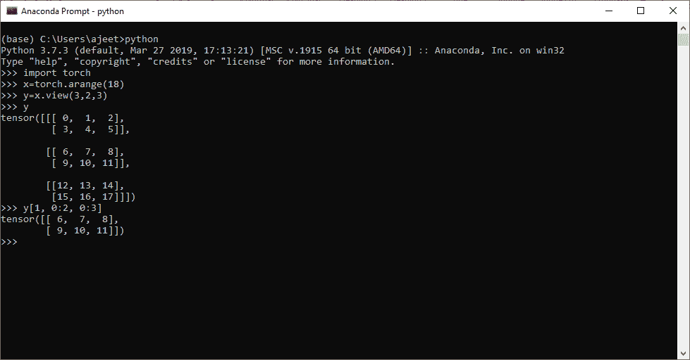

# 二维张量

> 原文：<https://www.javatpoint.com/pytorch-two-dimensional-tensor>

**二维**张量类似于二维度量。二维度量具有 n 个行数和 n 个列数。类似地，二维张量也有 n 行和 n 列。

二维张量有以下表示



灰度标量图像是二维像素矩阵。每个像素的强度由一个范围从 0 到 255 的数值表示，因此强度值 0 表示没有完全黑色的强度，255 表示完全白色的最大强度。我们可以存储这个二维值网格。



## 创建二维张量

要创建二维张量，首先必须使用手电筒的 arrange()方法创建一维张量。此方法包含两个整数类型的参数。这种方法根据给定的参数将元素排列成张量。一旦你的一维张量被创建，那么我们的下一步就是以二维形式改变它的视图，并将这个视图存储在二维类型的变量中。

让我们看一个创建二维张量的例子

```

import torch
x=torch.arange(0,9)
x
y=x.view(3,3)
y

```

**输出:**

```
tensor([0, 1, 2, 3, 4, 5, 6, 7, 8])
tensor([[0, 1, 2],
        [3, 4, 5],
        [6, 7, 8]])

```



#### 注意:要检查张量的维数，我们必须使用张量的 dim()方法。

```

import torch
x=torch.arange(0,9)
x
y=x.view(3,3)
y
x.dim()
y.dim()

```

**输出:**

```
tensor([0, 1, 2, 3, 4, 5, 6, 7, 8])
tensor([[0, 1, 2],
        [3, 4, 5],
        [6, 7, 8]])
1
2

```



## 访问二维张量元素

让我们看一个二维张量的例子，了解如何使用 index 从二维张量访问特定元素。

### 例子

```

import torch
x=torch.arange(0,9)
x
y=x.view(3,3)
y
y[0,2]

```

**输出:**

```
tensor([0, 1, 2, 3, 4, 5, 6, 7, 8])
tensor([[0, 1, 2],
        [3, 4, 5],
        [6, 7, 8]])
tensor(2)

```



## 张量乘法

乘法的方式与度量乘法相同。张量乘法是用相应的行乘以相应的列来完成的。张量乘法在深度学习模型中起着至关重要的作用。张量可以是一维的，二维的，三维的，等等。张量的乘法只在大小相容的情况下进行。

让我们看一个张量乘法的例子

```
import torch
mat_a=torch.tensor([1,3,5,7,9,2,4,6,8])
mat_a=mat_a.view(3,3)
mat_b=torch.tensor([1,3,5,7,9,2,4,6,8])
mat_b=mat_b.view(3,3)
mat_a
mat_b
torch.matmul(mat_a,mat_b)# We can also usemat_a @ mat_b

```

**输出:**

```
tensor([[1, 3, 5],
        [7, 9, 2],
        [4, 6, 8]])
tensor([[1, 3, 5],
        [7, 9, 2],
        [4, 6, 8]])
tensor([[ 42,  60,  51],
        [ 78, 114,  69],
        [ 78, 114,  96]])

```



## 三维张量

借助 view()方法制作三维张量。三维张量具有以下结构



## 从三维张量访问元素

从三维张量访问元素非常容易。这将使用索引来完成。

### 例子

```

import torch
x=torch.arange(18)
y=x.view(3, 2, 3)
y
y[1,1,1]

```

**输出:**

```
tensor([[[ 0,  1,  2],
         [ 3,  4,  5]],
        [[ 6,  7,  8],
         [ 9, 10, 11]],
        [[12, 13, 14],
         [15, 16, 17]]])
tensor(10)

```



## 三维张量切片

分段切片非常类似于我们对一维张量的切片。对张量进行切片意味着将张量的元素切片成一个新的张量，或者我们可以说切片是通过划分张量来创建一个新张量的过程。

### 例子

假设我们有一个三维张量，它包含从 0 到 17 的元素，我们想把张量从 6 切到 11。

```

import torch
x=torch.arange(18)
y=x.view(3,2,3)
y
y[1, 0:2, 0:3]		# can also apply y[1, :, :] 

```

**输出:**

```
tensor([[[ 0,  1,  2],
         [ 3,  4,  5]],
        [[ 6,  7,  8],
         [ 9, 10, 11]],
        [[12, 13, 14],
         [15, 16, 17]]])
tensor([[ 6,  7,  8],
[ 9, 10, 11]])

```



* * *