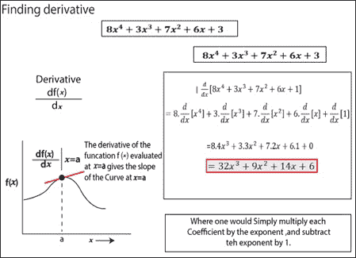
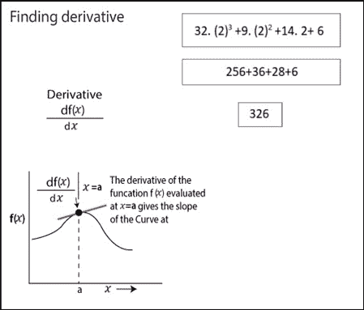
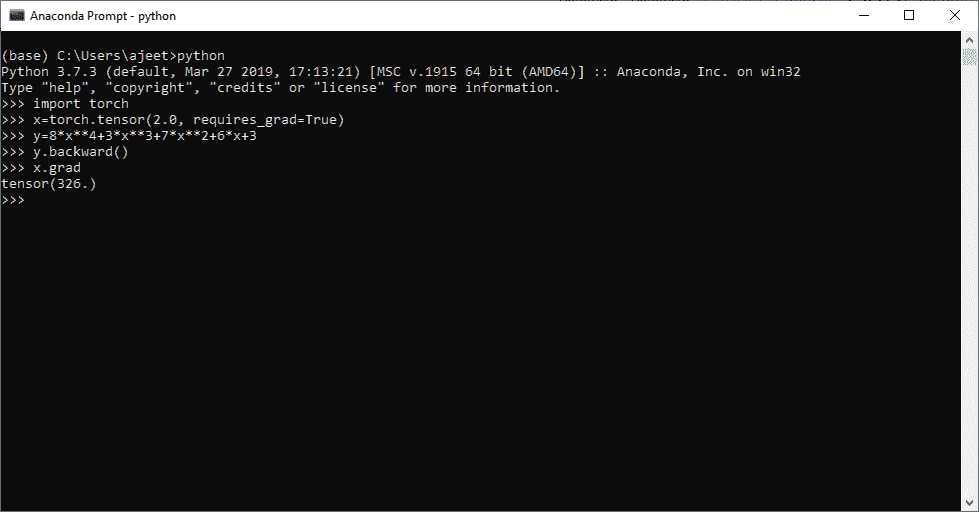
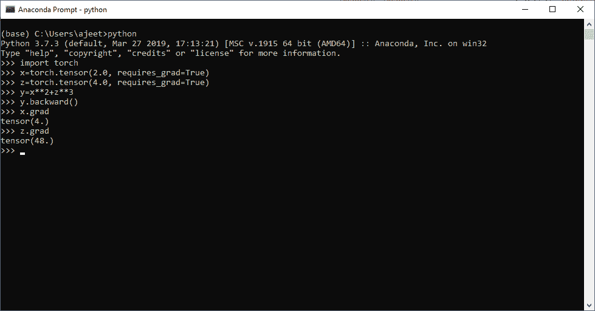

# 带 PyTorch 的渐变

> 原文：<https://www.javatpoint.com/gradient-with-pytorch>

在本节中，我们将讨论导数以及它们如何应用于 PyTorch。让我们开始吧

**梯度**用来求函数的导数。用数学术语来说，导数意味着函数的部分微分和求值。

下面是如何计算函数导数的示意图。





我们在上面的图表中所做的工作将在带有渐变的 PyTorch 中完成。下面是求函数导数的步骤。

1.我们首先要初始化函数(y=3x <sup>3</sup> +5x <sup>2</sup> +7x+1)，我们将为其计算导数。

2.下一步是设置函数中使用的变量值。x 的值以下列方式设置。

```

X= torch.tensor (2.0, requires_grad=True)

```

我们通常需要一个梯度来求函数的导数。

3.接下来是简单地用 backward()方法计算函数的导数。

4.最后一步是使用 grad 访问或打印导数的值。

让我们看一个求导的例子

```

import torch
x=torch.tensor(2.0, requires_grad=True)
y=8*x**4+3*x**3+7*x**2+6*x+3
y.backward()
x.grad

```

**输出:**

```
tensor(326.)

```



**另一个例子**

```

import torch
x=torch.tensor(2.0, requires_grad=True)
z=torch.tensor(4.0, requires_grad=True)
y=x**2+z**3
y.backward()
x.grad
z.grad

```

**输出:**

```
tensor(4.)
tensor(48.)

```



* * *