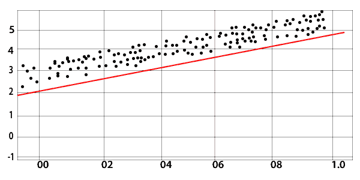
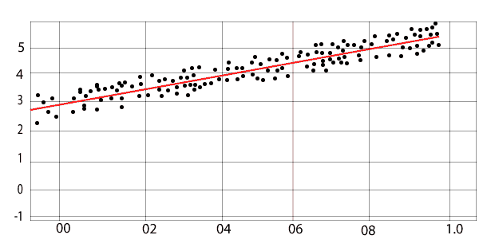
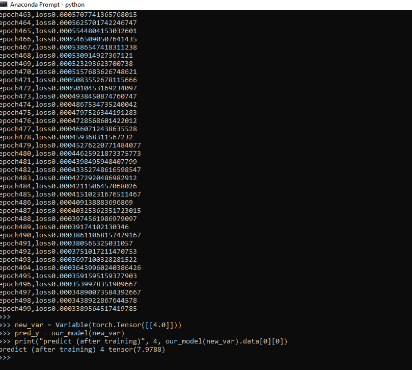

# 线性回归

> 原文：<https://www.javatpoint.com/pytorch-linear-regression>

**线性回归**是通过最小化距离来寻找因变量和自变量之间的线性关系的一种方法。

线性回归是一种有监督的机器学习方法。该方法用于**订单离散类别**的分类。在本节中，我们将了解如何建立一个模型，用户可以通过该模型预测因变量和自变量之间的关系。

简单来说，我们可以说两个变量之间的关系，即**独立**或**从属**，被称为**线性**。假设 Y 是因变量，X 是自变量，那么这两个变量的线性回归关系为

**Y=AX+b**

*   a 为**坡度**。
*   b 为 **y 截距**。

**初始状态**



**最终状态**



创建或学习基本线性模型需要理解三个基本概念。

## 1.模型类

在需要时编写所有代码并编写所有函数是非常典型的，这不是我们的动机。

写数字优化库总是比写所有的代码和函数更好，但是如果我们在预先编写的库的基础上构建它来完成事情，业务价值也可以增加。为此，我们使用 PyTorch 的 nn 包的实现。为此，我们首先要创建一个单层。

### 线性图层使用

每个线性模块根据输入计算输出，对于权重和偏差，它保存其内部张量。

还有其他几个标准模块。我们将使用模型类格式，它有两个主要方法，如下所示:

1.  **Init:** 用于定义线性模块。
2.  **转发:**借助转发方法，在此基础上进行预测，我们将训练我们的线性回归模型

## 2.【计算机】优化程序

优化器是 PyTorch 中的重要概念之一。它用于优化我们的权重，使我们的模型适合数据集。有几个优化算法，如梯度下降和反向传播，优化我们的权重值，最适合我们的模型。

各种优化算法由 torch.optim 包实现。要使用 torch.optim，您必须构造一个优化器对象，该对象将根据计算机梯度更新参数，并保持当前状态。该对象按如下方式创建:

```

Optimizer=optim.SGD(model.parameters(), lr=0.01, momentum=0.9)
Optimizer=optim.Adam([var1, var2], lr=0.0001))

```

一个**步骤()**方法由所有优化器实现，更新参数。有两种方法可以使用它

### 1)优化器。步骤()

这是一个非常简单的方法，得到了许多优化者的支持。使用 backward()方法计算梯度后，我们可以调用 optimizer.step()函数。

### 示例:

```

for input, target in dataset:
	optimizer.zero_grad()
	output=model(input)
	loss=loss_fn(output, target)
	loss.backward() 	
	optimizer.step()

```

### 2)优化器.步骤(结束)

有一些优化算法，比如 **LBFGS** ，**共轭梯度**需要多次重新评估函数，所以我们必须把它传递给闭包，这样它们就可以重新计算你的模型。

**示例:**

```

for input, target in dataset:
def closure():
	optimizer.zero_grad()
	output = model(input)
	loss = loss_fn(output, target)
	loss.backward()
	return loss
	optimizer.step(closure)

```

## 标准

标准是我们的损失函数，用来寻找损失。该功能在 torch nn 模块中使用。

**示例:**

```

criterion = torch.nn.MSELoss(size_average = False) 

```

### 所需的功能和对象

1.  进口火炬
2.  来自 torch . aut grad 导入变量

我们需要定义一些数据，并按照以下方式将它们分配给变量

```

xdata=Variable(torch.Tensor([[1.0],[2.0],[3.0]]))
ydata=Variable(torch.Tensor([[2.0],[4.0],[6.0]]))

```

下面的代码为我们训练一个完整的回归模型提供了预测。这只是为了理解我们如何实现代码，以及我们使用什么函数来训练回归模型。

```

import torch 
from torch.autograd import Variable 
xdata = Variable(torch.Tensor([[1.0], [2.0], [3.0]]))
ydata = Variable(torch.Tensor([[2.0], [4.0], [6.0]])) 
class LRM(torch.nn.Module):
	def __init__(self): 
		super(LRM, self).__init__()  
		self.linear = torch.nn.Linear(1, 1)
	def forward(self, x): 
		ypred = self.linear(x)  
		return ypred  
ourmodel = LRM()
criterion = torch.nn.MSELoss(size_average = False) 
optimizer = torch.optim.SGD(ourmodel.parameters(), lr = 0.01) 
for epoch in range(500): 
	predy = our_model(xdata) 
	loss = criterion(predy, ydata)  
	optimizer.zero_grad() 
	loss.backward() 	
	optimizer.step() 
	print('epoch {}, loss {}'.format(epoch, loss.item()))
newvar = Variable(torch.Tensor([[4.0]]))
predy = ourmodel(newvar)
print("predict (after training)", 4, our_model(newvar).data[0][0])

```

**输出:**

```
epoch0,loss1.7771836519241333
epoch1,loss1.0423388481140137
epoch2,loss0.7115973830223083
epoch3,loss0.5608030557632446
.
.
.
.
epoch499,loss0.0003389564517419785
predict (after training) 4 tensor(7.9788)

```



有以下概念用于训练完整的回归模型

1.  做预测
2.  线性类
3.  自定义模块
4.  创建数据集
5.  损失函数
6.  梯度下降
7.  均方误差
8.  培养

所有以上几点对于理解如何训练回归模型是必不可少的。

* * *