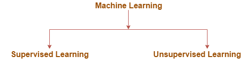
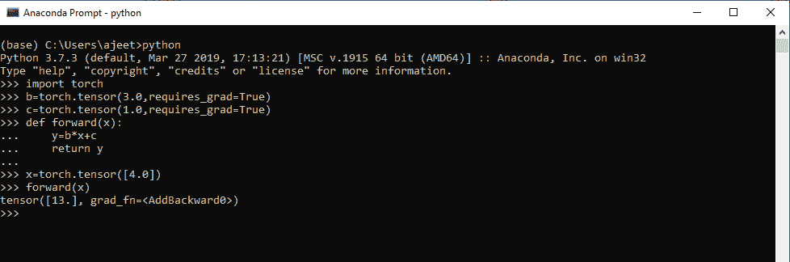
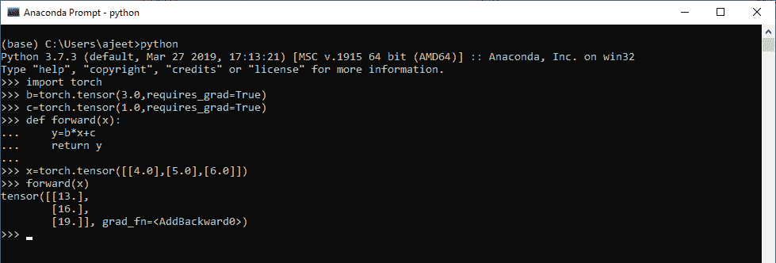
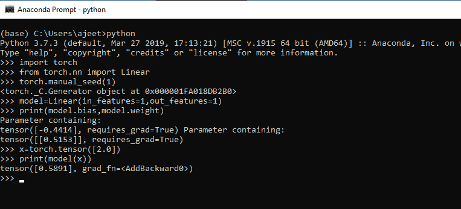
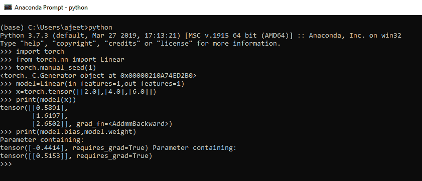

# 预测和线性分类

> 原文：<https://www.javatpoint.com/pytorch-prediction-and-linear-class>

在这篇文章中，我们简单介绍了如何实现一种基于机器学习的算法来训练一个线性模型来拟合一组数据点。

为此，不需要有任何深度学习的先验知识。我们将从**监督学习**的讨论开始。我们将讨论监督学习的概念以及它与监督学习的关系。

## 机器学习

**机器学习**是 AI 的一个应用。机器学习为系统提供了在经验的帮助下自动学习和改进的能力。ML 专注于开发可以访问数据并用于自己学习的计算机程序。

学习的过程从数据或观察开始，如例子、指令或直接经验，以便在数据中寻找模式，并根据我们提供的例子在未来做出更好的决定。它的目的是让计算机在没有人工干预的情况下自动学习，并相应地调整动作。



### 监督学习

正如名字所表明的，有一名教师担任主管。在监督学习中，我们使用标记良好的数据来训练或教授机器。标记良好意味着很少有数据已经标记了正确答案。之后，机器会获得一组新的数据。监督学习算法分析训练数据，并从标记数据中产生正确的结果。

**监督学习分为两大类算法:**

1.  **分类**:分类问题是当输出变量或单纯输出是“红”或“蓝”或“病或无病”等类别时的问题
2.  **回归**:回归问题是当输出变量或者简单的输出是一个真实的或者连续的值，比如“工资”或者“权重”的时候出现的问题

### 无监督学习

在无监督学习中，机器使用既没有分类也没有标记的信息进行训练，并允许算法在没有指导的情况下对该信息进行操作。在无监督学习中，任务是根据相似性、差异和模式对未分类的信息进行分组，而无需事先对数据进行任何训练。

没有主管，也就是说不会对机器进行培训。所以，机器被限制自己去寻找隐藏的结构。

**无监督学习分为两大类算法:**

*   **聚类**:聚类问题是我们必须发现数据中固有分组的问题。比如按课程或年龄行为对学生进行分组。
*   **关联**:关联问题就是我们必须发现描述我们大部分数据的规则的问题，比如买苹果的人也想买香蕉。

## 进行预测(创建数据模型)

做预测是建立线性回归模型的第一步。在线性回归模型中，我们使用监督学习，因为回归是它的第二大类。因此，学习者被训练并利用与定义我们的训练数据的含义的标记特征相关联的数据集。

学习者能够在将新的输入数据提供给机器之前预测相应的输出。

### 寻找预测的步骤

*   第一步是安装火炬并导入它来使用它。
*   下一步是初始化变量 c 和 c 来知道一条线的方程。
*   初始化直线方程，使 y=w*x + b，这里 w 是斜率，b 是偏差项，y 是预测。
*   预测是在 forward()方法中计算的。

让我们看一个例子来理解线性回归中的预测是如何进行的。

**对于单个数据**

```

import torch
b=torch.tensor(3.0,requires_grad=True)
c=torch.tensor(1.0,requires_grad=True)
def forward(x):
       y=b*x+c
       return y
x=torch.tensor([4.0])
forward(x)

```

**输出:**

```
tensor([13.], grad_fn=<AddBackward0>)

```



**为多个数据**

```

import torch
b=torch.tensor(3.0,requires_grad=True)
c=torch.tensor(1.0,requires_grad=True)
def forward(x):
       y=b*x+c
       return y
x=torch.tensor([[4.0],[5.0],[6.0]])
forward(x)

```

**输出:**

```
tensor([[13.],
        [16.],
        [19.]], grad_fn=<AddBackward0>)

```



## 使用线性类的预测

还有另一种标准的绑定预测方式。为此，我们必须导入 torch.nn 包的线性类。在本文中，我们使用 manual_seed()方法来生成随机数。当我们用线性类创建一个模型时，它将被赋予线性类的随机数值，这是有意义的，因为召回。

让我们看一个如何用模型和 manual_seed()方法进行预测的例子。

**对于单个数据**

```

import torch
from torch.nn import Linear
torch.manual_seed(1)
model=Linear(in_features=1,out_features=1)
print(model.bias,model.weight)
x=torch.tensor([2.0])
print(model(x))

```

**输出:**

```
<torch._C.Generator object at 0x000001FA018DB2B0>
Parameter containing:
tensor([-0.4414], requires_grad=True) Parameter containing:
tensor([[0.5153]], requires_grad=True)
tensor([0.5891], grad_fn=<AddBackward0>)

```



**为多个数据**

```

import torch
from torch.nn import Linear
torch.manual_seed(1)
model=Linear(in_features=1,out_features=1)
print(model.bias,model.weight)
x=torch.tensor([[2.0],[4.0],[6.0]])
print(model(x))

```

**输出:**

```
<torch._C.Generator object at 0x00000210A74ED2B0>
Parameter containing:
tensor([-0.4414], requires_grad=True) Parameter containing:
tensor([[0.5153]], requires_grad=True)
tensor([[0.5891],
        [1.6197],
        [2.6502]], grad_fn=<AddmmBackward>)

```



* * *