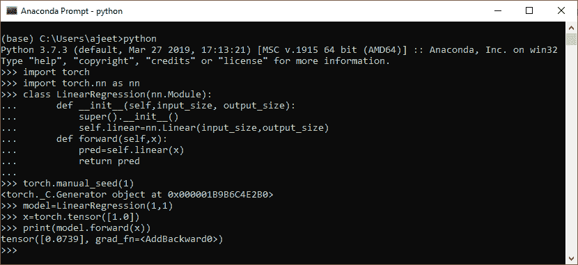
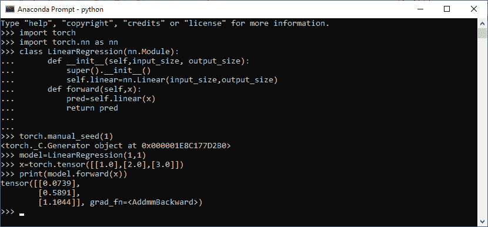

# 使用自定义模块创建数据模型

> 原文：<https://www.javatpoint.com/pytorch-custom-module>

还有另一种方法可以找到预测。在前一节中，我们使用 forward()并通过实现线性模型来找到预测。这种方法非常有效和可靠。很容易理解和实现。

在**自定义模块**中，我们用类创建了一个自定义模块，它是 init()和 forward()方法和模型。init()方法用于初始化类的新实例。在这个 init()方法中，第一个参数是 self，它指示类的实例，即尚未初始化的对象，在它之后，我们可以添加额外的参数。

下一个参数是初始化线性模型的实例。在前一节中，初始化线性模型需要输入大小和输出大小等于 1，但是在自定义模块中，我们传递输入大小和输出大小变量，而不传递其默认值。

在这种情况下，需要导入火炬的 nn 包。在这种情况下，我们使用**继承**，这样这个子类将利用我们基类和模块中的代码。

模块本身通常将作为所有神经网络模块的基类。之后，我们创建一个模型，通过它来进行预测。

让我们看一个通过创建自定义模块来完成预测的例子:

**对于单个数据**

```

import torch
import torch.nn as nn
class LinearRegression(nn.Module):
	def __init__(self,input_size, output_size):
		super().__init__()
		self.linear=nn.Linear(input_size,output_size)
	def forward(self,x):
		pred=self.linear(x)
		return pred
torch.manual_seed(1)
model=LinearRegression(1,1)
x=torch.tensor([1.0])
print(model.forward(x))

```

**输出:**

```
<torch._C.Generator object at 0x000001B9B6C4E2B0>
tensor([0.0739], grad_fn=<AddBackward0>)

```



**为多个数据**

```

import torch
import torch.nn as nn
class LinearRegression(nn.Module):
	def __init__(self,input_size, output_size):
		super().__init__()
		self.linear=nn.Linear(input_size,output_size)
	def forward(self,x):
		pred=self.linear(x)
		return pred
torch.manual_seed(1)
model=LinearRegression(1,1)
x=torch.tensor([[1.0],[2.0],[3.0]])
print(model.forward(x))

```

**输出:**

```
<torch._C.Generator object at 0x000001B9B6C4E2B0>
tensor([[0.0739],
        [0.5891],
        [1.1044]], grad_fn=<AddmmBackward>)

```



* * *